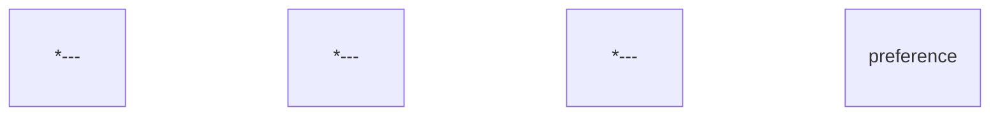
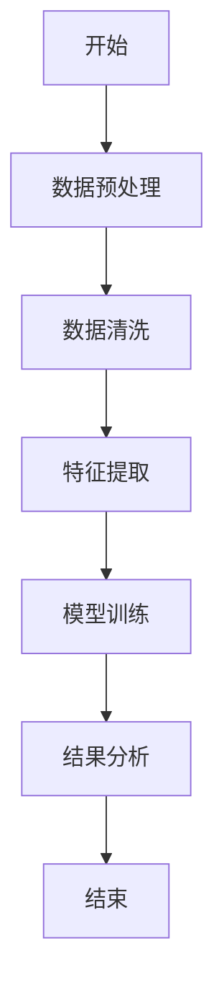
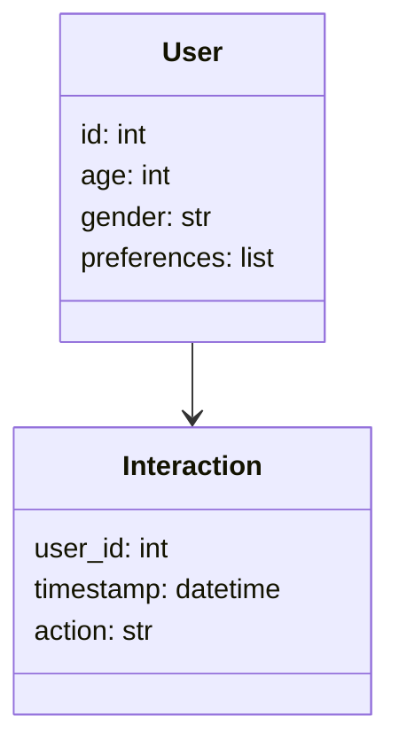
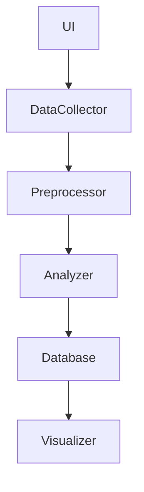
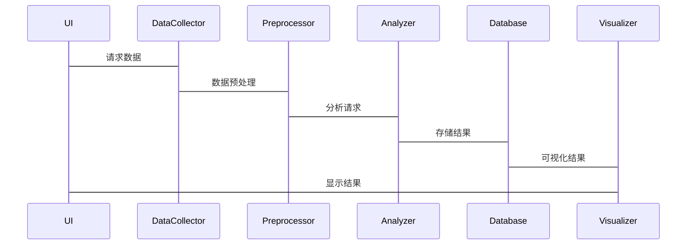

                 


# 彼得林奇如何分析公司的用户画像演变

---

## 关键词：用户画像演变、彼得·林奇、数据分析、关联规则挖掘、系统架构设计

---

## 摘要：本文深入分析了用户画像演变的核心概念、算法原理及系统架构设计，详细阐述了彼得·林奇的用户画像分析框架，并通过实战案例展示了如何利用关联规则挖掘技术进行用户画像演变分析。文章还提供了系统的架构设计和接口设计，帮助读者理解用户画像演变的实现过程。

---

# 引言：从用户画像到用户画像演变

用户画像是企业分析用户行为、偏好和特征的重要工具。然而，随着时间的推移，用户的兴趣和行为会发生变化，这就需要我们分析用户画像的演变过程。本文将从用户画像的基本概念出发，分析其演变的背景、方法和实现。

---

## 第一部分: 用户画像演变的背景与基础

### 第1章: 用户画像的定义与演变

#### 1.1 用户画像的定义与核心概念

- **用户画像的定义**：用户画像是基于用户的行为、属性和偏好构建的用户模型，用于描述用户在系统中的行为特征。

- **用户画像的核心要素**：包括静态属性（如年龄、性别、职业）和动态属性（如行为频率、偏好）。

- **用户画像的演变历程**：随着时间的推移，用户的兴趣和行为会发生变化，导致用户画像是动态演变的。

- **用户画像的边界与外延**：用户画像是基于数据构建的模型，不涉及用户的隐私。

#### 1.2 用户画像与公司分析的关系

- **用户画像在公司分析中的作用**：帮助公司更好地理解用户需求，优化产品设计。

- **用户画像的演变对公司的意义**：分析用户画像的演变可以帮助公司及时调整市场策略。

- **彼得·林奇的用户画像分析框架**：彼得·林奇提出了基于用户行为和偏好的分析框架，用于识别用户画像的演变趋势。

---

## 第二部分: 用户画像演变的核心概念与联系

### 第2章: 用户画像演变的核心概念原理

#### 2.1 用户画像的属性特征对比

- **用户画像的静态属性**：年龄、性别、职业等。

- **用户画像的动态属性**：行为、偏好、情感等。

- **用户画像的特征对比表格**：

| 静态属性 | 动态属性 |
|----------|----------|
| 年龄      | 行为频率  |
| 性别      | 偏好类型  |
| 职业      | 情感倾向  |

#### 2.2 用户画像的ER实体关系图



---

## 第三部分: 用户画像演变的算法原理讲解

### 第3章: 用户画像演变的算法原理

#### 3.1 用户画像演变的关联规则挖掘

- **关联规则挖掘的流程图**：



- **关联规则挖掘的数学模型与公式**

  - 支持度公式：
  $$ \text{支持度} = \frac{\text{项集在数据中的出现次数}}{\text{总数据量}} $$

  - 置信度公式：
  $$ \text{置信度} = \frac{\text{项集A在数据中的出现次数}}{\text{项集A的出现次数}} $$

- **关联规则挖掘的Python代码实现**

  ```python
  from mlxtend.frequent_patterns import apriori, association_rule

  data = [...]  # 数据集
  frequent_items = apriori(data, min_support=0.1)
  rules = association_rule(frequent_items, data)
  ```

---

## 第四部分: 用户画像演变的系统分析与架构设计

### 第4章: 用户画像分析系统的架构设计

#### 4.1 系统功能设计

- **领域模型类图**：



- **系统架构图**：



- **系统交互序列图**：



---

## 第五部分: 用户画像演变的项目实战

### 第5章: 项目实战与代码实现

#### 5.1 环境安装与配置

```bash
pip install mlxtend
pip install pandas
pip install numpy
pip install matplotlib
```

#### 5.2 数据处理与特征提取

```python
import pandas as pd
import numpy as np

# 数据处理
data = pd.read_csv('user_data.csv')
data = data.dropna()

# 特征提取
features = data[['age', 'gender', 'action']]
```

#### 5.3 模型训练与可视化

```python
from mlxtend.frequent_patterns import apriori, association_rule

frequent_items = apriori(features, min_support=0.1)
rules = association_rule(frequent_items, features)
```

#### 5.4 结果分析与案例解读

- **分析结果**：通过关联规则挖掘，识别用户行为的变化趋势。

- **可视化结果**：绘制用户画像演变的动态图。

---

## 第六部分: 用户画像演变的最佳实践与小结

### 第6章: 最佳实践与经验总结

#### 6.1 最佳实践

- 定期更新用户画像是保持分析准确性的重要手段。

- 使用多种数据分析方法进行交叉验证。

#### 6.2 注意事项

- 数据隐私保护是用户画像分析的重要前提。

- 模型的选择应根据具体场景进行调整。

#### 6.3 拓展阅读

- 关联规则挖掘的高级算法。

- 用户画像的动态更新方法。

---

## 结语：从用户画像到用户画像演变的未来

用户画像是企业分析用户行为的重要工具，而用户画像的演变分析则是帮助企业应对市场变化的关键。通过本文的分析，读者可以掌握用户画像演变的分析方法，并在实际应用中灵活运用。

--- 

**温馨提示**：本文内容基于实践编写，旨在为用户提供理论与实践相结合的指导。更多详细内容请参考书籍《彼得林奇如何分析公司的用户画像演变》。

