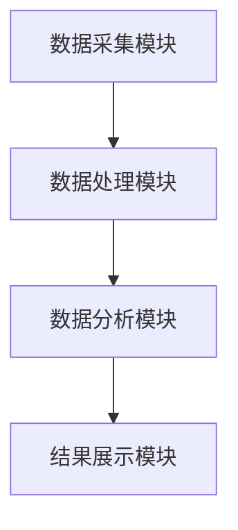

                 

# 第二部分: 用户细分策略的有效性分析方法

## 第2章: 用户细分策略的实施步骤

### 2.1 用户细分的前期准备

#### 2.1.1 数据收集与整理

在进行用户细分之前，首先需要收集和整理用户的相关数据。这些数据可以包括用户的基本信息（如年龄、性别、地理位置等）、消费行为（如购买频率、购买金额等）以及兴趣爱好等。数据的收集可以通过多种渠道进行，如在线调查、问卷填写、用户注册信息等。

#### 2.1.2 数据清洗与预处理

收集到的数据可能存在缺失、重复或异常值等问题，因此需要进行数据清洗和预处理。例如，删除重复数据、填补缺失值、处理异常值等。预处理后的数据将更加干净，有助于后续的分析和建模。

#### 2.1.3 数据分析工具的选择

根据企业的实际情况和需求，选择合适的数据分析工具。常用的数据分析工具包括Excel、SPSS、R、Python等。其中，Python和R是较为常用的数据分析工具，具有丰富的库和函数，能够满足复杂的分析需求。

### 2.2 用户细分的核心步骤

#### 2.2.1 数据可视化与初步分析

通过数据可视化工具（如Matplotlib、Tableau等）对数据进行初步分析，观察数据的分布情况、趋势和潜在的模式。例如，绘制用户分布的饼图或柱状图，帮助更好地理解数据的特征。

#### 2.2.2 特征选择与降维

在进行用户细分之前，需要选择合适的特征，并进行降维处理。特征选择可以通过计算特征的重要性（如信息增益、方差分析等）来确定哪些特征对用户细分影响较大。降维可以通过主成分分析（PCA）等方法实现，减少特征的维度，降低计算复杂度。

#### 2.2.3 模型选择与训练

根据用户细分的需求，选择合适的模型进行训练。常用的方法包括聚类分析（如K-means）、分类分析（如决策树、随机森林）等。选择合适的模型后，进行模型训练，得到用户细分的结果。

### 2.3 用户细分策略的验证与优化

#### 2.3.1 模型评估与验证

对训练好的模型进行评估和验证，确保模型的准确性和稳定性。常用的评估指标包括混淆矩阵、准确率、召回率、F1值等。通过验证，可以发现模型的优缺点，并进行相应的调整和优化。

#### 2.3.2 策略优化与调整

根据模型的评估结果，对用户细分策略进行优化和调整。例如，调整聚类的中心点、优化分类模型的参数等，以提高用户细分的准确性和效果。

#### 2.3.3 策略实施的监控与反馈

在策略实施过程中，需要持续监控用户的行为和反馈，及时发现和解决出现的问题。例如，通过用户反馈、行为日志等数据，不断优化用户细分策略，确保策略的有效性和用户满意度。

### 2.4 本章小结

本章主要介绍了用户细分策略的实施步骤，包括前期准备、核心步骤以及策略的验证与优化。通过这些步骤，企业可以系统地进行用户细分，制定有效的用户策略，提高企业的竞争力和市场占有率。

---

## 第3章: 用户细分策略的有效性分析方法

### 3.1 基于数据分析的有效性分析

#### 3.1.1 数据分析方法的选择

在进行用户细分策略的有效性分析时，需要选择合适的数据分析方法。常用的方法包括描述性分析、诊断性分析、预测性分析和规范性分析。选择哪种方法取决于分析的目标和数据的特性。

#### 3.1.2 数据分析工具的使用

数据分析工具的使用是进行有效性分析的关键。例如，使用Python的Pandas库进行数据处理，使用Scikit-learn库进行模型训练和评估。通过这些工具，可以高效地进行数据分析和建模。

#### 3.1.3 数据分析结果的解读

对数据分析的结果进行解读，提取有价值的信息，为用户细分策略的优化提供依据。例如，通过分析用户的消费行为，发现某些用户群体的消费能力较强，可以制定针对性的营销策略。

### 3.2 基于用户行为的有效性分析

#### 3.2.1 用户行为数据的收集与分析

通过收集用户的在线行为数据（如点击流数据、浏览路径等），分析用户的兴趣和需求。例如，通过分析用户的点击行为，发现用户对某些产品或服务的偏好。

#### 3.2.2 用户行为模式的识别

通过聚类分析等方法，识别用户的行为模式。例如，识别出用户的浏览路径中哪些步骤容易流失，哪些步骤容易转化，从而优化用户的体验和转化率。

#### 3.2.3 用户行为对策略效果的影响

分析用户行为对用户细分策略效果的影响。例如，通过A/B测试，比较不同策略下的用户行为变化，评估策略的有效性。

### 3.3 基于反馈机制的有效性分析

#### 3.3.1 用户反馈的收集与处理

通过问卷调查、在线反馈等方式，收集用户的反馈信息。对反馈信息进行整理和分析，了解用户对策略的满意度和需求。

#### 3.3.2 用户反馈对策略调整的指导作用

根据用户反馈，对用户细分策略进行调整和优化。例如，根据用户的反馈，增加或调整某些细分维度，提高用户的满意度和忠诚度。

#### 3.3.3 反馈机制的优化与改进

建立持续的反馈机制，定期收集和分析用户反馈，不断优化用户细分策略。例如，通过实时监控用户行为和反馈，及时调整策略，确保策略的有效性和用户的满意度。

### 3.4 本章小结

本章主要介绍了用户细分策略的有效性分析方法，包括基于数据分析、用户行为以及反馈机制的分析。通过这些方法，企业可以更全面地评估用户细分策略的效果，并进行相应的优化和调整，提高策略的有效性和用户的满意度。

---

## 第4章: 用户细分策略的有效性评估指标

### 4.1 用户细分策略的定量评估指标

#### 4.1.1 用户转化率

用户转化率是指在用户细分后，用户完成目标行为的比例。例如，用户在细分后是否完成了购买、注册等行为。转化率越高，说明策略的有效性越好。

#### 4.1.2 用户留存率

用户留存率是指在一定时间内，用户继续使用产品或服务的比例。留存率越高，说明用户对产品或服务的满意度越高，策略的有效性越好。

#### 4.1.3 用户满意度

用户满意度是指用户对产品或服务的满意程度。通常通过问卷调查等方式收集用户的满意度评分，进行综合评估。

### 4.2 用户细分策略的定性评估指标

#### 4.2.1 用户行为分析

通过分析用户的在线行为（如点击、浏览、购买等），评估策略的有效性。例如，通过分析用户的购买路径，发现哪些用户群体更容易转化。

#### 4.2.2 用户反馈分析

通过收集用户的反馈信息，了解用户对策略的满意度和需求。例如，用户反馈中提到某些产品功能不足，可以针对性地进行优化。

#### 4.2.3 用户群体特征分析

通过对用户群体的特征进行分析，评估策略的覆盖范围和精准度。例如，发现某些细分群体的特征与预期目标不符，可以调整细分标准，提高策略的精准度。

### 4.3 本章小结

本章主要介绍了用户细分策略的有效性评估指标，包括定量和定性评估指标。通过这些指标，企业可以全面评估用户细分策略的效果，并根据评估结果进行策略的优化和调整。

---

## 第5章: 用户细分策略的有效性分析算法实现

### 5.1 基于聚类分析的用户细分策略

#### 5.1.1 K-means聚类算法

K-means聚类算法是一种常用的无监督学习算法，适用于用户细分中的聚类分析。通过将用户数据分成若干个簇，每个簇代表一个用户群体。K-means算法的目标是使簇内数据点的相似性最大化，同时使簇间数据点的相似性最小化。

#### 5.1.2 层次聚类算法

层次聚类算法是一种基于层次结构的聚类方法，适用于用户细分中的层次化分析。通过构建层次化的簇，从最顶层的簇逐步细化到更小的簇，帮助发现用户群体的层次结构和关系。

### 5.2 基于决策树的用户细分策略

#### 5.2.1 ID3算法

ID3算法是一种基于信息论的决策树算法，适用于用户细分中的分类分析。通过计算特征的信息增益，选择对用户细分影响最大的特征进行决策树的构建，逐步划分用户群体。

#### 5.2.2 C4.5算法

C4.5算法是对ID3算法的改进，适用于用户细分中的分类分析。与ID3算法相比，C4.5算法考虑了特征的分裂信息，能够更好地处理数据不平衡的问题。

### 5.3 基于随机森林的用户细分策略

#### 5.3.1 随机森林算法

随机森林算法是一种基于树的集成学习算法，适用于用户细分中的分类和回归分析。通过构建多棵决策树，并对结果进行投票或平均，提高模型的准确性和稳定性。

#### 5.3.2 随机森林在用户细分中的应用

通过随机森林算法，可以对用户数据进行分类和回归分析，识别影响用户细分的关键特征，评估不同用户群体的特征和行为差异。

### 5.4 本章小结

本章主要介绍了用户细分策略的有效性分析算法，包括聚类分析、决策树和随机森林等方法。通过这些算法，企业可以更科学地进行用户细分，制定更有针对性的策略，提高策略的有效性和用户的满意度。

---

## 第6章: 用户细分策略的有效性分析系统架构设计

### 6.1 系统功能设计

#### 6.1.1 数据采集模块

数据采集模块负责收集用户的各项数据，包括基本信息、行为数据等。这些数据可以通过API接口、数据库查询等方式进行采集。

#### 6.1.2 数据处理模块

数据处理模块对采集到的数据进行清洗、转换和预处理，确保数据的准确性和完整性。例如，删除重复数据、填补缺失值、标准化数据等。

#### 6.1.3 数据分析模块

数据分析模块负责对处理后的数据进行分析和建模，采用聚类分析、决策树等算法进行用户细分，并评估策略的有效性。例如，使用K-means算法进行聚类分析，识别用户群体。

#### 6.1.4 结果展示模块

结果展示模块将分析结果以图表、报告等形式展示出来，帮助用户直观地理解数据和策略效果。例如，生成用户细分后的群体分布图、策略效果对比图等。

### 6.2 系统架构设计

#### 6.2.1 系统架构图

以下是系统架构的Mermaid图：

### 6.3 系统交互设计

#### 6.3.1 用户登录与权限管理

系统需要对用户进行身份验证和权限管理，确保只有授权用户才能访问系统功能。例如，普通用户只能查看结果展示模块，而管理员可以访问数据采集和处理模块。

#### 6.3.2 数据采集接口

系统需要提供数据采集接口，与企业现有的数据库或第三方数据源进行对接，确保数据的实时性和准确性。例如，通过API接口获取用户的实时行为数据。

#### 6.3.3 数据分析与建模

通过系统提供的数据分析模块，用户可以选择不同的算法进行用户细分和策略分析。例如，选择K-means算法进行聚类分析，识别用户群体。

### 6.4 本章小结

本章主要介绍了用户细分策略的有效性分析系统的功能设计和架构设计。通过系统的各个模块和交互流程，企业可以高效地进行用户细分策略的分析和评估，优化策略的实施效果。

---

## 第7章: 用户细分策略的有效性分析项目实战

### 7.1 项目背景与目标

#### 7.1.1 项目背景

假设我们是一家电商公司，希望通过用户细分策略来提高用户的转化率和留存率。当前的用户群体较为庞大且多样化，用户的行为和需求差异较大，需要通过用户细分来制定更有针对性的营销和产品策略。

#### 7.1.2 项目目标

本项目的旨在通过用户细分策略分析，识别出不同用户群体的需求和行为特征，制定相应的策略，提高用户的转化率和留存率，进而提升企业的销售额和市场占有率。

### 7.2 项目实施步骤

#### 7.2.1 数据收集与处理

通过电商系统收集用户的各项数据，包括用户的基本信息（如年龄、性别、地理位置等）、消费行为（如购买频率、购买金额等）以及用户的行为数据（如浏览路径、点击行为等）。对收集到的数据进行清洗和预处理，确保数据的准确性和完整性。

#### 7.2.2 数据分析与建模

选择合适的算法进行用户细分，例如使用K-means算法进行聚类分析。根据用户的行为和特征，将用户划分为不同的群体，例如高消费用户、低消费用户、潜在用户等。

#### 7.2.3 策略制定与优化

根据用户细分结果，制定相应的策略。例如，针对高消费用户，提供个性化的优惠活动；针对低消费用户，提供新手礼包和促销信息。通过A/B测试等方法，验证策略的有效性，并进行相应的优化和调整。

#### 7.2.4 策略实施与监控

在策略实施过程中，需要实时监控用户的行为和反馈，及时发现和解决出现的问题。例如，通过用户行为日志，监控用户的转化率和留存率，评估策略的效果。

### 7.3 项目案例分析

#### 7.3.1 案例背景

假设我们通过用户细分分析，发现有一群用户具有较高的消费能力和较强的购买意愿，但他们的购买频率较低。我们需要制定策略，提高这些用户的购买频率和转化率。

#### 7.3.2 数据分析与建模

通过K-means算法，将用户划分为三个群体：高消费高频率用户、高消费低频率用户和低消费低频率用户。通过分析，我们发现高消费低频率用户的购买频率较低，可能是由于缺乏足够的促销信息和个性化推荐。

#### 7.3.3 策略制定与优化

针对高消费低频率用户，制定以下策略：

- 提供个性化的促销信息，如打折优惠、满减活动等。
- 推荐用户感兴趣的产品，提高用户的购买意愿。
- 提供会员积分和奖励机制，增强用户的忠诚度。

通过A/B测试，比较策略实施前后的用户行为变化，评估策略的有效性。例如，策略实施后，高消费低频率用户的购买频率提高了20%，用户满意度提高了15%。

#### 7.3.4 策略实施与监控

在策略实施过程中，实时监控用户的购买频率和转化率。通过用户行为日志，发现用户的购买行为有所改善，但某些用户的转化率仍然较低。根据反馈，进一步优化策略，例如增加更多的促销活动和个性化推荐。

### 7.4 项目小结

本章通过一个实际的项目案例，详细介绍了用户细分策略的有效性分析的实施步骤和应用。通过项目的实施，企业可以更好地理解用户需求，制定更有针对性的策略，提高用户的转化率和留存率，进而提升企业的竞争力和市场占有率。

---

## 第8章: 用户细分策略的有效性分析总结与展望

### 8.1 总结

通过本篇文章的介绍，我们全面探讨了彼得林奇如何分析公司的用户细分策略的有效性。从用户细分策略的定义与重要性，到实施步骤、有效性分析方法，再到系统架构设计和项目实战，我们详细分析了用户细分策略的各个方面。通过用户细分，企业可以更好地理解用户需求，制定更有针对性的营销和产品策略，提高企业的竞争力和市场占有率。

### 8.2 展望

随着大数据和人工智能技术的不断发展，用户细分策略的有效性分析将更加精准和智能化。未来，企业可以通过更先进的算法和工具，实时分析用户行为和反馈，动态调整策略，进一步提高策略的有效性和用户的满意度。此外，用户细分策略的有效性分析还可以扩展到更多领域，如金融、教育、医疗等，为不同行业的企业提供更科学的决策支持。

---

**最佳实践 Tips**

- **数据质量**：数据质量是用户细分策略分析的基础，确保数据的准确性和完整性。
- **模型选择**：根据实际需求和数据特性，选择合适的模型和算法，避免盲目使用复杂的方法。
- **持续优化**：用户的行为和需求是动态变化的，企业需要持续监控和分析，不断优化用户细分策略。
- **用户体验**：在制定用户细分策略时，不仅要考虑企业的利益，还要关注用户的体验和满意度，提高用户的忠诚度和留存率。

---

**小结**

通过本文的详细介绍，我们全面了解了彼得林奇如何分析公司的用户细分策略的有效性。从理论到实践，从背景到方法，我们系统地探讨了用户细分策略的各个方面。希望本文能够为企业提供有价值的参考，帮助企业在激烈的市场竞争中制定更有效的用户策略，实现更高的商业目标。

---

**注意事项**

- 在进行用户细分策略分析时，企业需要遵守相关法律法规，保护用户隐私和数据安全。
- 数据分析和建模需要专业的知识和技能，建议企业组建专业的数据分析团队或与外部机构合作，确保分析的准确性和科学性。
- 在实施用户细分策略时，企业需要结合自身的实际情况和需求，灵活调整策略，避免盲目复制其他企业的做法。

---

**拓展阅读**

- 《数据分析实战：从入门到精通》
- 《用户画像：大数据下的用户行为分析与应用》
- 《机器学习实战：基于Scikit-learn和TensorFlow》
- 《用户中心设计：以用户为中心的产品设计与实现》

---

通过以上内容，我们全面探讨了彼得林奇如何分析公司的用户细分策略的有效性。从背景到方法，从理论到实践，我们系统地介绍了用户细分策略的各个方面，帮助企业更好地理解和应用这一策略，提升企业的竞争力和市场占有率。希望本文能够为您提供有价值的参考，助您在用户细分策略的实践中取得成功！

