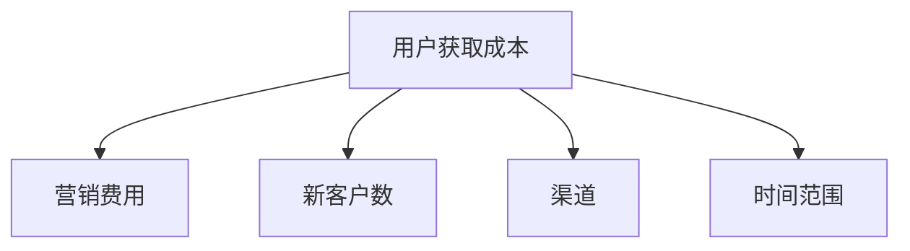
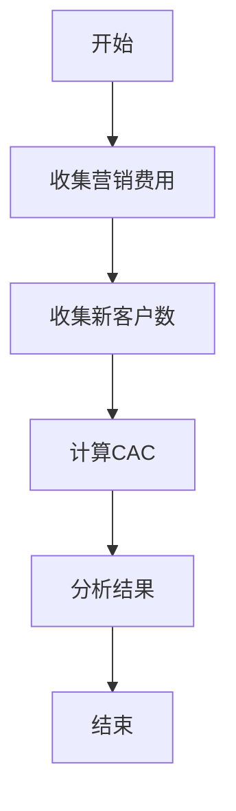
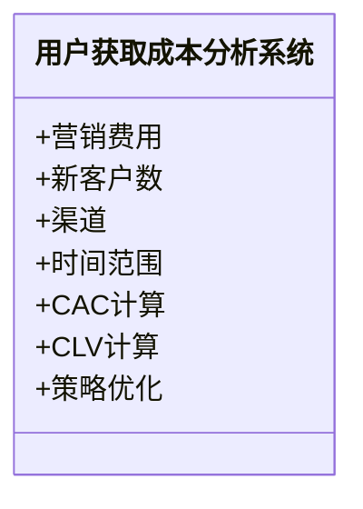
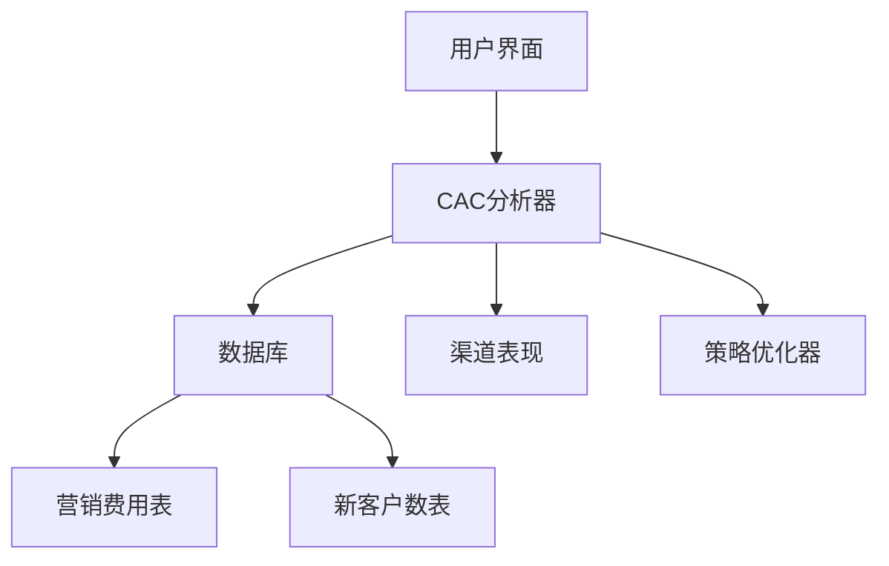

                 


# 彼得林奇如何分析公司的用户获取成本趋势

## 关键词：用户获取成本（CAC）、彼得林奇、投资分析、营销策略、用户生命周期价值（CLV）

## 摘要：本文将探讨彼得林奇在分析公司用户获取成本（CAC）趋势时的方法和策略。通过背景介绍、核心概念、算法原理、系统分析、项目实战以及最佳实践等多角度，深入剖析CAC的计算方法、影响因素及其与用户生命周期价值的关系，帮助投资者和企业更好地优化营销策略和投资决策。

---

## 第一部分：背景介绍

### 第1章：用户获取成本（CAC）的基本概念

#### 1.1 问题背景
- 1.1.1 投资分析中的用户获取成本问题：企业在获取用户的过程中投入了大量营销费用，如何评估这些费用是否合理，是否能带来正收益，是投资者关注的重点。
- 1.1.2 用户获取成本对企业价值的影响：低效的用户获取策略可能导致企业成本过高，影响盈利能力，而高效的策略则能提升企业竞争力和市场价值。

#### 1.2 问题描述
- 1.2.1 用户获取成本的定义与计算方法：用户获取成本（CAC）是指企业获取一位新用户的平均成本，通常包括广告费用、营销支出等。
- 1.2.2 用户获取成本的驱动因素：包括营销渠道效率、用户转化率、营销支出分配等。

#### 1.3 问题解决
- 1.3.1 如何通过分析用户获取成本优化投资决策：通过分析不同渠道的CAC，选择成本最低且效果最佳的渠道，优化营销预算分配。
- 1.3.2 用户获取成本与用户生命周期价值（CLV）的关系：CAC与CLV的比率是衡量用户获取策略是否有效的关键指标，CLV/CAC比率越高，用户获取的经济性越好。

#### 1.4 边界与外延
- 1.4.1 用户获取成本的边界条件：仅考虑直接的营销费用，不包括其他成本如研发或客户服务。
- 1.4.2 用户获取成本与其他成本的关系：与用户留存成本、用户活跃成本等共同影响整体用户管理成本。

#### 1.5 概念结构与核心要素组成
- 1.5.1 用户获取成本的核心要素：营销费用、新客户数、时间范围、渠道。
- 1.5.2 用户获取成本与企业利润的关系：CAC与企业利润的关系是投资回报的核心考量，直接影响企业的可持续发展和投资价值。

---

## 第二部分：核心概念与联系

### 第2章：用户获取成本的核心概念

#### 2.1 核心概念原理
- 2.1.1 用户获取成本的计算公式：$$CAC = \frac{\text{营销费用}}{\text{新客户数}}$$
- 2.1.2 用户获取成本与用户生命周期价值的对比：CAC是获取用户的成本，而CLV是用户在企业生命周期内带来的总收入，两者的比值决定了用户获取策略的经济性。

#### 2.2 核心概念属性特征对比表格
| 属性             | 用户获取成本（CAC） | 用户生命周期价值（CLV） |
|------------------|---------------------|-------------------------|
| 定义             | 获取新用户的平均成本 | 用户在生命周期内为企业带来的总收入 |
| 计算公式         | $$CAC = \frac{\text{营销费用}}{\text{新客户数}}$$ | $$CLV = (收入 - 成本) \times \text{用户生命周期长度}$$ |
| 影响因素         | 营销费用、新客户数 | 收入、成本、用户生命周期长度 |
| 重要性           | 决定营销效率 | 决定用户长期价值 |

#### 2.3 ER实体关系图架构


---

## 第三部分：算法原理讲解

### 第3章：用户获取成本的算法原理

#### 3.1 算法原理概述
用户获取成本（CAC）的计算是基于营销费用和新客户数的比率。其核心在于通过数据收集和分析，优化营销渠道和策略，以最小化CAC并最大化CLV。

#### 3.2 算法流程图


#### 3.3 算法实现
以下是一个简单的CAC计算器的Python代码：

```python
def calculate_cac(market_cost, new_customers):
    return market_cost / new_customers

# 示例
market_cost = 10000  # 总营销费用
new_customers = 100  # 新客户数
cac = calculate_cac(market_cost, new_customers)
print(f"用户获取成本（CAC）为：{cac:.2f}")
```

#### 3.4 算法分析
- 3.4.1 算法流程：数据收集 → 计算CAC → 分析结果。
- 3.4.2 算法数学模型：$$CAC = \frac{\text{营销费用}}{\text{新客户数}}$$
- 3.4.3 算法优化：通过A/B测试优化营销渠道，动态调整营销预算分配，以最小化CAC并提高CLV。

---

## 第四部分：系统分析与架构设计

### 第4章：用户获取成本分析系统架构

#### 4.1 问题场景介绍
- 用户获取成本分析系统用于帮助企业优化营销策略，通过实时数据收集和分析，提供基于CAC的决策支持。

#### 4.2 系统功能设计


#### 4.3 系统架构设计


---

## 第五部分：项目实战

### 第5章：用户获取成本分析项目实战

#### 5.1 环境安装
- 安装Python和相关库（如Pandas、Matplotlib）。
- 数据收集工具：Google Analytics、社交媒体广告平台API。

#### 5.2 核心代码实现
```python
import pandas as pd
import matplotlib.pyplot as plt

# 数据加载
data = pd.read_csv('marketing_data.csv')

# CAC计算
data['CAC'] = data['Marketing Cost'] / data['New Customers']

# 可视化
plt.figure(figsize=(10, 6))
plt.plot(data['Date'], data['CAC'], 'b-', marker='o')
plt.title('用户获取成本（CAC）趋势图')
plt.xlabel('日期')
plt.ylabel('CAC')
plt.grid(True)
plt.show()
```

#### 5.3 案例分析
- 案例背景：假设一家互联网公司通过不同渠道获取用户，需要分析哪种渠道的CAC最低。
- 数据分析：通过计算不同渠道的CAC，比较其与CLV的关系，选择CAC低于CLV的渠道进行重点投资。
- 实施效果：优化后的营销策略使CAC降低，同时CLV提升，带来投资回报率的提高。

---

## 第六部分：最佳实践

### 第6章：用户获取成本分析的最佳实践

#### 6.1 小结
- CAC是衡量用户获取效率的关键指标，优化CAC能够降低成本，提高企业盈利能力。
- 结合CLV分析，可以更好地评估用户获取策略的经济性，指导投资决策。

#### 6.2 注意事项
- 确保数据的准确性和完整性。
- 定期更新和分析CAC趋势，及时调整营销策略。
- 结合多维度数据（如用户留存率、转化率）进行综合评估。

#### 6.3 拓展阅读
- 《彼得·林奇的投资哲学》：深入理解彼得·林奇的投资理念。
- 《数据分析实战》：学习更多数据分析方法和工具。

---

## 结语
通过本文的详细讲解，读者可以系统地了解彼得·林奇分析用户获取成本的方法，并在实际项目中应用这些知识优化营销策略，提升投资回报。希望本文能为投资者和企业提供有价值的见解和实用的指导。

