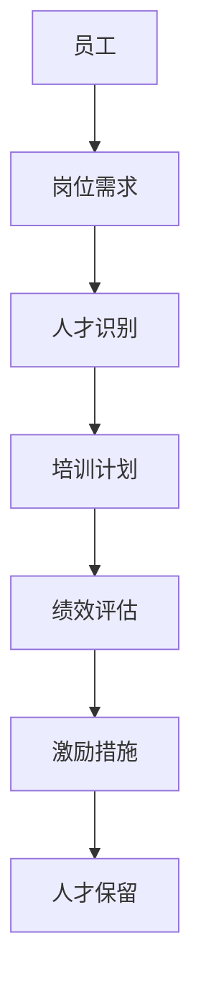
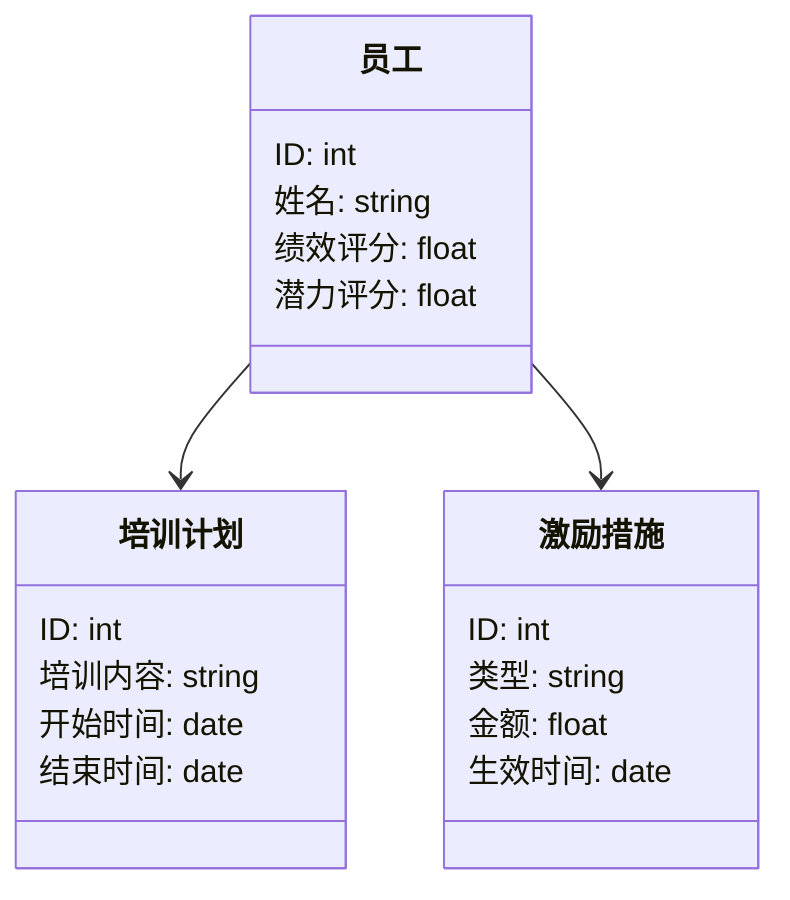
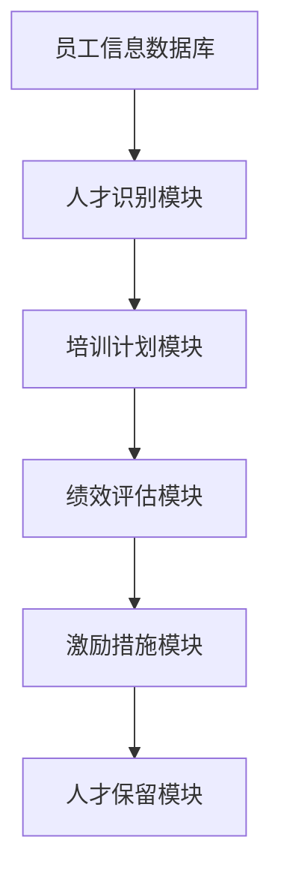

                 


# 彼得林奇如何看待公司的人才培养与保留策略

> 关键词：人才战略，彼得·林奇，人才培养，人才保留，企业战略，投资理念

> 摘要：本文从彼得·林奇的投资理念出发，探讨其在公司人才管理中的应用，分析如何通过人才识别、培养和保留策略来构建高效的人才管理体系，提出基于数学模型的算法原理和系统架构设计方案，最后给出实际项目案例和最佳实践。

---

## # 第一部分: 背景介绍

### ## 第1章: 问题背景与问题描述

#### ### 1.1 问题背景
- **人才管理的重要性**：在现代企业中，人才是核心资产，企业的长期发展依赖于优秀人才的培养与保留。
- **彼得·林奇的投资理念**：林奇以其长期投资策略闻名，注重基本面分析和企业潜力评估。这些理念可类比于人才管理中的长期培养和潜力挖掘。
- **现代企业的挑战**：人才流失和短缺已成为企业面临的主要问题，传统的人才管理方法已难以应对快速变化的市场需求。

#### ### 1.2 问题描述
- **人才流失问题**：优秀员工的流失导致企业竞争力下降，增加了招聘和培训的成本。
- **人才培养不足**：缺乏系统性的人才培养机制，员工潜力未被充分挖掘。
- **激励机制不完善**：员工缺乏长期激励，导致职业忠诚度降低。

#### ### 1.3 问题解决
- **借鉴投资理念**：通过系统性地识别、培养和保留人才，构建可持续的人才管理体系。
- **长期激励机制**：类似投资中的长期持有，建立员工与企业共同发展的激励模式。
- **动态评估与调整**：定期评估员工潜力和绩效，及时调整培养和保留策略。

#### ### 1.4 边界与外延
- **人才管理的范围**：包括高管、中层管理和技术人才，但不包括短期合同工。
- **与其他策略的关系**：与企业战略、文化管理和绩效考核相辅相成。
- **长期效果**：人才战略的实施需要时间，但能带来企业绩效的持续提升。

#### ### 1.5 概念结构与核心要素
- **人才识别**：通过评估员工的能力、潜力和价值观，识别高潜力人才。
- **人才培养**：通过系统化的培训和项目经验，提升员工的专业能力和综合素质。
- **人才保留**：通过激励机制和职业发展机会，留住优秀员工。

---

## # 第二部分: 核心概念与联系

### ## 第2章: 核心概念与原理

#### ### 2.1 人才战略的核心原理
- **人才识别的科学性**：基于员工的绩效、能力和潜力，结合岗位需求进行评估。
- **人才培养的系统性**：通过分层分类的培训计划，提升员工的综合素质。
- **人才保留的激励性**：通过股权激励、职业发展和个性化福利，增强员工的归属感。

#### ### 2.2 核心概念对比表格
```markdown
| 概念 | 人才管理 | 投资理念 | 对比分析 |
|------|----------|----------|----------|
| 核心目标 | 建立可持续的人才体系 | 投资于具有长期增长潜力的公司 | 相似性：长期性和系统性 |
| 实施方法 | 识别、培养、保留 | 选股、分析、长期持有 | 相似性：基于基本面的评估 |
| 成功标准 | 人才留存率和企业绩效提升 | 投资回报率和股价增长 | 相似性：关注长期收益 |
```

#### ### 2.3 实体关系图（Mermaid）


---

## # 第三部分: 算法原理讲解

### ## 第3章: 人才评估算法

#### ### 3.1 算法原理
- **基于彼得·林奇的选股模型**：将员工的能力、潜力和绩效视为“股票”，评估其长期价值。
- **权重分配**：根据岗位需求和员工特点，分配不同的权重进行综合评分。

#### ### 3.2 绩效评估模型
- **数学模型**：$$ \text{综合评分} = \sum_{i=1}^{n} w_i \times s_i $$
  - $$ w_i $$：第i项的权重
  - $$ s_i $$：第i项的评分
- **示例**：对于一个技术岗位，权重分配为：技术能力（60%）、团队合作（30%）、创新意识（10%）。综合评分为：$$ 0.6 \times 85 + 0.3 \times 90 + 0.1 \times 80 = 85.5 $$

#### ### 3.3 代码实现
```python
def talent_assessment(scores, weights):
    return sum(w * s for w, s in zip(weights, scores))

scores = [85, 90, 80]
weights = [0.6, 0.3, 0.1]
assessment = talent_assessment(scores, weights)
print(f"综合评分为: {assessment}")
```

---

## # 第四部分: 系统分析与架构设计

### ## 第4章: 人才管理系统设计

#### ### 4.1 系统功能设计
- **人才识别模块**：通过评估工具和数据分析识别高潜力员工。
- **人才培养模块**：制定个性化培训计划，提升员工能力。
- **人才保留模块**：设计激励机制，减少人才流失。

#### ### 4.2 领域模型类图（Mermaid）


#### ### 4.3 系统架构图（Mermaid）


---

## # 第五部分: 项目实战

### ## 第5章: 人才管理系统的实现

#### ### 5.1 环境安装
- **工具**：Python、Jupyter Notebook、Mermaid
- **依赖**：pandas、numpy、matplotlib

#### ### 5.2 核心代码实现
```python
import pandas as pd

# 创建员工数据
data = {
    '员工ID': [1, 2, 3, 4, 5],
    '姓名': ['A', 'B', 'C', 'D', 'E'],
    '绩效评分': [85, 90, 75, 80, 95],
    '潜力评分': [0.8, 0.7, 0.9, 0.6, 0.8]
}

df = pd.DataFrame(data)

# 计算综合评分
def calculate_assessment(row):
    return row['绩效评分'] * 0.7 + row['潜力评分'] * 0.3

df['综合评分'] = df.apply(calculate_assessment, axis=1)
print(df)
```

#### ### 5.3 案例分析
- **案例**：某公司技术部门有5名员工，通过上述算法计算综合评分，识别出两名高潜力员工，并制定个性化培训计划。

---

## # 第六部分: 最佳实践

### ## 第6章: 小结与建议

#### ### 6.1 小结
- 彼得·林奇的投资理念为人才管理提供了新的视角。
- 通过系统性的人才识别、培养和保留策略，企业可以构建高效的人才管理体系。

#### ### 6.2 注意事项
- **动态调整**：人才评估和激励机制需要定期更新。
- **员工参与**：鼓励员工参与制定个人发展计划。
- **文化塑造**：营造良好的企业文化和价值观。

#### ### 6.3 拓展阅读
- 《彼得·林奇的投资哲学》
- 《人才管理的创新实践》

---

通过以上结构，我们可以系统地分析和实施基于彼得·林奇投资理念的人才培养与保留策略，帮助企业建立可持续的人才管理体系，实现长期发展。

