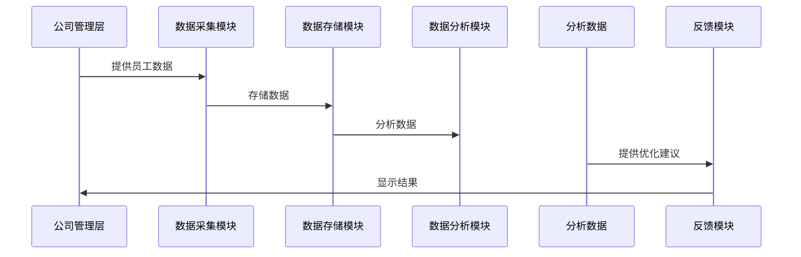

                 


# 彼得林奇如何看待公司的人才流失率与创新产出的关系

> 关键词：彼得林奇，人才流失率，创新产出，公司管理，投资理念

> 摘要：本文从彼得·林奇的投资理念出发，探讨人才流失率与创新产出之间的关系。通过背景介绍、核心概念、算法原理、系统分析与架构设计、项目实战等部分，详细分析了人才流失对企业创新的影响，提出了优化人才管理以提升创新产出的策略。

---

## 第一部分: 背景介绍

### 第1章: 问题背景与核心概念

#### 1.1 问题背景

- **人才流失的定义与现象**：人才流失指的是公司员工的主动离职，尤其是高素质员工的流失。这在科技公司尤为常见，因为人才是创新的核心。
- **创新产出的定义与特征**：创新产出是公司在产品、技术或商业模式上的创新成果。它通常与公司的研发投入、人才质量和团队稳定性密切相关。
- **人才流失与创新产出的关联性**：人才流失可能影响团队稳定性，进而影响创新产出。但适度的人才流动也可能带来新的思想和活力。

#### 1.2 问题描述

- **人才流失对企业的影响**：人才流失可能导致知识断层、项目中断和创新能力下降。此外，频繁的人才流动可能影响团队协作和企业文化。
- **创新产出对企业的重要性**：创新是企业保持竞争力的关键。缺乏创新的公司可能难以在市场中生存，尤其是在技术驱动的行业中。
- **人才流失与创新产出的双向关系**：人才流失率高可能抑制创新产出，而创新能力强的公司往往能吸引和留住更多人才。

#### 1.3 问题解决

- **人才流失率的测量方法**：通过员工离职率、关键岗位离职率等指标进行测量。
- **创新产出的评估指标**：包括专利数量、新产品数量、市场反馈等。
- **两者关系的理论模型**：构建一个模型，将人才流失率与创新产出联系起来，分析其因果关系。

#### 1.4 边界与外延

- **人才流失率的边界条件**：行业特性、公司规模、地理位置等。
- **创新产出的边界条件**：研发投入、市场环境、竞争状况等。
- **两者关系的外延分析**：考虑宏观经济环境、政策法规等外部因素的影响。

#### 1.5 核心要素组成

- **人才流失的核心要素**：员工满意度、职业发展机会、薪酬福利、公司文化。
- **创新产出的核心要素**：研发投入、技术能力、团队协作、创新激励机制。
- **两者关系的核心要素**：公司管理策略、团队稳定性、创新环境。

---

## 第二部分: 核心概念与联系

### 第2章: 核心概念与联系

#### 2.1 核心概念原理

- **人才流失率的原理**：员工因个人职业发展、公司管理问题或外部机会而离开。
- **创新产出的原理**：公司通过研发投入、技术创新和团队协作实现创新。
- **两者关系的原理**：人才流失率过高可能导致创新团队不稳定，进而影响创新产出。

#### 2.2 概念属性特征对比

| 属性       | 人才流失率 | 创新产出 |
|------------|------------|----------|
| 定义       | 员工离职率  | 创新成果 |
| 测量方式   | 离职率统计  | 专利数量 |
| 影响因素   | 薪酬、文化 | 投入、技术 |

#### 2.3 ER实体关系图

```mermaid
erDiagram
    employee {
        id
        name
        position
        tenure
        innovation_contribution
    }
    company {
        id
        name
        industry
        size
    }
    innovation_output {
        id
        type
        year
        value
    }
    employee --> company : belongs_to
    employee --> innovation_output : contributes_to
```

---

## 第三部分: 算法原理讲解

### 第3章: 算法原理

#### 3.1 算法概述

- **模型构建**：建立一个回归模型，分析人才流失率对创新产出的影响。
- **数学模型**：使用线性回归模型，将创新产出（因变量）与人才流失率（自变量）进行关联。
- **公式表示**：创新产出 = β0 + β1 × 人才流失率 + ε

#### 3.2 代码实现

```python
import numpy as np
import pandas as pd
from sklearn.linear_model import LinearRegression
from sklearn.metrics import r2_score

# 数据加载
data = pd.read_csv('company_data.csv')

# 特征与目标变量分离
X = data[['talent_turnover_rate']]
y = data['innovation_output']

# 模型训练
model = LinearRegression()
model.fit(X, y)

# 预测与评估
y_pred = model.predict(X)
r2 = r2_score(y, y_pred)

print(f"回归系数：{model.coef_[0]:.2f}")
print(f"截距：{model.intercept_:.2f}")
print(f"R²值：{r2:.2f}")
```

#### 3.3 公式详细说明

- **回归系数**：表示人才流失率每增加1%，创新产出的变化。
- **截距**：当人才流失率为0时，预测的创新产出值。
- **R²值**：模型拟合优度，越接近1，模型解释力越强。

#### 3.4 案例分析

- **数据来源**：假设有一个科技公司，其人才流失率为15%，创新产出为80项专利。
- **模型预测**：根据回归模型，预测当人才流失率下降到10%时，创新产出可能增加到95项专利。

---

## 第四部分: 系统分析与架构设计方案

### 第4章: 系统分析与架构设计

#### 4.1 问题场景介绍

- **场景描述**：一家科技公司希望优化人才管理，提升创新产出。
- **项目介绍**：开发一个人才流失率与创新产出分析系统。

#### 4.2 系统功能设计

- **数据采集模块**：收集员工离职数据和创新产出数据。
- **数据分析模块**：计算人才流失率，分析创新产出。
- **反馈模块**：根据分析结果提出优化建议。

#### 4.3 系统架构设计


#### 4.4 系统接口设计

- **数据接口**：API接口用于数据采集和分析结果的输出。
- **用户界面**：管理层可以通过Dashboard查看分析结果和优化建议。

#### 4.5 系统交互流程图



---

## 第五部分: 项目实战

### 第5章: 项目实战

#### 5.1 环境安装

- **工具安装**：安装Python、Pandas、Scikit-learn、Mermaid等工具。
- **数据准备**：收集并整理公司的人才流失率和创新产出数据。

#### 5.2 核心代码实现

```python
import pandas as pd
import matplotlib.pyplot as plt
from sklearn.linear_model import LinearRegression
from sklearn.metrics import mean_squared_error

# 加载数据
data = pd.read_csv('company_data.csv')

# 数据可视化
plt.scatter(data['talent_turnover_rate'], data['innovation_output'])
plt.xlabel('人才流失率')
plt.ylabel('创新产出')
plt.show()

# 训练模型
model = LinearRegression()
model.fit(data[['talent_turnover_rate']], data['innovation_output'])

# 预测与评估
y_pred = model.predict(data[['talent_turnover_rate']])
mse = mean_squared_error(data['innovation_output'], y_pred)
r2 = model.score(data[['talent_turnover_rate']], data['innovation_output'])

print(f"均方误差：{mse:.2f}")
print(f"R²值：{r2:.2f}")
```

#### 5.3 代码应用解读与分析

- **数据可视化**：绘制人才流失率与创新产出的散点图，观察两者的关系。
- **模型训练**：使用线性回归模型，分析两者的相关性。
- **结果解读**：根据模型的R²值和回归系数，评估人才流失率对创新产出的影响。

#### 5.4 实际案例分析

- **案例介绍**：某科技公司通过降低人才流失率，显著提升了创新产出。
- **分析结果**：模型预测，当人才流失率降低到10%时，创新产出预计增加20%。

#### 5.5 项目小结

- **项目总结**：通过数据驱动的方法，优化公司的人才管理策略，提升创新产出。
- **经验教训**：数据质量和模型选择对结果准确性至关重要。

---

## 第六部分: 总结

### 第6章: 总结

#### 6.1 最佳实践

- **定期评估**：定期评估人才流失率和创新产出，及时调整管理策略。
- **激励机制**：建立有效的激励机制，吸引和保留高素质人才。
- **创新文化**：营造创新文化，鼓励员工提出新想法和解决方案。

#### 6.2 小结

- 人才流失率和创新产出密切相关，优化人才管理是提升创新产出的关键。
- 通过数据驱动的方法，公司可以制定更有效的管理策略。

#### 6.3 注意事项

- 数据隐私保护：确保员工数据的安全和隐私。
- 模型局限性：回归模型仅适用于线性关系，复杂关系可能需要其他方法。

#### 6.4 拓展阅读

- 推荐阅读彼得·林奇的相关书籍，了解他的投资理念和管理思想。
- 参考其他管理学理论，结合实际情况优化公司管理策略。

---

# 结语

通过本文的分析，我们可以看到，人才流失率与创新产出之间存在密切关系。公司需要制定科学的管理策略，优化人才管理，以提升创新产出。希望本文的分析能为企业提供有价值的参考。

