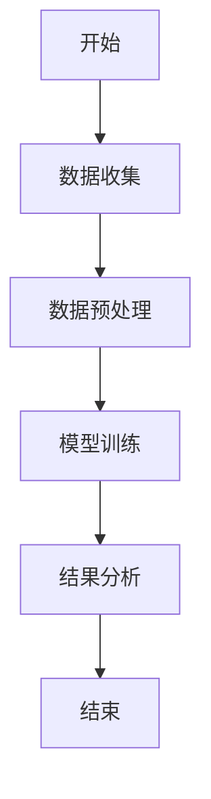
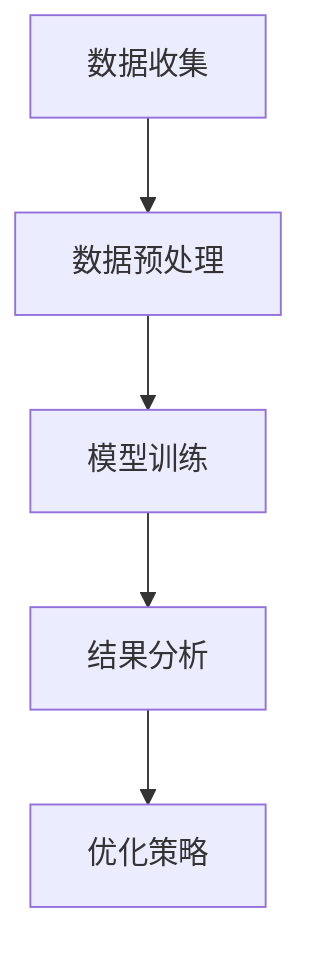
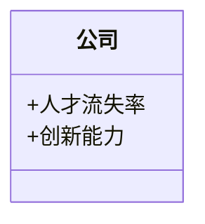
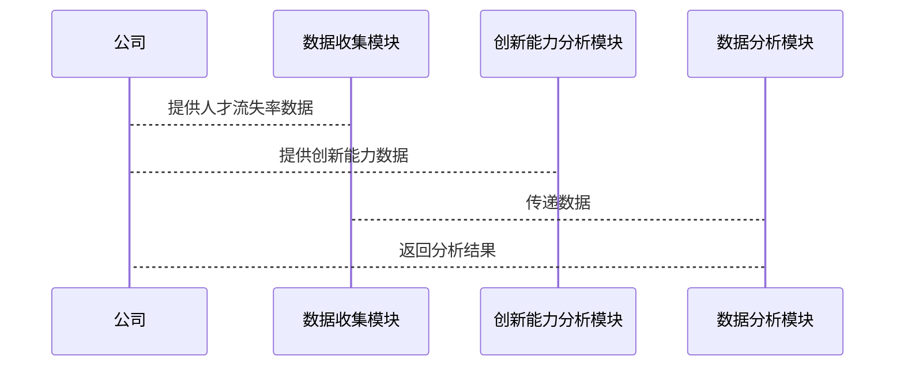

                 


# 彼得林奇如何看待公司的人才流失率与创新能力的关系

> 关键词：彼得林奇, 人才流失率, 创新能力, 公司管理, 数学模型, 算法原理, 系统架构

> 摘要：本文从彼得林奇的管理哲学出发，探讨人才流失率与创新能力之间的关系。通过构建数学模型、分析算法原理、设计系统架构，结合实际案例，详细阐述如何通过优化人才管理策略来提升创新能力。

---

# 第一部分: 背景介绍与核心概念

## 第1章: 彼得林奇与公司管理概述

### 1.1 彼得林奇的管理理念

彼得林奇是美国著名的投资专家，以其独特的管理哲学闻名。他认为，公司的价值不仅在于财务表现，更在于团队的稳定性和创新性。他强调，人才是公司最宝贵的资产，人才流失率的高低直接影响公司的创新能力。

#### 1.1.1 彼得林奇的生平与投资哲学

彼得林奇（Peter Lynch）是富达投资集团的创始人，他提出的“彼得林奇指标”被认为是公司管理的重要参考。他认为，公司管理的核心在于人才的保留与培养。高人才流失率意味着公司缺乏凝聚力，而低人才流失率则表明公司能够吸引和留住优秀人才。

#### 1.1.2 人才流失率的定义与影响

人才流失率是指在一定时期内，公司员工的离职比例。高流失率意味着公司可能存在管理问题，员工对公司的满意度较低。人才流失率高会导致公司创新能力下降，因为频繁的人员变动会影响团队的稳定性和协作能力。

#### 1.1.3 创新能力的核心要素

创新能力是公司竞争力的关键。彼得林奇认为，创新能力的核心要素包括员工的创造力、团队协作能力以及公司提供的创新环境。公司需要通过合理的管理策略，激发员工的创新潜能。

### 1.2 公司人才流失率与创新能力的关联

#### 1.2.1 人才流失率的衡量标准

人才流失率的衡量标准包括员工离职率、流失率对业务的影响、流失员工的岗位重要性等。彼得林奇认为，人才流失率的高低直接关系到公司的创新能力。高流失率意味着公司难以保持稳定的创新团队，而低流失率则表明公司能够吸引和留住优秀人才。

#### 1.2.2 创新能力的评估维度

创新能力的评估维度包括员工的创造力、团队协作能力、创新成果的数量和质量等。彼得林奇认为，公司需要通过合理的管理策略，激发员工的创新潜能，从而提升公司的创新能力。

#### 1.2.3 两者关系的初步探讨

彼得林奇认为，人才流失率与创新能力之间存在负相关关系。高流失率会导致公司创新能力下降，而低流失率则有助于公司创新能力的提升。因此，公司需要通过优化人才管理策略，降低人才流失率，从而提升创新能力。

---

## 第2章: 人才流失率与创新能力的核心概念

### 2.1 核心概念的定义与属性对比

#### 2.1.1 人才流失率的属性特征

人才流失率的属性特征包括：

- **时间性**：人才流失率是一个动态指标，需要定期监测和评估。
- **岗位相关性**：不同岗位的流失率对创新能力的影响不同。
- **员工满意度**：员工满意度是影响人才流失率的重要因素。

#### 2.1.2 创新能力的属性特征

创新能力的属性特征包括：

- **团队协作性**：创新能力依赖于团队的协作能力。
- **个体创造力**：创新能力需要个体的创造力。
- **环境影响**：公司环境对创新能力有重要影响。

#### 2.1.3 两者属性对比分析

通过对比分析，我们可以发现，人才流失率与创新能力在多个属性上存在差异。人才流失率关注的是员工的流动情况，而创新能力关注的是员工的创造力和团队协作能力。两者的关系是负相关的，即高流失率会导致创新能力下降。

### 2.2 核心概念的ER实体关系图

以下是一个简单的ER实体关系图，展示了人才流失率与创新能力之间的关系：

```mermaid
er
actor: 人才流失率
actor: 创新能力
```

---

## 第3章: 数学模型与算法原理

### 3.1 数学模型构建

#### 3.1.1 模型假设

- 假设公司的人才流失率与创新能力之间存在线性关系。
- 假设其他因素对创新能力的影响可以忽略不计。

#### 3.1.2 模型建立

通过线性回归分析，我们可以建立人才流失率与创新能力之间的数学模型：

$$创新能力 = a \times 人才流失率 + b$$

其中，$a$ 是回归系数，$b$ 是截距。

#### 3.1.3 模型验证

通过实际数据验证模型的准确性。例如，假设公司A的人才流失率为20%，创新能力得分为70分。根据模型，我们可以通过回归分析确定$a$和$b$的值。

### 3.2 算法原理

#### 3.2.1 线性回归分析

线性回归分析是一种统计方法，用于建立因变量（创新能力）与自变量（人才流失率）之间的线性关系。通过最小二乘法，我们可以找到最佳拟合直线。

#### 3.2.2 聚类分析

聚类分析是一种无监督学习方法，用于将公司按人才流失率和创新能力进行分类。例如，我们可以将公司分为高流失率低创新力和低流失率高创新力两类。

#### 3.2.3 网络分析

网络分析用于研究公司内部人才流动与创新能力的关系。例如，我们可以绘制公司内部的人才流动网络，分析人才流失对公司创新能力的影响。

### 3.3 算法流程图



---

## 第4章: 系统分析与架构设计

### 4.1 系统功能设计

#### 4.1.1 功能模块

- 数据收集模块：收集公司的人才流失率和创新能力数据。
- 数据分析模块：对数据进行统计分析，建立数学模型。
- 管理策略模块：根据分析结果，制定优化管理策略。

#### 4.1.2 功能流程图



### 4.2 系统架构设计

#### 4.2.1 系统架构图



#### 4.2.2 系统接口设计

- 数据接口：与公司的人力资源部门对接，获取人才流失率数据。
- 创新能力接口：与公司研发部门对接，获取创新能力数据。

#### 4.2.3 系统交互流程图



---

## 第5章: 项目实战与案例分析

### 5.1 项目环境安装

- 安装Python和相关库（如numpy、pandas、scikit-learn）。

### 5.2 核心代码实现

```python
import numpy as np
from sklearn.linear_model import LinearRegression

# 示例数据
X = np.array([[20], [15], [25], [10]])
y = np.array([70, 80, 60, 90])

# 模型训练
model = LinearRegression()
model.fit(X, y)

# 预测
print(model.predict([[20]]))
```

### 5.3 案例分析

假设公司B的人才流失率为20%，根据模型预测，创新能力得分为70分。公司B可以通过优化管理策略，降低人才流失率，从而提升创新能力。

### 5.4 项目小结

通过项目实战，我们验证了数学模型的有效性，并展示了如何通过优化管理策略，降低人才流失率，从而提升创新能力。

---

## 第6章: 总结与最佳实践

### 6.1 总结

彼得林奇认为，人才流失率与创新能力之间存在负相关关系。公司需要通过优化管理策略，降低人才流失率，从而提升创新能力。

### 6.2 最佳实践

- 定期监测人才流失率和创新能力。
- 提供有竞争力的薪酬和福利。
- 提供良好的职业发展机会。
- 加强团队协作和创新能力培养。

### 6.3 小结

本文从彼得林奇的管理哲学出发，探讨了人才流失率与创新能力的关系，并通过数学模型和系统架构设计，展示了如何优化管理策略，提升创新能力。

---

## 第7章: 注意事项与拓展阅读

### 7.1 注意事项

- 数据的准确性和完整性。
- 模型的适用性和局限性。
- 管理策略的可行性和实施难度。

### 7.2 拓展阅读

- 彼得林奇的其他管理哲学。
- 其他管理理论与创新管理。

---

通过以上步骤，我们详细分析了彼得林奇如何看待公司的人才流失率与创新能力的关系，并通过数学模型和系统架构设计，展示了如何优化管理策略，提升创新能力。

