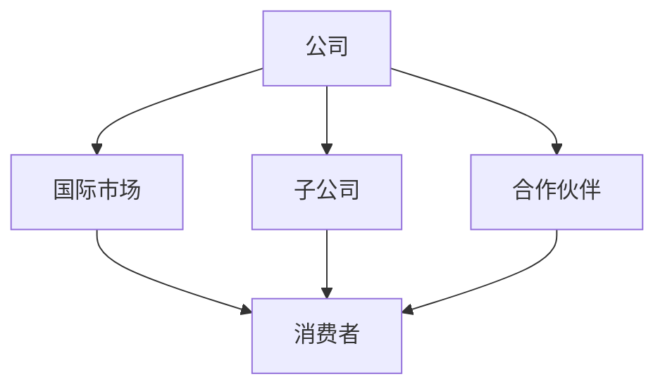
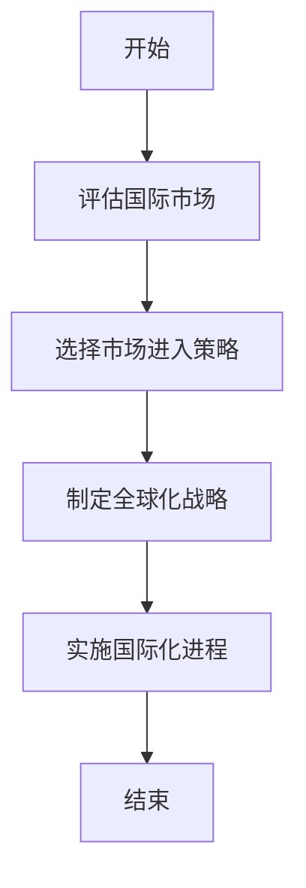
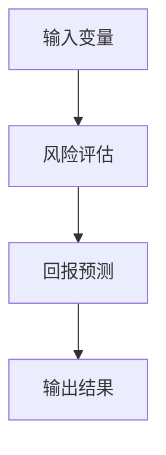
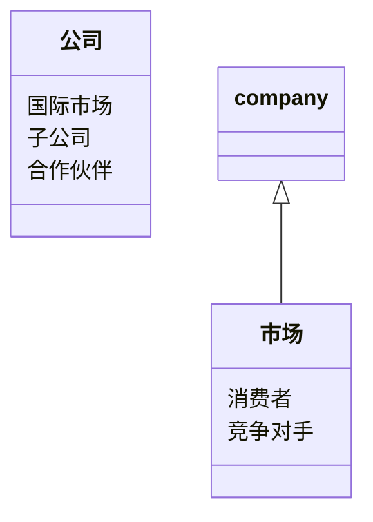
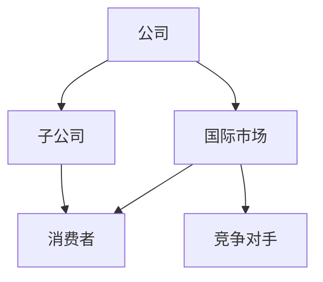
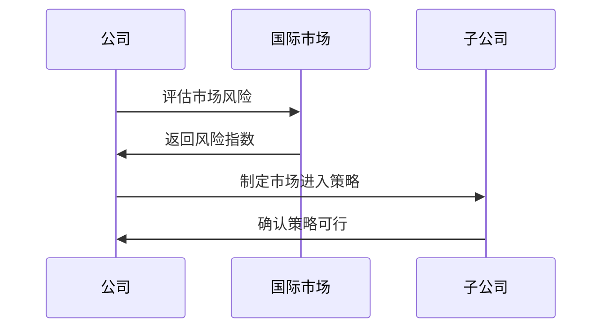

                 


# 彼得林奇如何看待公司的国际化进程

## 关键词：彼得·林奇、公司国际化、投资策略、全球化、风险管理

## 摘要：  
本文深入探讨了彼得·林奇如何看待公司的国际化进程，分析了公司在国际化过程中面临的挑战与机遇，结合彼得·林奇的投资理念和策略，详细解读了国际化进程对投资决策的影响，以及如何通过国际化进程提升企业的核心竞争力。

---

# 第1章 公司国际化进程的背景与概念

## 1.1 公司国际化的定义与背景

### 1.1.1 公司国际化的定义  
公司国际化是指企业将业务扩展到国际市场，跨越国界进行生产、销售、投资和管理的过程。这一过程通常涉及文化差异、法律环境、市场进入策略等多种复杂因素。

### 1.1.2 公司国际化的背景  
- **全球化趋势的推动**：随着全球化的深入，企业为了获取更大的市场和资源，纷纷将目光投向国际市场。  
- **技术进步的驱动**：互联网和信息技术的发展使得跨国经营变得更加便捷，企业能够更快速地响应全球市场需求。  
- **市场竞争的压力**：在本地市场趋于饱和的情况下，企业通过国际化寻求新的增长点，避免竞争压力。

### 1.1.3 公司国际化的核心特征  
- **跨国性**：业务覆盖多个国家和地区。  
- **文化多样性**：需要适应不同国家的文化、法律和消费习惯。  
- **复杂性**：涉及多个领域的协调与管理，如法律、财务、物流等。

---

## 1.2 彼得·林奇的投资视角与国际化进程的关系

### 1.2.1 彼得·林奇的投资者背景  
彼得·林奇是全球著名投资者，以其在富达投资集团的长期成功而闻名。他强调基本面分析、风险管理以及对企业的深入了解。

### 1.2.2 国际化进程对投资决策的影响  
- **企业价值的提升**：国际化能够扩大企业的收入来源，增强市场地位。  
- **投资风险的评估**：国际化涉及的法律、文化等因素增加了投资的复杂性，彼得·林奇会特别关注这些风险点。  
- **投资回报的潜力**：国际化通常意味着更大的市场和增长空间，但也需要更谨慎的评估。

### 1.2.3 彼得·林奇如何看待国际化进程的挑战  
- **文化差异**：不同国家的消费习惯和商业文化会影响企业的运营。  
- **法律与政策风险**：国际化涉及复杂的法律环境，企业需要应对不同国家的政策变化。  
- **市场竞争压力**：国际化过程中，企业可能面临来自本地竞争对手的压力。

---

# 第2章 公司国际化进程的核心概念与联系

## 2.1 国际进程的核心概念

### 2.1.1 全球化战略  
全球化战略是指企业在全球范围内进行资源配置和市场拓展，以实现最大的经济效益。这种战略要求企业具备跨文化的管理和协调能力。

### 2.1.2 市场进入策略  
市场进入策略是企业在国际化过程中选择的进入方式，常见的包括直接投资、合资合作、特许经营等。每种策略都有其优缺点，彼得·林奇会根据企业的具体情况选择最适合的策略。

### 2.1.3 跨国经营的组织架构  
跨国经营的组织架构需要考虑到不同国家的法律、文化和市场环境，通常包括母国公司、子公司、区域总部等多层次结构。

## 2.2 核心概念的对比分析

### 2.2.1 不同市场进入策略的对比  
| 市场进入策略 | 优点 | 缺点 |
|----------------|------|------|
| 直接投资 | 控制力强，风险分散 | 投资金额大，风险高 |
| 合资合作 | 风险较低，资源互补 | 控制力较弱 |
| 特许经营 | 投资小，风险低 | 收益有限 |

### 2.2.2 不同国际化模式的优缺点分析  
- **出口模式**：简单易行，风险较低，但增长潜力有限。  
- **合资模式**：资源整合，风险分担，但控制力较弱。  
- **全资子公司模式**：控制力强，但风险和成本较高。

### 2.2.3 不同国家文化差异对国际化进程的影响  
- **高语境文化 vs 低语境文化**：在高语境文化国家（如日本），企业更注重非正式沟通和关系建立；而在低语境文化国家（如美国），企业更注重正式沟通和合同。

---

## 2.3 实体关系图与流程图

### 2.3.1 国际进程的实体关系图（ER图）



### 2.3.2 国际进程的流程图（mermaid）



---

# 第3章 公司国际化进程的算法原理

## 3.1 国际进程的评估模型

### 3.1.1 模型的输入变量  
- 市场规模  
- 竞争程度  
- 法律环境  
- 文化差异  

### 3.1.2 模型的输出结果  
- 投资风险评估  
- 投资回报预测  

### 3.1.3 模型的算法流程  



---

## 3.2 算法的数学模型与公式

### 3.2.1 投资风险评估公式  
$$ \text{风险指数} = \frac{\text{法律风险} + \text{文化风险} + \text{市场风险}}{3} $$

### 3.2.2 投资回报预测公式  
$$ \text{回报率} = \left( \frac{\text{国际市场收入} - \text{本地市场收入}}{\text{本地市场收入}} \right) \times 100 $$

---

## 3.3 实际案例分析  

### 3.3.1 案例背景  
假设一家美国公司计划进入中国市场，彼得·林奇会如何评估其投资风险和回报？

### 3.3.2 评估过程  
- **法律风险**：中国市场的法规复杂，但通过合资模式可以降低风险。  
- **文化风险**：中国消费者注重品牌和售后服务，需要调整营销策略。  
- **市场风险**：竞争激烈，但公司可以通过技术创新和优质服务获得竞争优势。

---

# 第4章 公司国际化进程的系统分析与架构设计

## 4.1 问题场景介绍  
企业希望通过国际化进程提升市场竞争力，但面临文化差异、法律风险等问题，需要构建一个高效的国际化管理系统。

## 4.2 系统功能设计  

### 4.2.1 领域模型（mermaid类图）  



### 4.2.2 系统架构设计（mermaid架构图）  



---

## 4.3 系统接口设计  

### 4.3.1 系统接口设计  
- **API接口**：用于与国际市场数据源对接，获取市场信息。  
- **用户界面**：提供给企业高管查看国际市场风险和回报分析。

---

## 4.4 系统交互流程图（mermaid序列图）  



---

# 第5章 项目实战

## 5.1 环境安装  

### 5.1.1 安装工具  
- **Python**：用于数据分析和建模。  
- **Mermaid**：用于绘制图表。  

## 5.2 核心实现源代码  

### 5.2.1 投资风险评估代码  

```python
def calculate_risk/legal_risk + cultural_risk + market_risk)/3
```

### 5.2.2 投资回报预测代码  

```python
def calculate_return( international_revenue, local_revenue ):
    return ((international_revenue - local_revenue) / local_revenue) * 100
```

---

## 5.3 实际案例分析  

### 5.3.1 案例分析  
以某国际公司为例，分析其国际化进程中的风险和回报，解读彼得·林奇的投资决策过程。

---

## 5.4 项目小结  

### 5.4.1 核心实现总结  
通过代码和图表，我们能够清晰地评估国际化的风险和回报，为投资决策提供数据支持。

---

# 第6章 最佳实践、小结与展望

## 6.1 最佳实践  

### 6.1.1 投资建议  
- 仔细评估国际化市场的法律和文化风险。  
- 根据具体情况选择合适的市场进入策略。  

### 6.1.2 风险管理  
- 建立风险评估模型，定期更新数据。  
- 与当地合作伙伴建立良好关系，降低文化风险。

## 6.2 小结  
本文从彼得·林奇的视角分析了公司国际化进程的背景、核心概念和实际应用，结合理论与实践，提出了有效的投资策略。

## 6.3 未来展望  
随着全球化的深入，公司国际化进程将面临更多挑战和机遇，彼得·林奇的投资理念也将继续为投资者提供宝贵的经验。

---

# 结语  

公司国际化进程是一个复杂而重要的过程，彼得·林奇的投资理念为我们提供了独特的视角。通过系统的分析和实际案例的探讨，我们能够更好地理解国际化进程的挑战与机遇，为企业制定更有效的国际化战略提供支持。

