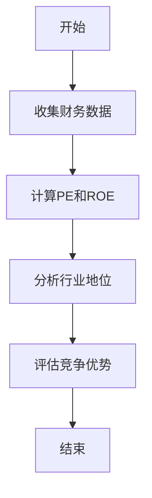

                 


# 彼得·林奇如何看待公司的市场适应能力

## 关键词：彼得·林奇, 市场适应能力, 投资哲学, 财务分析, 竞争优势

## 摘要：  
彼得·林奇是全球著名的投资专家，他的投资哲学强调对公司基本面的深入分析和市场适应能力的评估。本文将从背景介绍、核心概念、算法原理、数学模型、系统架构、项目实战和最佳实践等多个方面，详细阐述彼得·林奇如何看待公司的市场适应能力，帮助读者理解这一重要投资理念。

---

# 正文

## 第一部分：背景介绍

### 第1章：市场适应能力的定义  
市场适应能力是指公司在不断变化的市场环境中，能够灵活调整战略、优化运营、抓住机遇并应对挑战的能力。它是企业生存和发展的关键因素，尤其是在经济波动和市场变化频繁的环境下。彼得·林奇认为，市场适应能力是衡量一家公司是否具备长期投资价值的重要标准。

#### 1.1 核心概念术语说明  
- **市场适应能力**：公司在市场变化中的应变和调整能力。  
- **基本面分析**：通过对公司的财务状况、行业地位和市场环境进行分析，评估其内在价值。  
- **竞争优势**：公司在市场上相对于竞争对手的独特优势，包括成本优势、技术优势、品牌优势等。  

#### 1.2 问题背景与描述  
在投资领域，市场适应能力直接影响公司的长期表现和股价波动。彼得·林奇通过分析公司的市场适应能力，识别出那些能够在市场变化中持续增长的优秀企业。  

#### 1.3 边界与外延  
市场适应能力不仅包括公司对市场变化的反应速度，还包括其战略调整能力、创新能力以及团队执行力。  

---

## 第二部分：核心概念与联系

### 第2章：彼得·林奇的投资哲学  
彼得·林奇的投资哲学以基本面分析为核心，强调对公司市场适应能力的深入研究。他认为，投资者应该选择那些在市场中具备竞争优势、财务健康且管理层能力强的公司。

#### 2.1 投资的核心原则  
- **长期投资**：避免短期市场波动的干扰，关注公司的长期价值。  
- **深入研究**：通过基本面分析，识别出具备竞争优势的公司。  
- **分散投资**：降低投资风险，避免过度集中。  

#### 2.2 投资策略与方法  
彼得·林奇提出了一系列分析框架，包括对公司财务状况、行业地位和管理层能力的评估。他强调，投资者应该选择那些能够在市场变化中保持竞争优势的公司。

#### 2.3 成功案例分析  
以可口可乐为例，彼得·林奇认为其强大的品牌优势和全球市场布局使其具备了强大的市场适应能力。

---

## 第三部分：算法原理

### 第3章：市场适应能力的算法分析  
彼得·林奇的分析方法可以看作是一种基于基本面的算法，通过量化指标评估公司的市场适应能力。

#### 3.1 算法原理  
- **步骤1**：收集公司的财务数据，包括收入、利润、负债等。  
- **步骤2**：计算关键财务指标，如市盈率（PE）、市净率（PB）、ROE（净资产收益率）等。  
- **步骤3**：分析公司的行业地位和竞争优势。  
- **步骤4**：评估管理层的能力和战略调整能力。  

#### 3.2 代码实现  
```python
import pandas as pd
import numpy as np

def calculate_pe_ratio(revenue, net_income):
    pe_ratio = revenue / net_income
    return pe_ratio

def calculate_roe(net_income, equity):
    roe = (net_income / equity) * 100
    return roe

# 示例数据
revenue = 1000000000
net_income = 200000000
equity = 500000000

pe = calculate_pe_ratio(revenue, net_income)
roe = calculate_roe(net_income, equity)

print(f"PE Ratio: {pe:.2f}")
print(f"ROE: {roe:.2f}%")
```

#### 3.3 流程图  


---

## 第四部分：数学模型

### 第4章：财务指标与市场适应能力  
彼得·林奇的分析框架中，财务指标是评估市场适应能力的重要工具。

#### 4.1 关键指标  
- **PE Ratio (市盈率)**：$PE = \frac{股价}{每股收益}$  
- **ROE (净资产收益率)**：$ROE = \frac{净利润}{股东权益} \times 100\%$  
- **毛利率**：$毛利率 = \frac{营业收入 - 营业成本}{营业收入} \times 100\%$  

#### 4.2 示例计算  
假设某公司营业收入为10亿元，营业成本为6亿元，净利润为2亿元，股东权益为5亿元。  
- PE Ratio：$PE = \frac{股价}{2}$  
- ROE：$ROE = \frac{2}{5} \times 100\% = 40\%$  

---

## 第五部分：系统分析与架构设计

### 第5章：系统架构设计  
为了更好地分析市场适应能力，可以构建一个基于彼得·林奇方法的分析系统。

#### 5.1 系统功能设计  
- **数据收集模块**：收集公司的财务数据和行业信息。  
- **分析模块**：计算财务指标，评估竞争优势。  
- **决策支持模块**：提供投资建议。  

#### 5.2 系统架构图  


---

## 第六部分：项目实战

### 第6章：项目实战分析  
以某公司为例，展示如何应用彼得·林奇的分析方法进行市场适应能力评估。

#### 6.1 环境安装  
需要安装Python和相关库（如pandas、numpy）。  

#### 6.2 源代码实现  
```python
import pandas as pd

def analyze_company(data):
    pe = data['收入'] / data['净利润']
    roe = (data['净利润'] / data['股东权益']) * 100
    return pe, roe

data = {
    '收入': 1000000000,
    '净利润': 200000000,
    '股东权益': 500000000
}

pe, roe = analyze_company(data)
print(f"PE Ratio: {pe:.2f}")
print(f"ROE: {roe:.2f}%")
```

#### 6.3 案例分析  
通过计算PE和ROE，评估公司的市场适应能力。  

---

## 第七部分：最佳实践

### 第7章：总结与建议  
彼得·林奇的市场适应能力分析方法为投资者提供了重要的指导。以下是几点建议：  
1. 深入研究公司的基本面。  
2. 关注管理层的能力和战略。  
3. 保持长期投资视角。  
4. 定期更新和调整分析模型。  

---

## 结论  
通过本文的分析，我们可以看到，彼得·林奇的市场适应能力分析方法不仅是一种投资策略，更是一种系统化的思考方式。投资者可以通过深入研究公司的基本面和竞争优势，识别出具备长期投资价值的优秀企业。希望本文能为读者提供有价值的参考和启发。

