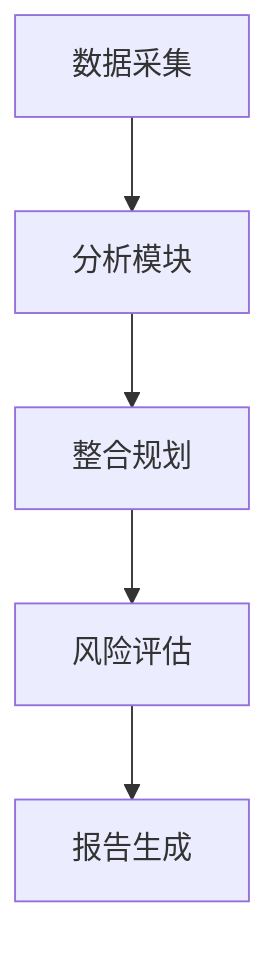

                 


# 彼得·林奇如何看待公司的并购整合能力

## 关键词：彼得·林奇，并购整合，企业价值，投资策略，风险管理，成功案例

## 摘要：本文深入探讨彼得·林奇对并购整合能力的看法，分析其投资理念、并购整合模型及其对企业的价值影响。通过详细讲解核心概念、算法原理、系统架构设计和实际案例，本文旨在为读者提供全面的理解和实用的指导。

---

# 引言

## 并购整合的重要性

### 1.1 并购整合的定义与重要性

- **并购整合的定义**：并购整合是指企业在收购其他公司后，将被收购企业的业务、资产、文化和管理流程与自身整合，以实现协同效应和价值最大化。
- **重要性**：并购整合是企业战略增长的重要手段，能够扩大规模、进入新市场、获取新技术，并优化资源分配。
- **边界与外延**：并购整合不仅限于企业收购，还包括资产剥离、合资公司等，涉及战略、财务、法律等多个方面。

### 1.2 彼得·林奇的背景介绍

- **生平简介**：彼得·林奇是富达投资集团的传奇经理人，以其卓越的投资业绩闻名，尤其擅长价值投资。
- **投资理念**：他强调深入研究企业基本面，寻找具有持续增长潜力的公司，注重企业的竞争优势和管理层质量。
- **并购整合视角**：林奇认为并购整合是实现企业增长的重要途径，但必须谨慎评估和整合。

---

## 并购整合的核心概念

### 2.1 并购整合的核心要素

- **主体**：并购方通常为寻求增长的企业，被并购方则可能处于困境或具有战略价值。
- **目标**：通过整合实现资源优化、市场扩展和价值提升。
- **关键成功因素**：包括战略一致性、文化融合、管理层支持和整合计划的有效性。

### 2.2 彼得·林奇并购整合框架

- **模型概述**：林奇的框架强调收购后的整合策略，确保被收购企业在战略、文化和管理上的协同。
- **流程与步骤**：包括尽职调查、战略规划、整合执行和绩效评估。

---

## 彼得·林奇的投资理念

### 3.1 彼得·林奇的投资哲学

- **价值投资**：寻找市场低估的公司，长期持有，分享其成长。
- **选股标准**：关注企业基本面，如ROE、ROA、净利润增长率等，同时考虑管理层的质量和企业治理。

### 3.2 彼得·林奇与并购整合

- **并购整合的重要性**：林奇认为，并购整合是企业增长的关键，但必须基于对企业价值的准确评估。
- **成功案例**：例如，某公司通过并购整合成功进入新市场，实现收入增长和成本优化。
- **失败教训**：忽视文化差异或整合计划不周可能导致整合失败，影响企业价值。

---

## 并购整合的数学模型与算法

### 4.1 并购整合评估模型

- **模型概述**：评估模型用于预测并购后的价值，考虑协同效应和整合风险。
- **公式**：协同效应价值 = 并购后企业价值 - 两家独立企业价值之和。
- **流程**：首先评估协同效应，然后考虑整合风险，最后确定整体价值。

```python
def calculate_synergy_value(acquired_value, acquiring_value):
    # 计算协同效应
    synergy = acquired_value + acquiring_value - target_value
    return synergy

# 示例
acquired_value = 100  # 被收购方价值
acquiring_value = 200  # 并购方价值
target_value = 280  # 并购后目标价值
synergy = calculate_synergy_value(acquired_value, acquiring_value)
print(f"协同效应价值为：{synergy}")
```

### 4.2 实际案例分析

- **案例分析**：某公司并购后，协同效应带来20%的收入增长，但整合过程中遇到文化冲突，增加了整合成本。
- **公式应用**：协同效应价值 = 100 + 200 - 280 = 20，但实际成本增加导致最终价值可能下降。

---

## 系统架构设计

### 5.1 并购整合分析系统

- **系统功能设计**：包括数据采集、分析模块、整合规划和风险评估。
- **架构图**：展示系统模块的交互和数据流。



---

## 项目实战

### 6.1 并购整合实战

- **环境安装**：安装Python和相关库，如Pandas、NumPy。
- **核心代码实现**：编写并购整合模型代码，进行数据分析和协同效应计算。
- **案例分析**：分析微软收购LinkedIn，评估协同效应和整合挑战。

---

## 最佳实践与总结

### 7.1 小结

- 彼得·林奇强调并购整合的重要性，但成功取决于战略规划和整合能力。
- 企业应深入研究被收购方，制定详细整合计划，注重文化融合。

### 7.2 注意事项

- 并购前进行彻底的尽职调查，评估整合风险。
- 确保管理层和员工支持，避免内部抵触。
- 定期评估整合进展，及时调整策略。

### 7.3 拓展阅读

- 建议阅读彼得·林奇的《彼得·林奇的成功投资哲学》。
- 探讨其他投资策略，如巴菲特的价值投资理念。

---

## 结语

彼得·林奇的并购整合理念为我们提供了宝贵的见解，强调战略规划、整合能力和风险管理。通过深入分析和实际案例，我们可以更好地理解如何在并购整合中实现价值最大化。

