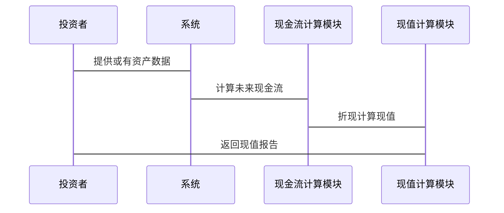

                 


# 彼得·林奇如何看待公司的或有资产价值

## 关键词
- 彼得·林奇
- 或有资产
- 投资评估
- 现金流折现模型
- 企业价值分析

## 摘要
本文深入探讨了投资大师彼得·林奇对公司或有资产价值的看法，结合理论分析和实际案例，详细讲解了或有资产的定义、分类及其在投资决策中的重要性。通过现金流折现模型（DCF）的数学推导和Python实现，文章展示了如何量化评估或有资产的价值，并通过系统架构设计和项目实战，为读者提供了全面的理解和实用的应用方法。

---

# 第一部分：背景介绍

## 第1章：公司的或有资产概述

### 1.1 或有资产的定义与背景
#### 1.1.1 什么是或有资产
或有资产是企业在资产负债表中未明确列示，但在特定条件下可能带来的经济利益的资产。常见的或有资产包括未决诉讼中的潜在赔偿、质保金、期权等。

#### 1.1.2 或有资产的分类
| 类型               | 定义与特点                     |
|--------------------|-------------------------------|
| 保证类或有资产     | 企业为其他方提供担保或保证的资产，如保证债券。 |
| 承诺类或有资产     | 企业在未来特定条件下必须履行的承诺，如长期合同。 |
| 其他或有资产       | 包括期权、认股权证等金融工具。 |

#### 1.1.3 或有资产在企业财务中的重要性
或有资产可能转化为实际的现金流入或资产增加，但同时也可能带来潜在的负债，因此在评估企业价值时，必须考虑其潜在影响。

---

### 1.2 彼得·林奇与或有资产的价值评估
#### 1.2.1 彼得·林奇的投资理念
彼得·林奇强调基本面分析，认为企业的内在价值可以通过对其未来现金流的评估来确定。

#### 1.2.2 或有资产在投资决策中的作用
或有资产可能成为企业的潜在价值来源，但也可能增加财务风险。

#### 1.2.3 彼得·林奇对或有资产的独特见解
彼得·林奇认为，评估或有资产时，应关注其对现金流的影响，而不仅仅是其账面价值。

---

# 第二部分：核心概念与联系

## 第2章：或有资产的核心概念与评估方法

### 2.1 或有资产的类型与特征
#### 2.1.1 保证类或有资产
企业为其他方提供的担保可能带来潜在的偿债责任，影响企业的财务状况。

#### 2.1.2 承诺类或有资产
企业未来可能需要履行的承诺，如长期服务合同，可能带来未来的收入或支出。

#### 2.1.3 其他或有资产
包括期权、认股权证等金融工具，可能在特定条件下为企业带来额外收益。

### 2.2 或有资产的评估方法
#### 2.2.1 现金流折现法
现金流折现法是评估或有资产价值的核心方法，通过预测未来现金流并折现至现值来确定其价值。

#### 2.2.2 市场法
通过比较类似资产的市场价，调整差异因素后确定或有资产的价值。

#### 2.2.3 相对价值法
基于相对指标（如市盈率、市净率）进行评估，适用于市场数据丰富的资产。

---

# 第三部分：算法原理讲解

## 第3章：现金流折现模型（DCF）的应用

### 3.1 DCF模型的基本原理
现金流折现模型通过预测未来现金流并折现至现值，计算资产的公允价值。公式为：
$$ PV = \frac{CF}{(1 + r)^t} $$
其中，CF为未来现金流，r为折现率，t为时间。

#### 3.1.1 现金流的定义与分类
现金流分为经营性现金流、投资性现金流和融资性现金流，经营性现金流是评估企业价值的核心。

#### 3.1.2 折现率的计算方法
折现率通常采用加权平均资本成本（WACC）或行业平均收益率。

#### 3.1.3 现金流折现的公式推导
通过累加未来现金流的现值，计算总现值：
$$ PV = \sum_{t=1}^{n} \frac{CF_t}{(1 + r)^t} $$

### 3.2 使用Python实现DCF模型
#### 3.2.1 环境安装与依赖管理
安装Python和必要的库（如numpy、pandas）。

#### 3.2.2 核心代码实现
```python
import numpy as np
def calculate_pv(cash_flows, discount_rate):
    return np.npv(discount_rate, cash_flows)
```

#### 3.2.3 代码解读与优化建议
使用numpy的npv函数计算现值，考虑现金流的时间价值。

---

# 第四部分：系统分析与架构设计方案

## 第4章：或有资产评估系统的架构设计

### 4.1 问题场景介绍
在投资决策中，准确评估或有资产的价值是关键，但传统的财务报表分析往往忽略其潜在影响。

### 4.2 系统功能设计
#### 4.2.1 领域模型设计（Mermaid类图）


#### 4.2.2 系统架构设计（Mermaid架构图）


#### 4.2.3 系统接口设计与交互流程（Mermaid序列图）


---

# 第五部分：项目实战

## 第5章：实际案例分析与系统实现

### 5.1 案例分析：某公司或有资产的评估
#### 5.1.1 案例背景与数据收集
某公司有一笔未决诉讼的潜在赔偿，需评估其价值。

#### 5.1.2 应用DCF模型进行评估
预测未来现金流并计算现值，考虑折现率和时间价值。

#### 5.1.3 结果分析与投资决策
评估结果显示潜在赔偿的现值为1000万美元，对投资决策产生重大影响。

---

# 总结

## 最佳实践 tips
- 在投资评估中，不可忽视或有资产的潜在影响。
- 使用DCF模型进行或有资产的价值评估时，确保数据准确和模型合理。

## 小结
本文通过理论分析和实际案例，展示了如何评估公司的或有资产价值，并提供了系统的架构设计和代码实现。这些方法和工具可帮助投资者更准确地评估企业价值。

## 注意事项
- 或有资产的评估具有不确定性，需谨慎处理。
- 折现率的选择对评估结果影响重大，需结合市场实际情况。

## 拓展阅读
- 《彼得·林奇的投资哲学》
- 《现金流折现模型的高级应用》

通过本文的学习，读者可以深入理解彼得·林奇的视角，并在实际投资中应用这些方法和工具。

