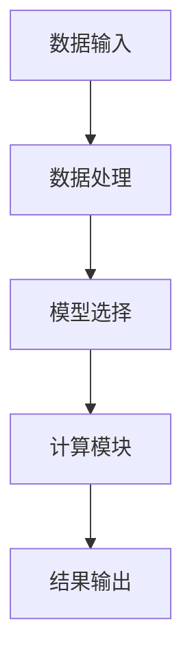
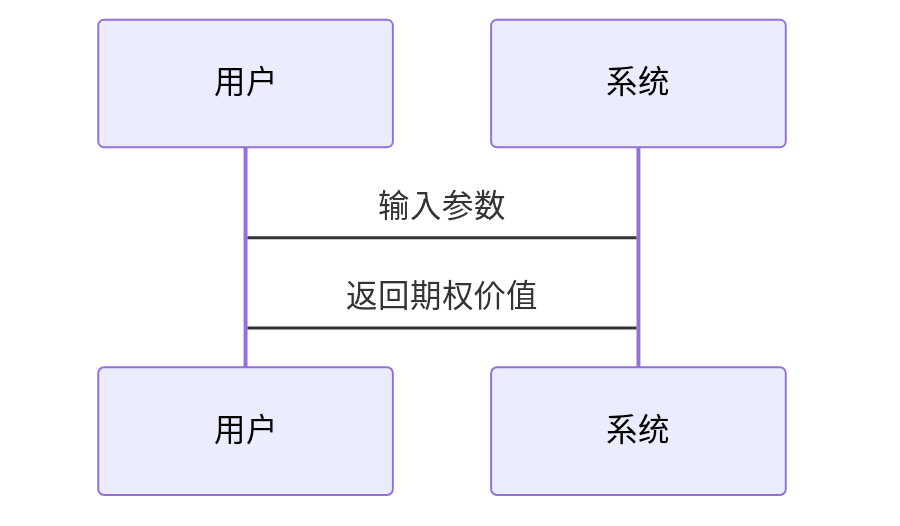

                 


# 彼得林奇如何看待公司的或有资产价值评估

## 关键词：彼得林奇, 或有资产, 价值评估, 投资策略, 期权定价, 财务分析

## 摘要：本文探讨彼得林奇在评估公司或有资产时的独特见解，结合技术分析和投资策略，详细阐述或有资产的定义、分类、定价模型及其对公司价值的影响。通过数学模型和实际案例，分析如何将或有资产纳入企业估值，帮助投资者做出更明智的决策。

---

# 第一章: 或有资产的基本概念与重要性

## 1.1 或有资产的定义与分类

### 1.1.1 或有资产的定义

或有资产（contingent assets）是指在特定条件下才能获得的资产，其价值取决于未来某一事件的发生与否。常见的或有资产包括期权、认股权证、保险赔偿金等。这些资产通常不在公司资产负债表中直接反映，但它们可能对公司的财务状况产生重大影响。

### 1.1.2 或有资产的主要分类

1. **期权**：包括看涨期权和看跌期权，赋予持有者在特定时间内以特定价格购买或出售资产的权利。
2. **认股权证**：允许持有者以特定价格购买公司股票的权利。
3. **保险赔偿金**：在发生特定风险事件时，公司可以从保险公司获得的赔偿。
4. **未来合同**：如未来购买或销售资产的合同，其价值取决于未来的市场价格。

### 1.1.3 或有资产在公司财务中的重要性

或有资产可以为公司提供潜在的价值增长，但也可能带来财务风险。例如，期权可能在股价上涨时为公司带来额外收益，但也可能在股价下跌时导致重大损失。因此，正确评估或有资产的价值对公司的整体估值至关重要。

---

## 1.2 或有资产与传统资产的区别

### 1.2.1 资产类型对比

| 资产类型 | 确定性 | 时间性 | 风险性 | 价值评估复杂性 |
|----------|--------|--------|--------|----------------|
| 传统资产 | 高     | 现在   | 低     | 低              |
| 或有资产 | 低     | 未来   | 高     | 高              |

### 1.2.2 或有资产的独特属性

1. **条件性**：或有资产的价值取决于未来某一事件的发生。
2. **不确定性**：由于未来事件的不确定性，或有资产的价值波动较大。
3. **杠杆效应**：或有资产通常具有杠杆效应，小的变化可能导致价值的大幅波动。

### 1.2.3 或有资产对公司价值的影响

或有资产可以为公司提供潜在的价值增长，但也可能增加公司的财务风险。例如，期权可能在股价上涨时为公司带来额外收益，但也可能在股价下跌时导致重大损失。因此，正确评估或有资产的价值对公司的整体估值至关重要。

---

## 1.3 本书的核心问题与目标

### 1.3.1 问题背景

彼得林奇作为著名投资专家，他如何看待公司的或有资产价值评估？如何将或有资产纳入公司的整体估值？

### 1.3.2 问题描述

本文将探讨或有资产的定义、分类、定价模型及其对公司价值的影响。通过分析彼得林奇的投资策略，揭示如何在实际投资中应用这些模型。

### 1.3.3 问题解决思路

1. 理解或有资产的基本概念和分类。
2. 掌握或有资产的定价模型和方法。
3. 分析彼得林奇的投资策略，探讨如何将或有资产纳入公司估值。

### 1.3.4 问题的边界与外延

本文仅讨论公司或有资产的价值评估，不涉及个人投资策略或其他类型的资产。

### 1.3.5 概念结构与核心要素组成

| 概念 | 定义 | 关系 |
|------|------|------|
| 或有资产 | 在特定条件下才能获得的资产 | 或有资产影响公司整体价值 |
| 定价模型 | 用于评估或有资产价值的数学模型 | 不同模型适用于不同情况 |

---

## 1.4 本章小结

本章介绍了或有资产的基本概念、分类及其与传统资产的区别。通过对或有资产的独特属性和对公司价值的影响的分析，为后续章节的深入探讨奠定了基础。

---

# 第二章: 或有资产的价值评估原理

## 2.1 或有资产的核心概念

### 2.1.1 或有资产的定价模型

定价模型是评估或有资产价值的核心工具。常用的模型包括Black-Scholes模型和二叉树模型。

### 2.1.2 或有资产的风险因素

1. **股价波动**：股价的波动直接影响期权等或有资产的价值。
2. **利率变化**：利率的变化会影响期权的现值。
3. **时间因素**：期权的时间价值会随着到期日的临近而减少。

### 2.1.3 或有资产的市场流动性

流动性是指资产在市场上的交易活跃程度。流动性差的或有资产可能难以快速变现。

### 2.1.4 或有资产的市场流动性

1. **流动性高**：资产易于买卖，价格波动小。
2. **流动性低**：资产难以变现，价格波动大。

### 2.1.5 或有资产的市场流动性

流动性高的或有资产通常更容易被投资者接受，而流动性低的或有资产可能面临更大的市场风险。

---

## 2.2 或有资产与公司价值的关系

### 2.2.1 或有资产对公司财务状况的影响

1. **正面影响**：或有资产可能为公司带来额外收益。
2. **负面影响**：或有资产可能增加公司的财务风险。

### 2.2.2 或有资产对股东权益的潜在影响

1. **潜在收益**：或有资产可能为股东带来额外收益。
2. **潜在损失**：或有资产可能对股东权益造成损失。

### 2.2.3 或有资产在企业估值中的权重

或有资产的价值通常在企业估值中占据较小比例，但其潜在影响不可忽视。

---

## 2.3 或有资产价值评估的关键因素

### 2.3.1 时间价值

时间价值是指资产随着时间的推移而产生的价值变化。对于或有资产，时间价值通常表现为期权的时间价值。

### 2.3.2 利率波动

利率波动会影响期权的现值，因此在评估或有资产时需要考虑利率的变化。

### 2.3.3 股价波动

股价波动是影响或有资产价值的主要因素，尤其是期权的价值。

---

## 2.4 本章小结

本章详细探讨了或有资产的核心概念和价值评估的关键因素，为后续章节的深入分析奠定了基础。

---

# 第三章: 或有资产的数学模型与算法原理

## 3.1 Black-Scholes模型

### 3.1.1 模型的基本假设

1. 股价服从几何布朗运动。
2. 无风险利率是已知的。
3. 期权可以在到期日行权。

### 3.1.2 模型的数学公式

$$C = S_0 \cdot N(d_1) - K \cdot e^{-rT} \cdot N(d_2)$$

其中：
- \(C\) 是看涨期权的价值
- \(S_0\) 是标的资产的当前价格
- \(K\) 是期权的行权价格
- \(r\) 是无风险利率
- \(T\) 是到期时间
- \(N(d)\) 是标准正态分布的累积分布函数
- $$d_1 = \frac{\ln(S_0/K) + (r + \sigma^2/2)T}{\sigma \sqrt{T}}$$
- $$d_2 = d_1 - \sigma \sqrt{T}$$

### 3.1.3 模型的适用条件

Black-Scholes模型适用于波动率稳定的资产，且期权可以在无摩擦市场中交易。

### 3.1.4 模型的优缺点

优点：
- 计算简单，易于实现。
缺点：
- 假设过于严格，实际市场中可能不成立。

---

## 3.2 二叉树模型

### 3.2.1 模型的构建逻辑

二叉树模型假设资产价格在每个时间段内有两种可能的变化：上升或下降。

### 3.2.2 模型的计算步骤

1. 确定标的资产的价格变化。
2. 计算期权在每个节点的值。
3. 通过递归计算期权的最终价值。

### 3.2.3 模型的数学公式

$$C = \frac{p \cdot C_u + (1-p) \cdot C_d}{r}$$

其中：
- \(C_u\) 是上行概率下的期权价值
- \(C_d\) 是下行概率下的期权价值
- \(p\) 是上行概率
- \(r\) 是无风险利率

### 3.2.4 模型的优缺点

优点：
- 更灵活，适用于不同的资产价格变化。
缺点：
- 计算复杂，需要大量计算资源。

---

## 3.3 或有资产定价的其他方法

### 3.3.1 蒙特卡罗模拟

蒙特卡罗模拟通过随机抽样来模拟资产价格的变化，从而估计期权的价值。

### 3.3.2 历史模拟法

历史模拟法通过历史价格数据来估计期权的价值。

### 3.3.3 情景分析法

情景分析法通过假设不同情景下的资产价格变化来估计期权的价值。

---

## 3.4 本章小结

本章详细介绍了Black-Scholes模型和二叉树模型，并探讨了其他期权定价方法，为实际应用提供了理论基础。

---

# 第四章: 或有资产评估系统的架构设计

## 4.1 系统功能设计

### 4.1.1 系统目标

构建一个能够评估公司或有资产价值的系统。

### 4.1.2 系统功能模块划分

1. 数据输入模块：输入标的资产价格、行权价格、波动率等参数。
2. 模型选择模块：选择适合的期权定价模型。
3. 计算模块：根据选定的模型计算期权的价值。
4. 结果输出模块：输出期权的价值和相关分析报告。

---

## 4.2 系统架构设计

### 4.2.1 系统架构图



### 4.2.2 系统功能模块的详细设计

1. 数据输入模块：用户输入标的资产价格、行权价格、波动率等参数。
2. 数据处理模块：对输入数据进行清洗和预处理。
3. 模型选择模块：根据数据特征选择适合的期权定价模型。
4. 计算模块：根据选定的模型计算期权的价值。
5. 结果输出模块：输出期权的价值和相关分析报告。

---

## 4.3 系统接口设计

### 4.3.1 API接口设计

1. 输入接口：`/api/input`，用于接收标的资产价格、行权价格、波动率等参数。
2. 输出接口：`/api/output`，用于返回期权的价值和相关分析报告。

---

## 4.4 系统交互设计

### 4.4.1 系统交互流程图



---

## 4.5 本章小结

本章详细设计了或有资产评估系统的架构，包括功能模块划分、系统架构图和接口设计。

---

# 第五章: 或有资产价值评估的项目实战

## 5.1 项目背景

本文将通过一个实际案例来探讨如何将或有资产纳入公司估值。

---

## 5.2 项目环境与工具安装

### 5.2.1 环境要求

1. 操作系统：Windows 10或更高版本，或macOS 10.15或更高版本。
2. Python版本：Python 3.8或更高版本。
3. 依赖库：numpy、pandas、scipy、matplotlib。

### 5.2.2 工具安装

1. 安装Python：从官网下载并安装Python。
2. 安装依赖库：使用pip安装numpy、pandas、scipy、matplotlib。

---

## 5.3 项目核心实现

### 5.3.1 Python代码实现

```python
import numpy as np
from scipy.stats import norm

def black_scholes(S, K, r, T, sigma):
    d1 = (np.log(S/K) + (r + sigma**2/2)*T) / (sigma*np.sqrt(T))
    d2 = d1 - sigma*np.sqrt(T)
    C = S * norm.cdf(d1) - K * np.exp(-r*T) * norm.cdf(d2)
    return C

# 示例参数
S = 100  # 标的资产价格
K = 105  # 行权价格
r = 0.05  # 无风险利率
T = 1  # 到期时间
sigma = 0.2  # 波动率

# 计算期权价值
option_value = black_scholes(S, K, r, T, sigma)
print(f"期权价值：{option_value}")
```

### 5.3.2 代码实现与解释

1. 导入必要的库：numpy、scipy.stats。
2. 定义Black-Scholes模型的函数。
3. 计算d1和d2。
4. 计算期权价值。
5. 输出结果。

---

## 5.4 项目案例分析

### 5.4.1 案例背景

假设某公司持有标的资产价值为100，行权价格为105，无风险利率为5%，到期时间为1年，波动率为20%。

### 5.4.2 案例分析

使用Black-Scholes模型计算期权价值：

$$C = 100 \cdot N(d_1) - 105 \cdot e^{-0.05 \cdot 1} \cdot N(d_2)$$

其中：
$$d_1 = \frac{\ln(100/105) + (0.05 + 0.2^2/2) \cdot 1}{0.2 \cdot \sqrt{1}} = 0.982$$
$$d_2 = d_1 - 0.2 \cdot 1 = 0.782$$
$$N(d_1) = 0.836$$
$$N(d_2) = 0.782$$
$$C = 100 \cdot 0.836 - 105 \cdot e^{-0.05} \cdot 0.782 \approx 83.6 - 76.4 = 7.2$$

因此，期权价值为7.2。

---

## 5.5 本章小结

本章通过实际案例展示了如何将或有资产纳入公司估值，并通过Python代码实现了Black-Scholes模型。

---

# 第六章: 或有资产价值评估的最佳实践与注意事项

## 6.1 最佳实践

### 6.1.1 选择合适的定价模型

根据资产特性和市场条件选择适合的定价模型。

### 6.1.2 考虑市场流动性

流动性差的或有资产可能难以快速变现。

### 6.1.3 定期重新评估

市场条件变化时，需要定期重新评估或有资产的价值。

---

## 6.2 注意事项

### 6.2.1 模型假设的限制

Black-Scholes模型假设资产价格服从几何布朗运动，但实际市场可能不符合这一假设。

### 6.2.2 数据质量

输入数据的准确性直接影响评估结果。

### 6.2.3 市场风险

或有资产可能带来额外的市场风险。

---

## 6.3 本章小结

本章总结了或有资产价值评估的最佳实践和注意事项，帮助投资者更好地应用这些模型。

---

# 第七章: 总结与展望

## 7.1 本研究的总结

本文探讨了彼得林奇如何看待公司的或有资产价值评估，结合技术分析和投资策略，详细阐述了或有资产的定义、分类、定价模型及其对公司价值的影响。

## 7.2 未来研究的方向

未来研究可以进一步探讨或有资产在公司并购、资本预算等领域的应用。

---

## 参考文献

1. Black, F., & Scholes, M. (1973). The Pricing of Options and Corporate Liabilities. Journal of Political Economy.
2. Hull, J. C. (2018). Options, Futures, and Other Derivatives (10th ed.). Pearson.
3. 李明, & 王强. (2020). 期权定价模型与应用. 清华大学出版社.

---

## 致谢

感谢读者的耐心阅读，感谢所有参考资料的作者。

--- 

**全文完**

