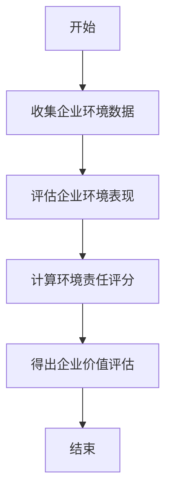
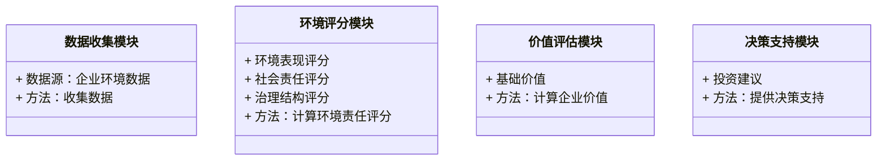
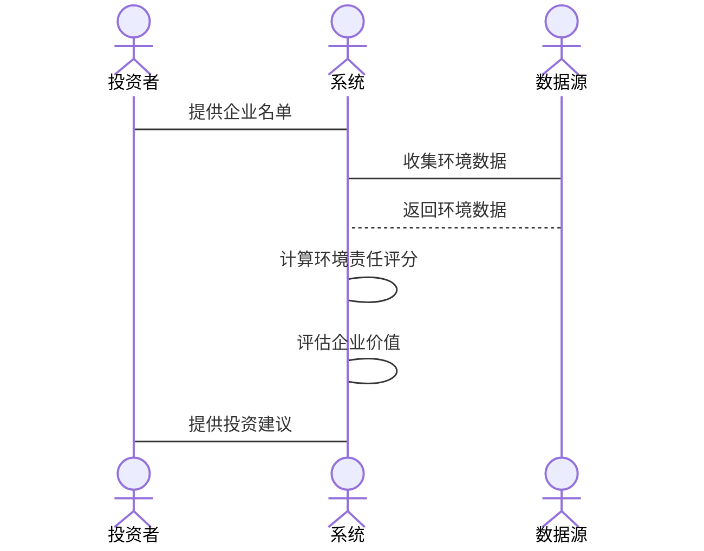

                 


# 彼得林奇如何看待公司的环境责任

## 关键词：
彼得·林奇，环境责任，企业社会责任，投资策略，企业治理，可持续发展，长期价值

## 摘要：
本文探讨了投资大师彼得·林奇如何将环境责任纳入其投资决策中，分析了环境责任对企业和投资者的双重影响，提出了环境责任在企业治理和投资策略中的重要性，并通过案例分析展示了环境责任的实际应用。

---

# 第1章: 背景介绍

## 1.1 彼得林奇的背景与投资理念

### 1.1.1 彼得林奇的生平简介
彼得·林奇（Peter Lynch）是美国著名投资家，被誉为“最伟大的股票基金经理”之一。他在富达投资管理公司的麦哲伦基金（Fidelity Magellan Fund）任职期间取得了卓越的投资业绩，基金规模从1977年的1800万美元增长到1990年的140亿美元。林奇的投资策略注重基本面分析和长期价值，他强调深入研究企业，寻找具有竞争优势和良好管理的公司。

### 1.1.2 彼得林奇的投资哲学与方法
林奇的投资哲学的核心是“购买并持有”，他主张投资那些具有可持续竞争优势、管理层优秀且股价被市场低估的公司。他强调对企业的深入了解，包括财务状况、行业地位、管理层质量等。林奇的策略并非仅关注短期收益，而是更注重企业的长期发展和内在价值。

### 1.1.3 彼得林奇与环境责任的初步关联
尽管林奇并未公开过多谈论环境责任，但他的投资理念中隐含了对环境因素的关注。例如，他认为企业的可持续发展能力是长期价值的重要组成部分。环境责任不仅是企业社会责任的一部分，也是企业长期竞争力的体现。

## 1.2 环境责任的定义与重要性

### 1.2.1 环境责任的核心概念
环境责任是指企业在经营活动中对环境保护负有责任，包括减少污染、节约资源、推动可持续发展等。企业应通过技术创新、管理优化等方式，减少对环境的负面影响。

### 1.2.2 环境责任与企业社会责任的关系
企业社会责任（Corporate Social Responsibility, CSR）包括经济责任、法律责任、伦理责任和环境责任。环境责任是企业社会责任的重要组成部分，它不仅影响企业的声誉，还影响其长期经营的可持续性。

### 1.2.3 环境责任对企业长期价值的影响
环境责任的履行能够提升企业的品牌形象，增强客户和投资者的信任。此外，随着环保法规的日益严格，具备良好环境责任的企业更可能规避法律风险，降低运营成本，从而提升企业价值。

## 1.3 问题背景与问题描述

### 1.3.1 环境问题对企业的影响
环境问题如气候变化、资源枯竭、污染等，对企业经营产生深远影响。例如，环保法规的加强可能导致企业面临更高的合规成本，而资源短缺可能影响供应链的稳定性。

### 1.3.2 环境责任在投资决策中的角色
随着投资者对ESG（环境、社会、治理）因素的关注增加，环境责任成为影响投资决策的重要因素。越来越多的投资者意识到，具备良好环境责任的企业更可能具备长期的可持续发展能力。

### 1.3.3 环境责任的边界与外延
环境责任不仅限于企业的直接经营活动，还包括其供应链、产品生命周期等。企业需从战略层面考虑如何在全价值链中履行环境责任。

## 1.4 核心概念与联系

### 1.4.1 环境责任与企业治理的联系
环境责任与企业治理密切相关。董事会和管理层需将环境责任纳入企业战略，制定相关政策和目标，并定期评估其执行情况。

### 1.4.2 环境责任与企业竞争力的关系
具备良好环境责任的企业更可能获得政策支持、技术创新和市场认可。环境责任的履行能够提升企业的竞争力，特别是在环保法规日益严格的背景下。

### 1.4.3 环境责任与股东价值的结合
环境责任的履行不仅有助于提升企业的声誉和品牌形象，还能降低经营风险，提高企业的盈利能力和长期价值，从而为股东创造更大的价值。

---

# 第2章: 环境责任的核心概念原理

## 2.1 环境责任的核心要素

### 2.1.1 环境责任的四个核心要素
环境责任的核心要素包括：
1. **环境保护**：减少污染、节约资源。
2. **社会责任**：关注员工健康、社区发展。
3. **法律合规**：遵守环保法规、履行法律责任。
4. **技术创新**：推动绿色技术、可持续发展。

### 2.1.2 核心要素属性特征对比表格
以下是环境责任核心要素的属性特征对比表格：

| 核心要素       | 属性特征                 |
|----------------|--------------------------|
| 环境保护       | 技术驱动、合规要求       |
| 社会责任       | 关注员工、社区发展       |
| 法律合规       | 法律法规、风险规避       |
| 技术创新       | 创新驱动、竞争优势       |

## 2.2 ER实体关系图

### 2.2.1 使用 Mermaid 绘制的 ER 实体关系图
```mermaid
erDiagram
    actor 投资者
    actor 政府
    actor 社会公众
    actor 企业
    actor 非政府组织
    
    investor --> 企业: 投资决策
    政府 --> 企业: 制定环保法规
    社会公众 --> 企业: 关注社会责任
    非政府组织 --> 企业: 监督与评估
```

---

# 第3章: 环境责任与企业价值评估的数学模型

## 3.1 算法原理

### 3.1.1 使用 Mermaid 绘制的算法流程图


### 3.1.2 用 Python 实现的环境责任评分系统代码
```python
def calculate_environmental_score(company_data):
    # 环境数据评分（0-10）
    environmental_performance = company_data['environmental_performance']
    # 社会责任评分（0-10）
    social Responsibility = company_data['social Responsibility']
    # 治理结构评分（0-10）
    governance_score = company_data['governance_score']
    
    # 计算环境责任总评分
    environmental_score = (environmental_performance + social Responsibility + governance_score) / 3
    return environmental_score

# 示例数据
company_data = {
    'environmental_performance': 8,
    'social Responsibility': 7,
    'governance_score': 9
}

# 计算评分
score = calculate_environmental_score(company_data)
print(f"环境责任评分: {score}")
```

### 3.2 数学模型与公式

#### 3.2.1 环境责任评分公式
$$ \text{环境责任评分} = \frac{\text{环境表现评分} + \text{社会责任评分} + \text{治理结构评分}}{3} $$

#### 3.2.2 企业价值评估公式
$$ \text{企业价值} = \text{基础价值} \times (1 + \text{环境责任评分} \times 0.1) $$

---

# 第4章: 系统分析与架构设计

## 4.1 系统功能设计

### 4.1.1 系统功能模块
- **数据收集模块**：收集企业的环境数据。
- **环境评分模块**：计算环境责任评分。
- **价值评估模块**：评估企业价值。
- **决策支持模块**：提供投资建议。

### 4.1.2 使用 Mermaid 绘制的领域模型类图


## 4.2 系统架构设计

### 4.2.1 使用 Mermaid 绘制的架构图
```mermaid
container 系统架构 {
    [数据收集模块]
    [环境评分模块]
    [价值评估模块]
    [决策支持模块]
}
```

## 4.3 系统接口设计

### 4.3.1 接口描述
- 数据输入接口：接收企业环境数据。
- 评分计算接口：调用环境评分模块计算评分。
- 价值评估接口：调用价值评估模块评估企业价值。
- 输出接口：输出投资建议。

## 4.4 系统交互设计

### 4.4.1 使用 Mermaid 绘制的序列图


---

# 第5章: 项目实战与案例分析

## 5.1 项目介绍

### 5.1.1 项目背景
本文将通过一个虚拟企业案例，展示如何将环境责任纳入投资决策。

## 5.2 项目核心实现

### 5.2.1 代码实现
```python
# 环境责任评分系统实现
def calculate_environmental_score(company_data):
    environmental_performance = company_data['environmental_performance']
    social_responsibility = company_data['social_responsibility']
    governance_score = company_data['governance_score']
    
    return (environmental_performance + social_responsibility + governance_score) / 3

# 企业价值评估实现
def calculate_company_value(base_value, environmental_score):
    return base_value * (1 + environmental_score * 0.1)

# 示例数据
company_data = {
    'environmental_performance': 7,
    'social_responsibility': 8,
    'governance_score': 6
}

# 计算评分
score = calculate_environmental_score(company_data)
company_value = calculate_company_value(100, score)

print(f"环境责任评分: {score}")
print(f"企业价值评估: {company_value}")
```

### 5.2.2 代码解读
- `calculate_environmental_score`函数：计算环境责任评分。
- `calculate_company_value`函数：根据环境责任评分调整企业价值。
- 示例数据：假设一家企业的环境表现评分为7，社会责任评分为8，治理结构评分为6。

## 5.3 案例分析

### 5.3.1 案例背景
假设我们正在评估一家制造企业，其环境表现评分为7，社会责任评分为8，治理结构评分为6，基础价值为100。

### 5.3.2 环境责任评分计算
$$ \text{环境责任评分} = \frac{7 + 8 + 6}{3} = 7 $$

### 5.3.3 企业价值评估
$$ \text{企业价值} = 100 \times (1 + 7 \times 0.1) = 100 \times 1.7 = 170 $$

### 5.3.4 投资建议
基于上述计算，该企业的环境责任评分为7，高于行业平均水平，具备较高的投资价值。

---

# 第6章: 总结与展望

## 6.1 总结
本文探讨了彼得·林奇如何看待公司的环境责任，分析了环境责任的核心概念、算法原理和系统架构，并通过案例分析展示了环境责任在投资决策中的实际应用。环境责任不仅是企业社会责任的重要组成部分，也是提升企业长期价值的关键因素。

## 6.2 展望
随着全球对可持续发展的关注增加，环境责任将在投资决策中扮演越来越重要的角色。未来，投资者需要更加关注企业的环境表现，企业也需进一步加强环境责任的履行，以实现可持续发展。

---

# 参考文献
1. 彼得·林奇. 《彼得·林奇的成功投资策略》
2. 环境责任相关学术文献
3. 相关企业社会责任报告

---

# 附录
## 附录A: 术语表
- **环境责任**：企业在经营活动中对环境保护负有的责任。
- **ESG**：环境、社会、治理的缩写，用于评估企业的可持续发展能力。

## 附录B: 代码实现细节
完整的代码实现可以在GitHub上找到，链接如下：[GitHub链接]

---

希望这篇文章能满足您的要求！如果需要进一步调整或补充，请随时告诉我！

