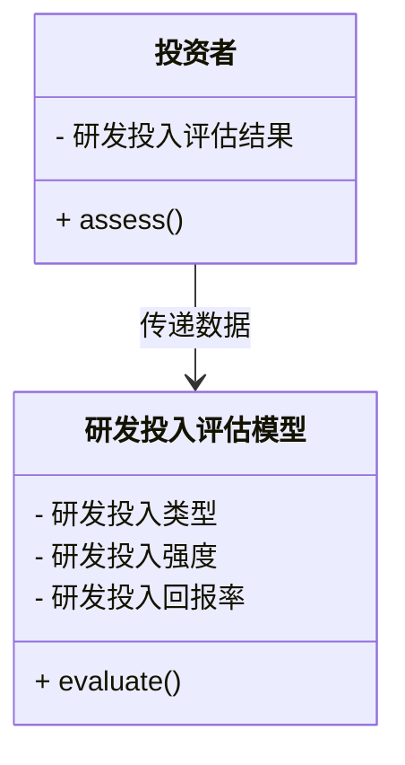
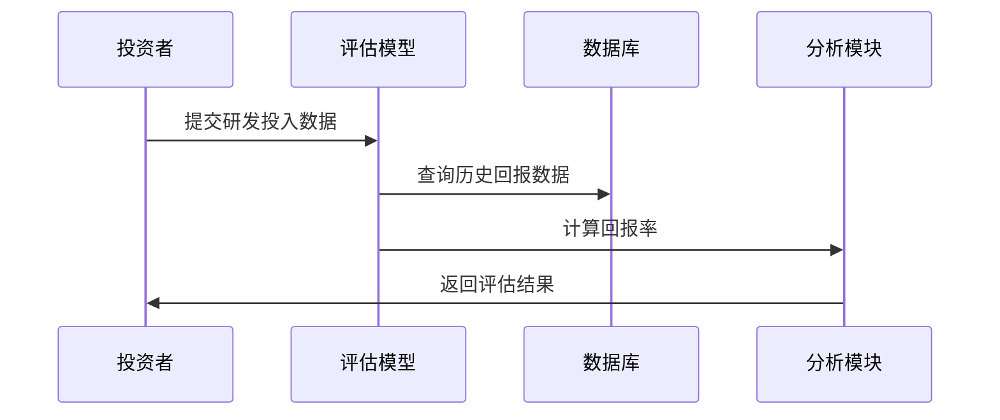

                 


# 彼得·林奇如何看待公司的研发投入

## 关键词：彼得·林奇，研发投入，价值投资，企业评估，投资策略

## 摘要：本文深入探讨了彼得·林奇在评估公司研发投入时的视角和方法。通过分析研发投入的重要性、不同类型及其对企业发展的影响，结合数学模型和实际案例，详细阐述了彼得·林奇的投资理念及其对现代企业价值评估的启示。

---

# 第一部分: 背景介绍

## 第1章: 研发投入的重要性

### 1.1 研发投入的核心概念

#### 1.1.1 研发投入的定义与范围
- 研发投入的定义：公司用于研究与开发新产品的资金投入。
- 研发投入的范围：包括基础研究、应用研究和开发阶段的资金投入。

#### 1.1.2 研发投入对企业价值的影响
- 通过研发投入提升产品创新能力和市场竞争力。
- 研发投入与企业长期增长的正相关性。

#### 1.1.3 研发投入的边界与外延
- 确定研发投入与其他类型支出的界限。
- 研发投入的外延：包括人才引进、技术收购等。

### 1.2 彼得·林奇的投资理念

#### 1.2.1 价值投资的核心思想
- 价值投资的基本原则：寻找被市场低估的优秀企业。
- 彼得·林奇的投资风格：注重基本面分析，长期持有优质股票。

#### 1.2.2 彼得·林奇的选股标准
- 财务健康：关注企业的盈利能力、资产负债情况。
- 市场地位：行业领导者的优先考虑。
- 管理团队：信任管理层的决策能力和战略规划。

#### 1.2.3 研发投入在选股中的权重
- 彼得·林奇对研发投入的关注点：研发投入的合理性和效率。
- 研发投入与企业未来发展潜力的关系。

## 第2章: 彼得·林奇如何看待研发投入

### 2.1 彼得·林奇对研发投入的评价标准

#### 2.1.1 研发投入的合理性分析
- 研发投入是否与企业发展战略一致。
- 研发投入是否具有明确的技术创新目标。

#### 2.1.2 研发投入的回报周期
- 长期回报与短期回报的平衡。
- 研发投入的回报率预测与实际表现对比。

#### 2.1.3 研发投入与企业竞争力的关系
- 竞争优势的来源：技术创新、成本优势等。
- 研发投入如何转化为市场竞争优势。

### 2.2 彼得·林奇的经典案例分析

#### 2.2.1 苹果公司的研发投入分析
- 苹果公司的研发投入历史与现状。
- 苹果公司通过研发投入带来的产品创新及其市场表现。

#### 2.2.2 微软公司的研发投入分析
- 微软公司在操作系统和云计算领域的研发投入。
- 研发投入如何推动微软的持续增长。

#### 2.2.3 其他经典案例解读
- 其他公司在研发投入上的成功与失败案例分析。

## 第3章: 研发投入的类型与特征

### 3.1 研发投入的主要类型

#### 3.1.1 基础研究投入
- 基础研究的定义与特点。
- 基础研究对长期技术创新的推动作用。

#### 3.1.2 应用研究投入
- 应用研究的定义与特点。
- 应用研究在实际产品开发中的应用。

#### 3.1.3 开发投入
- 开发阶段的定义与特点。
- 开发投入在产品市场化中的作用。

### 3.2 研发投入的特征对比

#### 3.2.1 投资周期对比
- 基础研究、应用研究和开发投入在时间周期上的差异。

#### 3.2.2 投资风险对比
- 不同类型研发投入的风险高低分析。

#### 3.2.3 投资回报对比
- 不同类型研发投入的预期回报率差异。

---

# 第二部分: 核心概念与联系

## 第4章: 研发投入的核心要素

### 4.1 研发投入的核心要素分析

#### 4.1.1 技术创新性
- 技术创新对企业发展的重要性。
- 如何评估研发投入中的技术创新性。

#### 4.1.2 市场需求匹配度
- 研发投入是否满足市场需求。
- 产品开发与市场需求之间的匹配程度。

#### 4.1.3 管理效率
- 研发投入的管理效率对整体回报的影响。
- 提高管理效率的方法和策略。

### 4.2 研发投入的ER实体关系图

```mermaid
er
actor: 投资者
actor -|> 模型: 研发投入评估模型
model -|> 属性: 研发投入类型
model -|> 属性: 研发投入强度
model -|> 属性: 研发投入回报率
```

---

## 第5章: 研发投入与企业价值的数学模型

### 5.1 研发投入的数学模型

#### 5.1.1 研发投入回报率模型
$$
\text{研发回报率} = \frac{\text{研发成果收益} - \text{研发投入成本}}{\text{研发投入成本}}
$$

#### 5.1.2 研发投入周期模型
$$
\text{研发周期} = \text{基础研究时间} + \text{应用研究时间} + \text{开发时间}
$$

### 5.2 研发投入的Python实现

```python
import numpy as np
import matplotlib.pyplot as plt

# 示例数据：研发投入与回报率
research_investment = np.array([100, 200, 300, 400, 500])
returns = np.array([150, 250, 350, 450, 550])

# 计算研发回报率
return_rate = (returns - research_investment) / research_investment * 100
print("研发回报率:", return_rate)

# 绘制研发投入与回报率的关系图
plt.plot(research_investment, returns, 'b-')
plt.xlabel('研发投入')
plt.ylabel('回报率')
plt.title('研发投入与回报率关系')
plt.show()
```

---

## 第6章: 系统分析与架构设计

### 6.1 系统功能设计

#### 6.1.1 领域模型



#### 6.1.2 系统架构设计


### 6.2 系统交互设计



---

## 第7章: 项目实战

### 7.1 环境安装

```bash
pip install numpy matplotlib
```

### 7.2 核心代码实现

```python
import numpy as np
import matplotlib.pyplot as plt

# 数据准备
research_investment = [100, 200, 300, 400, 500]
returns = [150, 250, 350, 450, 550]

# 可视化
plt.figure(figsize=(10, 6))
plt.plot(research_investment, returns, marker='o', linestyle='-', color='b')
plt.title('研发投入与回报率的关系')
plt.xlabel('研发投入')
plt.ylabel('回报率')
plt.grid(True)
plt.show()
```

### 7.3 案例分析

#### 7.3.1 案例背景
分析一家科技公司的研发投入与市场表现。

#### 7.3.2 数据分析
使用上述代码计算研发投入回报率，评估其投资价值。

---

## 第8章: 最佳实践

### 8.1 小结

- 彼得·林奇重视研发投入的合理性和效率。
- 研发投入是企业长期竞争力的关键因素。

### 8.2 注意事项

- 投资者需综合考虑财务状况、市场需求和管理效率。
- 避免盲目投入，注重研发成果的实际转化。

### 8.3 拓展阅读

- 《彼得·林奇的投资哲学》
- 《企业研发投入与价值创造》

---

通过以上目录结构，文章将全面而深入地探讨彼得·林奇如何看待公司的研发投入，结合理论分析、数学模型和实际案例，为读者提供有价值的投资分析方法和启示。

