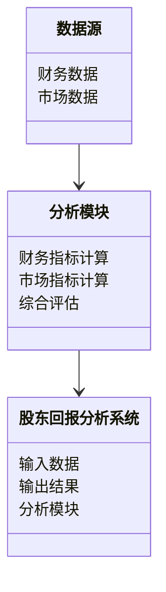
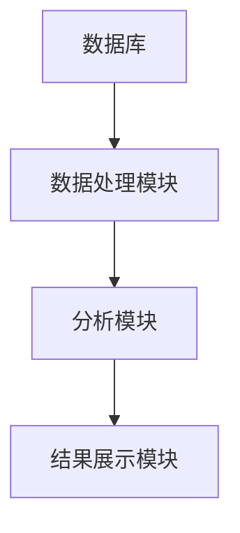
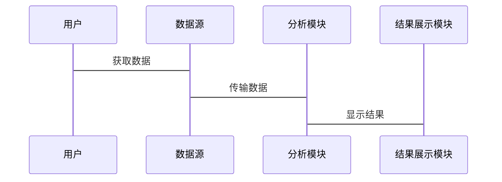
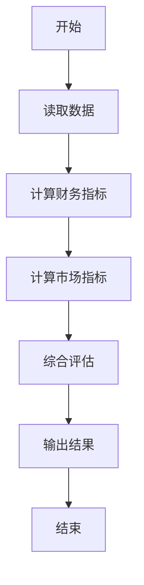

                 


# 彼得林奇如何看待公司的股东回报

## 关键词：彼得·林奇，股东回报，投资分析，财务指标，公司估值

## 摘要：彼得·林奇是全球著名投资家，他从股东回报的角度分析公司价值，通过财务指标和市场指标的综合评估，提出了一套独特的分析方法。本文将从背景介绍、核心概念、算法原理、系统分析、项目实战和最佳实践等角度，深入探讨彼得·林奇如何看待公司的股东回报。

---

# 第一部分: 股东回报的核心概念与背景

## 第1章: 股东回报的定义与重要性

### 1.1 股东回报的定义
股东回报是指股东通过持有公司股票所获得的收益，通常包括资本增值和股息收入。资本增值来源于股价上涨，股息收入则来源于公司分红。

#### 1.1.1 股东回报的内涵
股东回报不仅是投资者的收益，也是公司治理的重要指标。高股东回报的公司通常具有较强的盈利能力和发展潜力。

#### 1.1.2 股东回报的外延
股东回报可以通过多种方式实现，包括股息支付、股票回购和股价上涨等。不同公司选择不同的回报方式，取决于其财务状况和市场策略。

#### 1.1.3 股东回报的核心要素
股东回报的核心要素包括：
- 股息率：股息与股价的比率。
- 股价表现：股价的涨跌情况。
- 股东权益：股东在公司中的权益价值。

### 1.2 股东回报的重要性
#### 1.2.1 股东回报对企业价值的影响
股东回报是衡量企业价值的重要指标。高回报的公司通常能够吸引更多的投资者，提升市场地位。

#### 1.2.2 股东回报与股价的关系
股东回报直接影响股价。高回报的公司通常会有较高的股价，反之则可能导致股价下跌。

#### 1.2.3 股东回报对投资者决策的意义
投资者通过分析股东回报，可以评估公司的投资价值，做出合理的投资决策。

### 1.3 彼得·林奇的分析框架
#### 1.3.1 彼得·林奇的投资者理念
彼得·林奇强调长期投资，关注公司的基本面，寻找具有成长性的公司。

#### 1.3.2 彼得·林奇的分析方法
彼得·林奇通过分析财务报表、行业地位和市场趋势，评估公司的股东回报潜力。

#### 1.3.3 彼得·林奇的分析目标
彼得·林奇的目标是找到那些能够持续为股东创造价值的公司，实现长期收益。

## 第2章: 彼得·林奇的股东回报分析方法

### 2.1 核心分析工具
#### 2.1.1 股息率分析
股息率是股东回报的重要指标之一，反映了公司分红的能力。

#### 2.1.2 市盈率分析
市盈率是衡量公司估值的重要指标，低市盈率可能意味着低估，高市盈率可能意味着高风险。

#### 2.1.3 市净率分析
市净率是公司股价与净资产的比率，反映了公司的资产价值。

### 2.2 公司基本面分析
#### 2.2.1 营收增长率
营收增长率是衡量公司业务扩展能力的重要指标，高增长率通常意味着良好的发展潜力。

#### 2.2.2 净利润增长率
净利润增长率反映了公司的盈利能力，高增长率通常意味着公司能够有效控制成本并提高利润。

#### 2.2.3 股东权益增长率
股东权益增长率是衡量公司股东权益变化的重要指标，反映了公司的发展潜力和股东价值的增长。

### 2.3 公司成长性分析
#### 2.3.1 行业地位
行业地位决定了公司在市场中的竞争力，龙头公司通常具有更高的股东回报潜力。

#### 2.3.2 市场地位
市场地位反映了公司在行业中的影响力，高市场占有率通常意味着更强的定价能力和盈利能力。

#### 2.3.3 财务健康度
财务健康度是通过分析公司的财务报表，评估公司的偿债能力和盈利能力。

### 2.4 案例分析：苹果公司
以苹果公司为例，分析其股东回报情况。

---

## 第3章: 彼得·林奇的股东回报评估模型

### 3.1 模型的核心假设
#### 3.1.1 股东回报的可衡量性
通过财务指标和市场指标，可以量化股东回报。

#### 3.1.2 股东回报的可预测性
通过历史数据分析和市场趋势预测，可以预测未来的股东回报。

#### 3.1.3 股东回报的可比较性
不同公司之间的股东回报可以通过标准化指标进行比较。

### 3.2 模型的输入变量
#### 3.2.1 财务指标
包括净利润、营收、股息率等。

#### 3.2.2 市场指标
包括市盈率、市净率、股价走势等。

#### 3.2.3 行业指标
包括行业增长率、竞争状况等。

### 3.3 模型的输出结果
#### 3.3.1 股东回报评分
通过综合评估，给出公司的股东回报评分。

#### 3.3.2 股东回报排名
根据评分，对公司在行业中的股东回报潜力进行排名。

#### 3.3.3 潜在风险
评估公司在未来可能面临的风险因素。

### 3.4 模型的验证与优化
#### 3.4.1 模型的验证方法
通过历史数据验证模型的准确性。

#### 3.4.2 模型的优化策略
根据验证结果，优化模型的参数和指标。

#### 3.4.3 模型的局限性
分析模型的局限性，如数据偏差、市场波动等。

---

## 第4章: 系统架构与算法实现

### 4.1 问题场景介绍
通过系统架构和算法实现，优化彼得·林奇的股东回报分析模型。

### 4.2 项目介绍
介绍项目的背景、目标和范围。

### 4.3 系统功能设计
#### 4.3.1 领域模型
使用mermaid绘制领域模型类图。



#### 4.3.2 系统架构
使用mermaid绘制系统架构图。



#### 4.3.3 系统接口设计
接口设计包括数据输入、处理和输出。

#### 4.3.4 系统交互
使用mermaid绘制序列图，展示系统交互流程。



### 4.4 算法实现
#### 4.4.1 算法原理
使用mermaid绘制算法流程图。



#### 4.4.2 代码实现
使用Python实现算法。

```python
def calculate股东回报(数据):
    # 计算财务指标
    净利润 = 数据['净利润']
    营收 = 数据['营收']
    # 计算市场指标
    市盈率 = 数据['市盈率']
    市净率 = 数据['市净率']
    # 综合评估
    回报评分 = 净利润 * 0.3 + 营收 * 0.3 + 市盈率 * 0.2 + 市净率 * 0.2
    return 回报评分
```

### 4.5 算法优化
通过历史数据验证模型，并优化参数。

---

## 第5章: 项目实战

### 5.1 环境安装
安装必要的Python库，如pandas、numpy等。

### 5.2 核心代码实现
实现股东回报分析的代码。

```python
import pandas as pd

# 读取数据
data = pd.read_csv('data.csv')

# 计算财务指标
data['净利润率'] = data['净利润'] / data['营收']
data['股息率'] = data['股息'] / data['股价']

# 计算市场指标
data['市盈率'] = data['股价'] / data['每股收益']
data['市净率'] = data['股价'] / data['每股净资产']

# 综合评估
data['股东回报评分'] = 0.3 * data['净利润率'] + 0.3 * data['股息率'] + 0.2 * data['市盈率'] + 0.2 * data['市净率']
```

### 5.3 案例分析
以苹果公司为例，分析其股东回报。

### 5.4 结果解读
解读分析结果，评估公司的股东回报潜力。

---

## 第6章: 最佳实践与总结

### 6.1 投资建议
根据彼得·林奇的分析方法，提出投资建议。

### 6.2 注意事项
提醒投资者注意市场波动和公司风险。

### 6.3 拓展阅读
推荐相关书籍和资源，供读者深入学习。

### 6.4 本章小结
总结全文，强调彼得·林奇的股东回报分析方法的重要性和应用价值。

---

通过以上步骤，我们详细分析了彼得·林奇如何看待公司的股东回报，从理论到实践，为投资者提供了系统的分析方法和实用工具。

