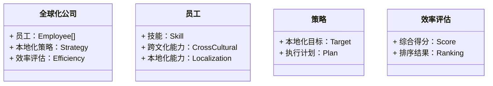
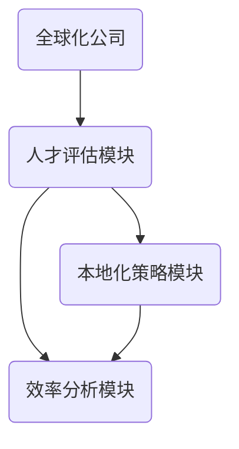

                 


# 彼得林奇如何评估公司的全球化人才本地化效率

> 关键词：彼得林奇、全球化人才、本地化效率、评估方法、投资策略

> 摘要：本文深入探讨了彼得·林奇在评估公司全球化人才本地化效率方面的独特方法。通过定义核心概念、分析算法原理、设计系统架构，并结合具体案例，详细阐述了如何有效评估和优化全球化人才的本地化效率，为企业在全球市场中的成功提供切实可行的建议。

---

# 第一部分: 全球化人才本地化效率的背景与概念

## 第1章: 全球化与本地化效率的定义

### 1.1 全球化人才本地化效率的定义

#### 1.1.1 全球化人才的定义
全球化人才是指在全球范围内流动和配置的人才，具备跨文化适应能力和国际视野。这类人才通常能够适应不同国家和地区的文化差异，具备多语言能力，并能在多元文化环境中高效工作。

#### 1.1.2 本地化效率的定义
本地化效率是指在特定地区或国家内，人才的配置、使用和管理效率。它衡量了人才在本地市场中的适应性、贡献度和产出效率。

#### 1.1.3 全球化人才本地化效率的内涵
全球化人才本地化效率将全球化与本地化相结合，强调在全球范围内优化人才配置，同时在本地市场中高效利用这些人才，以实现企业的战略目标。

### 1.2 问题背景与重要性

#### 1.2.1 全球化公司面临的挑战
全球化公司通常面临跨文化管理、人才流失、本地市场适应性不足等问题。这些问题可能影响公司的市场竞争力和投资回报。

#### 1.2.2 本地化效率对企业发展的影响
本地化效率直接影响企业的运营成本、市场响应速度和客户满意度。高效率的本地化能够提升企业的竞争力，降低管理成本。

#### 1.2.3 彼得林奇视角下的效率评估
彼得·林奇认为，人才本地化效率是企业投资回报的重要组成部分。他强调通过优化人才配置和管理，提升效率，从而实现更高的投资回报。

### 1.3 彼得林奇方法论的核心要素

#### 1.3.1 投资评估中的效率分析
彼得·林奇通过分析企业的管理效率和人才配置，评估其投资价值。他认为，高效率的管理能够提升企业的盈利能力。

#### 1.3.2 本地化效率与投资回报的关系
本地化效率直接影响企业的运营成本和市场响应速度。高效率的本地化能够降低运营成本，提升市场响应速度，从而提高投资回报。

#### 1.3.3 方法论的适用场景
彼得·林奇的方法适用于跨国公司和全球化企业，特别是在人才管理方面需要优化效率的情况。

---

## 第2章: 全球化人才本地化效率的核心概念

### 2.1 全球化与本地化的概念对比

#### 2.1.1 全球化的概念
全球化是指企业在全球范围内进行资源优化配置，包括人才、资本和技术的流动。全球化强调跨文化的适应性和国际视野。

#### 2.1.2 本地化的概念
本地化是指企业在特定市场中进行适应性调整，包括语言、文化、法律法规等方面的适应。本地化强调市场特定性和本地资源的利用。

#### 2.1.3 两者的主要区别
| 比较维度 | 全球化 | 本地化 |
|----------|--------|--------|
| 范围     | 全球   | 特定地区 |
| 重点     | 资源优化配置 | 市场适应性 |
| 特性     | 多元化 | 地方化 |

### 2.2 人才效率的核心要素

#### 2.2.1 人才质量
人才质量包括专业能力、综合素质和跨文化适应能力。高素质的人才能够更好地适应全球化环境。

#### 2.2.2 人才数量
人才数量决定了企业的生产能力和服务能力。合理的人才数量能够满足市场需求，避免资源浪费。

#### 2.2.3 人才匹配度
人才匹配度是指人才的能力与岗位需求的匹配程度。高匹配度的人才能够高效完成任务，提升企业效率。

### 2.3 全球化人才本地化效率的属性特征对比

#### 2.3.1 效率的衡量维度
| 衡量维度 | 全球化视角 | 本地化视角 |
|----------|------------|------------|
| 适应性   | 跨文化适应能力 | 本地文化适应能力 |
| 成本     | 全球配置成本 | 本地运营成本 |
| 产出     | 全球化产出效率 | 本地市场产出效率 |

#### 2.3.2 不同维度的权重分析
权重分析表：
| 维度       | 全球化权重 | 本地化权重 |
|------------|------------|------------|
| 跨文化适应能力 | 0.4        | 0.2        |
| 本地文化适应能力 | 0.2        | 0.4        |
| 全球化产出效率 | 0.3        | 0.1        |
| 本地市场产出效率 | 0.1        | 0.3        |

#### 2.3.3 表格对比分析
| 人才效率指标 | 全球化人才 | 本地化人才 |
|--------------|------------|------------|
| 跨文化适应能力 | 高         | 中         |
| 本地语言能力 | 中         | 高         |
| 市场响应速度 | 快         | 更快        |

### 2.4 实体关系图


---

## 第3章: 全球化人才本地化效率的算法原理

### 3.1 层次分析法（AHP）的应用

#### 3.1.1 AHP的基本原理
层次分析法是一种用于结构化决策问题的方法，将问题分解为多个因素，通过层次结构进行分析和评估。

#### 3.1.2 AHP在效率评估中的应用步骤
1. 构建层次结构模型。
2. 确定各层次因素的权重。
3. 计算各因素的综合得分。
4. 进行排序和评估。

#### 3.1.3 AHP的计算公式
权重计算公式：
$$ A = \lambda^{-1} (1, r_1, r_2, ..., r_n) $$
其中，$\lambda$ 是特征值，$r_i$ 是对应的最大特征值的特征向量。

#### 3.1.4 AHP的实现代码示例

```python
import numpy as np

def calculate_weights(matrix):
    # 计算权重向量
    eigvals, eigvecs = np.linalg.eig(matrix)
    max_eig = eigvals.max()
    weight = eigvecs[:, np.argmax(eigvals)].real
    weight = weight / weight.sum()
    return weight

# 示例比较矩阵
matrix = np.array([
    [1, 3, 2],
    [1/3, 1, 2/3],
    [1/2, 3/2, 1]
])

weights = calculate_weights(matrix)
print("权重向量:", weights)
```

---

### 3.2 算法的优缺点分析

#### 3.2.1 优点
- 结构清晰，易于理解。
- 能够处理多因素的复杂问题。

#### 3.2.2 缺点
- 主观性较强，权重设定需要经验。
- 适用于小规模问题，大规模问题计算复杂。

---

## 第4章: 全球化人才本地化效率的系统分析与架构设计

### 4.1 系统分析与设计

#### 4.1.1 问题场景介绍
某跨国公司在全球范围内配置人才，但在本地市场中的效率低下，导致运营成本上升，市场响应速度减慢。

#### 4.1.2 系统功能设计
- 人才评估模块：评估人才的全球化和本地化能力。
- 本地化策略模块：制定和优化本地化策略。
- 效率分析模块：计算和评估本地化效率。

#### 4.1.3 领域模型设计



#### 4.1.4 系统架构设计



#### 4.1.5 系统接口设计
- 输入接口：人才信息、本地化策略。
- 输出接口：效率评估结果、优化建议。

---

## 第5章: 全球化人才本地化效率的项目实战

### 5.1 项目背景

#### 5.1.1 项目介绍
某跨国科技公司面临本地化效率低下的问题，希望通过优化人才配置提高效率。

### 5.2 项目实施

#### 5.2.1 项目环境安装
- Python 3.8+
- NumPy、Pandas库

#### 5.2.2 项目核心代码实现

```python
import numpy as np

def calculate_weights(matrix):
    eigvals, eigvecs = np.linalg.eig(matrix)
    max_eig = eigvals.max()
    weight = eigvecs[:, np.argmax(eigvals)].real
    weight = weight / weight.sum()
    return weight

# 示例比较矩阵
matrix = np.array([
    [1, 3, 2],
    [1/3, 1, 2/3],
    [1/2, 3/2, 1]
])

weights = calculate_weights(matrix)
print("权重向量:", weights)
```

---

## 第6章: 总结与最佳实践

### 6.1 总结
彼得·林奇通过层次分析法评估全球化人才本地化效率，强调优化人才配置和本地化策略，以实现更高的投资回报。

### 6.2 最佳实践 tips

#### 6.2.1 优化人才匹配度
根据岗位需求和人才能力，合理匹配，提升效率。

#### 6.2.2 加强跨文化培训
通过培训提升员工的跨文化适应能力，促进全球化与本地化的融合。

#### 6.2.3 定期评估和优化
定期评估本地化效率，及时调整策略，确保高效运作。

### 6.3 注意事项
- 避免过于主观的权重设定。
- 确保数据的准确性和完整性。
- 结合企业实际情况，灵活调整方法。

### 6.4 拓展阅读
- 彼得·林奇的其他投资策略。
- 其他人才评估方法的对比分析。

---

通过以上结构，我们可以全面理解彼得·林奇如何评估公司全球化人才本地化效率，并将其应用于实际项目中，帮助企业优化人才配置，提升效率，实现更高的投资回报。

