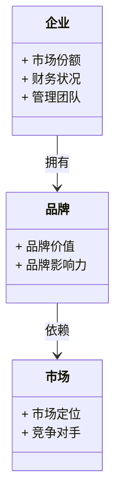

                 


# 彼得林奇如何评估公司的品牌扩张策略

## 关键词
- 彼得·林奇
- 品牌扩张
- 投资策略
- 市场分析
- 财务评估

## 摘要
彼得·林奇作为一位传奇的投资经理人，以其独特的方法评估公司的品牌扩张策略而闻名。本文将详细介绍彼得·林奇的评估框架，包括市场定位、财务健康状况、管理团队能力等方面，通过系统分析和实际案例，帮助读者理解如何应用这些方法进行品牌扩张策略的评估。

---

## 第1章: 品牌扩张的定义与重要性

### 1.1 品牌扩张的定义
品牌扩张是指企业在现有市场的基础上，通过扩展产品线、进入新市场或并购等方式，提升品牌影响力和市场占有率的过程。品牌扩张的核心在于最大化品牌价值，同时降低市场风险。

### 1.2 彼得·林奇的背景与投资理念
彼得·林奇是富达投资集团的传奇经理人，以其长期跑赢市场的投资业绩著称。他强调基本面分析，认为企业的长期价值取决于其商业模式、财务状况和管理团队。

---

## 第2章: 品牌扩张的策略与方法

### 2.1 品牌扩张的常见策略
- **市场扩展策略**：通过开拓新市场或扩大现有市场的份额。
- **产品线扩展策略**：推出新产品或服务，满足更多客户需求。
- **合作与并购策略**：通过合作或并购快速获取资源和市场。

### 2.2 彼得·林奇的品牌扩张评估框架
彼得·林奇的评估框架包括市场分析、竞争对手分析、财务状况评估和管理团队能力评估。以下是详细的评估步骤：

1. **市场定位与品牌价值**：分析企业的市场定位，评估品牌忠诚度和品牌价值。
2. **财务健康状况分析**：通过财务报表分析企业的盈利能力、资产负债状况等。
3. **管理团队与企业治理**：评估管理团队的稳定性和决策效率。

---

## 第3章: 彼得林奇评估框架的核心要素

### 3.1 市场定位与品牌价值
- **市场定位的重要性**：准确的市场定位是品牌扩张的基础。
- **品牌价值的评估方法**：包括品牌知名度、品牌忠诚度等指标。

### 3.2 财务健康状况分析
- **财务报表分析基础**：包括利润表、资产负债表和现金流量表。
- **盈利能力评估**：通过净利润率、毛利率等指标评估企业的盈利能力。
- **资产负债状况评估**：分析企业的偿债能力，确保财务健康。

### 3.3 管理团队与企业治理
- **管理团队的评估标准**：包括团队的经验、能力和稳定性。
- **企业治理结构的重要性**：良好的治理结构能提高决策效率和企业透明度。

---

## 第4章: 彼得林奇评估框架的数学模型与公式

### 4.1 市场定位与品牌价值的数学模型
- **市场定位指数**：通过市场份额和品牌知名度计算。
  $$\text{市场定位指数} = \frac{\text{市场份额}}{\text{行业平均市场份额}} \times 100$$

- **品牌价值评估公式**：
  $$\text{品牌价值} = \text{收入} \times \text{品牌影响力系数}$$

### 4.2 财务健康状况的评估公式
- **净利润率**：
  $$\text{净利润率} = \frac{\text{净利润}}{\text{营业收入}} \times 100$$

- **资产负债率**：
  $$\text{资产负债率} = \frac{\text{总负债}}{\text{总资产}} \times 100$$

---

## 第5章: 系统分析与架构设计方案

### 5.1 问题场景介绍
- **问题背景**：企业在品牌扩张过程中可能面临市场定位不清、财务状况不佳等问题。
- **彼得·林奇评估框架的应用场景**：适用于企业进行品牌扩张前的策略评估。

### 5.2 系统功能设计
- **领域模型**：通过Mermaid类图展示企业、品牌、市场等实体之间的关系。



---

## 第6章: 项目实战

### 6.1 环境安装
- **工具安装**：安装Mermaid和Python环境，用于数据分析和图表绘制。

### 6.2 核心实现源代码
- **市场定位分析**：使用Python计算市场份额和品牌影响力。

```python
def calculate_market_share(revenue, industry_revenue):
    return (revenue / industry_revenue) * 100

# 示例计算
revenue = 100000000
industry_revenue = 500000000
market_share = calculate_market_share(revenue, industry_revenue)
print(f"市场份额为：{market_share}%")
```

---

## 第7章: 最佳实践

### 7.1 小结
彼得·林奇的评估框架提供了全面的品牌扩张策略分析方法，包括市场定位、财务状况和管理团队评估。

### 7.2 注意事项
- 在实际应用中，需结合企业具体情况调整评估指标。
- 定期更新数据和模型，以反映市场变化。

### 7.3 拓展阅读
- 推荐阅读彼得·林奇的书籍，深入理解其投资哲学。
- 学习其他品牌评估方法，如波斯顿咨询法。

---

通过以上分析和实战，读者可以全面理解彼得·林奇的品牌扩张评估策略，并将其应用于实际投资决策中。

