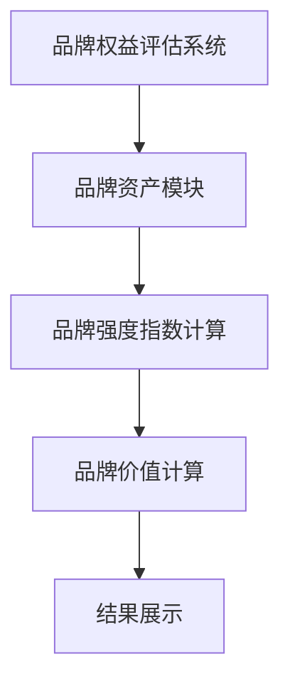
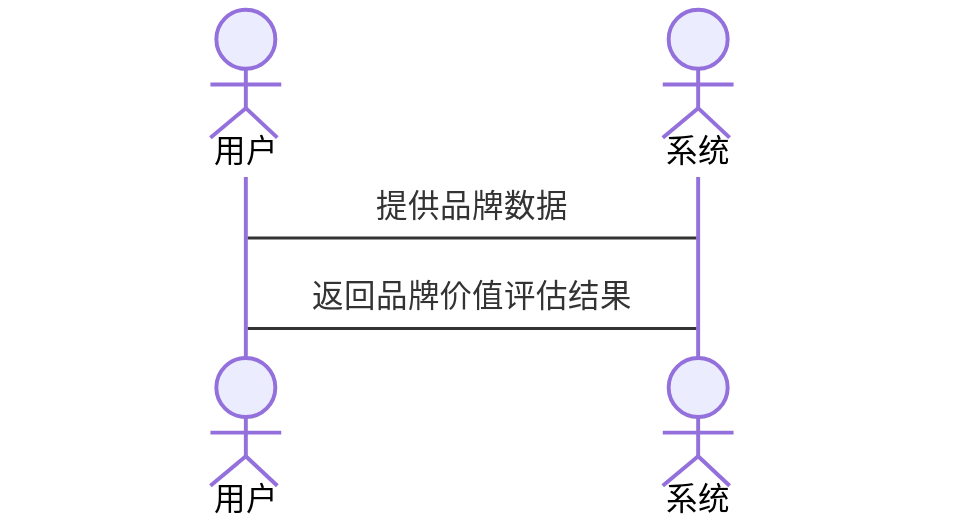

                 


# 彼得林奇如何评估公司的品牌权益

## 关键词：品牌权益，彼得·林奇，投资评估，品牌价值，品牌资产

## 摘要：本文详细探讨了彼得·林奇如何评估公司的品牌权益，从品牌权益的核心概念、评估方法到实际应用案例，结合技术分析和数学模型，帮助读者全面理解品牌权益在投资决策中的重要性。

---

# 目录

## 第一部分：品牌权益评估的背景与核心概念

### 第1章：品牌权益评估的重要性

#### 1.1 什么是品牌权益

- 1.1.1 品牌权益的定义
  - 品牌权益是品牌在市场中所蕴含的价值，包括品牌认知度、忠诚度和联想。
  
- 1.1.2 品牌权益的核心要素
  - 品牌认知度：品牌在消费者中的知名度。
  - 品牌忠诚度：消费者对品牌的忠诚程度。
  - 品牌联想：消费者对品牌的联想和记忆。

- 1.1.3 品牌权益与企业价值的关系
  - 品牌权益直接影响企业的市场价值和投资吸引力。

#### 1.2 彼得·林奇的品牌评估方法

- 1.2.1 彼得·林奇的投资理念
  - 林奇注重基本面分析，关注企业的内在价值和成长潜力。

- 1.2.2 品牌权益在投资中的作用
  - 品牌强的企业通常具有更高的市场地位和盈利能力，吸引投资者。

- 1.2.3 林奇的品牌评估模型
  - 林奇通过品牌资产、市场地位和财务表现综合评估品牌价值。

#### 1.3 品牌与财务的关系

- 1.3.1 品牌资产的财务表现
  - 品牌资产可以通过收入、利润和市场份额来衡量。

- 1.3.2 品牌对股价的影响
  - 强大的品牌通常能支撑更高的股价，减少波动性。

- 1.3.3 品牌在企业估值中的权重
  - 品牌价值是企业整体估值的重要组成部分。

#### 1.4 品牌权益评估的边界与外延

- 1.4.1 品牌权益的范围界定
  - 包括品牌在市场中的影响力和消费者的认知度。

- 1.4.2 品牌与市场的关系
  - 市场需求和竞争格局影响品牌价值。

- 1.4.3 品牌与消费者行为的关联
  - 消费者的行为直接反映品牌的价值和影响力。

### 第2章：品牌权益的核心概念与联系

#### 2.1 品牌权益的核心概念原理

- 品牌认知度：消费者对品牌的熟悉程度。
- 品牌忠诚度：消费者持续选择某一品牌的行为。
- 品牌联想：消费者对品牌的记忆和情感联系。

#### 2.2 核心概念属性特征对比表

| 概念       | 特性1      | 特性2      | 特性3      |
|------------|------------|------------|------------|
| 品牌认知度  | 客观性      | 可测量性    | 时间依赖性  |
| 品牌忠诚度  | 主观性      | 难测量性    | 持久性      |
| 品牌联想    | 主观性      | 可塑性      | 易变性      |

#### 2.3 ER实体关系图

```mermaid
er
actor 品牌权益评估者
actor 品牌资产
actor 市场表现
actor 消费者行为
```

---

## 第二部分：品牌权益评估的算法与模型

### 第3章：品牌权益评估的算法原理

#### 3.1 品牌资产模型

- 3.1.1 品牌资产模型的定义
  - 通过量化品牌资产、品牌忠诚度和品牌认知度来评估品牌价值。

- 3.1.2 品牌资产模型的构建步骤
  1. 收集品牌相关数据。
  2. 计算品牌资产、忠诚度和认知度。
  3. 综合各项指标得出品牌价值。

- 3.1.3 品牌资产模型的优缺点
  - 优点：量化品牌价值，提供明确的评估标准。
  - 缺点：依赖数据准确性，难以全面反映品牌情感价值。

#### 3.2 品牌价值评估的数学模型

- 3.2.1 品牌价值计算公式
  $$ 品牌价值 = 品牌资产 \times 品牌强度指数 $$

- 3.2.2 品牌强度指数的计算
  $$ 品牌强度指数 = \frac{品牌认知度 + 品牌忠诚度}{2} $$

#### 3.3 品牌强度指数的计算

- 3.3.1 品牌强度指数的定义
  - 衡量品牌在市场中的竞争力和影响力。

- 3.3.2 品牌强度指数的计算公式
  $$ 品牌强度指数 = \frac{品牌认知度 + 品牌忠诚度}{2} $$

- 3.3.3 实际案例
  - 假设某品牌认知度为80%，忠诚度为70%，则强度指数为75%。

---

### 第4章：数学模型和公式

#### 4.1 品牌价值的计算公式

$$ 品牌价值 = 品牌资产 \times 品牌强度指数 $$

- 品牌资产包括品牌知名度、市场份额和盈利能力。
- 品牌强度指数反映品牌在市场中的竞争力。

#### 4.2 品牌强度指数的计算

$$ 品牌强度指数 = \frac{品牌认知度 + 品牌忠诚度}{2} $$

- 通过量化指标，帮助投资者评估品牌价值。

---

## 第三部分：系统分析与架构设计

### 第5章：系统分析与架构设计方案

#### 5.1 问题场景介绍

- 品牌权益评估系统的应用场景包括企业估值、投资决策和品牌管理。

#### 5.2 项目介绍

- 开发一个品牌权益评估系统，帮助投资者和企业管理者量化品牌价值。

#### 5.3 系统功能设计

- 用户需求分析：投资者和企业管理者需要实时品牌价值评估。
- 领域模型设计：包括品牌资产、市场表现和消费者行为。

#### 5.4 系统架构设计



#### 5.5 系统接口设计

- API接口用于数据获取和结果返回，方便集成到现有系统中。

#### 5.6 系统交互流程



---

## 第四部分：项目实战

### 第6章：项目实战

#### 6.1 环境安装

- 安装Python和相关库，如Pandas、NumPy和Scikit-learn。

#### 6.2 核心代码实现

```python
def calculate_brand_value(brand_assets, brand_intensity):
    return brand_assets * brand_intensity

brand_assets = 1000000  # 假设品牌资产为100万美元
brand_intensity = 0.85    # 假设品牌强度指数为0.85
brand_value = calculate_brand_value(brand_assets, brand_intensity)
print(f"品牌价值为：{brand_value} 万美元")
```

#### 6.3 案例分析

- 以苹果公司为例，计算其品牌价值，假设品牌资产为200亿美元，强度指数为0.9，品牌价值为180亿美元。

#### 6.4 项目总结

- 品牌权益评估系统能够帮助投资者快速评估品牌价值，支持决策。

---

## 第五部分：最佳实践、小结、注意事项和拓展阅读

### 第7章：最佳实践与小结

#### 7.1 最佳实践

- 定期更新品牌数据，保持评估结果的准确性。
- 综合考虑品牌情感价值，避免仅依赖量化指标。

#### 7.2 小结

- 品牌权益评估是投资决策中的重要部分，掌握相关方法和模型有助于提升投资效果。

#### 7.3 注意事项

- 数据准确性对评估结果影响重大，需谨慎选择数据来源。
- 考虑市场变化和消费者行为的动态性，及时调整评估模型。

#### 7.4 拓展阅读

- 推荐阅读彼得·林奇的《投资最重要的事情》和相关品牌管理书籍，深入理解品牌价值评估的理论与实践。

---

# 结语

通过本文的详细讲解，读者能够全面理解彼得·林奇如何评估品牌权益，并掌握相关的技术方法和实际应用。希望这篇文章能为投资者和企业管理者提供有价值的参考，帮助他们在品牌管理和投资决策中取得成功。

