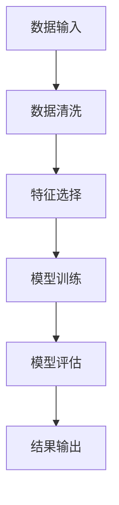
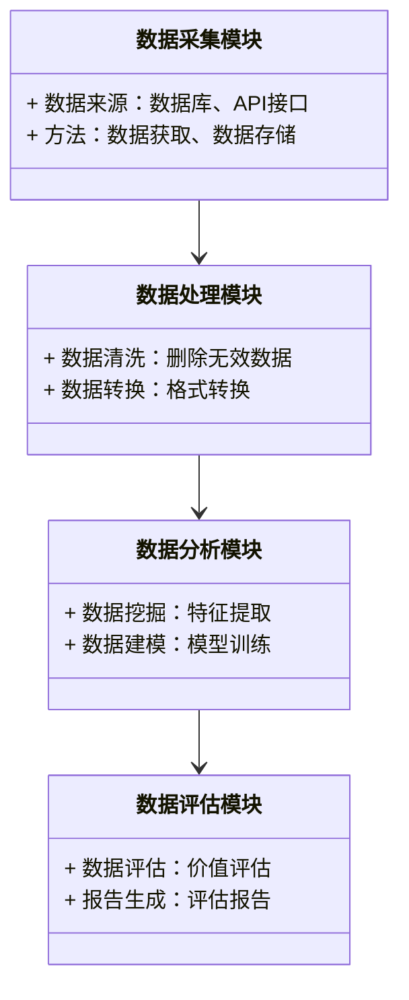
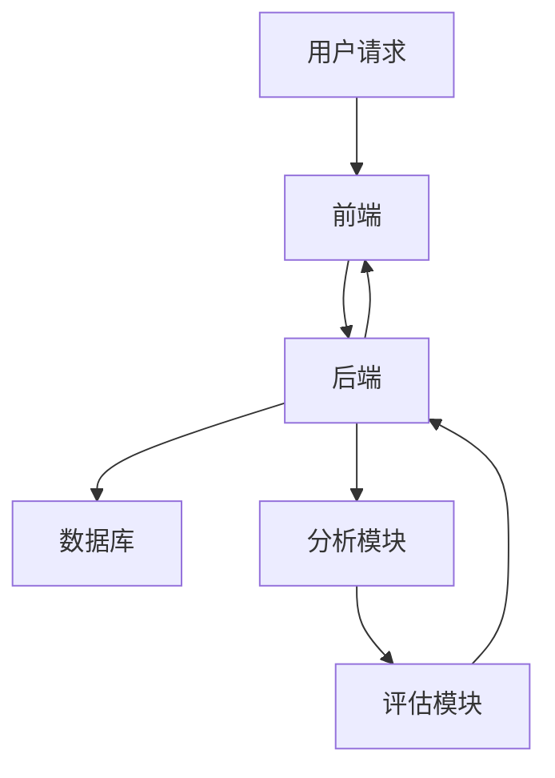

                 


# 彼得林奇如何评估公司的客户数据变现能力

> 关键词：彼得·林奇，客户数据，数据变现，数据评估，投资方法论

> 摘要：本文深入探讨了彼得·林奇的投资哲学在数据变现能力评估中的应用，结合现代技术手段，分析客户数据的核心价值，构建数据评估模型，并通过实际案例展示如何将彼得·林奇的方法论与现代数据科学结合，实现客户数据的高效变现。

---

# 目录

## 第一部分：背景介绍与核心概念

### 第1章：数据变现能力的背景与重要性

#### 1.1 数据变现的背景与趋势

##### 1.1.1 数据作为核心资产的时代背景
在数字化转型的今天，数据已成为企业最核心的资产之一。企业通过收集和分析客户数据，可以挖掘出巨大的商业价值，优化业务流程，提升客户体验，甚至开辟新的商业模式。数据的变现能力直接关系到企业的盈利能力和发展潜力。

##### 1.1.2 数据变现的核心价值与意义
数据变现不仅仅是技术问题，更是一种商业模式的创新。通过数据变现，企业可以将积累的客户数据转化为实际的经济收益。例如，精准营销、个性化推荐、风险管理等领域都离不开对客户数据的深度分析和应用。

##### 1.1.3 彼得·林奇的数据评估方法论
彼得·林奇是全球著名投资家，他在评估企业时注重基本面分析，尤其是企业的核心竞争力和数据价值。他的方法论强调对企业数据的深度挖掘和分析，以发现潜在的投资机会。

#### 1.2 客户数据的价值与变现模式

##### 1.2.1 客户数据的分类与特征
客户数据可以分为结构化数据（如年龄、性别、购买记录）和非结构化数据（如评论、社交媒体互动）。不同类型的客户数据具有不同的特征和价值。

##### 1.2.2 数据变现的主要模式
数据变现可以通过多种方式实现，如广告投放、数据销售、会员服务等。每种模式都有其独特的优势和挑战，企业需要根据自身情况选择合适的变现方式。

##### 1.2.3 客户数据在不同业务场景中的应用
客户数据在精准营销、客户细分、风险评估等领域具有广泛应用。通过分析客户数据，企业可以更好地理解客户需求，优化产品和服务。

### 第2章：数据变现能力的核心概念与联系

#### 2.1 数据变现能力的定义与属性

##### 2.1.1 数据变现能力的定义
数据变现能力是指企业通过分析和利用客户数据，将其转化为经济价值的能力。这种能力取决于数据的完整性、准确性和可用性。

##### 2.1.2 数据变现能力的核心属性对比表
| 属性 | 描述 |
|------|------|
| 完整性 | 数据的全面性，覆盖所有相关维度 |
| 准确性 | 数据的正确性，无错误或偏差 |
| 可用性 | 数据的可访问性和可处理性 |
| 及时性 | 数据的更新频率和时效性 |

##### 2.1.3 数据变现能力的ER实体关系图

```mermaid
er
  entity: 客户数据
  entity: 数据属性
  entity: 数据价值
  entity: 变现模式
  relationship: 客户数据 -[拥有]-> 数据属性
  relationship: 数据属性 -[影响]-> 数据价值
  relationship: 数据价值 -[决定]-> 变现模式
```

#### 2.2 数据变现能力与客户数据的关系

##### 2.2.1 数据变现能力的构成要素
数据变现能力的构成要素包括数据采集、数据分析、数据应用和数据价值实现。每个要素都相互关联，共同影响数据变现的整体效果。

##### 2.2.2 数据变现能力的核心要素对比表
| 要素 | 描述 |
|------|------|
| 数据采集 | 数据的获取方式和渠道 |
| 数据分析 | 数据的处理和挖掘方法 |
| 数据应用 | 数据的应用场景和模式 |
| 数据价值 | 数据带来的经济收益 |

---

## 第二部分：算法原理与数据评估

### 第3章：数据评估的算法原理

#### 3.1 数据评估模型的构建

##### 3.1.1 数据评估模型的数学模型

数据评估模型可以通过线性回归模型来表示：

$$
\text{数据价值} = \beta_0 + \beta_1 \times \text{数据完整性} + \beta_2 \times \text{数据准确性} + \epsilon
$$

其中，$\beta_0$ 是截距，$\beta_1$ 和 $\beta_2$ 是回归系数，$\epsilon$ 是误差项。

##### 3.1.2 数据评估模型的实现步骤

1. 数据预处理：清洗数据，处理缺失值和异常值。
2. 特征选择：选取影响数据价值的关键特征。
3. 模型训练：使用训练数据拟合回归模型。
4. 模型验证：通过测试数据评估模型的准确性。
5. 模型优化：调整参数，提升模型性能。

##### 3.1.3 数据评估模型的Python实现

```python
import pandas as pd
from sklearn.linear_model import LinearRegression
from sklearn.metrics import r2_score

# 加载数据
data = pd.read_csv('customer_data.csv')

# 数据预处理
data.dropna(inplace=True)
data.drop_duplicates(inplace=True)

# 特征选择
X = data[['data_completeness', 'data_accuracy']]
y = data['data_value']

# 模型训练
model = LinearRegression()
model.fit(X, y)

# 模型验证
y_pred = model.predict(X)
print(f"R² Score: {r2_score(y, y_pred)}")
```

#### 3.2 数据评估的数学公式与流程图

##### 3.2.1 数据评估的数学公式

数据评估的核心公式可以表示为：

$$
\text{数据价值} = \sum_{i=1}^{n} w_i \times x_i
$$

其中，$w_i$ 是第 $i$ 个特征的权重，$x_i$ 是第 $i$ 个特征的值。

##### 3.2.2 数据评估的流程图



---

## 第三部分：系统设计与架构

### 第4章：数据评估系统的架构设计

#### 4.1 数据评估系统的功能设计

##### 4.1.1 系统功能模块

数据评估系统主要包括以下几个功能模块：

1. 数据采集模块：负责从不同渠道采集客户数据。
2. 数据处理模块：清洗和转换数据，确保数据的完整性和准确性。
3. 数据分析模块：对数据进行深度分析，提取有价值的信息。
4. 数据评估模块：根据分析结果评估数据价值，并生成报告。

##### 4.1.2 系统功能模块的Mermaid类图



#### 4.2 数据评估系统的架构设计

##### 4.2.1 系统架构图



---

## 第四部分：项目实战与案例分析

### 第5章：数据评估的项目实战

#### 5.1 项目环境与安装

##### 5.1.1 项目环境配置

建议使用以下工具和环境：

- 操作系统：Linux/Windows/MacOS
- Python版本：3.8+
- 开发工具：PyCharm/VS Code
- 依赖库：pandas, numpy, scikit-learn

##### 5.1.2 安装依赖

```bash
pip install pandas numpy scikit-learn
```

#### 5.2 核心代码实现

##### 5.2.1 数据清洗与预处理

```python
import pandas as pd

# 加载数据
data = pd.read_csv('customer_data.csv')

# 删除缺失值
data.dropna(inplace=True)

# 删除重复值
data.drop_duplicates(inplace=True)
```

##### 5.2.2 特征选择与模型训练

```python
from sklearn.linear_model import LinearRegression

# 特征选择
X = data[['age', 'gender', 'purchase_history']]
y = data['customer_value']

# 模型训练
model = LinearRegression()
model.fit(X, y)
```

#### 5.3 案例分析与结果解读

##### 5.3.1 案例背景

假设我们有一家电商平台，希望通过分析客户数据来提升精准营销能力。

##### 5.3.2 数据分析结果

通过模型分析，我们发现客户的购买历史和性别是影响客户价值的最主要因素。

##### 5.3.3 模型优化与改进

根据分析结果，我们可以进一步优化模型，引入更多特征，如客户在社交媒体上的互动情况，以提高模型的准确性。

---

## 第五部分：最佳实践与小结

### 第6章：最佳实践与小结

#### 6.1 实践中的注意事项

- 数据隐私与合规性：确保数据的收集和使用符合相关法律法规。
- 数据安全：防止数据泄露和被恶意攻击。
- 模型解释性：选择易于解释的模型，方便业务人员理解和应用。

#### 6.2 项目小结

通过本文的分析和实践，我们了解了如何将彼得·林奇的投资哲学与现代数据科学结合，构建客户数据的评估体系，并通过实际案例展示了如何在企业中实现数据的高效变现。

#### 6.3 拓展阅读与学习方向

- 数据挖掘与机器学习
- 数据安全与隐私保护
- 数据可视化与仪表盘设计

---

# 结语

在数字化转型的今天，客户数据的变现能力已经成为企业竞争的核心之一。通过彼得·林奇的投资哲学和现代数据科学的结合，我们能够更深入地挖掘数据价值，为企业创造更大的经济效益。未来，随着技术的不断进步，数据变现的能力和应用将会更加广泛和深入。

