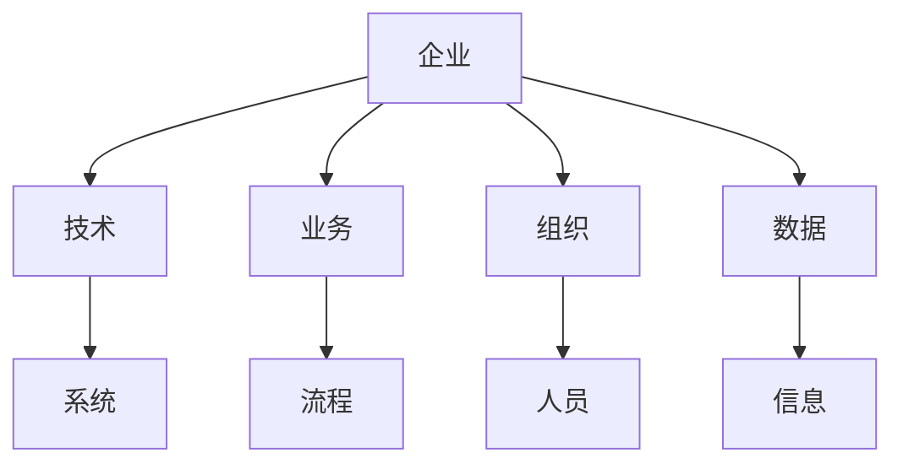
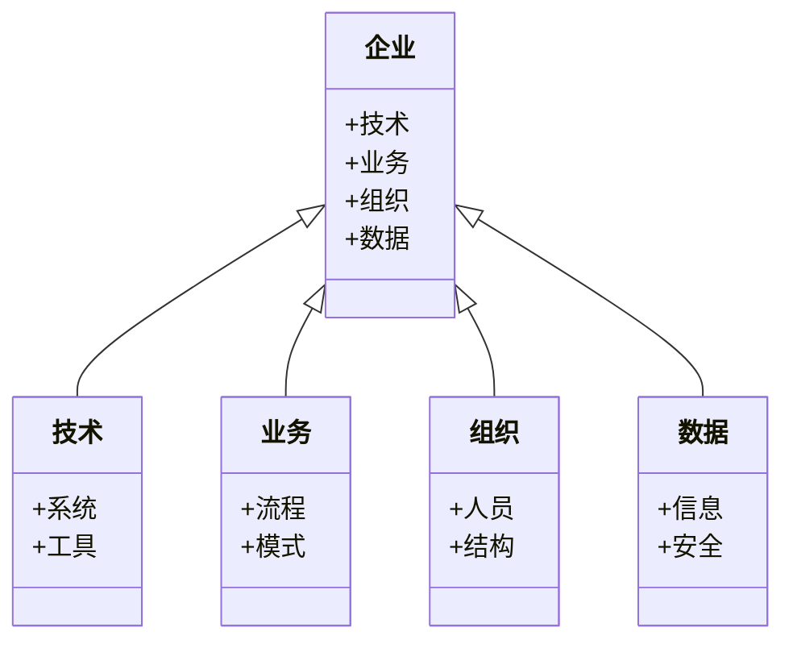
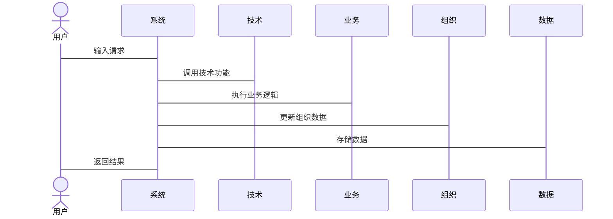

                 


# 彼得林奇如何评估公司的数字化转型速度

## 关键词：
彼得·林奇，数字化转型，评估方法，企业转型，投资评估，技术分析

## 摘要：
数字化转型是现代企业发展的关键趋势，而如何评估其转型速度和效果是企业关注的核心问题。本文结合投资大师彼得·林奇的评估方法，从技术、业务、组织和数据四个维度，详细探讨如何系统地评估公司的数字化转型速度。通过分析核心要素、构建评估框架、设计系统架构，并结合实际案例，为企业提供实用的评估策略和工具。本文旨在为企业的数字化转型提供可操作的方法论，帮助企业在竞争中占据优势。

---

# 第1章 数字化转型的背景与挑战

## 1.1 数字化转型的定义与内涵

### 1.1.1 数字化转型的定义
- 数字化转型是通过技术手段优化企业运营模式，提升效率和竞争力的过程。
- 核心目标是将传统业务与数字技术深度融合，推动业务创新和组织变革。

### 1.1.2 数字化转型的核心特征
- **数据驱动**：利用数据优化决策。
- **技术赋能**：借助新兴技术（如AI、大数据）提升效率。
- **组织变革**：从传统模式向数字化模式转型，强调敏捷性和协作性。

### 1.1.3 数字化转型的驱动因素
- 技术进步（云计算、AI等）。
- 市场需求变化。
- 竞争压力。

## 1.2 彼得·林奇与投资评估方法

### 1.2.1 彼得·林奇的投资理念
- 长期投资，注重企业基本面。
- 重视管理层能力和企业成长潜力。

### 1.2.2 投资评估方法与数字化转型的关联
- 林奇的评估方法注重企业潜力和管理层能力，数字化转型同样需要关注企业战略和执行能力。
- 通过数据分析和趋势预测，林奇的方法与数字化转型的评估逻辑有相似之处。

### 1.2.3 数字化转型评估的核心目标
- 评估转型的速度和效果。
- 识别转型中的关键问题和机会。

## 1.3 数字化转型的现状与挑战

### 1.3.1 当前企业数字化转型的现状
- 许多企业已意识到数字化转型的重要性，但进展不一。
- 技术应用广泛，但组织和文化转型滞后。

### 1.3.2 数字化转型中的主要挑战
- 技术与组织的协同困难。
- 数据孤岛问题严重。
- 缺乏明确的转型目标和路径。

### 1.3.3 数字化转型对企业的长期影响
- 提升竞争力和市场响应能力。
- 优化成本结构，提高效率。
- 改善客户体验，增强客户忠诚度。

---

# 第2章 数字化转型的核心要素

## 2.1 企业数字化转型的关键维度

### 2.1.1 技术维度
- 技术是数字化转型的基础，包括云技术、大数据、AI等。
- 技术的选择和应用直接影响转型的速度和效果。

### 2.1.2 业务维度
- 业务模式的创新是数字化转型的核心。
- 数字化转型需要重新设计业务流程和商业模式。

### 2.1.3 组织维度
- 组织结构和文化是转型成功的关键因素。
- 需要建立跨部门协作机制，推动组织变革。

### 2.1.4 数据维度
- 数据是数字化转型的核心资产。
- 数据的质量、安全和管理能力直接影响转型的效果。

## 2.2 数字化转型的核心要素对比

### 2.2.1 技术与业务的对比分析
- 技术是手段，业务是目标。
- 技术的应用需要围绕业务需求展开。

### 2.2.2 组织与数据的对比分析
- 组织是转型的主体，数据是转型的资源。
- 组织的变革决定了数据的利用效率。

### 2.2.3 核心要素的综合影响
- 技术、业务、组织和数据四个维度相互关联，共同影响数字化转型的速度和效果。

## 2.3 数字化转型的核心要素ER实体关系图



---

# 第3章 数字化转型评估的框架与步骤

## 3.1 评估框架的构建

### 3.1.1 评估框架的设计原则
- 全面性：覆盖技术、业务、组织和数据四个维度。
- 可操作性：评估指标应具体可量化。
- 灵活性：适应不同企业的实际情况。

### 3.1.2 评估框架的核心要素
- 技术成熟度。
- 业务创新度。
- 组织变革度。
- 数据利用度。

### 3.1.3 评估框架的实施步骤
1. 明确评估目标。
2. 确定评估维度。
3. 设计评估指标。
4. 收集数据并分析。
5. 输出评估报告。

## 3.2 评估步骤的详细说明

### 3.2.1 明确评估目标
- 确定评估的主要目的是优化转型速度还是提升转型效果。

### 3.2.2 确定评估维度
- 技术维度：评估技术的应用程度和成熟度。
- 业务维度：评估业务模式的创新性和市场响应能力。
- 组织维度：评估组织结构和文化的适应性。
- 数据维度：评估数据的利用效率和安全性。

### 3.2.3 设计评估指标
- 技术维度：系统可用性、技术更新频率。
- 业务维度：客户满意度、业务增长率。
- 组织维度：员工培训频率、团队协作效率。
- 数据维度：数据完整性、数据安全等级。

### 3.2.4 收集数据并分析
- 数据收集：通过问卷、访谈和系统日志等方式收集数据。
- 数据分析：利用统计方法和数据分析工具进行定量分析。

### 3.2.5 输出评估报告
- 总结评估结果，提出改进建议。
- 根据评估结果制定下一步的转型策略。

---

# 第4章 数字化转型评估的系统分析与架构设计

## 4.1 系统功能设计

### 4.1.1 领域模型设计


### 4.1.2 系统架构设计


### 4.1.3 系统接口设计
- 技术接口：系统与技术工具的交互接口。
- 业务接口：业务流程与系统数据的交互接口。
- 组织接口：人员与组织结构的交互接口。
- 数据接口：数据采集与存储的交互接口。

### 4.1.4 系统交互设计


## 4.2 项目实战

### 4.2.1 环境安装
- 安装必要的开发工具（如Python、Jupyter）。
- 配置数据库和服务器环境。

### 4.2.2 核心实现代码
```python
def assess_technology(technology_status):
    # 技术评估函数
    if technology_status >= 0.8:
        return "技术成熟"
    elif technology_status >= 0.5:
        return "技术一般"
    else:
        return "技术落后"

def assess_business(business_status):
    # 业务评估函数
    if business_status >= 0.8:
        return "业务创新"
    elif business_status >= 0.5:
        return "业务稳定"
    else:
        return "业务落后"

# 示例数据
technology_status = 0.7
business_status = 0.6

print(assess_technology(technology_status))
print(assess_business(business_status))
```

---

# 第5章 数字化转型评估的最佳实践与小结

## 5.1 最佳实践 tips

### 5.1.1 技术评估
- 定期评估技术成熟度，及时更新技术栈。

### 5.1.2 业务优化
- 以客户为中心，持续优化业务流程。

### 5.1.3 组织变革
- 建立跨部门协作机制，推动组织文化转型。

### 5.1.4 数据管理
- 加强数据安全，提升数据利用效率。

## 5.2 项目小结
- 数字化转型是一个长期且复杂的过程。
- 通过系统化的评估和优化，可以显著提升转型速度和效果。

## 5.3 注意事项
- 转型过程中需注意技术与业务的协同。
- 数据安全和隐私保护是转型中的重要问题。
- 组织变革需要管理层和员工的共同努力。

## 5.4 拓展阅读
- 推荐阅读彼得·林奇的《彼得·林奇的投资哲学》。
- 参考其他数字化转型相关的书籍和文献。

---

# 结论

数字化转型是企业适应新时代竞争的必经之路。通过借鉴彼得·林奇的投资评估方法，结合技术、业务、组织和数据四个维度的系统分析，企业可以更有效地评估数字化转型的速度和效果。希望本文提供的方法和工具能够帮助企业在数字化转型中取得成功。

--- 

# 参考文献

1. 彼得·林奇. 《彼得·林奇的投资哲学》
2. 某些企业数字化转型的实践案例
3. 相关技术文献和研究报告

