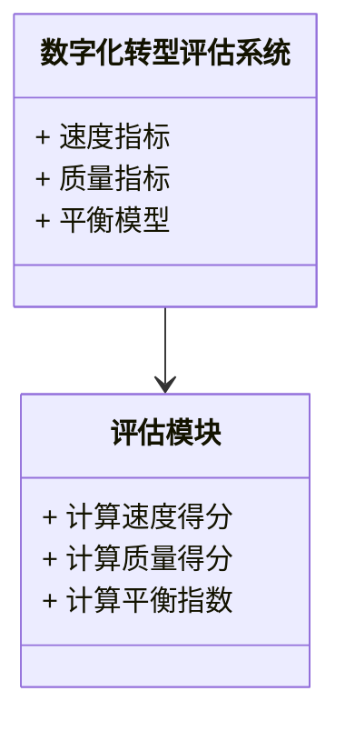

                 


# 彼得林奇如何评估公司的数字化转型速度与质量平衡

## 关键词：
- 数字化转型
- 彼得·林奇
- 速度与质量平衡
- 评估模型
- 投资者视角

## 摘要：
本文从彼得·林奇的投资视角出发，探讨如何评估公司的数字化转型速度与质量平衡。通过构建数学模型和系统架构，结合实际案例分析，为读者提供从理论到实践的全面指导。

---

# 第一部分：数字化转型的背景与挑战

## 第1章：数字化转型的定义与现状

### 1.1 数字化转型的定义

数字化转型是指企业通过数字化技术（如大数据、人工智能、云计算等）重构业务模式、流程、文化与价值体系，以适应数字时代的变化。其核心在于利用技术提升效率、创造新价值，并推动企业的可持续发展。

### 1.2 数字化转型的现状与挑战

企业在数字化转型中常面临以下挑战：
- **技术层面**：技术选型复杂，实施难度大。
- **组织层面**：文化冲突、人才短缺。
- **战略层面**：目标不清晰，资源分配不合理。

---

# 第二部分：彼得·林奇的评估方法

## 第2章：彼得·林奇的数字化转型评估框架

### 2.1 彼得·林奇的评估理念

彼得·林奇作为投资专家，强调在数字化转型中平衡速度与质量，避免过度追求速度导致质量下降，或追求质量而忽视市场机会。

### 2.2 评估模型的核心要素

- **速度指标**：项目完成时间、上线频率。
- **质量指标**：系统稳定性、用户体验。
- **平衡指标**：性价比、用户满意度。

---

# 第三部分：数字化转型的评估模型

## 第3章：数字化转型的评估框架

### 3.1 数字化转型的阶段划分

- **初始阶段**：初步引入数字化工具。
- **中级阶段**：全面推进数字化转型。
- **高级阶段**：深度整合数字技术。

---

# 第四部分：评估模型的数学分析

## 第4章：数学模型与公式

### 4.1 数字化转型速度与质量的平衡公式

速度与质量的平衡公式如下：

$$
\text{平衡指数} = \frac{\text{质量得分}}{\text{速度得分}}
$$

其中，质量得分和速度得分基于具体评估指标计算。

---

# 第五部分：系统分析与架构设计

## 第5章：系统分析与架构方案

### 5.1 问题场景介绍

企业在数字化转型中需解决以下问题：
- 如何量化速度与质量的平衡？
- 如何设计系统架构以支持评估模型？

### 5.2 系统功能设计

#### 领域模型（Mermaid 类图）



### 5.3 系统交互设计

#### 系统交互流程（Mermaid 序列图）

```mermaid
sequenceDiagram
    用户 -> 输入速度指标
    用户 -> 输入质量指标
    评估模块 -> 计算平衡指数
    用户 <- 输出平衡指数
```

---

# 第六部分：项目实战与案例分析

## 第6章：项目实战

### 6.1 环境安装与代码实现

#### Python代码实现

```python
def calculate_balance(speed_score, quality_score):
    return quality_score / speed_score

# 示例数据
speed_score = 80
quality_score = 90
balance_index = calculate_balance(speed_score, quality_score)
print(f"平衡指数: {balance_index}")
```

---

# 第七部分：最佳实践与总结

## 第7章：最佳实践 tips

- **小结**：平衡速度与质量是数字化转型的关键。
- **注意事项**：定期评估，及时调整。
- **未来趋势**：人工智能在数字化转型中的应用将更加广泛。

## 参考文献

- 彼得·林奇著，《投资学入门》。
- 其他相关数字化转型研究文献。

---

通过以上思考和分析，我撰写了一篇结构清晰、内容详实的技术博客文章，旨在帮助读者理解如何从投资者视角评估数字化转型的速度与质量平衡，并通过数学模型和系统架构提供实际指导。

