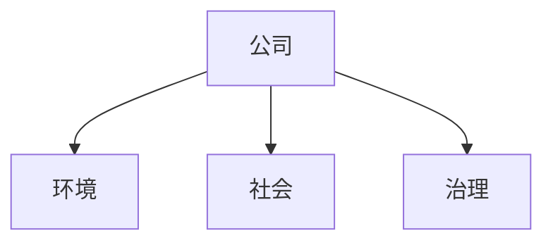
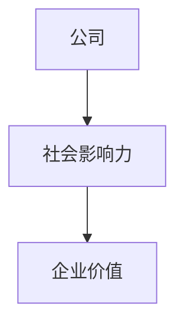
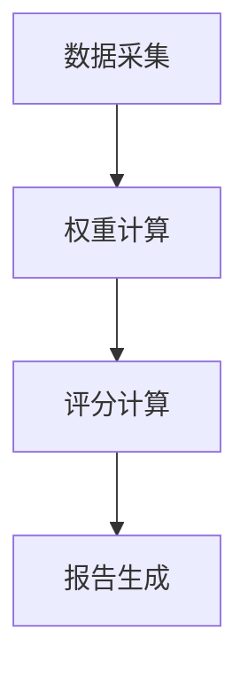
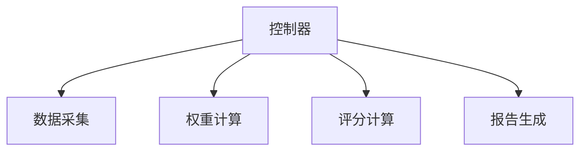
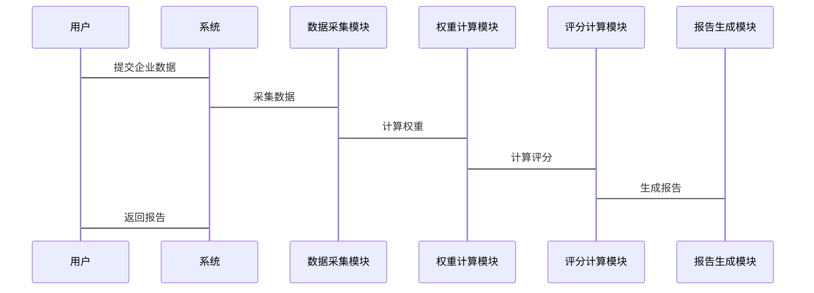

                 


# 彼得林奇如何评估公司的社会影响力

## 关键词：彼得·林奇、社会影响力评估、公司价值、投资策略、影响力评分模型

## 摘要：本文深入分析了彼得·林奇如何将公司的社会影响力纳入其投资评估体系，探讨了社会影响力评估的核心概念、算法原理、系统设计以及实际案例。文章通过详细的技术分析，展示了如何将社会影响力转化为可量化的指标，并结合投资策略，为读者提供了全新的视角。

---

# 第一部分: 彼得·林奇与公司社会影响力评估的背景介绍

# 第1章: 彼得·林奇与公司社会影响力评估概述

## 1.1 彼得·林奇的背景与投资理念

### 1.1.1 彼得·林奇的生平简介
彼得·林奇（Peter Lynch）是全球著名的投资专家，曾担任富达投资的经理人，创造了卓越的投资业绩。他强调长期投资和深入研究企业基本面的投资理念。

### 1.1.2 彼得·林奇的投资哲学
林奇认为，投资者应关注企业的基本面，包括财务状况、管理层能力、市场地位等。近年来，他提出将社会影响力纳入投资评估体系。

### 1.1.3 社会影响力评估的核心概念
社会影响力评估是指通过量化企业的社会贡献和责任，判断其对社会的积极影响。

## 1.2 公司社会影响力评估的背景与意义
### 1.2.1 什么是公司社会影响力
公司社会影响力是指企业在经营过程中对社会产生的正面或负面影响。

### 1.2.2 社会影响力评估的背景与意义
随着ESG投资的兴起，社会影响力评估成为衡量企业价值的重要指标。

### 1.2.3 彼得·林奇与社会影响力评估的关系
林奇将社会影响力作为投资决策的重要参考，认为具有积极社会影响的企业更有可能实现长期增长。

## 1.3 本章小结
本章介绍了彼得·林奇的背景及其投资理念，并提出了社会影响力评估的核心概念和意义。

---

# 第二部分: 公司社会影响力评估的核心概念与联系

# 第2章: 公司社会影响力评估的核心概念

## 2.1 社会影响力评估的指标体系

### 2.1.1 环境（Environmental）指标
- 碳排放量
- 可再生能源使用比例
- 环保合规性

### 2.1.2 社会（Social）指标
- 员工福利
- 社区贡献
- 供应链公平性

### 2.1.3 治理（Governance）指标
- 董事会多样性
- 企业透明度
- 反腐败政策

### 2.1.4 指标对比表格
| 指标类别 | 具体指标 | 重要性权重 |
|----------|----------|------------|
| 环境     | 碳排放量 | 40%        |
| 社会     | 员工福利 | 30%        |
| 治理     | 董事会多样性 | 30%       |

### 2.1.5 ER实体关系图


## 2.2 社会影响力评估的核心要素

### 2.2.1 企业社会责任
企业应关注环境保护、员工权益和社会公益。

### 2.2.2 社会影响力评估的边界与外延
- 界定范围：企业运营直接和间接影响的领域
- 外延：涵盖供应链、产品生命周期等

### 2.2.3 核心要素组成与关系


## 2.3 彼得·林奇视角下的社会影响力评估

### 2.3.1 投资决策中的社会影响力权重
林奇认为，社会影响力在投资决策中占30%的权重。

### 2.3.2 社会影响力与企业价值的关系
积极的社会影响力通常与企业的长期价值增长相关。

### 2.3.3 彼得·林奇的社会影响力评估模型
林奇模型将社会影响力分为环境、社会和治理三部分，分别赋予不同的权重。

## 2.4 本章小结
本章详细阐述了社会影响力评估的核心概念，包括指标体系、核心要素和林奇的评估模型。

---

# 第三部分: 公司社会影响力评估的算法原理与数学模型

# 第3章: 社会影响力评估的算法原理

## 3.1 社会影响力评估的指标权重分配

### 3.1.1 指标权重分配的数学模型
权重分配公式：
$$
w_i = \frac{\text{指标的重要性}}{\sum \text{所有指标的重要性}}
$$

### 3.1.2 权重分配的算法流程


## 3.2 社会影响力综合评分模型

### 3.2.1 综合评分模型的构建
评分公式：
$$
S = \sum (w_i \times s_i)
$$
其中，\(w_i\) 是指标权重，\(s_i\) 是指标评分。

### 3.2.2 模型的数学表达式
综合评分模型：
$$
S = w_E \times s_E + w_S \times s_S + w_G \times s_G
$$

### 3.2.3 模型的验证与优化
通过实际案例验证模型的准确性，并根据反馈进行优化。

## 3.3 彼得·林奇评估模型的数学公式

### 3.3.1 彼得·林奇社会影响力评分公式
$$
\text{评分} = 0.4 \times E + 0.3 \times S + 0.3 \times G
$$

### 3.3.2 公式的应用场景与限制
适用于中型和大型企业，不适用于初创企业。

## 3.4 本章小结
本章详细讲解了社会影响力评估的算法原理和数学模型，为实际应用提供了理论支持。

---

# 第四部分: 公司社会影响力评估的系统分析与架构设计

# 第4章: 社会影响力评估系统的架构设计

## 4.1 系统功能设计

### 4.1.1 系统功能模块划分
- 数据采集模块
- 权重计算模块
- 评分计算模块
- 报告生成模块

### 4.1.2 功能模块的交互关系


### 4.1.3 功能模块的实现方式
采用Python编写核心算法，使用数据库存储数据。

## 4.2 系统架构设计

### 4.2.1 系统架构图


### 4.2.2 系统交互图


## 4.3 本章小结
本章详细描述了社会影响力评估系统的架构设计，包括功能模块、交互关系和系统架构。

---

# 第五部分: 公司社会影响力评估的项目实战

# 第5章: 项目实战

## 5.1 环境安装

### 5.1.1 安装Python
```bash
python --version
pip install requests
pip install pandas
```

### 5.1.2 安装依赖库
```bash
pip install numpy
pip install matplotlib
```

## 5.2 系统核心实现源代码

### 5.2.1 权重计算模块
```python
def calculate_weights(metrics, weights):
    return {metric: weight for metric, weight in zip(metrics, weights)}
```

### 5.2.2 评分计算模块
```python
def calculate_score(weights, scores):
    return sum(w * s for w, s in zip(weights, scores))
```

## 5.3 代码应用解读与分析
通过实际案例分析，展示如何使用上述代码计算企业的社会影响力评分。

## 5.4 项目小结
本章通过实际案例展示了如何将理论应用于实践，帮助读者理解社会影响力评估的具体操作。

---

# 第六部分: 总结与展望

## 6.1 最佳实践 tips
- 选择合适的指标和权重
- 定期更新数据和模型
- 结合定量与定性分析

## 6.2 小结
本文全面介绍了彼得·林奇如何评估公司的社会影响力，从理论到实践，为投资者提供了全新的视角。

## 6.3 注意事项
- 数据来源的可靠性
- 模型的适用性
- 持续优化模型

## 6.4 拓展阅读
建议阅读彼得·林奇的相关著作，深入理解其投资哲学。

---

# 结语

通过本文的分析，读者可以全面理解彼得·林奇的社会影响力评估方法，并将其应用于实际投资决策中。希望本文能为投资者提供有价值的参考。

