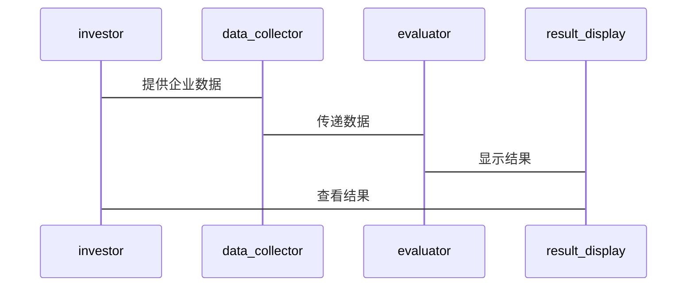

                 


# 彼得林奇如何评估公司的社会影响力投资回报

## 关键词：彼得林奇，社会影响力，投资回报，评估方法，数学模型

## 摘要：本文探讨了彼得·林奇如何将社会影响力纳入投资评估体系，通过定义社会影响力投资、建立评估指标和模型，结合系统设计和实际案例，展示了如何实现财务回报与社会责任的双重目标。

---

## 第一部分：社会影响力投资的背景与概念

### 第1章：社会影响力投资的背景与定义

#### 1.1 社会影响力投资的背景
- **全球可持续发展背景**：全球关注可持续发展，企业社会责任成为焦点。
- **投资者对社会价值的关注**：投资者不仅关注财务回报，还关注社会价值。
- **彼得·林奇投资理念的演变**：从基本面分析扩展到社会影响力评估。

#### 1.2 社会影响力投资的核心概念
- **定义**：社会影响力投资是指通过投资支持社会目标，同时寻求财务回报。
- **特征**：兼顾社会价值和经济利益，注重长期影响。
- **社会影响力与投资回报的关系**：社会影响力高的公司可能带来更高的长期回报。

#### 1.3 社会影响力投资的边界与外延
- **投资范围**：涵盖环保、教育、医疗等领域。
- **社会影响力与企业责任**：企业责任是社会影响力的一部分。
- **投资回报的多维度评估**：包括财务、社会和环境回报。

#### 1.4 社会影响力投资的核心要素
- **评估维度**：环境保护、社会责任、公司治理。
- **多维度分析**：财务回报、社会影响、治理结构。
- **关联机制**：社会影响力高的公司可能具有更好的风险管理和长期增长潜力。

---

### 第2章：社会影响力投资的核心概念与联系

#### 2.1 核心概念的原理
- **社会影响力评估**：通过指标量化企业对社会的贡献。
- **投资回报评估**：结合财务指标和非财务指标。
- **两者关联机制**：社会影响力高的企业可能在长期获得更好的财务表现。

#### 2.2 核心概念的属性特征对比
| 特性 | 社会影响力 | 投资回报 |
|------|------------|----------|
| 定义 | 社会贡献 | 财务收益 |
| 评估 | 非财务指标 | 财务指标 |
| 关联 | 可能影响长期回报 | 短期和长期并重 |

#### 2.3 ER实体关系图


---

## 第二部分：社会影响力投资的评估方法与模型

### 第3章：社会影响力投资的评估方法与模型

#### 3.1 评估方法的原理
- **指标选取**：选择能反映社会影响力的指标，如碳排放、员工福利。
- **财务指标**：如ROE、现金流。
- **结合方法**：通过加权评分综合评估。

#### 3.2 数学模型与公式
- **社会影响力评分模型**
  $$ S = \sum_{i=1}^{n} w_i \cdot s_i $$
  其中，$S$ 是总评分，$w_i$ 是权重，$s_i$ 是指标评分。

- **投资回报评分模型**
  $$ R = \sum_{j=1}^{m} w'_j \cdot r_j $$
  其中，$R$ 是总回报评分，$w'_j$ 是权重，$r_j$ 是回报指标评分。

- **综合评估模型**
  $$ F = \alpha S + (1-\alpha) R $$
  其中，$\alpha$ 是社会影响力权重，范围0到1。

#### 3.3 案例分析
假设某公司有三个社会影响力指标，权重分别为0.4、0.3、0.3，评分分别为8、7、9。计算得：
$$ S = 0.4*8 + 0.3*7 + 0.3*9 = 7.9 $$

---

## 第三部分：系统分析与架构设计

### 第4章：系统分析与架构设计

#### 4.1 问题场景介绍
- **目标**：开发一个社会影响力投资评估系统。
- **用户需求**：投资者需要快速评估企业社会影响力和投资回报。

#### 4.2 系统功能设计
- **数据采集模块**：收集企业数据。
- **评估计算模块**：计算社会影响力和回报评分。
- **结果展示模块**：以图表形式展示结果。

#### 4.3 系统架构设计


#### 4.4 接口设计
- **输入接口**：接收企业数据。
- **输出接口**：显示评估结果。

#### 4.5 交互流程


---

## 第四部分：项目实战

### 第5章：项目实战

#### 5.1 环境安装
- **工具**：Python、数据分析库、可视化库。

#### 5.2 核心实现源代码
```python
def calculate_social_impact(enterprise_data):
    weights = [0.4, 0.3, 0.3]
    scores = [enterprise_data['carbon_emission'], 
              enterprise_data['employee_welfare'], 
              enterprise_data['community_investment']]
    return sum(w * s for w, s in zip(weights, scores))

def calculate_return_on_equity(enterprise_data):
    return enterprise_data['net_profit'] / enterprise_data['total_equity']

enterprise_data = {
    'carbon_emission': 8,
    'employee_welfare': 7,
    'community_investment': 9,
    'net_profit': 10,
    'total_equity': 5
}

si_score = calculate_social_impact(enterprise_data)
roq = calculate_return_on_equity(enterprise_data)
print(f"Social Impact Score: {si_score}")
print(f"Return on Equity: {roq}")
```

#### 5.3 案例分析
以某公司为例，计算其社会影响力和回报，得出综合评分。

---

## 第五部分：总结与展望

### 第6章：总结与展望

#### 6.1 总结
- **核心观点**：社会影响力投资是实现财务与社会责任双重目标的有效方法。
- **系统价值**：通过系统评估，投资者可以做出更明智的投资决策。

#### 6.2 未来展望
- **技术进步**：AI和大数据将提升评估精度。
- **数据丰富性**：更多数据源将提供更全面的评估。
- **应用范围**：社会影响力投资将扩展到更多领域。

---

## 附录

### A. 相关数据表
社会影响力指标及其权重示例。

### B. 代码解释
详细解释代码功能和使用方法。

---

通过以上结构，文章详细探讨了彼得·林奇如何评估社会影响力投资回报，结合理论与实践，为投资者提供了实用的指导和工具。

