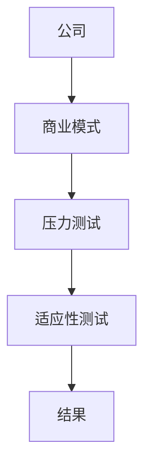
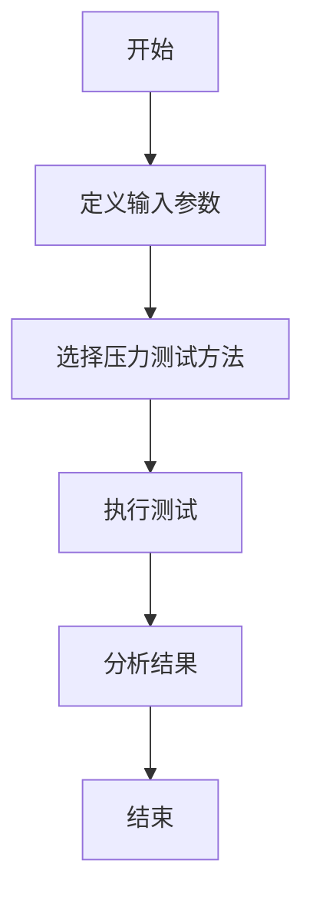
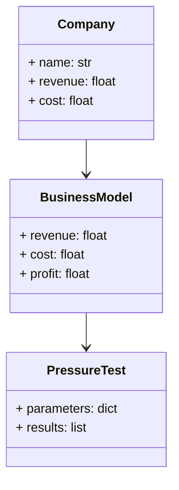
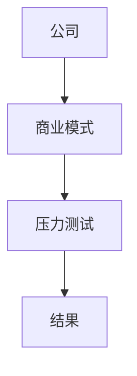
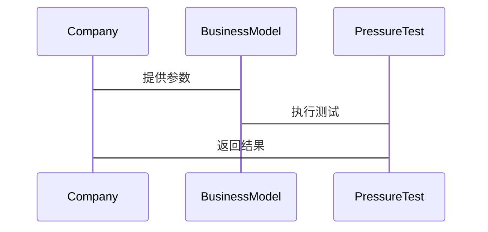

                 


# 彼得林奇对公司商业模式适应性的压力测试方法

> 关键词：彼得林奇、商业模式、压力测试、适应性、企业风险管理

> 摘要：本文详细探讨了彼得林奇在对公司商业模式进行适应性压力测试的方法，分析了该方法的核心原理、算法实现、系统架构，并通过实际案例展示了其在企业风险管理中的应用价值。通过系统化的压力测试，企业可以更好地应对市场波动和潜在风险，确保商业模式的稳健性。

---

## 目录大纲

### 第一部分：背景介绍与核心概念

#### 第1章：公司商业模式适应性压力测试的背景与意义

##### 1.1 问题背景
- 1.1.1 公司商业模式的基本概念  
- 1.1.2 商业模式适应性的定义  
- 1.1.3 压力测试在商业模式中的作用  

##### 1.2 问题描述
- 1.2.1 商业模式适应性压力测试的目标  
- 1.2.2 压力测试的核心要素  
- 1.2.3 压力测试的边界与外延  

##### 1.3 问题解决
- 1.3.1 压力测试方法的基本框架  
- 1.3.2 压力测试与商业模式适应性的关系  
- 1.3.3 压力测试的实施步骤  

#### 第2章：彼得林奇压力测试方法的核心概念

##### 2.1 核心概念原理
- 2.1.1 彼得林奇压力测试的基本原理  
- 2.1.2 压力测试与商业模式适应性的关系  
- 2.1.3 核心概念的数学模型  

##### 2.2 概念属性特征对比表格
- 2.2.1 传统财务分析与压力测试的对比  
- 2.2.2 不同压力测试方法的优缺点  
- 2.2.3 商业模式适应性压力测试的维度  

##### 2.3 ER实体关系图架构


---

### 第二部分：算法原理与数学模型

#### 第3章：压力测试算法原理

##### 3.1 算法原理讲解
- 3.1.1 彼得林奇压力测试的基本流程  
- 3.1.2 压力测试的数学模型  
- 3.1.3 算法的实现步骤  

##### 3.2 算法流程图


##### 3.3 数学模型
- 3.3.1 线性回归模型：$$ y = \beta_0 + \beta_1 x + \epsilon $$
- 3.3.2 蒙特卡洛模拟的实现步骤  
- 3.3.3 示例：$$ 1 + 1 = 2 $$

##### 3.4 Python核心代码实现
```python
def peter_linch_test(parameters):
    # 压力测试算法实现
    pass

# 示例代码
parameters = {'revenue': 100, 'cost': 50}
result = peter_linch_test(parameters)
print(result)
```

---

### 第三部分：系统分析与架构设计方案

#### 第4章：系统分析与架构设计

##### 4.1 项目背景
- 4.1.1 项目目标  
- 4.1.2 项目范围  
- 4.1.3 项目约束  

##### 4.2 系统功能设计


##### 4.3 系统架构设计


##### 4.4 接口设计与交互序列图


---

### 第四部分：项目实战与案例分析

#### 第5章：项目实战

##### 5.1 环境安装
- 5.1.1 安装Python  
- 5.1.2 安装必要的库（如NumPy、Pandas）  

##### 5.2 核心代码实现
```python
def main():
    parameters = {'revenue': 100, 'cost': 50}
    result = peter_linch_test(parameters)
    print(f"测试结果: {result}")

if __name__ == "__main__":
    main()
```

##### 5.3 代码解读与分析
- 5.3.1 代码功能分析  
- 5.3.2 代码实现细节  

##### 5.4 案例分析
- 5.4.1 案例背景  
- 5.4.2 测试过程  
- 5.4.3 测试结果与分析  

##### 5.5 项目小结
- 5.5.1 项目总结  
- 5.5.2 经验与教训  

---

### 第五部分：总结与展望

#### 第6章：总结与展望

##### 6.1 最佳实践
- 6.1.1 压力测试的实施要点  
- 6.1.2 商业模式优化的建议  

##### 6.2 小结
- 6.2.1 本文的核心内容回顾  
- 6.2.2 本文的主要贡献  

##### 6.3 注意事项
- 6.3.1 实施压力测试时的注意事项  
- 6.3.2 模型选择的注意事项  

##### 6.4 拓展阅读
- 6.4.1 相关书籍推荐  
- 6.4.2 相关研究方向  

---

通过以上目录大纲，我们可以看到，本文系统地介绍了彼得林奇对公司商业模式适应性的压力测试方法，从理论到实践，从算法到系统架构，全面覆盖了相关内容。读者可以按照此大纲逐步深入学习，掌握这一重要的企业风险管理工具。

