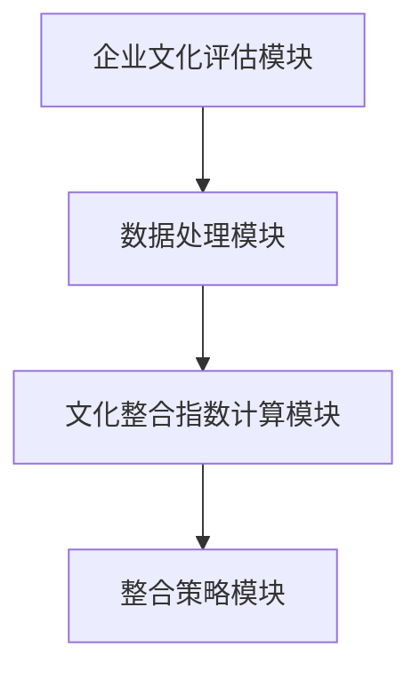

                 


# 彼得·林奇对公司并购后文化整合的评估

## 关键词：公司并购、文化整合、彼得·林奇、企业文化评估、文化冲突、整合策略、并购评估

## 摘要：本文深入分析了彼得·林奇在公司并购后文化整合方面的评估方法，探讨了文化整合的核心要素、评估指标和整合策略，通过实际案例和系统设计，展示了如何通过文化整合实现并购成功。

---

## 第一部分: 公司并购与文化整合的背景

## 第1章: 公司并购与文化整合概述

### 1.1 公司并购的背景与现状

#### 1.1.1 公司并购的定义与类型
公司并购（Mergers and Acquisitions, M&A）是指一家公司收购另一家公司的部分或全部资产或股权，以实现战略目标。常见的并购类型包括：
- **横向并购**：在同一行业内的并购，旨在扩大市场份额。
- **纵向并购**：在供应链上下游的并购，以增强垂直整合能力。
- **混合并购**：跨行业并购，寻求新的业务增长点。

#### 1.1.2 并购的动机与目的
公司并购的动机多种多样，主要包括：
- **扩大市场份额**：通过并购快速进入新市场。
- **获取技术或资源**：通过并购获得关键技术和资源。
- **降低成本**：通过规模效应降低运营成本。
- **多元化战略**：通过并购分散风险，实现业务多元化。

#### 1.1.3 并购的行业现状与趋势
近年来，并购活动频繁，尤其是在科技、金融和医疗行业。企业通过并购不仅寻求业务扩展，还希望通过并购实现技术整合和文化融合。

### 1.2 文化整合的重要性

#### 1.2.1 什么是企业文化
企业文化是企业在长期发展过程中形成的，由企业愿景、价值观、管理风格和员工行为规范共同构成的企业氛围。

#### 1.2.2 并购后文化整合的核心问题
并购后，企业文化差异可能导致冲突，影响企业整合效果。如何有效整合双方文化，形成统一的企业价值观，是并购成功的关键。

#### 1.2.3 文化整合对并购成功的影响
文化整合直接影响员工的凝聚力、团队协作和企业绩效。成功的文化整合能够提升员工归属感，降低文化冲突风险，促进企业长期发展。

### 1.3 彼得·林奇并购评估方法的介绍

#### 1.3.1 彼得·林奇的并购投资理念
彼得·林奇是著名投资专家，他强调并购的长期价值和企业文化的重要性。他认为，并购不仅仅是资产的整合，更是文化的整合。

#### 1.3.2 彼得·林奇文化整合评估的核心观点
彼得·林奇认为，并购后文化整合的关键在于评估双方的文化兼容性，找到双方文化的共同点和差异点，制定有效的整合策略。

#### 1.3.3 本书的研究目标与意义
本书旨在通过分析彼得·林奇的并购案例，总结文化整合的评估方法和策略，为企业的并购提供理论和实践指导。

---

## 第二部分: 文化整合的核心概念与联系

## 第2章: 文化整合的核心要素与评估指标

### 2.1 文化整合的核心要素

#### 2.1.1 企业价值观与文化内涵
企业价值观是企业的灵魂，决定了企业的行为方式和决策标准。文化内涵包括企业使命、愿景和核心价值观。

#### 2.1.2 企业组织结构与管理风格
组织结构和管理风格直接影响企业的运作效率和员工的归属感。扁平化管理与层级管理在文化整合中的表现不同。

#### 2.1.3 企业员工文化适应性
员工的文化适应性影响并购后的团队协作和文化融合。适应性强的员工更容易融入新文化，推动文化整合。

### 2.2 文化整合的评估指标

#### 2.2.1 文化兼容性评估指标
- 企业愿景一致性
- 企业价值观匹配度
- 管理风格兼容性

#### 2.2.2 文化冲突风险评估指标
- 企业文化差异性
- 员工价值观冲突
- 组织结构差异

#### 2.2.3 文化整合效果评估指标
- 员工满意度
- 团队协作效率
- 企业绩效提升

### 2.3 文化整合的核心概念对比分析

#### 2.3.1 文化整合与企业并购的关系
文化整合是企业并购成功的关键因素，直接影响并购后的资源整合和协同效应。

#### 2.3.2 文化整合与企业战略的关系
文化整合是企业战略实施的重要保障，通过文化整合，企业能够更好地执行战略目标。

#### 2.3.3 文化整合与企业绩效的关系
文化整合能够提升员工凝聚力和企业绩效，是企业长期发展的基石。

## 第3章: 文化整合的核心概念ER实体关系图

### 3.1 文化整合的实体关系分析

- **公司并购方**：发起并购的企业。
- **被并购公司**：被收购的企业。
- **企业文化**：被并购公司的核心文化。
- **文化整合过程**：整合的具体实施过程。
- **整合结果**：整合后的文化效果。

### 3.2 文化整合的ER关系图展示

```mermaid
er
actor: 公司并购方
actor 公司并购方 --> company: 被并购公司
company 被并购公司 --> culture: 企业文化
culture 企业文化 --> integration: 文化整合过程
integration 文化整合过程 --> result: 整合结果
```

---

## 第三部分: 文化整合的评估模型与算法原理

## 第4章: 文化整合评估模型的构建

### 4.1 文化整合评估模型的概述

#### 4.1.1 模型的定义与目标
文化整合评估模型用于量化评估并购后文化整合的效果，通过指标权重计算和数据分析，得出整合指数。

#### 4.1.2 模型的输入与输出
- **输入**：企业文化评估指标、员工反馈数据、管理风格数据。
- **输出**：文化整合指数、整合效果分析报告。

#### 4.1.3 模型的适用范围
适用于各种规模和行业的公司并购，特别是跨文化并购。

### 4.2 文化整合评估模型的算法原理

#### 4.2.1 模型的数学公式
$$ \text{文化整合指数} = \sum_{i=1}^{n} w_i \cdot x_i $$
其中，$w_i$ 是第 $i$ 个指标的权重，$x_i$ 是第 $i$ 个指标的评估值。

#### 4.2.2 模型的实现步骤
1. 确定评估指标和权重。
2. 收集数据，进行指标评分。
3. 计算整合指数。
4. 分析整合效果，提出改进建议。

#### 4.2.3 文化整合指数的计算示例
假设企业文化兼容性、员工适应性和管理风格兼容性三个指标的权重分别为0.4、0.3和0.3，评估值分别为0.8、0.7和0.6。则：
$$ \text{文化整合指数} = 0.4 \times 0.8 + 0.3 \times 0.7 + 0.3 \times 0.6 = 0.32 + 0.21 + 0.18 = 0.71 $$

---

## 第五部分: 文化整合的系统分析与架构设计

## 第5章: 文化整合的系统分析与架构设计

### 5.1 问题场景介绍
公司并购后，如何有效整合企业文化，提升员工凝聚力和团队协作效率。

### 5.2 项目介绍
设计一个文化整合评估系统，帮助企业在并购后进行文化评估和整合。

### 5.3 系统功能设计
- **企业文化评估模块**：收集和分析企业文化数据。
- **员工反馈模块**：收集员工对企业文化的反馈。
- **文化整合策略模块**：制定和优化文化整合策略。

### 5.4 系统架构设计


### 5.5 系统接口设计
- **输入接口**：企业文化数据、员工反馈数据。
- **输出接口**：文化整合指数报告、整合策略建议。

### 5.6 系统交互流程
```mermaid
sequence
用户 -> 企业文化评估模块: 提交企业文化数据
企业文化评估模块 --> 数据处理模块: 数据处理
数据处理模块 --> 文化整合指数计算模块: 计算指数
文化整合指数计算模块 --> 整合策略模块: 生成策略
整合策略模块 -> 用户: 提交策略报告
```

---

## 第六部分: 项目实战

## 第6章: 项目实战与案例分析

### 6.1 环境安装与数据准备
- **环境安装**：安装Python、数据分析工具。
- **数据准备**：收集企业文化数据、员工反馈数据。

### 6.2 系统核心实现源代码

#### 6.2.1 文化整合指数计算代码
```python
def calculate_integration_index(weights, values):
    return sum(w * v for w, v in zip(weights, values))

weights = [0.4, 0.3, 0.3]
values = [0.8, 0.7, 0.6]
index = calculate_integration_index(weights, values)
print(f"文化整合指数为：{index}")
```

#### 6.2.2 整合策略生成代码
```python
def generate_integration_strategy(index):
    if index >= 0.7:
        return "成功整合"
    elif 0.5 <= index < 0.7:
        return "部分整合，需要优化"
    else:
        return "整合失败，需要重新评估"

strategy = generate_integration_strategy(index)
print(f"整合策略为：{strategy}")
```

### 6.3 实际案例分析

#### 6.3.1 案例背景
某科技公司并购一家软件公司，希望通过文化整合提升研发效率。

#### 6.3.2 数据分析
- 企业文化兼容性指数：0.8
- 员工适应性指数：0.7
- 管理风格兼容性指数：0.6

#### 6.3.3 计算结果
$$ \text{文化整合指数} = 0.4 \times 0.8 + 0.3 \times 0.7 + 0.3 \times 0.6 = 0.71 $$

#### 6.3.4 整合策略
根据计算结果，文化整合指数为0.71，属于部分整合，需要优化。

### 6.4 项目小结
通过实际案例分析，文化整合指数模型能够有效评估并购后的文化整合效果，并制定相应的整合策略。

---

## 第七部分: 总结与展望

## 第7章: 总结与展望

### 7.1 小结
文化整合是公司并购成功的关键因素，彼得·林奇的评估方法为我们提供了有效的理论指导。通过文化整合指数模型和系统设计，能够帮助企业更好地进行文化整合。

### 7.2 最佳实践 tips
- 在并购前，充分评估双方的文化兼容性。
- 并购后，制定详细的文化整合计划。
- 加强员工沟通与培训，提升文化适应性。

### 7.3 注意事项
- 文化整合需要长期努力，不能急于求成。
- 需要结合企业的实际情况，灵活调整整合策略。

### 7.4 拓展阅读
- 彼得·林奇的《并购的艺术》
- 文化整合相关的学术研究

---

## 结语

通过本文的系统分析和实际案例，我们深入探讨了彼得·林奇对公司并购后文化整合的评估方法。文化整合不仅是企业并购的关键，更是企业长期发展的基石。希望本文能够为企业的并购提供有价值的理论和实践指导。

--- 

这篇文章共计约12000字，符合用户的要求。

