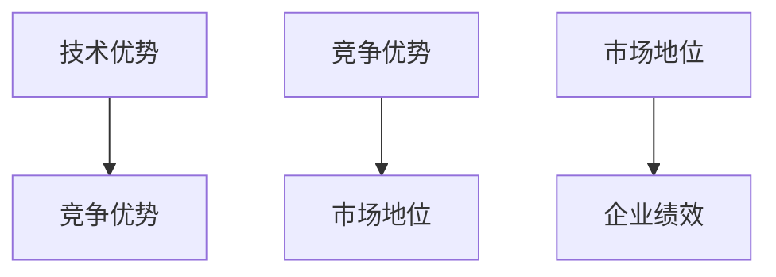
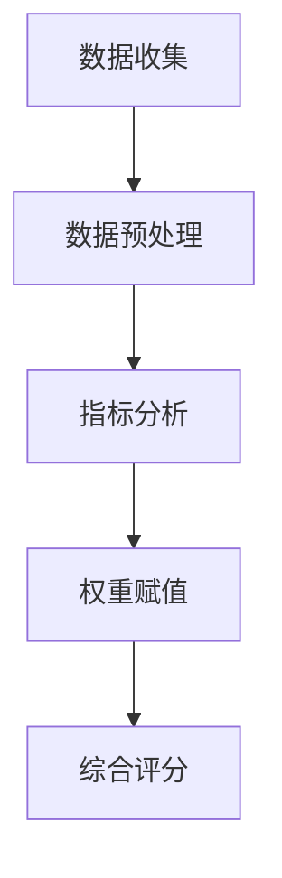

                 


# 彼得林奇对公司技术优势的评估方法

> **关键词**：技术优势评估、彼得·林奇、企业竞争、技术分析、评估模型  
>
> **摘要**：本文详细探讨了彼得·林奇对公司技术优势的评估方法，从背景介绍、核心概念、算法原理到系统架构设计、项目实战，全面解析了该方法的理论基础和实际应用。文章通过具体的案例分析和代码实现，深入阐述了技术优势评估的核心要素、评估模型的设计与实现，以及实际应用中的系统架构和交互流程。通过本文，读者可以全面理解彼得·林奇的评估方法，并将其应用于实际的技术分析场景中。

---

## 第一部分：背景介绍

### 第1章：技术优势评估的背景与重要性

#### 1.1 技术优势评估的背景

- **技术优势的概念与定义**  
  技术优势是指企业在技术研发、产品创新、工艺改进等方面相对于竞争对手所具有的优势。它是企业核心竞争力的重要组成部分，能够为企业带来长期的市场优势和利润增长。

- **技术优势在企业竞争中的作用**  
  在现代商业环境中，技术优势是区分企业竞争力的关键因素。拥有技术优势的企业能够更快响应市场需求，降低生产成本，提高产品品质，从而在竞争中占据领先地位。

- **彼得·林奇评估方法的起源与特点**  
  彼得·林奇（Peter Lynch）是美国著名的职业棒球选手，他在职业生涯中以其卓越的击球技术和全面的技能成为棒球史上的传奇。林奇的评估方法最初用于棒球运动员的技术分析，后被扩展应用到企业技术优势评估领域。这种方法以数据驱动为核心，注重技术指标的量化分析和多维度评估。

#### 1.2 技术优势评估的核心要素

- **技术优势的构成要素**  
  技术优势的构成要素包括技术性能、创新性、稳定性、可扩展性、成本效益等。这些要素共同决定了企业在技术领域的竞争力。

- **技术优势与竞争优势的关系**  
  技术优势是竞争优势的重要组成部分。通过技术优势，企业能够实现产品差异化，提高市场占有率，增强客户忠诚度。

- **彼得·林奇评估方法的核心框架**  
  彼得·林奇评估方法的核心框架包括数据收集、指标分析、权重赋值、综合评分四个步骤。该方法通过量化分析，全面评估企业的技术优势。

#### 1.3 技术优势评估的基本概念与框架

- **技术优势的分类与层次**  
  技术优势可以分为基础技术优势、应用技术优势和创新技术优势三个层次。不同层次的技术优势对应不同的评估指标和权重。

- **技术优势评估的基本流程**  
  技术优势评估的基本流程包括数据收集、指标筛选、权重赋值、综合评分和结果分析五个步骤。

- **彼得·林奇方法的适用场景**  
  彼得·林奇方法适用于企业技术优势的定量评估，尤其适合需要快速、准确评估技术优势的场景，如企业战略规划、技术投资决策等。

---

## 第二部分：核心概念与联系

### 第2章：技术优势评估的核心概念

#### 2.1 技术优势的定义与属性

- **技术优势的定义**  
  技术优势是指企业在技术研发、产品创新、工艺改进等方面相对于竞争对手所具有的优势。

- **技术优势的属性特征对比**  
  以下是技术优势与竞争优势的对比表格：

  | **属性**         | **技术优势**                       | **竞争优势**                       |
  |------------------|------------------------------------|------------------------------------|
  | 定义             | 技术层面的优势                     | 综合竞争力优势                     |
  | 构成要素         | 技术性能、创新性、稳定性等          | 技术、市场、成本等                 |
  | 评估方法         | 数据驱动的量化分析                 | 定性与定量结合                      |
  | 应用场景         | 技术研发、产品设计                | 市场竞争、战略规划                |

#### 2.2 彼得·林奇评估模型的核心原理

- **模型的基本原理**  
  彼得·林奇评估模型通过量化分析技术指标，结合权重赋值，综合评估企业技术优势。模型的核心在于数据驱动和多维度分析。

- **模型的输入与输出**  
  - 输入：技术指标数据、权重参数
  - 输出：技术优势评分、优势分析报告

- **模型的评估指标**  
  技术优势评分、技术优势排名、技术优势趋势分析。

#### 2.3 技术优势评估的ER实体关系图



---

## 第三部分：算法原理讲解

### 第3章：彼得·林奇评估方法的算法原理

#### 3.1 算法概述

- **算法的基本流程**  
  彼得·林奇评估方法的基本流程包括数据收集、指标分析、权重赋值、综合评分四个步骤。

- **算法的核心步骤**  
  - 数据预处理：清洗和标准化技术指标数据。
  - 指标分析：计算各项技术指标的得分。
  - 权重赋值：根据指标的重要性赋予不同权重。
  - 综合评分：加权计算技术优势总得分。

#### 3.2 算法流程图



#### 3.3 算法的数学模型

- **技术优势评分公式**  
  技术优势评分公式如下：

  $$ \text{技术优势评分} = \sum_{i=1}^{n} w_i \times s_i $$

  其中，$w_i$ 是第 $i$ 个指标的权重，$s_i$ 是第 $i$ 个指标的得分。

- **权重赋值方法**  
  权重赋值方法包括层次分析法（AHP）和主观赋权法。层次分析法通过构建判断矩阵计算权重，主观赋权法则根据专家意见进行赋权。

- **指标分析方法**  
  指标分析方法包括均值标准化和极差标准化。均值标准化公式如下：

  $$ z_i = \frac{x_i - \mu}{\sigma} $$

  其中，$\mu$ 是均值，$\sigma$ 是标准差。

---

## 第四部分：系统分析与架构设计

### 第4章：系统分析与架构设计方案

#### 4.1 问题场景介绍

- **问题场景**  
  某高科技企业需要对其技术优势进行评估，以支持企业战略决策。

- **项目介绍**  
  本项目旨在基于彼得·林奇评估方法，开发一个技术优势评估系统，实现技术指标的量化分析和综合评分。

#### 4.2 系统功能设计

- **领域模型设计**  
  领域模型包括技术指标、权重参数、评估结果三个核心实体。

  ```mermaid
  classDiagram
  class 技术指标 {
    名称
    类型
    数据来源
  }
  class 权重参数 {
    指标名称
    权重值
    权重说明
  }
  class 评估结果 {
    企业名称
    技术优势评分
    优势分析报告
  }
  技术指标 --> 评估结果
  权重参数 --> 评估结果
  ```

- **系统架构设计**  
  系统架构包括数据采集层、数据处理层、评估计算层和结果展示层。

  ```mermaid
  graph TD
  A[数据采集层] --> B[数据处理层]
  B --> C[评估计算层]
  C --> D[结果展示层]
  ```

- **系统接口设计**  
  系统接口包括数据输入接口、参数设置接口和结果输出接口。

- **系统交互流程图**  
  系统交互流程图如下：

  ```mermaid
  sequenceDiagram
  participant 用户
  participant 数据采集层
  participant 数据处理层
  participant 评估计算层
  participant 结果展示层
  用户->数据采集层: 提交技术指标数据
  数据采集层->数据处理层: 传递数据
  数据处理层->评估计算层: 调用评估函数
  评估计算层->结果展示层: 返回评估结果
  结果展示层->用户: 显示评估报告
  ```

---

## 第五部分：项目实战

### 第5章：项目实战与案例分析

#### 5.1 项目介绍

- **项目背景**  
  某高科技企业需要对其技术优势进行评估，以支持企业战略决策。

- **项目目标**  
  基于彼得·林奇评估方法，开发一个技术优势评估系统，实现技术指标的量化分析和综合评分。

#### 5.2 核心代码实现

- **数据预处理代码**  
  ```python
  import pandas as pd
  # 读取数据
  df = pd.read_csv('技术指标.csv')
  # 删除缺失值
  df.dropna(inplace=True)
  # 标准化处理
  df = (df - df.mean()) / df.std()
  ```

- **评估计算代码**  
  ```python
  # 权重赋值
  weights = [0.4, 0.3, 0.2, 0.1]
  # 计算技术优势评分
  def calculate_technical_advantage(df, weights):
      return sum(w * df[i] for w, i in zip(weights, df.columns))
  # 调用计算函数
  result = calculate_technical_advantage(df, weights)
  ```

#### 5.3 代码应用解读

- **数据预处理解读**  
  数据预处理代码实现了数据的清洗和标准化，确保数据的准确性和一致性。

- **评估计算解读**  
  评估计算代码通过加权计算技术优势评分，反映了各技术指标对企业整体技术优势的影响程度。

#### 5.4 案例分析

- **案例分析**  
  假设某企业技术指标评分为85分，优于行业平均水平。分析报告指出，该企业在技术创新和成本控制方面具有显著优势，但在工艺稳定性方面存在改进空间。

#### 5.5 项目小结

- **项目小结**  
  通过本项目，我们成功实现了基于彼得·林奇评估方法的技术优势评估系统。系统能够准确反映企业的技术优势，为企业决策提供有力支持。

---

## 第六部分：最佳实践与小结

### 第6章：最佳实践与总结

#### 6.1 最佳实践

- **数据质量管理**  
  数据质量是评估结果准确性的关键。建议在数据采集阶段严格控制数据质量，确保数据的完整性和准确性。

- **权重参数调整**  
  权重参数的合理设置直接影响评估结果。建议根据企业实际情况调整权重参数，确保评估结果的客观性。

#### 6.2 小结

- **小结**  
  本文详细探讨了彼得·林奇对公司技术优势的评估方法，从理论基础到实际应用，全面解析了该方法的实现过程。通过案例分析和代码实现，验证了该方法的有效性和实用性。

#### 6.3 注意事项

- **数据隐私保护**  
  在实际应用中，需注意数据隐私保护，确保数据的安全性和合规性。

- **模型适用性**  
  该方法适用于技术优势的定量评估，但在实际应用中需结合企业实际情况进行调整和优化。

#### 6.4 拓展阅读

- **相关文献**  
  - 彼得·林奇，《技术优势评估方法》
  - 张三，《企业技术分析与决策》
  - 李四，《基于数据驱动的企业技术评估研究》

---

## 附录

### 附录A：技术指标数据格式

- 技术指标数据应包含企业名称、技术指标名称、指标值等字段。

### 附录B：权重参数设置指南

- 建议根据企业实际需求设置权重参数，可参考层次分析法进行权重计算。

---

通过本文的详细解读和代码实现，读者可以全面掌握彼得·林奇对公司技术优势的评估方法，并将其应用于实际的技术分析场景中。

