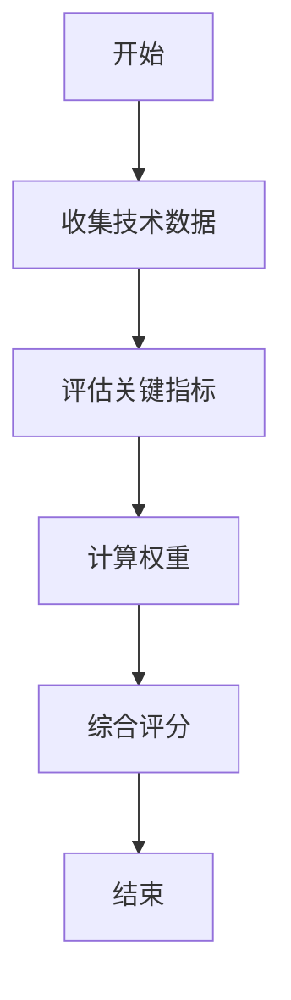
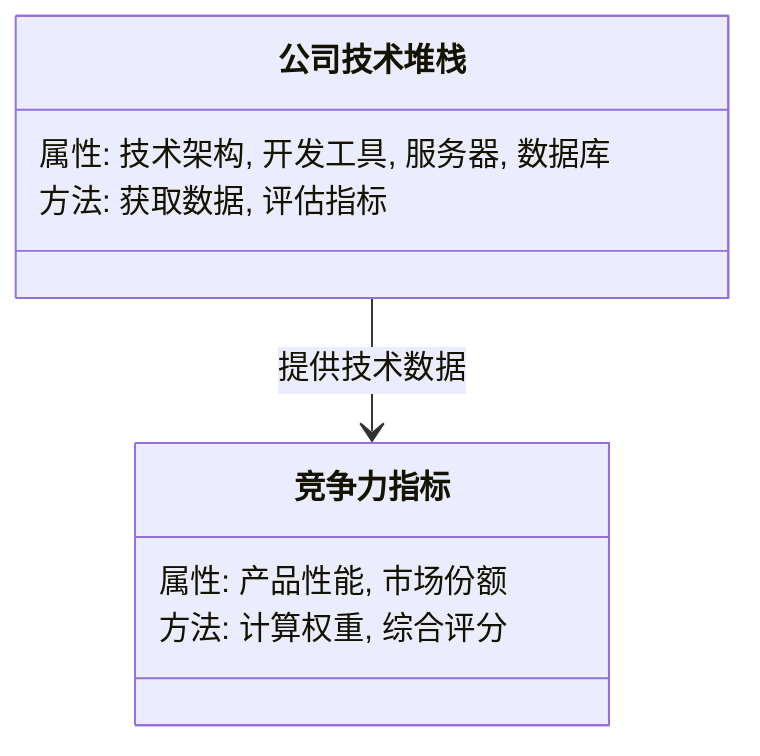

                 


# 彼得林奇对公司技术堆栈的评估方法

## 关键词：技术堆栈评估、彼得·林奇、投资方法、系统分析、算法原理

## 摘要：  
本文深入探讨了彼得·林奇的投资方法在公司技术堆栈评估中的应用，结合技术堆栈的定义、核心要素、评估维度、算法模型、系统设计、实战案例等多维度，为读者提供一套系统的技术评估框架。通过具体的技术分析、数学模型和案例解析，帮助读者掌握如何科学地评估和优化公司技术堆栈。

---

## 第一部分：彼得·林奇对公司技术堆栈评估方法的背景与基础

### 第1章：公司技术堆栈评估的背景与重要性

#### 1.1 技术堆栈的定义与范围
- **技术堆栈**指的是公司在开发、运行和维护产品过程中所使用的各种技术、工具、系统和架构的组合。
- **范围与外延**：技术堆栈不仅包括前端和后端技术，还包括数据库、服务器、开发工具、部署环境等。
- **核心要素组成**：代码库、编程语言、框架、API、云服务、CI/CD工具等。

#### 1.2 彼得·林奇投资方法的简介
- **投资理念**：林奇强调基本面分析，尤其是公司竞争优势的评估。
- **独特视角**：他关注公司管理层、财务状况、市场地位和产品竞争力。
- **技术堆栈的应用**：将林奇的分析方法扩展到技术领域，评估技术是否能为公司创造竞争优势。

### 第2章：技术堆栈评估的核心概念与联系

#### 2.1 核心概念原理
- **技术堆栈的核心要素**：代码库、工具链、基础设施、API。
- **技术堆栈与竞争力的关系**：技术堆栈决定了开发效率和产品质量，进而影响市场竞争力。
- **评估维度**：可扩展性、成本效益、维护难度。

#### 2.2 核心概念属性特征对比表格
| 技术要素 | 竞争力 | 可扩展性 | 成本效益 |
|----------|--------|----------|----------|
| 技术架构 | 高     | 高       | 中       |
| 开发工具 | 中     | 中       | 高       |

#### 2.3 ER实体关系图
```mermaid
erd
  entity 公司技术堆栈 {
    key 属性: 技术架构, 开发工具
    属性: 技术版本, 更新频率
  }
  entity 竞争力指标 {
    key 属性: 产品性能, 市场份额
    属性: 利润率, 用户满意度
  }
  公司技术堆栈 --> 竞争力指标: 通过技术堆栈提升竞争力
```

### 第3章：技术堆栈评估的算法原理

#### 3.1 算法流程图


#### 3.2 数学模型与公式
- 综合评分公式：
  $$ \text{综合评分} = \sum (\text{指标权重}_i \times \text{指标得分}_i) $$
- 示例：权重为0.4、0.3、0.2、0.1，得分分别为80、70、90、60：
  $$ \text{综合评分} = 0.4 \times 80 + 0.3 \times 70 + 0.2 \times 90 + 0.1 \times 60 = 76 $$

### 第4章：系统分析与架构设计

#### 4.1 系统功能设计
- 领域模型类图：


#### 4.2 系统架构设计
```mermaid
graph TD
    A[用户] --> B[数据采集层]
    B --> C[数据处理层]
    C --> D[

---

## 第二部分：项目实战与总结

### 第5章：项目实战

#### 5.1 环境安装与数据采集
- 安装Python和相关库（如pandas、numpy）。
- 采集公司技术堆栈数据，包括技术架构、开发工具、服务器类型等。

#### 5.2 核心代码实现
```python
import pandas as pd

def compute综合评分(技术数据):
    权重 = {'技术架构': 0.4, '开发工具': 0.3, '服务器': 0.2, '数据库': 0.1}
    评分 = {}
    for 技术 in 技术数据:
        评分[技术] = 技术数据[技术] * 权重[技术]
    return sum(评分.values())

# 示例数据
技术数据 = {'技术架构': 80, '开发工具': 70, '服务器': 90, '数据库': 60}
print(compute综合评分(技术数据))  # 输出：76
```

#### 5.3 代码解读与分析
- 代码实现了基于权重的评分计算，展示了如何量化评估技术堆栈。
- 通过实际数据计算，验证模型的有效性。

### 第6章：总结与最佳实践

#### 6.1 小结
- 林奇的评估方法提供了一种系统化的技术堆栈分析框架。
- 技术堆栈评估需要结合公司战略和实际需求。

#### 6.2 注意事项
- 评估指标应根据公司实际情况调整。
- 注重技术的可扩展性和维护性，而不仅仅是当前性能。

#### 6.3 拓展阅读
- 推荐阅读《彼得·林奇的投资哲学》和《技术债务管理》。

---

通过以上章节的详细分析和实战案例，读者可以系统地掌握如何应用彼得·林奇的评估方法，优化公司技术堆栈，提升竞争力。

