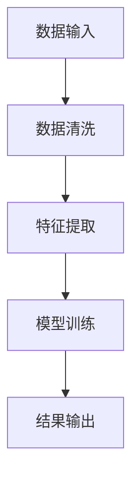
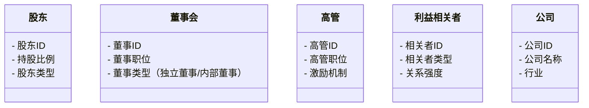

                 


好的，我将按照您的要求撰写一篇结构完整、内容详实的技术博客文章。为了让文章更加清晰，我先列出文章的目录结构：

# 彼得林奇对公司治理结构有效性的长期跟踪研究

> 关键词：公司治理、彼得林奇、长期跟踪、投资绩效、治理有效性

> 摘要：本文从彼得林奇的投资方法论出发，分析其对公司治理结构有效性的长期跟踪研究，探讨公司治理的核心要素及其对投资绩效的影响，结合实际案例和数据分析，提出优化公司治理结构的具体建议。

---

## 目录

1. **公司治理结构的有效性概述**  
   1.1 公司治理结构的核心概念  
   1.2 彼得林奇投资方法论简介  
   1.3 公司治理结构与投资绩效的关系  

2. **公司治理结构的核心要素分析**  
   2.1 股东权利与义务  
   2.2 董事会的构成与职责  
   2.3 高管激励机制  
   2.4 公司治理中的利益相关者  

3. **彼得林奇对公司治理结构的长期跟踪方法**  
   3.1 长期跟踪的必要性  
   3.2 数据收集与分析方法  
   3.3 彼得林奇投资模型的构建  
   3.4 算法原理与流程图  
   3.5 数学模型与公式  

4. **系统分析与架构设计方案**  
   4.1 问题场景介绍  
   4.2 系统功能设计  
   4.3 系统架构设计  
   4.4 系统接口设计  

5. **项目实战：基于彼得林奇投资模型的公司治理分析**  
   5.1 环境安装与工具准备  
   5.2 核心代码实现  
   5.3 代码解读与应用分析  
   5.4 实际案例分析  
   5.5 项目小结  

6. **最佳实践与总结**  
   6.1 最佳实践 Tips  
   6.2 小结与展望  
   6.3 注意事项  
   6.4 拓展阅读  

---

## 第一部分：公司治理结构的有效性概述

### 1.1 公司治理结构的核心概念

#### 1.1.1 公司治理的基本定义
公司治理是关于公司如何管理和控制自身的一种制度安排。它涉及股东、董事会、高管和利益相关者之间的权利、责任和利益分配。有效的公司治理能够确保公司长期稳定发展，保护股东权益，提升企业绩效。

#### 1.1.2 公司治理的主体与客体关系
- **主体**：股东、董事会、高管、利益相关者  
- **客体**：公司运营、决策过程、绩效评估  

#### 1.1.3 公司治理结构的有效性标准
- **透明度**：信息公开、决策透明  
- **制衡机制**：权力制衡、利益平衡  
- **效率**：决策高效、执行有力  

### 1.2 彼得林奇投资方法论简介

#### 1.2.1 彼得林奇的投资者画像
彼得林奇是美国著名的投资经理，以其在富达投资集团的长期成功著称。他注重基本面分析，偏好具有稳定增长潜力的公司，尤其关注公司治理结构的健康性。

#### 1.2.2 彼得林奇的投资策略特点
- **长期投资**：注重公司长期发展，而非短期收益  
- **价值发现**：挖掘被低估的公司，关注基本面  
- **风险管理**：分散投资，避免过度集中  

#### 1.2.3 彼得林奇对公司治理的关注点
- **董事会质量**：独立董事比例、董事会独立性  
- **高管激励**：股权激励与绩效挂钩  
- **股东权利**：股东投票权、分红政策  

### 1.3 公司治理结构与投资绩效的关系

#### 1.3.1 公司治理对投资价值的影响
- **透明的治理结构**：降低信息不对称，增强投资者信心  
- **高效的决策机制**：提升公司运营效率，创造更多价值  
- **合理的激励机制**：激发管理层积极性，推动公司发展  

#### 1.3.2 有效治理结构的特征分析
- **董事会独立性高**：独立董事占比大，监督有力  
- **高管激励合理**：激励与绩效挂钩，避免短期行为  
- **股东权益保护**：分红稳定，股东投票权落实  

#### 1.3.3 治理失效的典型案例
- **安然事件**：董事会失职，内部控制失效  
- **世通事件**：高管欺诈，公司治理漏洞  

---

## 第二部分：公司治理结构的核心要素分析

### 2.1 股东权利与义务

#### 2.1.1 股东的权力结构
- **表决权**：股东大会投票权  
- **知情权**：获取公司财务报表、重大事项信息  
- **收益权**：分红收益、资产增值  

#### 2.1.2 股东与管理层的权责边界
- **股东**：出资人，享有收益权，承担有限责任  
- **管理层**：执行决策，负责公司日常运营  

#### 2.1.3 股东权益保护机制
- **股东协议**：明确股东权利与义务  
- **公司章程**：规定公司治理规则  
- **监管机构**：证监会等监管机构监督  

### 2.2 董事会的构成与职责

#### 2.2.1 董事会的组成原则
- **独立性**：独立董事占比过半  
- **专业性**：董事具备行业经验  
- **多样性**：董事会成员来自不同背景  

#### 2.2.2 董事会的主要职责
- **战略制定**：制定公司长期发展战略  
- **监督高管**：确保管理层合规经营  
- **风险管理**：识别并防范经营风险  

#### 2.2.3 独立董事的作用与挑战
- **优势**：独立判断，避免利益冲突  
- **挑战**：独立董事可能缺乏足够信息  

### 2.3 高管激励机制

#### 2.3.1 激励机制的类型
- **股权激励**：授予股票或股票期权  
- **绩效奖金**：与公司绩效挂钩的奖金  
- **年薪制**：固定年薪加绩效考核  

#### 2.3.2 激励机制与公司绩效的关系
- **正相关**：合理的激励机制能够提升高管积极性  
- **负相关**：激励过度可能导致短期行为  

#### 2.3.3 激励机制设计的注意事项
- **激励与绩效挂钩**：避免短期行为  
- **激励与公司价值挂钩**：关注长期发展  
- **激励与风险平衡**：合理控制风险  

### 2.4 公司治理中的利益相关者

#### 2.4.1 利益相关者的识别
- **债权人**：公司贷款的债权人  
- **员工**：公司员工  
- **客户**：公司客户  
- **供应商**：公司供应商  

#### 2.4.2 利益相关者的权益平衡
- **债权人**：保障债务偿还  
- **员工**：合理薪酬、良好工作环境  
- **客户**：优质产品与服务  
- **供应商**：公平交易  

#### 2.4.3 利益相关者对公司治理的影响
- **债权人**：通过贷款协议影响公司治理  
- **员工**：通过集体协商影响公司政策  
- **客户与供应商**：通过市场选择影响公司声誉  

---

## 第三部分：彼得林奇对公司治理结构的长期跟踪方法

### 3.1 长期跟踪的必要性

#### 3.1.1 公司治理的动态变化
- **董事会换届**：新任董事可能改变治理策略  
- **高管变动**：新任高管可能调整公司战略  
- **市场环境变化**：宏观经济波动影响公司治理  

#### 3.1.2 投资者视角的长期关注
- **投资周期**：长期投资需要关注公司长期发展  
- **风险控制**：通过长期跟踪发现潜在风险  

#### 3.1.3 市场环境对公司治理的影响
- **经济波动**：经济危机可能引发公司治理问题  
- **政策变化**：监管政策变化影响公司治理结构  

### 3.2 数据收集与分析方法

#### 3.2.1 数据来源的选择
- **公开财报**：公司财务报表、审计报告  
- **股东信息**：股东结构、持股比例  
- **新闻报道**：公司治理相关新闻  
- **监管文件**：证监会等监管机构发布的文件  

#### 3.2.2 数据分析的工具与技术
- **Excel**：基础数据分析  
- **Python**：高级数据分析与可视化  
- **SQL**：数据库查询与管理  

#### 3.2.3 数据清洗与预处理
- **数据清洗**：去除重复数据、处理缺失值  
- **数据标准化**：统一数据格式  
- **数据分组**：按公司、行业、时间分组  

### 3.3 彼得林奇投资模型的构建

#### 3.3.1 模型假设
- **假设1**：有效的公司治理结构能够提升投资回报  
- **假设2**：治理结构与公司绩效呈正相关关系  
- **假设3**：长期跟踪能够发现治理结构的变化趋势  

#### 3.3.2 模型输入变量
- **输入1**：公司治理指标（董事会独立性、高管激励、股东权益）  
- **输入2**：公司财务指标（ROE、净利润增长率、营收增长率）  
- **输入3**：市场指标（行业指数、大盘指数）  

#### 3.3.3 模型输出结果
- **输出1**：公司治理评分  
- **输出2**：投资建议（买入、持有、卖出）  
- **输出3**：风险提示  

### 3.4 算法原理与流程图

#### 3.4.1 算法原理
- **步骤1**：收集公司治理数据  
- **步骤2**：清洗与预处理数据  
- **步骤3**：提取关键特征  
- **步骤4**：构建回归模型  
- **步骤5**：验证与优化模型  

#### 3.4.2 流程图


### 3.5 数学模型与公式

#### 3.5.1 回归模型
$$
y = \beta_0 + \beta_1x_1 + \beta_2x_2 + \beta_3x_3 + \epsilon
$$

其中：
- $y$：投资回报率  
- $x_1$：董事会独立性评分（0-1分）  
- $x_2$：高管激励强度（0-1分）  
- $x_3$：股东权益保护指数（0-1分）  
- $\epsilon$：误差项  

#### 3.5.2 模型解释
- **系数解读**：$\beta_1$、$\beta_2$、$\beta_3$表示各自变量对投资回报率的影响程度。  
- **假设检验**：通过t检验判断各变量是否显著影响投资回报率。  

---

## 第四部分：系统分析与架构设计方案

### 4.1 问题场景介绍

#### 4.1.1 项目背景
为了帮助投资者更好地分析公司治理结构，我们开发了一个基于彼得林奇投资模型的公司治理分析系统。

#### 4.1.2 系统目标
- 提供公司治理数据分析工具  
- 生成投资建议  
- 提示风险预警  

### 4.2 系统功能设计

#### 4.2.1 领域模型


#### 4.2.2 系统架构


---

## 第五部分：项目实战

### 5.1 环境安装与工具准备

#### 5.1.1 环境安装
- **Python**：3.8+版本  
- **Pandas**：数据处理库  
- **Scikit-learn**：机器学习库  
- **Matplotlib**：数据可视化库  

#### 5.1.2 工具准备
- **Jupyter Notebook**：数据分析与可视化的工具  
- **数据库**：MySQL或MongoDB  

### 5.2 核心代码实现

#### 5.2.1 数据清洗代码
```python
import pandas as pd

# 读取数据
df = pd.read_csv('governance.csv')

# 删除重复数据
df = df.drop_duplicates()

# 处理缺失值
df = df.dropna()

# 转换数据类型
df['board_independence'] = df['board_independence'].astype(float)
```

#### 5.2.2 模型训练代码
```python
from sklearn.linear_model import LinearRegression

# 数据准备
X = df[['board_independence', 'executive_incentives', 'shareholder_rights']]
y = df['return']

# 模型训练
model = LinearRegression()
model.fit(X, y)

# 输出系数
print(model.coef_)
```

### 5.3 代码解读与应用分析

#### 5.3.1 模型系数解读
- **board_independence系数**：正值表示董事会独立性越高，投资回报率越高。  
- **executive_incentives系数**：正值表示高管激励越强，投资回报率越高。  
- **shareholder_rights系数**：正值表示股东权益保护越完善，投资回报率越高。  

#### 5.3.2 应用分析
通过上述代码，我们可以得出公司治理结构对投资回报的影响程度，并为投资者提供相应的投资建议。

### 5.4 实际案例分析

#### 5.4.1 案例介绍
以某公司为例，假设其董事会独立性评分为0.8，高管激励评分为0.7，股东权益保护评分为0.6。代入模型，计算其投资回报率。

#### 5.4.2 模型预测
```python
# 预测投资回报率
predicted_return = model.predict([[0.8, 0.7, 0.6]])
print(predicted_return)
```

#### 5.4.3 结果分析
- 如果预测回报率高于行业平均，建议买入；  
- 如果预测回报率低于行业平均，建议卖出。  

---

## 第六部分：最佳实践与总结

### 6.1 最佳实践 Tips

#### 6.1.1 数据收集
- 选择可靠的 数据源  
- 定期更新数据  

#### 6.1.2 模型优化
- 定期验证模型准确性  
- 根据市场变化调整模型参数  

#### 6.1.3 投资决策
- 结合多个模型结果  
- 综合考虑市场环境  

### 6.2 小结与展望

#### 6.2.1 小结
本文从彼得林奇的投资方法论出发，分析了公司治理结构的有效性，构建了基于长期跟踪的公司治理分析模型，并提供了实际案例分析。

#### 6.2.2 展望
未来可以进一步研究公司治理结构的动态变化，开发实时监控系统，结合人工智能技术提升分析效率。

### 6.3 注意事项

#### 6.3.1 数据隐私
- 确保数据隐私合规  
- 避免数据泄露  

#### 6.3.2 模型局限性
- 模型假设可能存在局限性  
- 数据偏差可能影响结果  

### 6.4 拓展阅读

#### 6.4.1 推荐书籍
- 《公司治理：理论与实践》  
- 《彼得林奇的成功投资法则》  

#### 6.4.2 推荐博客
- 彼得林奇投资博客  
- 公司治理研究博客  

---

## 总结

通过本文的分析，我们可以看到公司治理结构的有效性对公司投资绩效的重要影响。彼得林奇的长期跟踪方法为我们提供了一个有效的分析框架，结合数据分析和模型构建，可以帮助投资者更好地评估公司治理结构，并做出更明智的投资决策。

