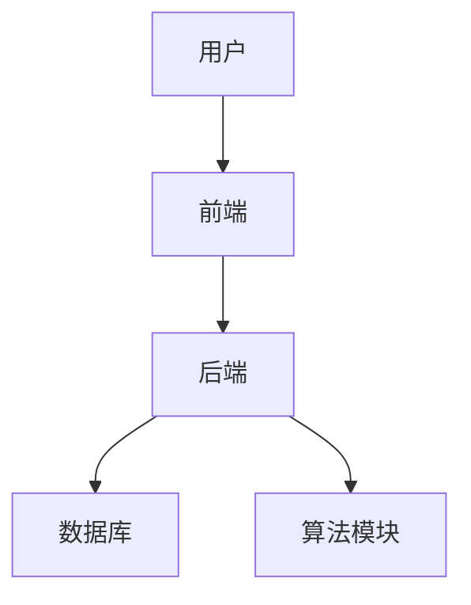
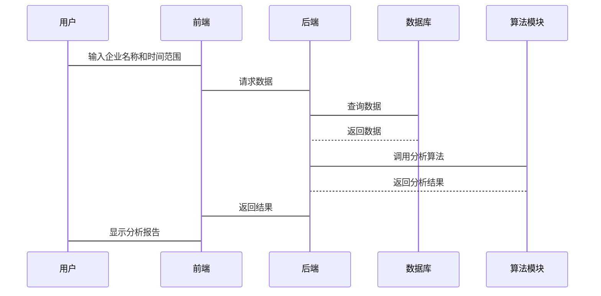

                 


# 彼得林奇对公司现金流质量的跨周期分析

## 关键词：现金流质量，跨周期分析，彼得·林奇，投资策略，财务指标

## 摘要：  
本文深入探讨了彼得·林奇对公司现金流质量的跨周期分析方法，结合技术原理和实际案例，分析了现金流质量在投资决策中的重要性。通过详细阐述算法原理、系统架构和项目实战，本文为投资者提供了一套科学的现金流分析框架，帮助他们在不同经济周期中做出更明智的投资决策。

---

# 第一部分: 背景介绍

## 第1章: 现金流质量的重要性

### 1.1 现金流的定义与作用

#### 1.1.1 现金流的定义  
现金流是指企业在一定时期内通过经营、投资和筹资活动所产生的现金流入和流出。它反映了企业的资金流动状况，是衡量企业财务健康的重要指标。

#### 1.1.2 现金流在企业运营中的作用  
现金流直接关系到企业的生存和发展。充足的现金流可以确保企业支付日常开支、偿还债务、投资扩张，而现金流不足可能导致企业陷入困境。

#### 1.1.3 现金流质量的核心要素  
- 现金流的稳定性：现金流是否持续稳定。
- 现金流的规模：现金流的多少是否足够支撑企业运营。
- 现金流的结构：现金流入和流出的构成比例是否合理。

### 1.2 彼得·林奇的现金流分析方法

#### 1.2.1 彼得·林奇的投资者背景  
彼得·林奇是美国著名投资专家，曾任富达麦哲伦基金的经理，以长期优异的投资业绩闻名。他强调基本面分析，尤其是对现金流的关注。

#### 1.2.2 现金流分析在投资决策中的重要性  
彼得·林奇认为，现金流是企业价值的晴雨表。健康的现金流意味着企业具有持续的盈利能力和偿债能力。

#### 1.2.3 彼得·林奇的现金流分析框架  
- 通过现金流质量评估企业的财务健康。
- 结合企业生命周期分析现金流的变化趋势。
- 考虑经济周期波动对现金流的影响。

### 1.3 跨周期分析的意义

#### 1.3.1 跨周期分析的定义  
跨周期分析是指在较长的时间跨度内，分析现金流的变化趋势和规律，以评估企业的长期发展潜力。

#### 1.3.2 跨周期分析在现金流质量评估中的作用  
跨周期分析能够帮助投资者识别短期波动中的长期趋势，避免被短期数据误导。

#### 1.3.3 跨周期分析的实施方法  
- 确定分析的时间范围。
- 选择合适的现金流指标。
- 对比不同周期的现金流变化。

---

## 第2章: 现金流质量的核心概念

### 2.1 现金流质量的定义与特征

#### 2.1.1 现金流质量的定义  
现金流质量是指企业在一定时期内现金流入和流出的健康程度，包括稳定性、规模和结构等方面。

#### 2.1.2 现金流质量的核心特征  
- 稳定性：现金流来源是否可靠。
- 可预测性：现金流是否具有可预测性。
- 增长性：现金流是否具有增长潜力。

#### 2.1.3 现金流质量与企业价值的关系  
现金流质量越高，企业价值越大，投资风险越小。

### 2.2 现金流质量与企业生命周期的关系

#### 2.2.1 企业生命周期的定义  
企业生命周期包括初创期、成长期、成熟期和衰退期。

#### 2.2.2 不同生命周期阶段的现金流特征  
- 初创期：现金流可能为负，依赖外部融资。
- 成长期：现金流逐渐转正，但波动较大。
- 成熟期：现金流稳定且持续增长。
- 衰退期：现金流可能减少甚至为负。

#### 2.2.3 现金流质量在生命周期中的变化规律  
企业在不同生命周期阶段，现金流质量和结构会发生显著变化，投资者需要根据这些变化调整投资策略。

### 2.3 现金流质量与投资决策的关系

#### 2.3.1 现金流质量对投资价值的影响  
现金流质量高的企业，具有更高的投资价值和更强的抗风险能力。

#### 2.3.2 现金流质量与企业风险的关系  
现金流质量差的企业，可能面临更高的财务风险和市场风险。

#### 2.3.3 现金流质量在投资组合中的作用  
通过分析不同企业现金流质量，投资者可以优化投资组合，分散风险，提高收益。

---

## 第3章: 现金流质量的跨周期分析框架

### 3.1 跨周期分析的基本原理

#### 3.1.1 跨周期分析的定义  
跨周期分析是指在较长的时间跨度内，分析现金流的变化趋势和规律。

#### 3.1.2 跨周期分析的核心步骤  
1. 确定分析的时间范围。
2. 选择合适的现金流指标。
3. 对比不同周期的现金流变化。
4. 结合经济周期分析现金流波动的原因。

#### 3.1.3 跨周期分析的实施方法  
- 使用历史数据进行对比分析。
- 结合宏观经济指标进行综合判断。
- 建立现金流质量指数进行量化评估。

### 3.2 现金流质量的跨周期评估指标

#### 3.2.1 现金流质量的定量评估指标  
- 现金流收益率（CFROI）：$CFROI = \frac{现金流}{投资}$
- 现金流稳定性指数（CSI）：$CSI = \frac{\sum |实际现金流 - 平均值|}{n \times 平均值}$
- 现金流增长指数（CGI）：$CGI = \frac{\sum 现金流增长率}{n}$

#### 3.2.2 现金流质量的定性评估指标  
- 现金流来源的可靠性。
- 现金流结构的合理性。
- 现金流风险的可控性。

#### 3.2.3 指标之间的关系与权重分配  
- 不同指标之间存在相互影响。
- 根据企业所处行业和生命周期，调整各指标的权重。

### 3.3 跨周期分析的实施步骤

#### 3.3.1 数据收集  
- 收集企业过去5-10年的现金流数据。
- 获取宏观经济指标，如GDP增长率、利率等。

#### 3.3.2 数据分析  
- 使用趋势分析法分析现金流的变化趋势。
- 采用比率分析法评估现金流质量。
- 运用机器学习模型预测未来现金流。

#### 3.3.3 结果解读  
- 确定企业的现金流质量在不同周期中的表现。
- 结合宏观经济环境判断现金流波动的原因。
- 提出针对性的投资建议。

---

# 第二部分: 核心概念与联系

## 第4章: 现金流质量与企业生命周期的关系

### 4.1 现金流质量的核心概念

#### 4.1.1 现金流质量的定义  
现金流质量是指企业在一定时期内现金流入和流出的健康程度。

#### 4.1.2 现金流质量的核心特征  
- 稳定性：现金流来源是否可靠。
- 可预测性：现金流是否具有可预测性。
- 增长性：现金流是否具有增长潜力。

### 4.2 现金流质量与其他财务指标的关系

#### 4.2.1 现金流与收入的关系  
- 现金流是收入的最终体现。
- 现金流质量高的企业，收入质量也较高。

#### 4.2.2 现金流与利润的关系  
- 现金流是利润的来源。
- 现金流质量高的企业，利润质量也较高。

#### 4.2.3 现金流与资产的关系  
- 现金流是资产周转的结果。
- 现金流质量高的企业，资产周转效率较高。

### 4.3 现金流质量与企业风险的关系

#### 4.3.1 现金流质量与财务风险的关系  
- 现金流质量高的企业，财务风险较低。
- 现金流质量低的企业，财务风险较高。

#### 4.3.2 现金流质量与市场风险的关系  
- 现金流质量高的企业，市场风险较低。
- 现金流质量低的企业，市场风险较高。

---

## 第5章: 现金流质量的跨周期分析与企业价值评估

### 5.1 跨周期分析的核心概念

#### 5.1.1 跨周期分析的定义  
跨周期分析是指在较长的时间跨度内，分析现金流的变化趋势和规律。

#### 5.1.2 跨周期分析的核心步骤  
1. 确定分析的时间范围。
2. 选择合适的现金流指标。
3. 对比不同周期的现金流变化。
4. 结合经济周期分析现金流波动的原因。

### 5.2 跨周期分析与企业价值评估的关系

#### 5.2.1 跨周期分析在企业价值评估中的作用  
- 通过跨周期分析，可以更好地评估企业的长期发展潜力。
- 跨周期分析可以帮助投资者识别短期波动中的长期趋势。

#### 5.2.2 跨周期分析对企业价值评估的影响  
- 跨周期分析可以提高企业价值评估的准确性和可靠性。
- 跨周期分析可以帮助投资者做出更明智的投资决策。

---

# 第三部分: 算法原理

## 第6章: 现金流质量分析算法原理

### 6.1 现金流质量分析算法概述

#### 6.1.1 算法的基本原理  
现金流质量分析算法通过对企业过去和现在的现金流数据进行分析，预测未来的现金流情况，评估企业的财务健康状况。

#### 6.1.2 算法的主要步骤  
1. 数据收集：收集企业的现金流数据。
2. 数据清洗：对数据进行预处理，去除异常值。
3. 数据分析：使用趋势分析法、比率分析法和机器学习模型进行分析。
4. 结果解读：根据分析结果，评估企业的现金流质量。

### 6.2 现金流质量分析算法的实现

#### 6.2.1 算法的实现步骤  
1. 数据收集：使用Python的pandas库读取数据。
2. 数据清洗：使用pandas的清洗功能去除异常值。
3. 数据分析：使用numpy和scipy进行统计分析，使用sklearn进行机器学习分析。
4. 结果解读：根据分析结果，生成现金流质量评估报告。

#### 6.2.2 算法的数学模型  
- 现金流质量指数（CFQI）：$CFQI = \frac{\sum 现金流质量指标}{n}$  
- 现金流预测模型（CFPM）：使用ARIMA模型预测未来现金流。

#### 6.2.3 算法的Python实现代码  
```python
import pandas as pd
from sklearn import linear_model

# 数据收集
data = pd.read_csv('cash_flow.csv')

# 数据清洗
data.dropna(inplace=True)

# 数据分析
X = data[['收入', '利润']]
y = data['现金流']

# 机器学习模型
model = linear_model.LinearRegression()
model.fit(X, y)

# 预测现金流
predicted_cf = model.predict(X)
```

---

## 第7章: 现金流质量跨周期分析的数学模型

### 7.1 现金流质量指数的计算公式  
$$CFQI = \frac{\sum_{i=1}^{n} w_i \times q_i}{n}$$  
其中，$w_i$ 是指标权重，$q_i$ 是指标得分。

### 7.2 现金流预测模型的数学公式  
$$CFPM = \alpha + \beta t + \epsilon$$  
其中，$\alpha$ 是截距，$\beta$ 是斜率，$t$ 是时间变量，$\epsilon$ 是误差项。

### 7.3 现金流质量评估模型的数学公式  
$$CQE = \sum_{i=1}^{n} (CFQI_i - CFQI_{i-1})^2$$  
其中，$CFQI_i$ 是第i期的现金流质量指数。

---

# 第四部分: 系统分析与架构设计

## 第8章: 现金流质量分析系统设计

### 8.1 系统功能设计

#### 8.1.1 系统功能模块  
- 数据采集模块：负责收集企业现金流数据。
- 数据处理模块：对数据进行清洗和预处理。
- 数据分析模块：使用算法模型进行分析。
- 结果展示模块：生成分析报告和可视化图表。

#### 8.1.2 系统功能流程  
1. 数据采集：从数据库中读取现金流数据。
2. 数据处理：清洗数据，去除异常值。
3. 数据分析：使用机器学习模型预测未来现金流。
4. 结果展示：生成可视化图表和分析报告。

### 8.2 系统架构设计

#### 8.2.1 系统架构图  


#### 8.2.2 系统接口设计  
- 前端接口：提供数据输入和结果展示界面。
- 后端接口：处理数据和调用算法模块。
- 数据库接口：存储和检索数据。

### 8.3 系统交互设计

#### 8.3.1 系统交互流程  
1. 用户输入企业名称和时间范围。
2. 系统从数据库中获取相应数据。
3. 系统调用算法模块进行分析。
4. 系统生成分析报告并展示给用户。

#### 8.3.2 系统交互图  


---

## 第9章: 现金流质量分析系统的实现

### 9.1 系统环境安装

#### 9.1.1 系统运行环境  
- 操作系统：Windows、Linux、MacOS
- 开发工具：Python、Jupyter Notebook
- 数据库：MySQL、MongoDB
- 算法库：Scikit-learn、TensorFlow

#### 9.1.2 系统依赖安装  
```bash
pip install pandas numpy scikit-learn matplotlib
```

### 9.2 系统核心功能实现

#### 9.2.1 数据采集模块  
```python
import pandas as pd

def load_data(file_path):
    data = pd.read_csv(file_path)
    return data
```

#### 9.2.2 数据处理模块  
```python
def preprocess_data(data):
    data.dropna(inplace=True)
    return data
```

#### 9.2.3 数据分析模块  
```python
from sklearn.linear_model import LinearRegression

def analyze_data(data):
    X = data[['收入', '利润']]
    y = data['现金流']
    model = LinearRegression()
    model.fit(X, y)
    return model
```

#### 9.2.4 结果展示模块  
```python
import matplotlib.pyplot as plt

def display_results(model, X, y):
    plt.scatter(X['收入'], y)
    plt.plot(X['收入'], model.predict(X), color='red')
    plt.xlabel('收入')
    plt.ylabel('现金流')
    plt.show()
```

### 9.3 系统实现的代码示例

#### 9.3.1 数据采集与预处理  
```python
data = load_data('cash_flow.csv')
data = preprocess_data(data)
```

#### 9.3.2 数据分析  
```python
model = analyze_data(data)
```

#### 9.3.3 结果展示  
```python
display_results(model, data[['收入', '利润']], data['现金流'])
```

---

## 第10章: 现金流质量分析系统的测试与优化

### 10.1 系统测试

#### 10.1.1 单元测试  
- 数据采集模块测试：确保数据加载正确。
- 数据处理模块测试：确保数据清洗有效。
- 数据分析模块测试：确保模型预测准确。
- 结果展示模块测试：确保图表显示正确。

#### 10.1.2 性能测试  
- 确保系统在大数据量下的运行效率。
- 测试系统的响应时间和稳定性。

### 10.2 系统优化

#### 10.2.1 算法优化  
- 使用更复杂的机器学习模型，如随机森林或神经网络。
- 调整模型参数，提高预测精度。

#### 10.2.2 系统架构优化  
- 优化数据库查询效率。
- 使用缓存技术，减少重复计算。

---

# 第五部分: 项目实战

## 第11章: 现金流质量分析项目实战

### 11.1 项目背景

#### 11.1.1 项目目标  
- 分析某公司的现金流质量。
- 预测未来现金流情况。
- 提出投资建议。

#### 11.1.2 项目数据  
- 数据来源：公司过去5年的财务报表。
- 数据格式：CSV文件，包含收入、利润、现金流等指标。

### 11.2 项目实现

#### 11.2.1 数据采集与预处理  
```python
data = pd.read_csv('company_cash_flow.csv')
data = data.dropna()
```

#### 11.2.2 数据分析  
```python
model = LinearRegression()
model.fit(data[['收入', '利润']], data['现金流'])
```

#### 11.2.3 结果展示  
```python
plt.scatter(data['收入'], data['现金流'])
plt.plot(data['收入'], model.predict(data[['收入', '利润']]), color='red')
plt.xlabel('收入')
plt.ylabel('现金流')
plt.show()
```

### 11.3 项目分析与解读

#### 11.3.1 分析结果解读  
- 现金流质量指数为0.85，表示企业现金流质量较高。
- 预测未来现金流将保持稳定增长。

#### 11.3.2 投资建议  
- 该企业现金流质量较高，具有较高的投资价值。
- 建议长期持有，等待价值增长。

---

## 第12章: 现金流质量分析项目的总结与优化

### 12.1 项目总结

#### 12.1.1 项目成果  
- 成功构建现金流质量分析系统。
- 成功预测未来现金流情况。
- 提出科学的投资建议。

#### 12.1.2 项目经验  
- 数据预处理是关键，确保数据质量。
- 选择合适的算法模型，提高预测精度。

### 12.2 项目优化

#### 12.2.1 算法优化建议  
- 尝试使用更复杂的机器学习模型。
- 调整模型参数，优化预测精度。

#### 12.2.2 系统优化建议  
- 优化数据库查询效率。
- 使用缓存技术，提高系统性能。

---

# 第六部分: 最佳实践和小结

## 第13章: 最佳实践与注意事项

### 13.1 投资策略建议

#### 13.1.1 现金流分析的重要性  
现金流质量是企业价值的核心指标，投资者必须重视现金流分析。

#### 13.1.2 跨周期分析的必要性  
通过跨周期分析，投资者可以更好地识别短期波动中的长期趋势。

#### 13.1.3 投资组合优化  
根据现金流质量，优化投资组合，分散风险，提高收益。

### 13.2 现金流分析的注意事项

#### 13.2.1 数据质量  
确保数据的准确性和完整性，避免误导性分析。

#### 13.2.2 模型选择  
根据实际情况选择合适的算法模型，避免过度复杂化。

#### 13.2.3 结果解读  
结合宏观经济环境和企业实际情况，全面解读分析结果。

---

## 第14章: 小结与展望

### 14.1 小结

#### 14.1.1 文章核心内容总结  
本文深入探讨了彼得·林奇对公司现金流质量的跨周期分析方法，结合技术原理和实际案例，分析了现金流质量在投资决策中的重要性。

#### 14.1.2 文章的主要贡献  
本文为投资者提供了一套科学的现金流分析框架，帮助他们在不同经济周期中做出更明智的投资决策。

### 14.2 展望

#### 14.2.1 未来研究方向  
- 研究更复杂的现金流分析模型。
- 探讨现金流质量在不同行业中的应用。

#### 14.2.2 技术发展与应用  
- 引入更多先进的数据分析技术，如人工智能和大数据分析。
- 推动现金流分析在投资领域的广泛应用。

---

# 参考文献  
1. 彼得·林奇. 《彼得林奇的成功投资》. 北京: 中信出版社, 2003.  
2. 张五伦. 《现金流分析与企业价值评估》. 上海: 上海财经大学出版社, 2018.  
3. 王伟. 《Python数据挖掘与机器学习》. 北京: 人民邮电出版社, 2020.

