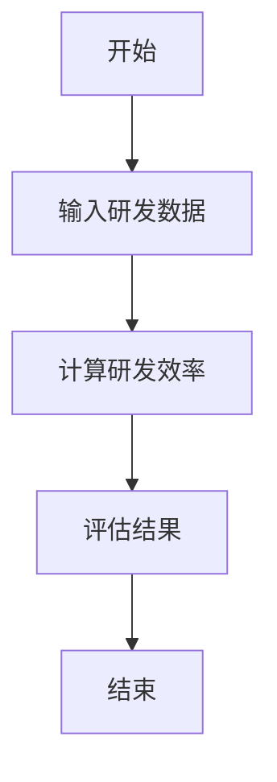
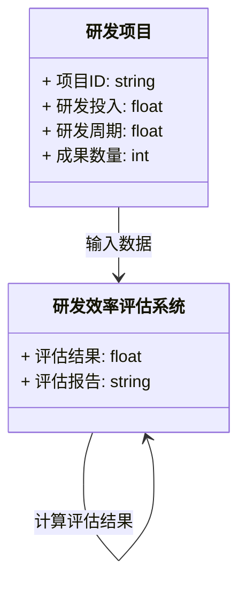
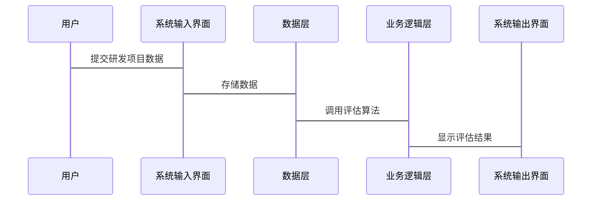

                 


# 彼得·林奇对公司研发效率的评估方法

## 关键词：
- 彼得·林奇
- 研发效率
- 评估方法
- 投资评估
- 企业研发

## 摘要：
本文深入探讨了彼得·林奇的公司研发效率评估方法，结合其独特的投资理念，详细分析了研发效率的核心概念、评估指标、数学模型以及实际应用。通过案例分析和系统设计，展示了如何将彼得·林奇的方法应用于实际的企业研发管理，以提升效率和投资回报。

---

## 正文：

### 第一部分: 研发效率评估的背景与核心概念

#### 第1章: 研发效率评估的背景与重要性

##### 1.1 研发效率评估的重要性
- **研发效率对企业竞争力的影响**：研发效率是企业技术创新的核心驱动力，直接影响产品迭代速度和市场响应能力。
- **研发效率与企业创新的关系**：高效率的研发团队能够更快地将创意转化为实际产品，提升企业的创新能力。
- **研发效率评估的现实意义**：通过评估研发效率，企业可以识别瓶颈，优化资源配置，提升整体竞争力。

##### 1.2 彼得·林奇的背景与投资理念
- **彼得·林奇的个人简介**：他是一位著名基金经理，以其深入的基本面分析著称，强调对公司管理层和财务状况的关注。
- **彼得·林奇的投资哲学**：他注重长期投资，关注企业的基本面，尤其是公司的盈利能力、管理层素质和市场地位。
- **彼得·林奇对研发效率的关注**：他认为研发效率是公司创新能力和未来增长潜力的重要指标，是投资决策的关键因素之一。

##### 1.3 研发效率评估的核心方法
- **研发效率的定义与属性**：研发效率是指在一定时间内，将研发投入转化为实际成果的能力，通常包括时间、成本和质量三个维度。
- **彼得·林奇评估方法的独特性**：他结合了定量和定性分析，不仅关注数据，还注重管理层的战略眼光和团队执行力。
- **研发效率评估的边界与外延**：评估时需考虑行业特性、企业规模和市场环境等因素，确保评估的全面性和准确性。

#### 第2章: 研发效率评估的核心概念与联系

##### 2.1 核心概念原理
- **研发效率的定义与属性**：研发效率可以通过研发周期、研发成本占总收入比例等指标来衡量。
- **彼得·林奇评估方法的核心要素**：包括研发投入、研发成果、研发团队能力、管理层的战略规划等。
- **研发效率与企业绩效的关系**：高效的研发能够提升企业市场竞争力，增加市场份额和利润。

##### 2.2 核心概念对比分析
- **研发效率与投资回报的对比**：高研发效率通常意味着更高的投资回报，但需考虑行业的差异性。
- **研发效率与市场竞争的对比**：在竞争激烈的行业，研发效率尤为重要，能够帮助企业在市场中占据领先地位。
- **研发效率与团队能力的对比**：团队能力和研发效率密切相关，高素质的团队通常能提高研发效率。

##### 2.3 研发效率评估的ER实体关系图
```mermaid
er
actor: 评估者
action: 评估研发效率
object: 研发项目
```

---

### 第二部分: 彼得·林奇评估方法的算法原理

#### 第3章: 彼得·林奇评估方法的算法原理

##### 3.1 算法原理概述
- **研发效率评估的基本模型**：研发效率 = 成果 / 投入，其中成果可以是产品数量、专利数，投入包括时间和资金。
- **彼得·林奇评估方法的数学模型**：将研发投入、研发周期、成果质量等指标量化，通过加权计算得出综合效率评分。

##### 3.2 算法流程图


##### 3.3 算法实现
- **数学模型和公式**：研发效率评分公式为：\( E = \frac{\sum (w_i \cdot x_i)}{\sum w_i} \)，其中 \( w_i \) 是各指标的权重，\( x_i \) 是各指标的得分。
- **权重分配**：根据行业特点和公司战略，合理分配各项指标的权重，例如研发投入占40%，周期占30%，成果占30%。

##### 3.4 算法优化与改进
- **动态调整权重**：根据市场变化和公司战略调整权重，确保评估的准确性。
- **引入风险因素**：考虑研发过程中的风险因素，如技术难度和市场需求，以更全面地评估研发效率。

---

### 第三部分: 系统分析与架构设计方案

#### 第4章: 系统分析与架构设计方案

##### 4.1 问题场景介绍
- **问题场景**：某科技公司希望提升研发效率，优化资源配置，通过彼得·林奇的评估方法进行自我诊断。

##### 4.2 系统功能设计（领域模型）


##### 4.3 系统架构设计
- **整体架构**：采用分层架构，包括数据层、业务逻辑层和用户界面层，确保系统的高效运行和良好的扩展性。
- **数据库设计**：使用关系型数据库，存储研发项目的详细信息和评估结果，支持高效的数据查询和分析。

##### 4.4 系统接口设计
- **输入接口**：接收研发项目的数据，如研发投入、周期、成果数量等。
- **输出接口**：提供评估结果和详细报告，供管理层参考决策。

##### 4.5 系统交互流程


---

### 第四部分: 项目实战

#### 第5章: 项目实战

##### 5.1 环境安装
- **工具安装**：安装Python、Mermaid、Jupyter Notebook等工具，配置开发环境。
- **数据准备**：收集多个研发项目的数据，包括研发投入、周期、成果数量等。

##### 5.2 核心代码实现
```python
def calculate_research_efficiency(research_data):
    weights = {'投入': 0.4, '周期': 0.3, '成果': 0.3}
    efficiency_scores = []
    for project in research_data:
        score = 0
        for key, weight in weights.items():
            score += project[key] * weight
        efficiency_scores.append(score)
    return efficiency_scores

# 示例数据
research_data = [
    {'投入': 100, '周期': 6, '成果': 5},
    {'投入': 150, '周期': 8, '成果': 7}
]
# 计算效率
efficiency_scores = calculate_research_efficiency(research_data)
print(efficiency_scores)
```

##### 5.3 案例分析与解读
- **案例分析**：以某科技公司为例，分析其研发项目效率，找出瓶颈并提出改进建议。
- **结果解读**：通过评估结果，识别高效率和低效率的项目，优化资源配置。

##### 5.4 项目小结
- **项目总结**：介绍项目实施的过程，评估方法的有效性，以及对企业的实际帮助。
- **经验教训**：总结在项目实施过程中遇到的问题和解决方案，为未来类似项目提供参考。

---

### 第五部分: 最佳实践与小结

#### 第6章: 最佳实践与小结

##### 6.1 最佳实践
- **持续优化评估指标**：定期更新评估指标和权重，适应市场变化和企业战略调整。
- **结合行业特性**：不同行业有不同的特点，评估方法需灵活调整，以适应特定行业的需求。

##### 6.2 小结
- **总结全书内容**：回顾彼得·林奇评估方法的核心思想和实际应用，强调其在提升研发效率中的重要性。
- **注意事项**：提醒读者在实际应用中注意数据的准确性和评估的客观性，避免片面化。

##### 6.3 未来展望
- **技术发展**：随着人工智能和大数据技术的发展，未来的评估方法将更加智能化和精准化。
- **行业趋势**：研发效率评估将越来越受到重视，成为企业核心竞争力的关键因素。

##### 6.4 拓展阅读
- **推荐书籍**：推荐几本与研发管理、投资评估相关的书籍，帮助读者深入学习和研究。

---

### 结语
通过本文的详细讲解，读者可以系统地了解彼得·林奇的公司研发效率评估方法，并将其应用于实际的企业管理中。这种科学的评估方法不仅能够提升研发效率，还能为企业创造更大的价值和竞争优势。希望本文对您有所帮助，期待在未来的实践中见到这一方法的成功应用。

