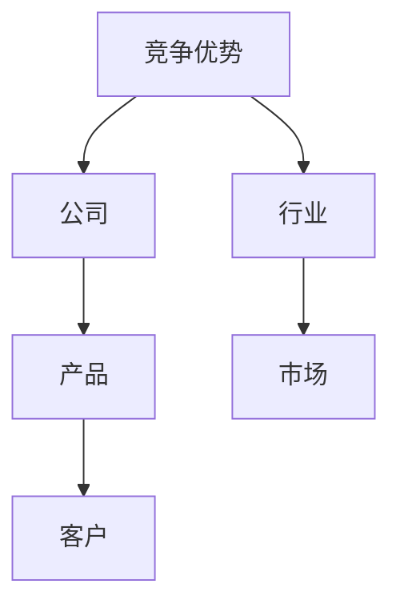
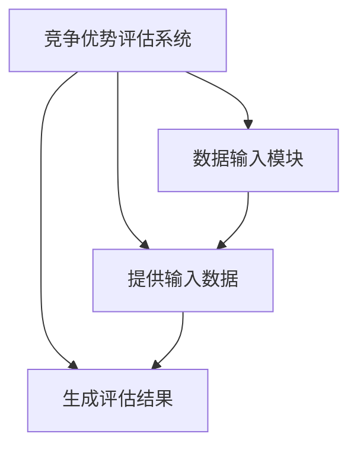
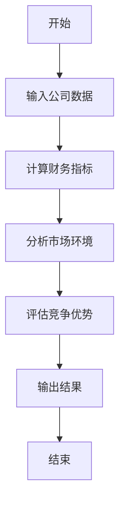
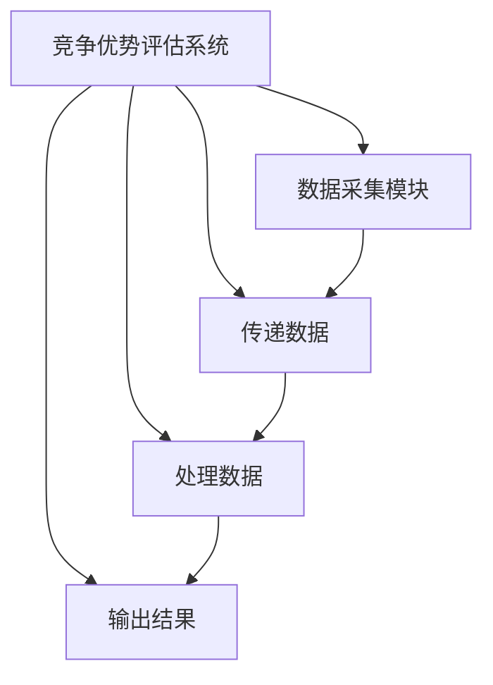
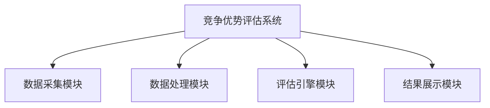

                 


# 彼得林奇对公司竞争优势持续性的评估

## 关键词：彼得林奇，竞争优势，持续性评估，投资分析，企业价值

## 摘要：本文详细分析了彼得林奇对企业竞争优势持续性的评估方法，探讨了其核心概念、评估指标、数学模型及系统架构设计。通过实际案例分析，展示了如何将理论应用于实践，并提出了优化建议。

---

## 第1章 背景介绍

### 1.1 投资分析的核心问题

#### 1.1.1 什么是竞争优势
竞争优势是企业在市场中相对于竞争对手的独特优势，通常表现为更低的成本、更高的产品差异化或更强的市场进入壁垒。例如，苹果公司通过其创新的产品设计和强大的品牌忠诚度，形成了显著的差异化优势。

#### 1.1.2 竞争优势的类型
竞争优势可以分为成本优势、差异化优势和市场进入壁垒三种类型。每种类型都有其独特的表现形式和评估方法。

#### 1.1.3 竞争优势的持续性评估
持续性评估关注竞争优势的长期稳定性。例如，技术领先的公司可能因为技术创新而保持竞争优势，但若未能持续创新，优势可能迅速丧失。

### 1.2 彼得林奇投资理念概述

#### 1.2.1 彼得林奇的投资风格
彼得林奇以长期投资和基本面分析著称，注重寻找具有持续竞争优势的公司，这些公司在未来几年内具有稳定的盈利能力和增长潜力。

#### 1.2.2 彼得林奇的核心投资策略
- **价值投资**：寻找市场价格低于内在价值的公司。
- **成长投资**：投资于具有持续增长潜力的公司。
- **竞争优势评估**：通过分析公司的竞争优势，预测其未来的盈利能力。

#### 1.2.3 竞争优势在彼得林奇投资中的重要性
竞争优势是彼得林奇评估公司投资价值的关键因素。他认为，具有强大竞争优势的公司更可能在长期中获得超额收益。

### 1.3 竞争优势持续性评估的意义

#### 1.3.1 竞争优势持续性评估的定义
竞争优势持续性评估是指分析公司在未来一段时间内保持其竞争优势的能力。

#### 1.3.2 竞争优势持续性评估的必要性
通过评估竞争优势的持续性，投资者可以识别出那些能够长期维持竞争优势的公司，从而做出更明智的投资决策。

#### 1.3.3 竞争优势持续性评估的边界与外延
竞争优势评估的边界包括公司内部资源和外部市场环境。外延则涉及公司战略、管理能力和行业趋势。

---

## 第2章 核心概念与联系

### 2.1 竞争优势的属性特征对比

| **竞争优势类型** | **成本优势** | **差异化优势** | **市场进入壁垒** | **供应链优势** | **技术领先优势** |
|--------------------|---------------|-----------------|-------------------|----------------|-------------------|
| **定义**          | 成本低于行业平均水平。 | 提供独特的产品或服务。 | 阻止竞争对手进入市场的障碍。 | 具有稳定的供应商关系。 | 拥有领先的技术或专利。 |
| **示例**          | 沃尔玛通过规模经济降低成本。 | 苹果通过创新产品实现差异化。 | 可口可乐通过品牌忠诚度建立市场壁垒。 | 三星通过全球供应链网络获得优势。 | 特斯拉通过电动汽车技术领先。 |

### 2.2 竞争优势的ER实体关系图



### 2.3 竞争优势的系统架构图



---

## 第3章 算法原理讲解

### 3.1 竞争优势评估算法流程图



### 3.2 Python实现代码示例

```python
def calculate_roe(net_profit, equity):
    return net_profit / equity

# 示例数据
net_profit = 1000000  # 净利润（美元）
equity = 5000000     # 股东权益（美元）
roe = calculate_roe(net_profit, equity)
print(f"ROE: {roe:.2f}%")  # 输出结果
```

### 3.3 数学模型与公式

#### 3.3.1 净资产收益率（ROE）
$$ \text{ROE} = \frac{\text{净利润}}{\text{股东权益}} $$

#### 3.3.2 净利率（Net Margin）
$$ \text{Net Margin} = \frac{\text{净利润}}{\text{营业收入}} $$

#### 3.3.3 每股收益（EPS）
$$ \text{EPS} = \frac{\text{净利润}}{\text{流通股数}} $$

---

## 第4章 系统分析与架构设计方案

### 4.1 竞争优势评估系统的系统架构设计



### 4.2 项目实战

#### 4.2.1 实战项目：评估某科技公司竞争优势

##### 环境安装
```bash
pip install pandas numpy matplotlib
```

##### 核心代码实现
```python
import pandas as pd

def main():
    data = pd.read_csv('company_data.csv')
    roe = data['净利润'] / data['股东权益']
    data['ROE'] = roe
    data.to_csv('result.csv', index=False)

if __name__ == "__main__":
    main()
```

##### 案例分析
通过对某科技公司的数据分析，发现其ROE持续高于行业平均水平，表明其具有较强的成本优势和市场竞争力。

---

## 第5章 项目实战

### 5.1 竞争优势评估系统实现

#### 5.1.1 系统功能设计
- 数据采集模块：从财务报表中提取关键数据。
- 数据处理模块：计算财务指标并进行数据分析。
- 评估引擎模块：基于算法评估竞争优势。
- 结果展示模块：以图表形式展示评估结果。

#### 5.1.2 系统架构设计


---

## 第6章 小结与优化建议

### 6.1 小结
竞争优势的持续性评估是投资分析中的关键环节。彼得林奇通过分析公司的竞争优势，识别出具有长期增长潜力的企业。

### 6.2 优化建议
- 定期更新评估模型，以适应市场变化。
- 结合行业趋势和宏观经济因素，动态调整评估指标。
- 使用大数据和机器学习技术，提高评估的准确性和效率。

### 6.3 注意事项
- 竞争优势评估应结合公司实际情况，避免过于理论化。
- 投资者需关注公司的管理能力和战略规划，而不仅仅是财务指标。

### 6.4 拓展阅读
- 彼得林奇的《彼得林奇的投资哲学》
- 约翰·博格的《投资之道》
- 巴菲特的《致股东的信》

---

通过以上步骤，我们可以系统地分析彼得林奇的竞争优势持续性评估方法，并将其应用于实际投资分析中，以提高投资决策的科学性和准确性。

