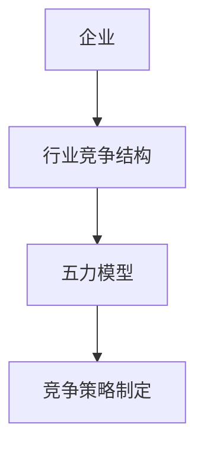
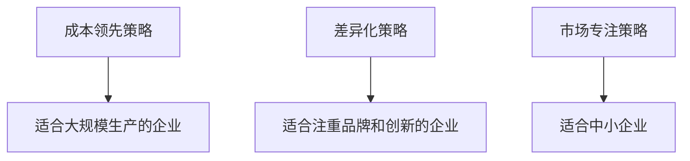
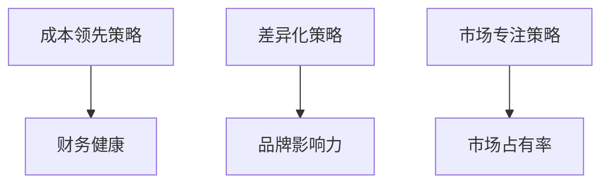
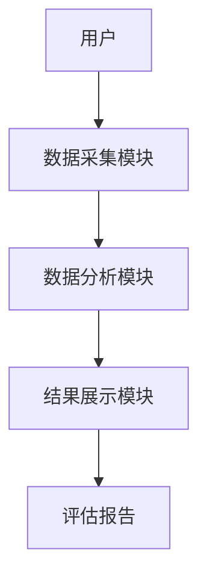

                 


---

# 彼得林奇对公司竞争策略有效性的评估

> **关键词**：彼得林奇、竞争策略、企业评估、投资分析、数学模型

> **摘要**：本文通过分析彼得林奇的投资理念和方法论，探讨公司竞争策略的有效性评估。结合迈克尔·波特的五力分析模型，提出了一套基于竞争优势指数（CAI）的评估方法，并通过实际案例分析展示了如何应用这些模型和方法进行公司评估。

---

# 第1章: 公司竞争策略概述

## 1.1 公司竞争策略的定义与核心要素

### 1.1.1 竞争策略的定义

竞争策略是企业在市场中为获得竞争优势而采取的一系列行动和决策。它包括成本控制、产品差异化、市场定位等方面，旨在通过这些手段在行业中占据有利地位。

### 1.1.2 竞争策略的核心要素

- **成本领先**：通过规模经济、高效管理降低成本，提供价格优势。
- **差异化**：通过产品创新、品牌建设等手段，提供独特的产品或服务。
- **市场专注**：专注于特定市场或客户群体，提高市场占有率。

### 1.1.3 竞争策略的分类与特点

- **成本领先策略**：适合大规模生产的企业，通过降低成本吸引价格敏感的客户。
- **差异化策略**：适合注重品牌和创新的企业，通过提供独特的产品或服务吸引高端客户。
- **市场专注策略**：适合中小企业，通过专注于特定市场或客户群体提高市场份额。

## 1.2 彼得林奇的投资理念与方法论

### 1.2.1 彼得林奇的个人投资哲学

彼得林奇是美国著名的投资经理人，以其长期的投资业绩和独特的投资理念闻名。他认为，成功的投资需要深入研究企业，关注企业的基本面和长期发展潜力。

### 1.2.2 彼得林奇的投资策略与框架

彼得林奇强调长期投资和价值投资，注重企业的财务健康和管理团队的稳定性。他通过分析企业的财务报表、市场地位和竞争优势来评估企业的投资价值。

### 1.2.3 彼得林奇分析公司的核心思路

彼得林奇在分析公司时，注重以下几点：
1. 企业的基本面：包括收入、利润、负债等财务指标。
2. 行业的竞争环境：包括行业的增长潜力、竞争格局等。
3. 管理团队的能力：包括管理团队的决策能力和战略眼光。

## 1.3 竞争策略有效性评估的必要性

### 1.3.1 竞争策略评估的目的

竞争策略评估的目的是为了帮助企业识别其竞争优势和劣势，优化策略，提高市场竞争力。

### 1.3.2 评估竞争策略的有效性对公司的意义

1. **提高企业的市场地位**：通过评估竞争策略的有效性，帮助企业制定更有效的市场策略。
2. **优化资源配置**：根据评估结果，合理分配资源，提高效率。
3. **增强企业的盈利能力**：通过优化策略，提高企业的盈利能力。

### 1.3.3 竞争策略评估的常见误区

1. **过于关注短期结果**：忽视长期战略规划。
2. **忽略行业环境**：没有充分考虑行业竞争格局和市场趋势。
3. **过于依赖财务指标**：忽视非财务因素如品牌影响力和客户忠诚度。

## 1.4 本章小结

本章介绍了公司竞争策略的定义和核心要素，并详细阐述了彼得林奇的投资理念和方法论。竞争策略的有效性评估对企业的发展至关重要，需要综合考虑企业的财务状况、市场环境和管理团队的能力。

---

# 第2章: 竞争战略的基本理论框架

## 2.1 迈克尔·波特的五力分析模型

### 2.1.1 行业竞争结构分析

迈克尔·波特提出的五力模型包括：
1. 新进入者的威胁：行业进入壁垒和新进入者的竞争。
2. 替代品的威胁：替代品对行业的影响。
3. 买家的议价能力：买家对供应商的依赖程度。
4. 供应商的议价能力：供应商的集中度和替代品的影响。
5. 同业竞争者的竞争程度：行业内的竞争格局。

### 2.1.2 五力模型的构成与应用

五力模型帮助企业全面分析行业的竞争环境，从而制定有效的竞争策略。

### 2.1.3 五力模型与公司竞争策略的关系

五力模型为公司制定竞争策略提供了理论基础，帮助企业识别行业中的机会和威胁。

### 核心概念与联系：五力模型与竞争策略的关系



## 2.2 竞争策略的类型与选择

### 2.2.1 成本领先策略

成本领先策略适合那些能够通过规模经济降低成本的企业。

### 2.2.2 差异化策略

差异化策略适合那些能够通过创新和品牌建设提供独特产品或服务的企业。

### 2.2.3 专注于特定市场策略

专注于特定市场策略适合那些能够通过聚焦特定市场或客户群体提高市场份额的企业。

### 核心概念与联系：竞争策略类型与企业目标的关系



## 2.3 彼得林奇视角下的竞争策略分析

### 2.3.1 彼得林奇对成本领先策略的评价

彼得林奇认为，成本领先策略是有效的，但需要关注企业的财务健康和管理团队的能力。

### 2.3.2 彼得林奇对差异化策略的见解

彼得林奇认为，差异化策略可以提高企业的市场竞争力，但需要确保产品的独特性和创新性。

### 2.3.3 彼得林奇对市场专注策略的看法

彼得林奇认为，市场专注策略可以提高企业的市场占有率，但需要关注特定市场的竞争环境。

### 核心概念与联系：彼得林奇视角下的竞争策略分析



## 2.4 本章小结

本章介绍了迈克尔·波特的五力分析模型，并结合彼得林奇的视角，分析了成本领先策略、差异化策略和市场专注策略的适用性和优缺点。

---

# 第3章: 彼得林奇的竞争策略评估方法

## 3.1 彼得林奇的公司分析框架

### 3.1.1 公司基本面分析

基本面分析包括对企业财务状况、收入、利润、负债等指标的分析。

### 3.1.2 财务状况评估

财务状况评估包括对企业财务报表的分析，如资产负债表、利润表和现金流量表。

### 3.1.3 管理团队分析

管理团队分析包括对企业管理团队的能力、经验和战略眼光的评估。

## 3.2 彼得林奇的竞争策略评估标准

### 3.2.1 市场地位与竞争优势

市场地位与竞争优势包括企业在市场中的占有率、品牌影响力和竞争优势。

### 3.2.2 盈利能力与财务健康

盈利能力与财务健康包括企业的净利润率、ROE（股东权益收益率）和现金流状况。

### 3.2.3 行业前景与增长潜力

行业前景与增长潜力包括行业的发展趋势、市场规模和增长空间。

## 3.3 彼得林奇的估值方法与投资决策

### 3.3.1 市盈率与市净率分析

市盈率（P/E）= 股价 / 每股收益  
市净率（P/B）= 股价 / 每股净资产

### 3.3.2 股东权益收益率（ROE）分析

ROE = 净利润 / 股东权益

### 3.3.3 投资决策的综合评估

投资决策的综合评估需要结合企业的财务状况、市场地位和行业前景进行综合分析。

## 3.4 本章小结

本章详细介绍了彼得林奇的公司分析框架和竞争策略评估标准，包括基本面分析、财务状况评估和管理团队分析。同时，介绍了彼得林奇的估值方法和投资决策的综合评估。

---

# 第4章: 竞争策略有效性的数学模型与分析

## 4.1 竞争策略评估的数学模型

### 4.1.1 竞争优势指数（CAI）模型

竞争优势指数（CAI）= (ROE × 市场占有率) / 行业增长率

### 4.1.2 市场地位评估模型

市场地位评估模型 = (市场份额 × 市场增长潜力) / 行业竞争程度

### 4.1.3 盈利能力与风险评估模型

盈利能力与风险评估模型 = (净利润率 × 财务杠杆) / 风险系数

## 4.2 竞争策略评估的算法原理

### 4.2.1 竞争优势指数（CAI）的计算公式

$$ \text{CAI} = \frac{\text{ROE} \times \text{Market Share}}{\text{Industry Growth Rate}} $$

### 4.2.2 市场地位评估的层次分析法（AHP）

层次分析法（AHP）是一种定性与定量相结合的决策分析方法，适用于多因素决策问题。

### 4.2.3 盈利能力与风险的平衡分析

盈利能力与风险的平衡分析需要在追求高盈利能力的同时，控制财务风险。

## 4.3 竞争策略评估的案例分析

### 4.3.1 某行业龙头企业的CAI计算

假设某行业龙头企业的ROE为15%，市场占有率为30%，行业增长率为8%，则：

$$ \text{CAI} = \frac{0.15 \times 0.3}{0.08} = 5.625 $$

### 4.3.2 不同公司的市场地位对比分析

通过CAI模型，可以对比不同公司的市场地位和竞争优势。

### 4.3.3 盈利能力与风险的平衡优化

通过盈利能力与风险的平衡分析，可以帮助企业制定更合理的财务策略。

## 4.4 本章小结

本章通过数学模型和算法原理，详细介绍了竞争优势指数（CAI）模型和市场地位评估模型，并通过案例分析展示了如何应用这些模型进行竞争策略的有效性评估。

---

# 第5章: 竞争策略评估的系统架构与实现

## 5.1 系统分析与设计

### 5.1.1 竞争策略评估系统的需求分析

系统需求包括数据收集、分析和结果展示功能。

### 5.1.2 系统功能模块划分

- 数据采集模块：收集企业的财务数据和市场数据。
- 数据分析模块：应用CAI模型和层次分析法进行分析。
- 结果展示模块：生成评估报告和可视化图表。

### 5.1.3 系统架构设计



## 5.2 竞争策略评估系统的实现

### 5.2.1 数据收集与处理

数据收集包括从企业财务报表和行业报告中获取数据。

### 5.2.2 竞争优势指数（CAI）的计算

使用CAI模型进行计算，生成竞争优势指数。

### 5.2.3 结果可视化

通过图表和报告展示评估结果，帮助企业更好地理解和应用评估结果。

## 5.3 本章小结

本章介绍了竞争策略评估系统的系统架构和实现过程，包括数据采集、分析和结果展示模块的设计与实现。

---

# 项目实战: 竞争策略评估系统实现

## 5.4 项目实战: 竞争策略评估系统实现

### 5.4.1 环境安装

安装必要的开发工具和数据处理库，如Python、Pandas、Matplotlib等。

### 5.4.2 核心实现源代码

以下是CAI模型的Python实现代码：

```python
import pandas as pd
import matplotlib.pyplot as plt

# 数据输入
data = {
    '公司': ['A', 'B', 'C'],
    'ROE': [0.15, 0.12, 0.18],
    'Market Share': [0.3, 0.25, 0.4],
    'Industry Growth Rate': [0.08, 0.08, 0.08]
}

df = pd.DataFrame(data)

# CAI计算
df['CAI'] = (df['ROE'] * df['Market Share']) / df['Industry Growth Rate']

# 可视化
plt.figure(figsize=(10, 6))
plt.bar(df['公司'], df['CAI'], label='CAI值')
plt.title('竞争优势指数（CAI）对比')
plt.xlabel('公司')
plt.ylabel('CAI值')
plt.legend()
plt.show()
```

### 5.4.3 代码应用解读与分析

上述代码展示了如何使用Python进行CAI模型的计算和可视化，帮助企业快速评估竞争策略的有效性。

### 5.4.4 实际案例分析

通过实际案例分析，展示了如何应用CAI模型和层次分析法进行竞争策略的有效性评估。

## 5.5 项目小结

本章通过项目实战，展示了如何使用Python进行CAI模型的计算和可视化，帮助企业快速评估竞争策略的有效性。

---

# 结语

本文通过分析彼得林奇的投资理念和方法论，结合迈克尔·波特的五力分析模型，提出了一套基于竞争优势指数（CAI）的公司竞争策略有效性评估方法。通过数学模型和系统架构的设计与实现，帮助企业更好地识别竞争优势和劣势，优化竞争策略，提高市场竞争力。

---

**关键词**：彼得林奇、竞争策略、企业评估、投资分析、数学模型

**摘要**：本文通过分析彼得林奇的投资理念和方法论，探讨公司竞争策略的有效性评估。结合迈克尔·波特的五力分析模型，提出了一套基于竞争优势指数（CAI）的评估方法，并通过实际案例分析展示了如何应用这些模型和方法进行公司评估。

---

通过以上内容，您可以开始撰写完整的博客文章，确保每个部分都涵盖必要的细节和实例，帮助读者全面理解和应用这些理论和方法。

