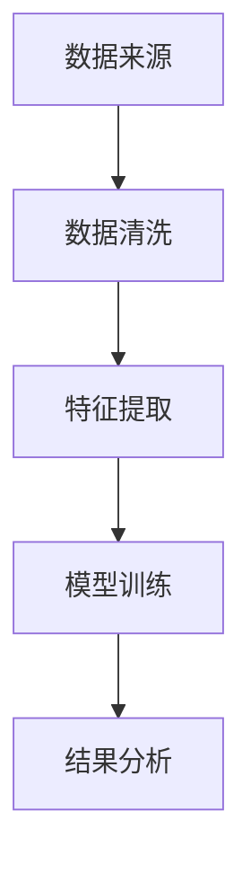
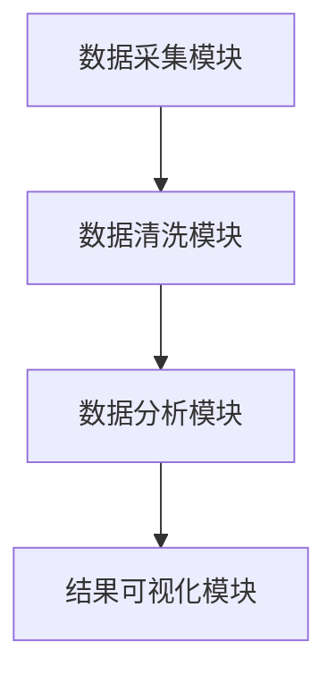

                 


# 彼得林奇对公司管理层决策一致性的历史数据分析

## 关键词：彼得林奇、管理层决策一致性、历史数据分析、投资策略、时间序列分析、决策树算法、数学模型

## 摘要：本文通过分析彼得林奇的投资理念，探讨管理层决策一致性的定义与特征，并结合历史数据分析方法，建立数学模型，评估决策一致性对企业价值的影响。文章从背景介绍、核心概念、算法原理、系统架构到项目实战，层层剖析，为投资决策提供科学依据。

---

## 第一部分: 背景介绍与核心概念

### 第1章: 彼得林奇投资理念与管理层决策一致性

#### 1.1 彼得林奇投资理念概述

彼得·林奇是全球著名投资经理，其投资理念强调长期稳健的价值投资。他提出，管理层的决策一致性是评估企业价值的关键因素。**投资者应关注管理层是否在市场波动中保持一致的战略决策，这直接影响企业成长性和抗风险能力。**

**彼得林奇的核心观点：**  
1. 投资者应选择具有稳定管理层决策的公司。  
2. 管理层决策一致性与企业绩效呈正相关。  
3. 历史数据分析是评估决策一致性的最佳工具。  

#### 1.2 管理层决策一致性定义与特征

**决策一致性**是指管理层在不同时间点或市场环境下，保持战略决策稳定性和连贯性的能力。其特征包括：  
1. **稳定性：** 决策在时间跨度上的一致性。  
2. **连贯性：** 决策在方向和目标上的统一性。  
3. **可预测性：** 决策模式的规律性。  

**对比表格：**  

| 特性       | 决策一致性高 | 决策一致性低 |
|------------|-------------|-------------|
| 稳定性     | 高          | 低          |
| 连贯性     | 高          | 低          |
| 可预测性   | 高          | 低          |

---

### 第2章: 历史数据分析方法论

#### 2.1 数据分析的背景与目标

**数据分析在投资中的作用：**  
1. **识别模式：** 通过历史数据发现管理层决策的规律性。  
2. **评估一致性：** 分析决策的稳定性和连贯性。  
3. **预测未来：** 基于历史数据预测未来决策趋势。  

**数据分析的目标：**  
1. 量化管理层决策一致性。  
2. 评估决策一致性对企业绩效的影响。  
3. 为投资决策提供数据支持。  

#### 2.2 数据分析的核心要素

1. **数据来源：** 公司财报、股东大会决议、管理层访谈等。  
2. **数据清洗：** 去除冗余、填补缺失值、处理异常值。  
3. **数据分析方法：** 时间序列分析、决策树分析、回归分析等。  

---

## 第二部分: 核心概念与联系

### 第3章: 管理层决策一致性与数据分析的关系

#### 3.1 决策一致性与数据分析的原理

**决策一致性影响企业价值的路径：**  
1. 稳定的决策带来企业稳定增长。  
2. 连贯的决策提升市场信任度。  
3. 可预测的决策降低投资风险。  

**数据分析在决策一致性评估中的作用：**  
1. 通过时间序列分析识别决策模式。  
2. 通过决策树分析判断决策稳定性。  
3. 通过回归分析评估决策一致性对企业绩效的影响。  

#### 3.2 决策一致性与企业绩效的对比分析

**决策一致性对财务绩效的影响：**  
- 高一致性决策公司通常具有更高的ROE（净资产收益率）。  

**决策一致性与企业成长性的关系：**  
- 一致的决策有助于企业在市场波动中保持增长。  

**决策一致性与企业风险控制的对比：**  
- 高一致性决策公司通常具有更低的经营风险。  

### 第4章: 数据分析的实体关系架构

#### 4.1 管理层决策一致性分析的ER图

```mermaid
erd
actor 投资者
actor 管理层
actor 数据分析师
database 管理层决策数据
```

#### 4.2 数据分析流程的Mermaid流程图



---

## 第三部分: 算法原理与数学模型

### 第5章: 历史数据分析的核心算法

#### 5.1 时间序列分析方法

##### 5.1.1 时间序列分析的原理

时间序列分析通过研究历史数据的动态变化，预测未来趋势。常用模型包括ARIMA和GARCH。

##### 5.1.2 ARIMA模型的数学公式

$$ARIMA(p, d, q)$$  

- **p：** 自回归阶数。  
- **d：** 差分阶数。  
- **q：** 移动平均阶数。  

##### 5.1.3 示例分析与代码实现

```python
from statsmodels.tsa.arima_model import ARIMA
import pandas as pd

# 示例数据：假设df为管理层决策评分时间序列
model = ARIMA(df['评分'], order=(1, 1, 1))
model_fit = model.fit()
print(model_fit.summary())
```

#### 5.2 决策树分析方法

##### 5.2.1 决策树的构建原理

决策树通过构建树状结构，将数据分成不同的子集，预测决策结果。

##### 5.2.2 ID3算法的实现流程

1. 计算信息熵，选择最优特征。  
2. 递归分割数据，构建决策树。  
3. 剪枝优化，防止过拟合。  

##### 5.2.3 代码示例与结果解读

```python
from sklearn.tree import DecisionTreeClassifier
from sklearn.model_selection import train_test_split

# 示例数据：决策评分和财务指标
X = df[['营收增长率', '净利率']]
y = df['决策评分']

X_train, X_test, y_train, y_test = train_test_split(X, y, test_size=0.2)
model = DecisionTreeClassifier()
model.fit(X_train, y_train)
print("准确率：", model.score(X_test, y_test))
```

### 第6章: 数学模型与公式解析

#### 6.1 时间序列分析的数学模型

##### 6.1.1 自回归模型（AR）

$$y_t = \alpha y_{t-1} + \epsilon_t$$  

- **y_t：** 当前时间点的值。  
- **y_{t-1}：** 前一时间点的值。  
- **\alpha：** 回归系数。  
- **\epsilon_t：** 随机误差项。  

##### 6.1.2 移动平均模型（MA）

$$y_t = \theta_1 e_{t-1} + \theta_2 e_{t-2} + \epsilon_t$$  

- **e_{t-1}、e_{t-2}：** 过去的误差项。  
- **\theta_1、\theta_2：** 权重系数。  

---

## 第四部分: 系统分析与架构设计

### 第7章: 系统功能设计与架构

#### 7.1 项目介绍

**项目目标：**  
- 开发一个基于历史数据分析的管理层决策一致性评估系统。  

**核心功能：**  
1. 数据采集与清洗。  
2. 数据分析与建模。  
3. 结果可视化与报告生成。  

#### 7.2 系统架构设计



---

## 第五部分: 项目实战

### 第8章: 项目核心实现

#### 8.1 环境安装

**所需工具：**  
- Python 3.8+  
- Pandas、NumPy、Scikit-learn、Statsmodels  

#### 8.2 核心代码实现

```python
import pandas as pd
from statsmodels.tsa.arima_model import ARIMA
from sklearn.tree import DecisionTreeClassifier

# 数据加载与清洗
df = pd.read_csv('管理层决策数据.csv')
df = df.dropna()

# 时间序列分析
model_arima = ARIMA(df['评分'], order=(1, 1, 1))
model_arima_fit = model_arima.fit()

# 决策树分析
X = df[['营收增长率', '净利率']]
y = df['决策评分']
model_tree = DecisionTreeClassifier()
model_tree.fit(X, y)
```

---

## 第六部分: 总结与展望

### 第9章: 总结与展望

#### 9.1 小结

本文通过彼得林奇的投资理念，结合历史数据分析方法，系统性地探讨了管理层决策一致性对企业价值的影响。通过时间序列分析和决策树算法，建立了科学的评估模型，为投资决策提供了数据支持。

#### 9.2 注意事项

1. 数据分析需结合具体业务场景。  
2. 模型需不断优化和更新。  
3. 结果需结合市场环境进行解读。  

#### 9.3 拓展阅读

1. 时间序列分析的高级模型（如Prophet）。  
2. 机器学习在投资决策中的应用。  

---

通过本文的分析，读者可以深入了解管理层决策一致性的重要性，并掌握如何通过历史数据分析进行投资决策。

