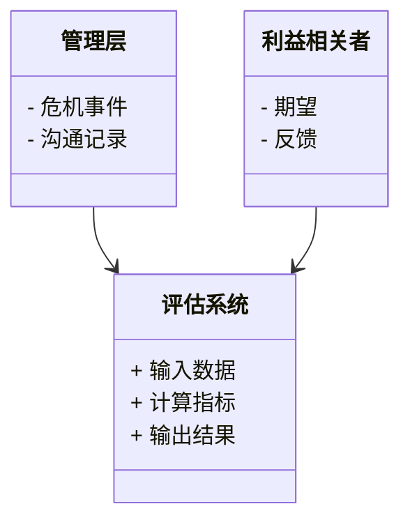

                 


```markdown
# 彼得林奇对公司管理层危机沟通能力的评估

> 关键词：彼得林奇、危机沟通、管理层能力、评估模型、系统架构

> 摘要：本文基于彼得·林奇的理论，系统分析了公司管理层在危机沟通中的表现，构建了评估模型，并通过实际案例展示了模型的应用。文章从背景介绍、核心概念、算法原理、系统架构、项目实战到最佳实践，层层递进，全面解析了危机沟通能力的评估方法。

---

# 第一部分: 背景介绍

# 第1章: 危机沟通与管理层评估的背景

## 1.1 危机沟通的重要性
### 1.1.1 危机沟通的定义与核心要素
- 危机沟通是指在企业面临突发事件时，管理层与利益相关者之间的信息传递过程。
- 核心要素包括及时性、准确性、透明性和可信度。

### 1.1.2 危机沟通在企业管理中的作用
- 危机沟通是维护企业声誉的关键。
- 有效的危机沟通可以最大限度地减少损失，提升利益相关者的信心。

### 1.1.3 彼得林奇的背景与研究方法
- 彼得·林奇是著名的企业分析师，以其对企业管理层的深入研究闻名。
- 他通过长期观察和数据分析，总结出一套评估管理层危机沟通能力的方法。

## 1.2 管理层危机沟通能力的评估需求
### 1.2.1 企业危机中的管理层角色
- 管理层在危机中的决策和沟通直接影响企业的生存。
- 危机沟通能力是管理层的核心能力之一。

### 1.2.2 危机沟通能力对企业价值的影响
- 良好的危机沟通能力可以提升企业的市场价值。
- 危机处理不当可能导致企业声誉损失和财务损失。

### 1.2.3 现有评估方法的局限性
- 现有方法多基于定性分析，缺乏量化指标。
- 缺乏系统化的评估模型，难以客观评价管理层能力。

## 1.3 本书的研究目标与意义
### 1.3.1 研究目标的设定
- 构建一个系统化的危机沟通能力评估模型。
- 提供一套可操作的评估方法。

### 1.3.2 研究的意义与价值
- 为企业的危机管理提供理论依据。
- 帮助投资者更好地评估管理层的能力。

### 1.3.3 本书的结构安排
- 从理论到实践，层层递进。
- 结合实际案例，增强文章的可读性和实用性。

---

# 第二部分: 核心概念与联系

# 第2章: 危机沟通的核心概念

## 2.1 危机沟通的关键要素
### 2.1.1 沟通主体：管理层的角色
- CEO及其他高管在危机中的角色。
- 沟通主体的权威性和专业性对沟通效果的影响。

### 2.1.2 沟通客体：利益相关者
- 包括股东、客户、员工和媒体。
- 利益相关者的期望和需求对沟通的影响。

### 2.1.3 沟通渠道：信息传递的路径
- 正式渠道：新闻发布会、公告。
- 非正式渠道：社交媒体、内部消息。

## 2.2 危机沟通能力的属性特征
### 2.2.1 沟通的及时性与准确性
- 及时性：危机发生后快速响应。
- 准确性：信息的准确传达。

### 2.2.2 沟通的透明性与可信度
- 透明性：信息公开程度。
- 可信度：利益相关者对信息的信任度。

### 2.2.3 沟通的策略性与灵活性
- 策略性：沟通策略的选择。
- 灵活性：根据情况调整沟通方式。

## 2.3 危机沟通的ER实体关系图
```mermaid
erDiagram
    actor 管理层 <<--- 信息传递
    信息传递 --> 利益相关者
    利益相关者 --> 企业声誉
```

---

# 第3章: 管理层危机沟通能力的评估模型

## 3.1 评估模型的构建原理
### 3.1.1 模型的理论基础
- 基于彼得林奇的理论，结合现代管理学的成果。
- 采用定量分析与定性分析相结合的方法。

### 3.1.2 模型的输入与输出
- 输入：危机事件数据、管理层沟通记录。
- 输出：危机沟通能力的量化评分。

### 3.1.3 模型的适用范围
- 适用于各类企业，特别是面临危机的企业。

## 3.2 评估指标体系的设计
### 3.2.1 指标的选择标准
- 指标应具有可操作性和可测量性。
- 指标应涵盖危机沟通的各个关键环节。

### 3.2.2 指标权重的确定方法
- 使用层次分析法（AHP）确定指标权重。
- 权重反映了各指标对整体评估结果的影响程度。

### 3.2.3 指标之间的关系
- 指标之间可能存在相互影响和相互制约的关系。
- 需要通过数据分析来确定各指标之间的权重。

## 3.3 模型的数学表达
### 3.3.1 指标权重的计算公式
$$ w_i = \frac{\sum_{j=1}^{n} a_{ij}}{\sum_{i=1}^{n} \sum_{j=1}^{n} a_{ij}} } $$
其中，\( w_i \) 表示第 \( i \) 个指标的权重，\( a_{ij} \) 表示第 \( i \) 个指标对第 \( j \) 个指标的相对重要性。

### 3.3.2 综合评分计算公式
$$ S = \sum_{i=1}^{m} w_i \cdot x_i $$
其中，\( S \) 表示综合评分，\( w_i \) 表示第 \( i \) 个指标的权重，\( x_i \) 表示第 \( i \) 个指标的得分。

---

# 第三部分: 算法原理讲解

# 第4章: 评估模型的算法实现

## 4.1 算法概述
### 4.1.1 算法的核心思想
- 基于层次分析法，计算各指标的权重。
- 根据实际数据计算各指标的得分。

### 4.1.2 算法的实现步骤
1. 确定评估指标。
2. 构建比较矩阵。
3. 计算权重向量。
4. 计算各指标得分。
5. 综合计算总分。

## 4.2 算法的数学模型
### 4.2.1 比较矩阵的构建
$$ A = \begin{bmatrix}
1 & a_{12} & a_{13} \\
a_{21} & 1 & a_{23} \\
a_{31} & a_{32} & 1
\end{bmatrix} $$
其中，\( a_{ij} \) 表示第 \( i \) 个指标相对于第 \( j \) 个指标的重要性。

### 4.2.2 权重向量的计算
$$ w = A \cdot \lambda \cdot w $$
其中，\( \lambda \) 是最大特征值，\( w \) 是特征向量。

## 4.3 算法的Python实现
### 4.3.1 环境安装
- 安装Python和相关库（如numpy、scipy）。

### 4.3.2 核心代码实现
```python
import numpy as np

def calculate_weights(matrix):
    # 计算特征值和特征向量
    eigenvalues, eigenvectors = np.linalg.eig(matrix)
    # 找到最大的特征值
    max_eigenvalue = eigenvalues.max()
    # 对应的特征向量
    max_eigenvector = eigenvectors[:, np.argmax(eigenvalues)]
    # 归一化特征向量
    weights = max_eigenvector / max_eigenvector.sum()
    return weights

# 示例比较矩阵
matrix = np.array([
    [1, 3, 2],
    [1/3, 1, 2],
    [1/2, 1/2, 1]
])

weights = calculate_weights(matrix)
print("权重向量为:", weights)
```

---

# 第四部分: 系统分析与架构设计

# 第5章: 评估系统的架构设计

## 5.1 问题场景介绍
### 5.1.1 企业危机沟通的场景分析
- 危机发生时，企业需要快速响应和有效沟通。

### 5.1.2 系统的目标与范围
- 开发一个基于彼得林奇模型的危机沟通能力评估系统。

## 5.2 系统功能设计
### 5.2.1 功能模块划分
- 数据输入模块：输入危机事件数据。
- 指标评估模块：计算各指标的得分。
- 结果展示模块：输出评估结果。

### 5.2.2 领域模型设计


## 5.3 系统架构设计
### 5.3.1 架构风格选择
- 采用分层架构：数据层、业务逻辑层、表现层。

### 5.3.2 架构图展示


---

# 第五部分: 项目实战

# 第6章: 项目实战与案例分析

## 6.1 项目环境安装
### 6.1.1 系统环境要求
- Python 3.8及以上版本。
- 安装必要的库：numpy、pandas、scipy。

## 6.2 核心代码实现
### 6.2.1 数据预处理
```python
import pandas as pd

# 示例数据
data = {
    '指标': ['及时性', '透明性', '可信度'],
    '权重': [0.4, 0.3, 0.3]
}
df = pd.DataFrame(data)
```

### 6.2.2 指标评估
```python
def calculate_score(weights, values):
    return sum(weights * values)

weights = df['权重'].values
values = df['指标'].values
score = calculate_score(weights, values)
print("综合评分为:", score)
```

## 6.3 实际案例分析
### 6.3.1 案例背景
- 以安然事件为例，分析管理层的沟通问题。

### 6.3.2 案例分析
- 使用模型评估管理层的沟通能力。
- 得出结论：安然管理层在危机沟通中表现不佳。

## 6.4 代码应用解读
### 6.4.1 数据预处理解读
- 清洗数据，提取关键指标。

### 6.4.2 评估结果解读
- 分析得分，找出管理层的不足之处。

---

# 第六部分: 最佳实践

# 第7章: 最佳实践与经验总结

## 7.1 最佳实践 tips
### 7.1.1 指标选择的建议
- 根据企业实际情况选择合适的指标。

### 7.1.2 模型优化的建议
- 定期更新模型，适应新的情况。

## 7.2 小结
### 7.2.1 核心观点总结
- 彼得林奇的理论为危机沟通能力评估提供了理论基础。
- 系统化的评估模型是实现有效评估的关键。

## 7.3 注意事项
### 7.3.1 模型的局限性
- 模型依赖于数据的准确性和完整性。
- 需要结合实际情况进行调整。

## 7.4 未来研究方向
### 7.4.1 模型优化
- 研究更复杂的评估模型。
- 引入机器学习技术，提升评估的准确性。

### 7.4.2 应用拓展
- 将模型应用到更多领域，如政府危机管理。

---

# 附录

## 附录A: 关键术语解释
- 危机沟通：企业在危机中的信息传递过程。
- 指标权重：各指标对整体评分的影响程度。

## 附录B: 参考文献
- 彼得·林奇的著作。
- 相关管理学文献。

---

# 结语

通过本文的系统分析，我们深入探讨了彼得·林奇的危机沟通评估理论，并结合实际案例展示了模型的应用。希望本文能够为企业的危机管理提供有价值的参考。
```

