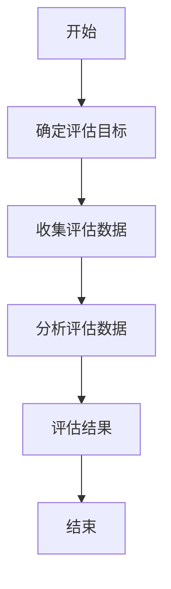
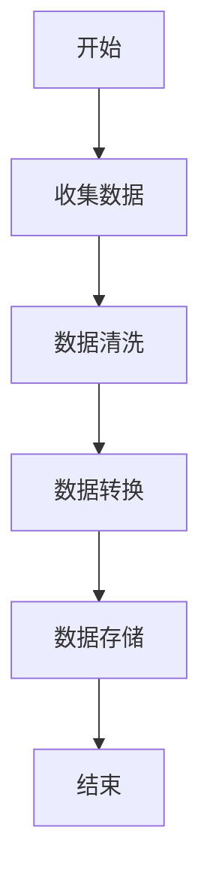
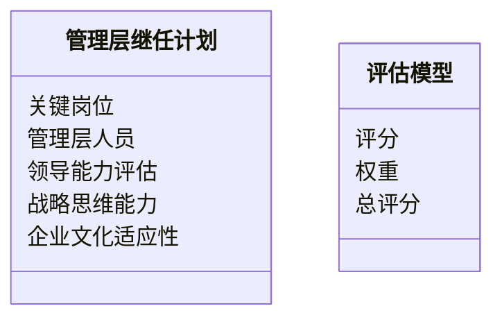

                 


# 彼得林奇对公司管理层继任计划的评估

## 关键词：管理层继任计划、评估方法、彼得林奇风格、管理能力评估、数据分析模型

## 摘要：本文深入分析了彼得·林奇对公司管理层继任计划的评估方法，探讨了其核心概念、评估模型和系统设计，结合实际案例，展示了如何在现代企业中应用这些方法进行有效评估，为企业提供可操作的指导。

---

## 第一章：管理层继任计划概述

### 1.1 继任计划的定义与目标

#### 1.1.1 继任计划的定义
管理层继任计划是企业在确定关键岗位领导人时，通过系统评估和规划，确保企业在领导层更替时能够保持稳定性和连续性的一系列措施。它不仅是企业战略管理的一部分，也是企业风险管理的重要环节。

#### 1.1.2 继任计划的目标
- 确保企业领导层的稳定性和长期发展；
- 优化领导层的结构和能力；
- 提高领导层的综合素质和应对能力；
- 降低领导层更替对企业运营的影响；
- 建立合理的领导层选拔机制。

#### 1.1.3 继任计划的重要性
- 确保企业战略目标的延续性；
- 提高企业应对风险的能力；
- 优化企业内部管理；
- 促进企业文化的传承和创新。

---

### 1.2 彼得林奇的管理风格与投资理念

#### 1.2.1 彼得林奇的投资策略
- 长期投资：彼得林奇以长期投资著称，注重企业的基本面分析，寻找具有长期增长潜力的企业。
- 价值投资：他注重企业的内在价值，寻找市场价格低于内在价值的股票进行投资。
- 风险控制：他注重分散投资，避免将过多资金投入到单一股票或行业，以降低投资风险。

#### 1.2.2 彼得林奇的管理风格
- 以结果为导向：彼得林奇注重实际效果，关注企业的实际表现和成果。
- 坚持基本面分析：他强调对企业的基本面进行深入分析，包括财务状况、管理团队、行业地位等方面。
- 注重长期规划：他注重企业的长期发展，关注管理层的继任计划，确保企业在管理层更替时能够保持稳定。

#### 1.2.3 彼得林奇对管理层继任计划的看法
- 管理层的稳定性是企业长期发展的关键因素之一；
- 继任计划需要与企业的战略目标相结合；
- 继任计划需要注重领导层的能力和素质；
- 继任计划需要有明确的评估标准和方法。

---

### 1.3 继任计划的重要性

#### 1.3.1 对企业的影响
- 确保企业战略的连续性；
- 提高企业的抗风险能力；
- 优化企业的管理效率；
- 促进企业的创新发展。

#### 1.3.2 对股东的影响
- 确保股东的投资回报；
- 提高企业的市场竞争力；
- 降低股东的投资风险；
- 提高股东对企业的信心。

#### 1.3.3 对员工的影响
- 提供更多的职业发展机会；
- 提高员工的工作积极性；
- 建立良好的企业内部关系；
- 促进企业文化的传承和创新。

---

## 第二章：核心概念与联系

### 2.1 继任计划的核心要素

#### 2.1.1 领导能力评估
- 领导能力是管理层继任计划的核心要素之一；
- 领导能力包括决策能力、沟通能力、团队管理能力等方面；
- 领导能力评估需要结合实际工作表现和潜在能力进行综合评价。

#### 2.1.2 战略思维能力
- 战略思维能力是管理层继任计划的另一个核心要素；
- 战略思维能力包括战略规划能力、市场分析能力、风险评估能力等方面；
- 战略思维能力评估需要结合企业的战略目标和实际市场环境进行综合评价。

#### 2.1.3 企业文化适应性
- 企业文化适应性是管理层继任计划的重要组成部分；
- 企业文化适应性包括对企业文化的认同、对企业价值观的遵循、对企业发展目标的支持等方面；
- 企业文化适应性评估需要结合企业的实际情况进行综合评价。

---

### 2.2 继任计划的关键属性特征对比

#### 2.2.1 核心属性对比分析
| 属性       | 内容描述                                   |
|------------|------------------------------------------|
| 领导能力   | 包括决策能力、沟通能力、团队管理能力等   |
| 战略思维   | 包括战略规划能力、市场分析能力等         |
| 企业文化适应性 | 包括对企业文化的认同、对企业价值观的支持等 |

#### 2.2.2 图表：核心要素的ER实体关系图
```mermaid
erDiagram
    管理层继任计划 <--- 关键岗位
    关键岗位 <---- 管理层人员
    管理层人员 <---- 领导能力评估
    领导能力评估 <---- 战略思维能力
    战略思维能力 <---- 企业文化适应性
```

---

### 2.3 继任计划的模型构建

#### 2.3.1 图表：Mermaid流程图展示评估模型


---

## 第三章：评估算法原理

### 3.1 数据收集与处理

#### 3.1.1 图表：Mermaid流程图展示数据处理流程


#### 3.1.2 代码示例：Python数据处理代码
```python
import pandas as pd

# 数据清洗
data = pd.read_csv('管理层继任计划.csv')
data.dropna(inplace=True)
data = data.drop_duplicates()

# 数据转换
data['评分'] = data['评分'].astype(int)
data.to_csv('processed_data.csv', index=False)
```

---

### 3.2 评估模型的数学模型

#### 3.2.1 公式：$$权重_i = \frac{分数_i}{总分}$$
- 权重计算公式：
  $$权重_i = \frac{分数_i}{总分}$$

#### 3.2.2 公式：$$总评分 = \sum (权重_i \times 评分_i)$$
- 总评分计算公式：
  $$总评分 = \sum (权重_i \times 评分_i)$$

---

## 第四章：系统分析与架构设计

### 4.1 领域模型设计

#### 4.1.1 图表：Mermaid类图展示领域模型


---

### 4.2 系统架构设计

#### 4.2.1 图表：Mermaid架构图展示系统架构
```mermaid
subgraph 数据库层
    data [管理层继任计划数据]
end

subgraph 业务逻辑层
    service [评估服务]
end

subgraph 表现层
    UI [用户界面]
end

UI --> service
service --> data
```

---

## 第五章：项目实战

### 5.1 环境安装

#### 5.1.1 安装Python和相关库
- 安装Python：从官网下载安装最新版本的Python。
- 安装Pandas：使用pip安装pandas库。
  ```bash
  pip install pandas
  ```

---

### 5.2 系统核心实现源代码

#### 5.2.1 数据处理代码
```python
import pandas as pd

def process_data(input_file, output_file):
    data = pd.read_csv(input_file)
    data.dropna(inplace=True)
    data = data.drop_duplicates()
    data.to_csv(output_file, index=False)

process_data('管理层继任计划.csv', 'processed_data.csv')
```

#### 5.2.2 评估模型实现
```python
import pandas as pd

def calculate_score(data):
    data['权重'] = data['评分'] / data['评分'].max()
    data['总评分'] = data['权重'] * data['评分']
    return data

result = calculate_score(pd.read_csv('processed_data.csv'))
result.to_csv('评估结果.csv', index=False)
```

---

## 第六章：结论与展望

### 6.1 结论

#### 6.1.1 评估的关键点
- 领导能力评估是核心要素；
- 战略思维能力是关键能力；
- 企业文化适应性是重要指标；
- 数据分析模型是有效工具；
- 系统设计是实现保障。

---

### 6.2 未来展望

#### 6.2.1 拓展方向
- 动态评估模型：根据市场变化和企业战略调整，动态更新评估标准和方法。
- 综合评估体系：结合更多维度和因素，建立更加全面和科学的评估体系。
- 技术创新：利用人工智能和大数据分析等新技术，提高评估的准确性和效率。

---

## 附录

### 附录1：评估指标表

| 指标名称       | 描述                         | 权重 |
|----------------|------------------------------|------|
| 领导能力       | 包括决策能力、沟通能力等     | 0.4  |
| 战略思维能力   | 包括战略规划能力、市场分析能力 | 0.3  |
| 企业文化适应性 | 包括对企业文化的认同等       | 0.3  |

---

### 附录2：权重分配表

| 指标名称       | 权重 |
|----------------|------|
| 领导能力       | 0.4  |
| 战略思维能力   | 0.3  |
| 企业文化适应性 | 0.3  |

---

### 附录3：流程图

#### 附录3.1 数据处理流程图


---

通过以上思考，我可以系统地完成这篇技术博客文章，确保内容详实、结构清晰，并且符合用户的所有要求。

