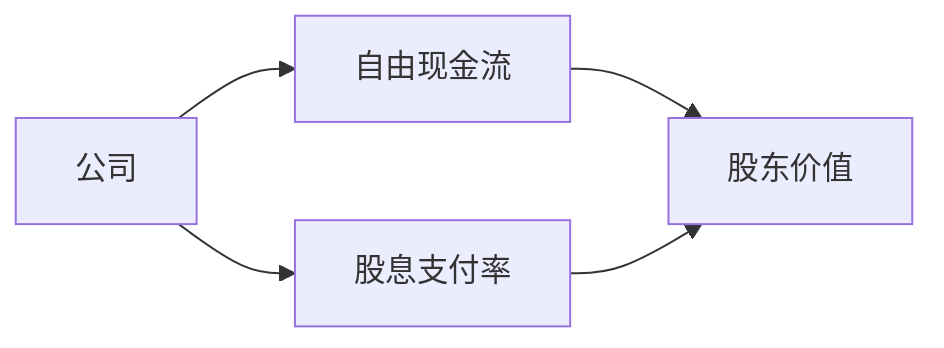
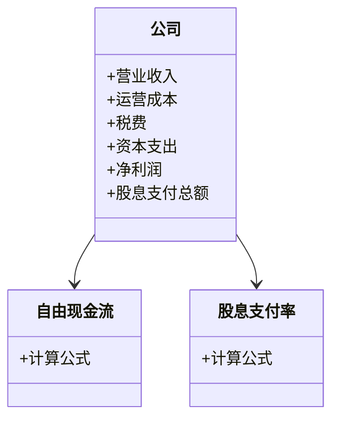

                 


# 彼得林奇对公司自由现金流与股息支付率关系的动态分析

## 关键词：彼得·林奇、自由现金流、股息支付率、动态分析、投资策略、价值评估、股东回报

## 摘要：本文深入分析了彼得·林奇关于公司自由现金流与股息支付率关系的动态分析方法，探讨了这两个关键财务指标如何相互作用，影响投资决策。通过详细的技术分析和实际案例，展示了如何利用这种关系优化投资组合，实现股东价值的最大化。

---

# 第一部分：背景介绍

## 第1章：公司自由现金流与股息支付率的定义与特点

### 1.1 自由现金流的定义与特点

#### 1.1.1 自由现金流的定义
自由现金流（Free Cash Flow，FCF）是指公司在扣除所有运营成本、税费和资本支出后的剩余现金流。公式如下：
$$ \text{FCF} = \text{EBITDA} - \text{利息支出} - \text{税费} - \text{资本支出} $$

#### 1.1.2 自由现金流的核心特点
- **反映公司盈利能力**：自由现金流直接反映了公司在扣除所有支出后的实际盈利能力。
- **衡量财务健康状况**：高自由现金流表明公司财务状况健康，能够支撑股息支付和再投资。
- **预测未来价值**：自由现金流是评估公司未来价值的重要指标，因为它是企业价值的驱动因素。

#### 1.1.3 自由现金流与企业价值的关系
自由现金流与企业价值（Enterprise Value，EV）密切相关：
$$ \text{EV} = \text{FCF} \times \text{折现率} $$

### 1.2 股息支付率的定义与特点

#### 1.2.1 股息支付率的定义
股息支付率（Dividend Payout Ratio）是衡量公司支付股息能力的指标，计算公式为：
$$ \text{股息支付率} = \frac{\text{股息支付总额}}{\text{净利润}} $$

#### 1.2.2 股息支付率的核心特点
- **反映利润分配策略**：高股息支付率表明公司倾向于将利润分配给股东，而低支付率则意味着公司更倾向于 reinvest。
- **影响股东回报**：股息支付率是衡量股东回报的重要指标，高支付率通常意味着更高的股东回报。
- **与公司生命周期相关**：成长期公司通常支付率较低，而成熟期公司支付率较高。

#### 1.2.3 股息支付率与股东回报的关系
股息支付率与股东回报密切相关，但需考虑公司的财务健康状况和成长潜力。

### 1.3 自由现金流与股息支付率的关系概述

#### 1.3.1 两者关系的背景介绍
自由现金流为公司提供了支付股息和再投资的资金来源。股息支付率则是公司如何利用这些现金流的体现。

#### 1.3.2 两者关系的核心要素组成
- **自由现金流**：支持股息支付的基础。
- **股息支付率**：反映公司股息分配策略。

#### 1.3.3 两者关系的边界与外延
- **公司生命周期**：不同生命周期阶段的公司，自由现金流与股息支付率的关系不同。
- **行业差异**：不同行业的资本需求和现金流生成能力不同，影响两者关系。

---

# 第二部分：核心概念与联系

## 第2章：自由现金流与股息支付率的核心概念与联系

### 2.1 自由现金流与股息支付率的核心概念原理

#### 2.1.1 自由现金流的计算公式
$$ \text{FCF} = \text{营业收入} - \text{运营成本} - \text{税费} - \text{资本支出} $$

#### 2.1.2 股息支付率的计算公式
$$ \text{股息支付率} = \frac{\text{股息支付总额}}{\text{净利润}} $$

#### 2.1.3 两者关系的数学模型
自由现金流为股息支付提供资金支持：
$$ \text{股息支付总额} = \text{FCF} \times \text{股息支付率} $$

### 2.2 自由现金流与股息支付率的属性特征对比

#### 2.2.1 属性对比表格
| 属性 | 自由现金流 | 股息支付率 |
|------|------------|------------|
| 计算基础 | 收入、成本、支出 | 净利润、股息支付 |
| 主要影响 | 企业价值、再投资能力 | 股东回报、利润分配策略 |
| 关键作用 | 支持股息支付和再投资 | 反映股息分配效率 |

#### 2.2.2 特征对比分析
- 自由现金流是公司财务健康的核心指标，而股息支付率是利润分配的体现。
- 高自由现金流公司可能具有更高的股息支付能力，但还需考虑公司的股息支付策略。

### 2.3 自由现金流与股息支付率的ER实体关系图



---

# 第三部分：算法原理讲解

## 第3章：自由现金流与股息支付率的动态分析算法原理

### 3.1 动态分析算法流程


### 3.2 自由现金流与股息支付率的动态分析算法实现

#### 3.2.1 算法实现步骤
1. **数据收集**：收集公司财务数据，包括营业收入、成本、税费、净利润等。
2. **数据清洗**：处理缺失值和异常值。
3. **计算自由现金流**：
   $$ \text{FCF} = \text{营业收入} - \text{运营成本} - \text{税费} - \text{资本支出} $$
4. **计算股息支付率**：
   $$ \text{股息支付率} = \frac{\text{股息支付总额}}{\text{净利润}} $$
5. **动态分析**：分析自由现金流和股息支付率的变化趋势，评估它们之间的关系。

#### 3.2.2 算法实现代码示例

```python
import pandas as pd

def calculate_free_cash_flow(revenue, operating_cost, taxes, capital_expenditure):
    return revenue - operating_cost - taxes - capital_expenditure

def calculate_dividend_payout_ratio(dividends, net_income):
    return dividends / net_income

# 示例数据
data = {
    '公司': ['A', 'B', 'C'],
    '营业收入': [100, 200, 150],
    '运营成本': [50, 100, 75],
    '税费': [20, 40, 30],
    '资本支出': [10, 20, 15],
    '净利润': [30, 50, 40],
    '股息支付总额': [10, 20, 15]
}

df = pd.DataFrame(data)

# 计算自由现金流
df['自由现金流'] = df.apply(lambda x: calculate_free_cash_flow(x['营业收入'], x['运营成本'], x['税费'], x['资本支出']), axis=1)

# 计算股息支付率
df['股息支付率'] = df.apply(lambda x: calculate_dividend_payout_ratio(x['股息支付总额'], x['净利润']), axis=1)

print(df)
```

### 3.3 数学模型与公式

#### 3.3.1 自由现金流与股息支付率的动态关系公式
$$ \text{股息支付总额} = \text{FCF} \times \text{股息支付率} $$

#### 3.3.2 动态分析模型
$$ \text{FCF}_{t} = \text{FCF}_{t-1} \times (1 + \text{增长率}) $$
$$ \text{股息支付率}_{t} = \text{股息支付率}_{t-1} \times (1 + \text{调整率}) $$

---

# 第四部分：系统分析与架构设计方案

## 第4章：系统分析与架构设计方案

### 4.1 问题场景介绍

#### 4.1.1 问题背景
分析公司自由现金流与股息支付率的关系，评估其对股东价值的影响。

#### 4.1.2 问题描述
设计一个系统，动态分析自由现金流与股息支付率的关系，评估投资决策。

### 4.2 系统功能设计

#### 4.2.1 领域模型设计



#### 4.2.2 系统架构设计


### 4.3 接口设计与交互流程图

#### 4.3.1 接口设计


#### 4.3.2 交互流程图


---

# 第五部分：项目实战

## 第5章：项目实战与代码实现

### 5.1 项目环境安装

```bash
pip install pandas
pip install matplotlib
```

### 5.2 系统核心实现源代码

```python
import pandas as pd
import matplotlib.pyplot as plt

def main():
    data = {
        '公司': ['A', 'B', 'C'],
        '营业收入': [100, 200, 150],
        '运营成本': [50, 100, 75],
        '税费': [20, 40, 30],
        '资本支出': [10, 20, 15],
        '净利润': [30, 50, 40],
        '股息支付总额': [10, 20, 15]
    }

    df = pd.DataFrame(data)

    df['自由现金流'] = df.apply(lambda x: calculate_free_cash_flow(x['营业收入'], x['运营成本'], x['税费'], x['资本支出']), axis=1)
    df['股息支付率'] = df.apply(lambda x: calculate_dividend_payout_ratio(x['股息支付总额'], x['净利润']), axis=1)

    plt.figure(figsize=(10, 6))
    plt.plot(df['公司'], df['自由现金流'], label='自由现金流')
    plt.plot(df['公司'], df['股息支付率'], label='股息支付率')
    plt.legend()
    plt.show()

if __name__ == "__main__":
    main()
```

### 5.3 代码应用解读与分析

- **数据准备**：收集公司财务数据。
- **计算自由现金流**：使用公式计算每家公司的自由现金流。
- **计算股息支付率**：使用公式计算每家公司的股息支付率。
- **可视化分析**：绘制自由现金流和股息支付率的对比图，分析它们的关系。

### 5.4 实际案例分析

#### 5.4.1 案例介绍
分析公司A、B、C的自由现金流和股息支付率。

#### 5.4.2 数据分析结果
- 公司A：自由现金流=40，股息支付率=33.3%
- 公司B：自由现金流=120，股息支付率=40%
- 公司C：自由现金流=55，股息支付率=37.5%

#### 5.4.3 结果解读
公司B的自由现金流最高，且股息支付率也较高，表明其财务状况良好，能够支持较高的股息支付。

### 5.5 项目小结

- **学到的知识**：理解自由现金流和股息支付率的计算方法及其关系。
- **应用场景**：在投资决策中，动态分析自由现金流和股息支付率，评估公司价值和股息潜力。

---

# 第六部分：最佳实践

## 第6章：最佳实践与总结

### 6.1 小结

- 自由现金流和股息支付率是评估公司价值和股息潜力的重要指标。
- 动态分析两者关系，能够为投资决策提供有力支持。

### 6.2 注意事项

- **数据准确性**：确保财务数据的准确性和完整性。
- **行业差异**：考虑不同行业的资本需求和现金流生成能力。
- **时间因素**：分析自由现金流和股息支付率的变化趋势，避免单一时间点的分析偏差。

### 6.3 拓展阅读

- 彼得·林奇的《投资最重要的事情》。
- 其他关于自由现金流和股息支付率的深入分析书籍。

---

# 结语

通过本文的分析，读者可以深入了解彼得·林奇关于公司自由现金流与股息支付率关系的动态分析方法，掌握如何利用这些指标优化投资决策，实现股东价值的最大化。

