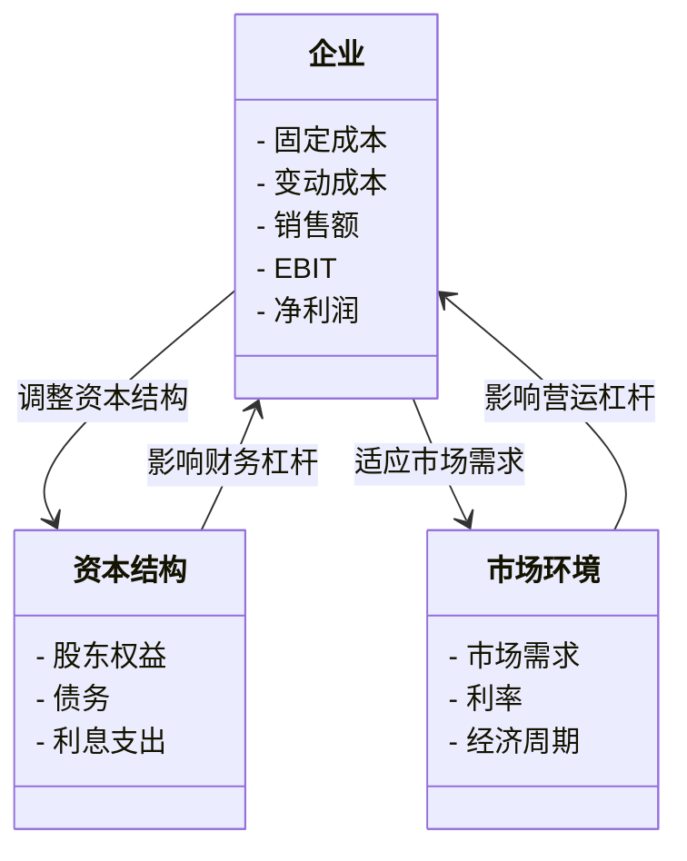

                 


# 彼得林奇对公司营运杠杆与财务杠杆组合效应的动态分析

## 关键词：彼得·林奇、营运杠杆、财务杠杆、组合效应、动态分析

## 摘要：本文深入分析了彼得·林奇对公司营运杠杆和财务杠杆组合效应的动态分析方法。通过定义和特点、数学模型、动态变化分析、系统架构设计、实际案例分析，以及最佳实践等多维度，全面阐述了如何理解和应用这些杠杆效应来优化企业价值和投资决策。本文适合金融从业者、企业管理者和技术研究人员阅读。

---

## 第一部分：背景介绍与核心概念

### 第1章：营运杠杆与财务杠杆的定义与特点

#### 1.1 营运杠杆的定义与特点

##### 1.1.1 营运杠杆的定义
营运杠杆是指企业在经营活动中，通过固定成本和变动成本的结合，利用销售额的变化来影响息税前利润（EBIT）的能力。它反映了企业在经营活动中对销售变化的放大效应。

##### 1.1.2 营运杠杆的核心特征
- **固定成本的存在**：营运杠杆的来源是企业存在固定成本，如租金、 salaries 等。
- **销售变化的放大效应**：当销售额增加时，营运杠杆会放大利润增长；当销售额下降时，营运杠杆会放大利润下降。

##### 1.1.3 营运杠杆与财务杠杆的区别
营运杠杆是经营性杠杆，与企业经营活动中固定成本和变动成本的结构有关；而财务杠杆是财务性杠杆，与企业资本结构中债务和股权的比例有关。

#### 1.2 财务杠杆的定义与特点

##### 1.2.1 财务杠杆的定义
财务杠杆是指企业在融资活动中，通过使用债务融资来放大股东权益回报的能力。当企业使用债务融资时，固定利息支出的存在使得净利润的变化幅度大于息税前利润（EBIT）的变化幅度。

##### 1.2.2 财务杠杆的核心特征
- **固定利息支出的存在**：财务杠杆的来源是企业存在固定利息支出，如债券利息。
- **EBIT变化对净利润的影响**：当EBIT增加时，财务杠杆会放大净利润的增长；当EBIT下降时，财务杠杆会放大净利润的下降。

##### 1.2.3 财务杠杆与营运杠杆的联系
营运杠杆和财务杠杆都通过固定成本的存在影响企业的收益结构。营运杠杆影响EBIT，财务杠杆影响净利润。两者的结合决定了企业的整体杠杆效应。

#### 1.3 营运杠杆与财务杠杆的组合效应

##### 1.3.1 组合效应的定义
组合效应是指营运杠杆和财务杠杆共同作用时，对企业整体收益的影响。这种组合效应可以通过杠杆系数的乘积来量化。

##### 1.3.2 组合效应的数学表达式
$$ \text{组合杠杆系数} = \text{营运杠杆系数} \times \text{财务杠杆系数} $$

##### 1.3.3 组合效应对企业价值的影响
组合效应会放大企业收益的波动性。当企业处于高增长阶段时，组合效应可以放大收益增长；当企业处于低增长阶段时，组合效应会放大收益下降。因此，合理管理组合效应是企业风险管理的重要内容。

### 第2章：营运杠杆与财务杠杆的动态分析框架

#### 2.1 动态分析的背景与意义

##### 2.1.1 动态分析的必要性
企业经营环境不断变化，如市场需求波动、成本变化、政策调整等，都会影响营运杠杆和财务杠杆的效果。因此，静态分析无法满足企业风险管理的需求。

##### 2.1.2 动态分析的目标
通过动态分析，可以更好地理解营运杠杆和财务杠杆在不同经营环境下的表现，从而优化资本结构，提高企业价值。

##### 2.1.3 动态分析的适用范围
适用于所有需要进行杠杆管理的企业，特别是资本密集型行业、周期性行业和高成长行业。

#### 2.2 动态分析的核心要素

##### 2.2.1 营运杠杆的动态变化
营运杠杆的动态变化主要受市场需求、成本结构和生产效率的影响。企业可以通过调整产品结构、优化成本控制来影响营运杠杆。

##### 2.2.2 财务杠杆的动态变化
财务杠杆的动态变化主要受资本结构、债务成本和企业信用评级的影响。企业可以通过调整债务规模和资本结构来优化财务杠杆。

##### 2.2.3 组合效应的动态变化
组合效应的动态变化是营运杠杆和财务杠杆动态变化的综合结果。企业需要通过动态调整资本结构和经营策略来优化组合效应。

#### 2.3 动态分析的方法论

##### 2.3.1 定性分析方法
- 通过行业分析、竞争对手分析和企业自身经营状况分析，判断营运杠杆和财务杠杆的动态变化趋势。
- 例如，如果行业需求持续增长，企业可以通过增加债务融资来放大收益增长。

##### 2.3.2 定量分析方法
- 使用杠杆系数模型，量化营运杠杆和财务杠杆的动态变化。
- 例如，使用历史数据拟合杠杆系数模型，预测未来的杠杆效应。

##### 2.3.3 综合分析方法
- 结合定性和定量分析方法，构建动态杠杆效应分析框架。
- 例如，结合行业趋势和企业财务数据，动态调整资本结构。

---

## 第二部分：营运杠杆与财务杠杆的数学模型与公式

### 第3章：营运杠杆的数学模型

#### 3.1 营运杠杆的基本公式

##### 3.1.1 营运杠杆系数的计算公式
$$ \text{营运杠杆系数} = \frac{\text{EBIT变化百分比}}{\text{销售额变化百分比}} $$

##### 3.1.2 营运杠杆系数的公式推导
假设企业销售额为 \( S \)，固定成本为 \( FC \)，变动成本率为 \( V \)。
则：
$$ EBIT = S \times (1 - V) - FC $$
对 \( S \) 求导：
$$ \frac{dEBIT}{dS} = 1 - V $$
因此：
$$ \text{营运杠杆系数} = \frac{1 - V}{1} = 1 - V $$

#### 3.2 营运杠杆的动态变化模型

##### 3.2.1 营运杠杆系数的动态变化公式
$$ \frac{d}{dS} \left( \frac{EBIT}{S} \right) = \text{营运杠杆系数} - 1 $$

---

## 第三部分：系统分析与架构设计

### 第4章：系统分析与架构设计方案

#### 4.1 问题场景介绍
企业需要动态调整资本结构，优化营运杠杆和财务杠杆的组合效应，以应对市场需求波动和经营环境变化。

#### 4.2 系统功能设计（领域模型）



#### 4.3 系统架构设计


---

## 第四部分：项目实战

### 第5章：项目实战

#### 5.1 环境安装
- 安装Python和相关库（如numpy、pandas、matplotlib）。

#### 5.2 核心代码实现

```python
import numpy as np
import pandas as pd
import matplotlib.pyplot as plt

# 示例数据
sales = np.array([100, 200, 300, 400, 500])
fixed_cost = 100
variable_cost_rate = 0.5

# 计算EBIT
ebit = sales * (1 - variable_cost_rate) - fixed_cost

# 计算营运杠杆系数
operating_leverage = (ebit / sales).mean()

# 计算财务杠杆系数
debt = 200
interest_rate = 0.05
net_profit = (ebit - debt * interest_rate) / sales

financial_leverage = (ebit / net_profit).mean()

# 组合杠杆系数
combination_leverage = operating_leverage * financial_leverage

print("营运杠杆系数:", operating_leverage)
print("财务杠杆系数:", financial_leverage)
print("组合杠杆系数:", combination_leverage)

# 可视化
plt.plot(sales, ebit, label='EBIT')
plt.plot(sales, net_profit, label='Net Profit')
plt.xlabel('Sales')
plt.ylabel('Profit')
plt.legend()
plt.show()
```

#### 5.3 案例分析
假设某企业销售额为500万元，固定成本为100万元，变动成本率为40%，债务为200万元，利率为5%。计算营运杠杆、财务杠杆和组合杠杆系数。

---

## 第五部分：结论与展望

### 6.1 小结
- 营运杠杆和财务杠杆的组合效应是企业风险管理的重要内容。
- 动态分析方法能够帮助企业更好地应对经营环境的变化。

### 6.2 注意事项
- 营运杠杆和财务杠杆的组合效应可能会放大企业的收益波动性，需要谨慎管理。
- 动态分析需要结合企业的实际情况，合理选择分析方法。

### 6.3 拓展阅读
- 《彼得·林奇的投资哲学》
- 《公司财务：理论与实践》

---

通过以上分析，我们深入探讨了彼得·林奇对公司营运杠杆与财务杠杆组合效应的动态分析方法，为企业优化资本结构和风险管理提供了理论依据和实践指导。

