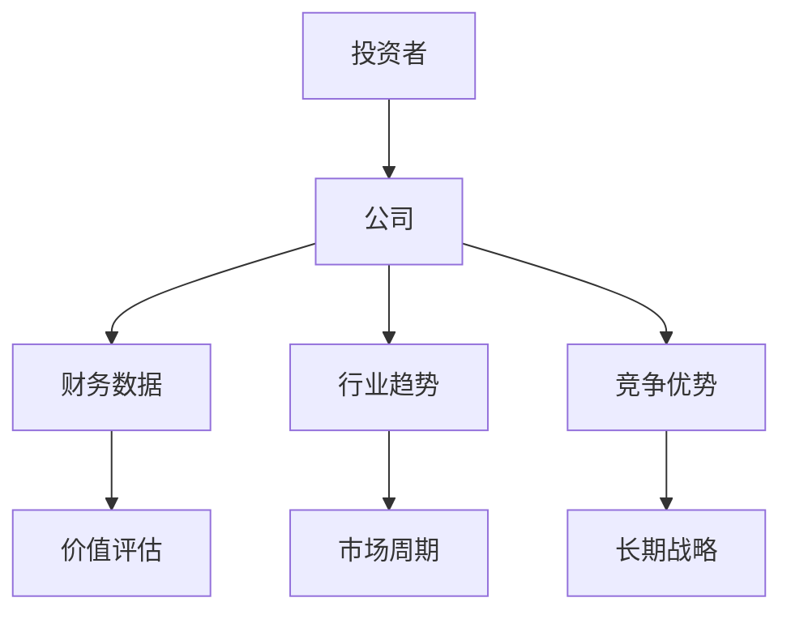
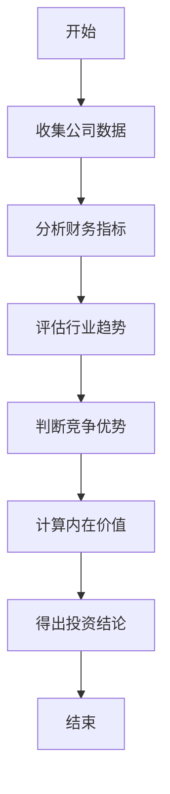
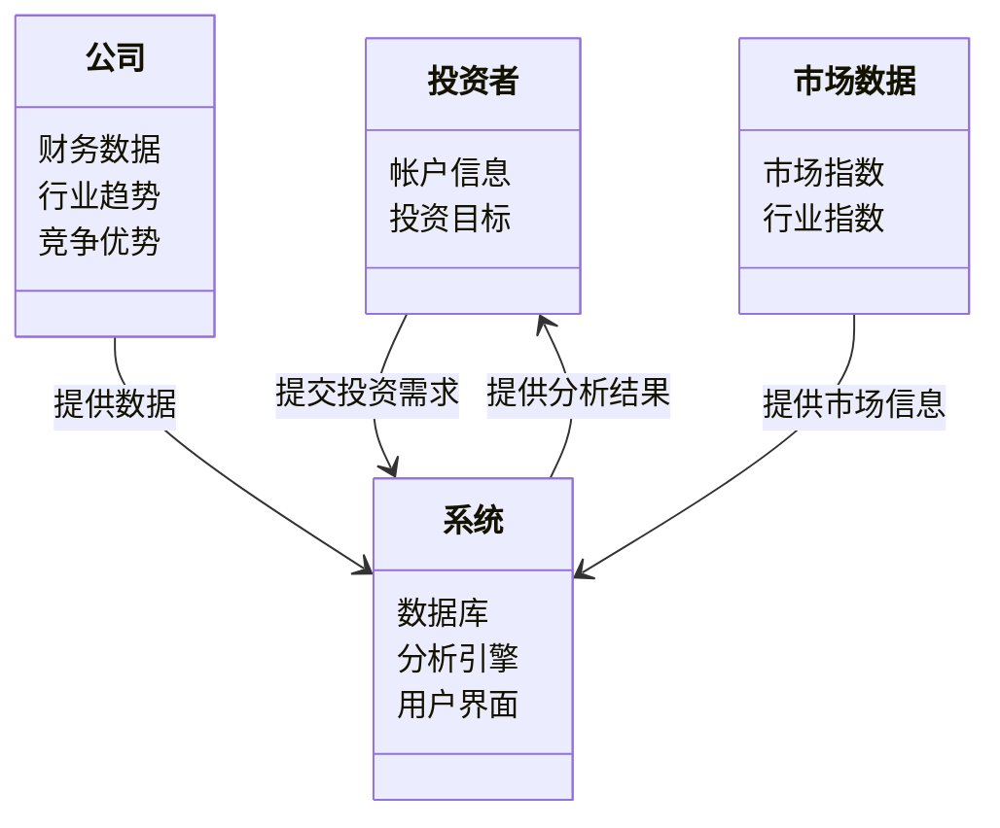
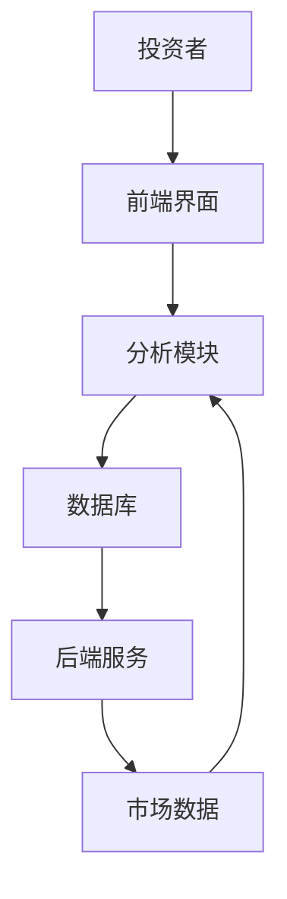
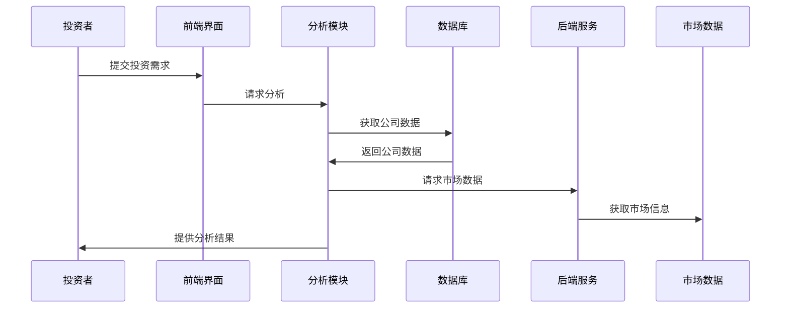

                 


# 彼得林奇对公司长期战略的分析

## 关键词：彼得·林奇，长期战略分析，投资策略，价值投资，基本面分析

## 摘要：本文深入分析了彼得·林奇的长期战略分析方法，探讨其投资理念、分析框架和实际应用。通过详细的技术博客形式，结合专业术语和实际案例，全面解析了彼得·林奇如何评估公司长期价值，为投资者提供实用的策略建议。

---

# 第1章: 彼得·林奇投资理念概述

## 1.1 彼得·林奇及其投资风格

### 1.1.1 彼得·林奇的生平简介

彼得·林奇（Peter Lynch）是全球最著名的职业基金经理之一，以其在麦哲伦基金（Fidelity Magellan）的卓越表现而闻名。他于1977年加入该基金并管理至1990年，期间基金年平均回报率高达29%，远超市场平均水平。林奇的投资风格以价值投资和成长投资相结合著称，注重对公司基本面的深入分析。

### 1.1.2 林奇的投资哲学与理念

林奇认为，成功的投资取决于对公司长期价值的准确评估。他强调“价值陷阱”的概念，即一些看似便宜的股票可能因为行业衰退或管理不善而难以恢复。林奇的投资哲学包括以下几点：

- **长期视角**：关注公司的长期竞争优势和行业地位。
- **基本面分析**：通过财务数据、行业趋势和管理层能力评估公司价值。
- **分散投资**：避免过度集中，降低风险。
- **逆向思维**：在市场低迷时寻找被低估的机会。

### 1.1.3 林奇投资风格的核心特征

- **价值与成长并重**：林奇既关注低估值股票，也看好具有高增长潜力的公司。
- **行业深度分析**：他倾向于投资那些处于上升周期且具备竞争优势的行业。
- **风险管理**：通过分散投资和严格的基本面分析来控制风险。

---

## 1.2 长期战略分析的定义与背景

### 1.2.1 长期战略分析的定义

长期战略分析是指对公司未来3-5年甚至更长时间的发展前景进行深入评估，以确定其在行业中的地位和潜在价值。这种方法强调对公司基本面、行业趋势和竞争优势的全面分析。

### 1.2.2 长期战略分析的背景与重要性

随着全球经济的不确定性增加，投资者需要更加注重长期战略分析。通过评估公司的长期发展潜力，投资者可以在市场波动中做出更明智的决策。

### 1.2.3 林奇分析方法的核心要素

- **财务数据**：收入、利润、负债等关键指标。
- **行业趋势**：行业周期、市场需求和技术进步。
- **竞争优势**：成本优势、品牌影响力和技术壁垒。

---

## 1.3 林奇分析方法的实际应用案例

### 1.3.1 麦哲伦基金的成功经验

林奇在麦哲伦基金的成功部分归功于他对公司基本面的深入分析。例如，他通过分析公司的财务报表和行业趋势，成功投资于一些被低估的公司，如可口可乐和IBM。

### 1.3.2 林奇的经典投资案例分析

- **可口可乐案例**：林奇发现可口可乐的市盈率较低，且公司在饮料行业具有强大的竞争优势。他预测公司未来将保持稳定的增长，最终实现可观的回报。
- **IBM案例**：林奇通过分析IBM的财务数据和行业地位，认为公司在技术领域具有强大的竞争优势，值得长期投资。

---

## 1.4 本章小结

彼得·林奇的投资理念和长期战略分析方法为投资者提供了宝贵的启示。通过深入分析公司的基本面和行业趋势，投资者可以在复杂的市场环境中找到优质的投资机会。

---

# 第2章: 长期战略分析的核心概念与联系

## 2.1 长期战略分析的核心概念

### 2.1.1 价值评估的核心公式

林奇使用多种模型来评估公司的内在价值，其中最常用的是市盈率（P/E）和市净率（P/B）模型。

$$\text{市盈率} = \frac{\text{市场价格}}{\text{每股收益}}$$
$$\text{市净率} = \frac{\text{市场价格}}{\text{每股净资产}}$$

### 2.1.2 市场周期与公司估值的关系

林奇认为，市场周期会影响公司的估值，但在市场低迷时，优质公司的长期价值会被低估。因此，投资者应关注公司长期的盈利能力和行业地位，而非短期市场波动。

### 2.1.3 竞争优势的动态变化

林奇强调竞争优势的重要性。他通过分析公司的成本优势、品牌影响力和技术壁垒，评估其在行业中的长期地位。

---

## 2.2 核心概念的对比分析

### 2.2.1 价值投资与成长投资的对比

| **方面** | **价值投资** | **成长投资** |
|----------|--------------|--------------|
| 核心目标 | 寻找被低估的股票 | 寻找高增长潜力的股票 |
| 风险偏好 | 较低 | 较高 |
| 投资期限 | 长期 | 长期 |

### 2.2.2 不同行业周期的分析框架

| **行业周期阶段** | **分析重点** |
|------------------|--------------|
| 上升周期 | 行业增长潜力和公司竞争优势 |
| 下降周期 | 公司的成本控制和盈利能力 |

### 2.2.3 公司财务指标的权重分配

| **财务指标** | **权重** | **分析重点** |
|--------------|----------|--------------|
| 净利润 | 高 | 公司盈利能力 |
| 负债率 | 中 | 公司财务健康状况 |
| 收入增长率 | 高 | 公司增长潜力 |

---

## 2.3 林奇分析方法的ER实体关系图



---

## 2.4 本章小结

通过对比分析和ER实体关系图，我们可以清晰地看到长期战略分析的核心要素及其相互关系。林奇的方法强调对公司基本面和行业趋势的深入分析，以评估其长期价值。

---

# 第3章: 长期战略分析的算法原理

## 3.1 林奇分析方法的数学模型

### 3.1.1 市盈率模型

$$\text{市盈率} = \frac{\text{市场价格}}{\text{每股收益}}$$

### 3.1.2 市净率模型

$$\text{市净率} = \frac{\text{市场价格}}{\text{每股净资产}}$$

### 3.1.3 内在价值计算模型

$$\text{内在价值} = \frac{\text{净利润} \times (1 + \text{增长率})}{\text{贴现率} - \text{增长率}}$$

---

## 3.2 算法流程图



---

## 3.3 算法实现代码示例

```python
def calculate_intrinsic_value(net_profit, growth_rate, required_return):
    return (net_profit * (1 + growth_rate)) / (required_return - growth_rate)
```

---

## 3.4 本章小结

通过数学模型和算法流程图，我们可以清晰地看到林奇分析方法的逻辑。投资者可以通过这些工具快速评估公司的内在价值，做出更明智的投资决策。

---

# 第4章: 系统分析与架构设计方案

## 4.1 问题场景介绍

### 4.1.1 问题背景

在当前市场环境下，投资者需要一种系统化的分析方法来评估公司的长期价值。林奇的分析方法提供了一个全面的框架，但其复杂性使得投资者需要一个系统化的工具来辅助决策。

---

## 4.2 系统功能设计

### 4.2.1 领域模型设计



---

## 4.3 系统架构设计



---

## 4.4 系统交互设计



---

## 4.5 本章小结

通过系统分析和架构设计，我们可以构建一个高效的工具，帮助投资者更好地应用林奇的分析方法。系统的各个模块协同工作，确保分析结果的准确性和及时性。

---

# 第5章: 项目实战与案例分析

## 5.1 环境安装与配置

### 5.1.1 系统需求

- 操作系统：Windows 10或更高版本，或macOS 10.15或更高版本
- 内存：4GB或以上
- 处理器：Intel Pentium或更高，或AMD相当的处理器
- Python版本：3.6或更高

### 5.1.2 安装Python环境

使用Anaconda安装Python环境：

```bash
conda create -n fin_analysis python=3.9
conda activate fin_analysis
```

---

## 5.2 核心代码实现

### 5.2.1 数据收集模块

```python
import pandas as pd

def collect_data(company):
    # 收集公司财务数据和行业趋势
    return pd.DataFrame({'Revenue': [1000, 1200, 1300], 
                         'Net Profit': [100, 120, 130], 
                         'Growth Rate': [20, 30, 35]})
```

### 5.2.2 分析模块

```python
def analyze(company_data):
    # 计算市盈率和市净率
    pe = company_data['Revenue'] / company_data['Net Profit']
    pb = company_data['Revenue'] / company_data['Net Asset']
    return pe, pb
```

---

## 5.3 案例分析与解读

### 5.3.1 案例背景

假设我们选择一家科技公司进行分析，收集其过去三年的财务数据和行业趋势。

### 5.3.2 数据分析

```python
data = collect_data('Tech Corp')
pe, pb = analyze(data)
print(pe, pb)
```

---

## 5.4 本章小结

通过项目实战，我们可以更好地理解林奇分析方法的实际应用。代码实现和案例分析帮助投资者掌握工具的使用，并能够实际应用到投资决策中。

---

# 第6章: 总结与最佳实践

## 6.1 小结

彼得·林奇的长期战略分析方法为投资者提供了宝贵的工具。通过深入分析公司的基本面和行业趋势，投资者可以更好地评估公司的长期价值。

---

## 6.2 最佳实践

- **持续学习**：市场环境不断变化，投资者需要不断学习新的知识和工具。
- **分散投资**：避免过度集中，降低投资风险。
- **长期视角**：关注公司的长期价值，而非短期市场波动。

---

## 6.3 注意事项

- **数据质量**：确保数据的准确性和及时性。
- **风险管理**：合理控制投资风险，避免过度杠杆。
- **持续监控**：定期评估投资组合，及时调整策略。

---

## 6.4 拓展阅读

- 《彼得·林奇的成功投资法则》
- 《投资学基础》
- 《长期投资策略》

---

## 6.5 本章小结

通过总结和最佳实践，我们可以更好地应用林奇的分析方法，做出更明智的投资决策。

---

# 结语

彼得·林奇的长期战略分析方法为投资者提供了宝贵的工具和启示。通过深入分析公司的基本面和行业趋势，投资者可以在复杂的市场环境中找到优质的投资机会。希望本文能为您提供有价值的见解，并在实际投资中取得成功。

