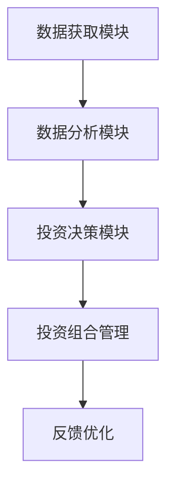
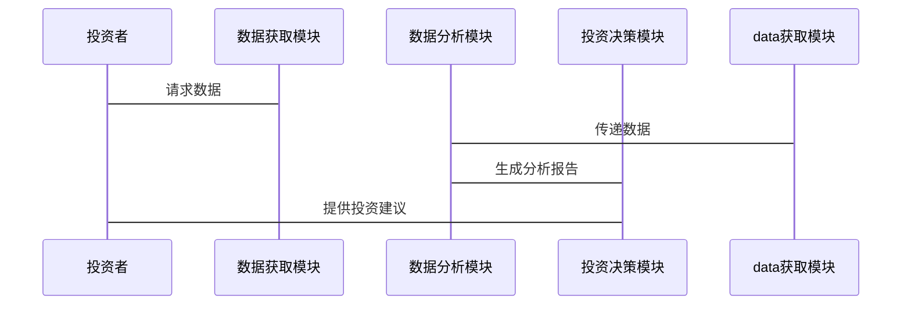

                 


# 彼得林奇的"价值投资"在人工智能时代的调整

## 关键词：价值投资、人工智能、彼得林奇、投资策略、机器学习、数据分析、系统架构

## 摘要：本文探讨了价值投资在人工智能时代的调整策略，分析了彼得林奇的价值投资理念如何与AI技术相结合，提出了基于机器学习和大数据分析的投资模型，优化了投资决策过程，并通过实战案例展示了系统的实现与应用。

---

# 第1章: 引言

## 1.1 价值投资的定义与核心思想

### 1.1.1 价值投资的定义
价值投资是一种以企业基本面分析为基础的投资策略，旨在通过识别被市场低估的企业进行长期投资。其核心理念是寻找具有持续竞争优势和良好治理结构的企业，并以合理的价格买入并长期持有。

### 1.1.2 彼得·林奇的价值投资理念
彼得·林奇是价值投资领域的代表人物，他强调通过深入研究企业基本面，寻找具有成长潜力的公司，并在市场恐慌时买入，市场狂热时卖出。

### 1.1.3 价值投资的核心原则
- 专注于企业的内在价值，而非市场波动。
- 长期持有优质资产，避免频繁交易。
- 通过分散投资降低风险。

## 1.2 价值投资的历史发展

### 1.2.1 价值投资的起源
价值投资起源于20世纪初，本杰明·格雷厄姆和戴维·多德是该领域的先驱者。他们提出“安全边际”概念，即以低于内在价值的价格买入股票。

### 1.2.2 彼得·林奇的投资风格
彼得·林奇继承并发展了格雷厄姆的价值投资理念，特别注重对企业基本面的深入分析和对管理层的信任。他的投资策略强调长期持有优质企业，并在市场波动中进行调整。

### 1.2.3 价值投资的现代演变
随着金融市场的复杂化和信息技术的发展，价值投资逐渐从传统的企业基本面分析扩展到结合技术分析和量化投资的方法。

## 1.3 价值投资与AI时代的结合

### 1.3.1 AI技术对投资的影响
人工智能技术的应用极大地提升了数据处理和分析能力，使得投资决策更加智能化和精准化。AI能够快速处理海量数据，发现传统方法难以察觉的投资机会。

### 1.3.2 价值投资在AI时代的调整方向
传统的价值投资依赖于人工分析和经验判断，而AI技术的应用使得投资决策更加数据化和自动化。价值投资需要结合AI技术，利用大数据分析和机器学习模型优化投资策略。

### 1.3.3 价值投资与AI技术的融合趋势
未来的投资领域将是传统价值投资与AI技术深度融合的时代。AI不仅能够辅助投资决策，还能够通过实时数据分析动态调整投资策略，提升投资效率和收益。

---

# 第2章: 价值投资的核心原理与AI技术的关联

## 2.1 价值投资的核心原理

### 2.1.1 企业基本面分析
企业基本面分析包括对企业财务状况、盈利能力、成长潜力和行业地位的评估。传统方法依赖财务报表分析和行业研究，而AI技术可以通过自然语言处理和大数据分析提高分析效率和准确性。

### 2.1.2 市场情绪与估值
市场情绪分析是投资决策的重要组成部分。传统方法依赖投资者的经验和市场趋势判断，而AI技术可以通过社交媒体分析、新闻数据挖掘等手段，实时捕捉市场情绪变化，辅助估值。

### 2.1.3 长期投资与复利效应
价值投资强调长期投资，通过复利效应实现财富增值。AI技术可以帮助投资者更好地识别长期投资机会，优化资产配置，降低投资风险。

## 2.2 AI技术在投资中的应用

### 2.2.1 数据挖掘与分析
AI技术能够处理海量数据，识别潜在投资机会。通过大数据分析，AI可以帮助投资者发现市场趋势和企业基本面的变化。

### 2.2.2 机器学习与预测模型
机器学习算法可以用于预测股票价格走势和市场波动。通过训练历史数据，AI模型能够识别市场模式，辅助投资决策。

### 2.2.3 自然语言处理在财报分析中的应用
自然语言处理技术可以帮助投资者快速理解企业财报，识别财务风险和成长潜力。通过分析文本数据，AI能够提供更加精准的企业基本面评估。

## 2.3 价值投资与AI技术的结合

### 2.3.1 AI如何辅助企业基本面分析
AI技术可以通过机器学习模型自动分析企业的财务数据，识别潜在风险和成长机会。通过大数据分析，AI能够提供更加全面的企业基本面评估。

### 2.3.2 AI在市场情绪分析中的应用
AI可以通过社交媒体、新闻媒体等渠道实时捕捉市场情绪变化，辅助投资者做出更明智的投资决策。

### 2.3.3 AI如何优化投资组合管理
通过机器学习算法，AI能够根据市场变化动态调整投资组合，优化资产配置，降低投资风险。

---

# 第3章: 价值投资在AI时代的调整策略

## 3.1 数据驱动的投资决策

### 3.1.1 数据收集与清洗
投资决策需要依赖高质量的数据支持。AI技术可以帮助投资者收集、清洗和整理海量数据，确保数据的准确性和完整性。

### 3.1.2 数据分析与建模
通过大数据分析和机器学习建模，AI能够识别数据中的潜在规律，辅助投资者做出更精准的投资决策。

### 3.1.3 数据驱动的决策优化
AI技术能够根据实时数据动态调整投资策略，优化投资组合，提升投资收益。

## 3.2 AI算法在投资组合管理中的应用

### 3.2.1 机器学习算法简介
机器学习算法包括监督学习、无监督学习和强化学习等。这些算法可以用于预测股票价格、识别市场趋势和优化投资组合。

### 3.2.2 基于AI的投资组合优化
通过机器学习算法，AI能够根据市场变化动态调整投资组合，优化资产配置，降低投资风险。

### 3.2.3 AI在风险管理中的应用
AI可以通过实时监控市场波动和企业基本面变化，识别潜在风险，制定风险管理策略。

## 3.3 价值投资的AI调整策略

### 3.3.1 基于AI的企业估值模型
通过机器学习模型，AI能够根据企业财务数据、行业地位和市场环境等因素，自动计算企业的内在价值。

### 3.3.2 AI驱动的市场趋势预测
AI可以通过分析历史数据和市场信号，预测未来的市场趋势，辅助投资者做出更明智的投资决策。

### 3.3.3 AI在投资策略动态调整中的应用
通过实时数据分析，AI能够根据市场变化动态调整投资策略，优化投资组合，提升投资收益。

---

# 第4章: 价值投资的系统架构与AI技术的融合

## 4.1 价值投资系统的模块划分

### 4.1.1 数据获取模块
数据获取模块负责从多个数据源收集股票价格、财务报表、市场新闻等数据。

### 4.1.2 数据分析模块
数据分析模块对收集到的数据进行清洗、处理和建模分析，识别潜在投资机会。

### 4.1.3 投资决策模块
投资决策模块根据分析结果生成投资建议，指导投资组合的构建和调整。

## 4.2 AI技术在系统中的应用

### 4.2.1 数据预处理与特征提取
数据预处理模块负责清洗和转换数据，特征提取模块通过分析数据特征，识别潜在投资信号。

### 4.2.2 机器学习模型构建
通过机器学习算法，系统构建预测模型，用于股票价格预测和市场趋势分析。

### 4.2.3 系统输出与反馈机制
系统输出投资建议，并根据实际投资结果进行反馈优化，提升模型性能。

## 4.3 系统架构的优化与调整

### 4.3.1 系统模块的协同工作
通过合理设计系统模块之间的协同关系，确保系统高效运行。

### 4.3.2 AI算法的动态调整
根据市场变化和投资需求，动态调整机器学习算法和模型参数。

### 4.3.3 系统的可扩展性设计
系统设计需要具备良好的可扩展性，能够适应未来更多的数据源和算法模型。

---

# 第5章: 价值投资的AI实战案例

## 5.1 项目介绍

### 5.1.1 项目背景
本项目旨在利用AI技术优化价值投资策略，构建一个基于机器学习的投资决策系统。

### 5.1.2 项目目标
通过大数据分析和机器学习建模，优化企业估值和投资组合管理，提升投资收益。

## 5.2 系统功能设计

### 5.2.1 数据获取模块
- 数据源：股票价格、财务报表、新闻媒体等。
- 功能：从多个数据源获取数据，并进行清洗和预处理。

### 5.2.2 数据分析模块
- 功能：对企业基本面和市场情绪进行分析，识别投资机会。

### 5.2.3 投资决策模块
- 功能：根据分析结果生成投资建议，指导投资组合的构建和调整。

## 5.3 系统架构设计

### 5.3.1 系统架构图


## 5.4 系统接口设计

### 5.4.1 数据获取接口
接口功能：从数据源获取股票价格、财务报表等数据。

### 5.4.2 数据分析接口
接口功能：对企业基本面和市场情绪进行分析，生成分析报告。

## 5.5 系统交互设计

### 5.5.1 交互流程图


## 5.6 项目实战

### 5.6.1 环境安装
安装Python、机器学习库（如scikit-learn、TensorFlow）和数据处理工具（如Pandas、NumPy）。

### 5.6.2 核心实现代码
```python
import pandas as pd
from sklearn.model_selection import train_test_split
from sklearn.linear_model import LinearRegression

# 数据获取与预处理
data = pd.read_csv('stock_data.csv')
X = data[['revenue', 'profit_margin']]
y = data['stock_price']
X_train, X_test, y_train, y_test = train_test_split(X, y, test_size=0.2)

# 模型训练
model = LinearRegression()
model.fit(X_train, y_train)

# 模型预测
predictions = model.predict(X_test)
```

### 5.6.3 代码应用解读与分析
通过机器学习模型，系统能够根据企业的收入和利润率预测股票价格，辅助投资者做出投资决策。

### 5.6.4 实际案例分析
以某企业为例，通过机器学习模型分析其财务数据和市场情绪，预测其股票价格走势，并生成投资建议。

## 5.7 项目小结

### 5.7.1 经验总结
通过本项目，我们验证了AI技术在价值投资中的应用潜力，证明了基于机器学习的投资模型能够有效提升投资决策的准确性和效率。

### 5.7.2 注意事项
在实际应用中，需要注意数据质量、模型选择和实时性问题，确保系统的稳定性和可靠性。

---

# 第6章: 最佳实践与未来展望

## 6.1 最佳实践 tips

### 6.1.1 数据处理
确保数据的准确性和完整性，选择合适的数据预处理方法。

### 6.1.2 模型选择
根据具体问题选择合适的机器学习算法，避免盲目追求复杂模型。

### 6.1.3 系统优化
通过模块化设计和动态调整优化系统性能，确保系统的高效运行。

## 6.2 小结

### 6.2.1 价值投资与AI的结合
通过AI技术的应用，价值投资策略得到了优化和提升，投资决策更加智能化和精准化。

### 6.2.2 投资效率的提升
AI技术的应用极大地提升了投资效率，使得投资者能够更快地捕捉市场机会，优化投资组合。

## 6.3 未来展望

### 6.3.1 AI技术的进一步发展
随着AI技术的不断进步，投资决策将更加智能化和自动化，投资策略将更加多样化和个性化。

### 6.3.2 价值投资的未来发展
价值投资将继续与AI技术深度融合，通过技术创新和数据驱动实现更高效的投资决策，创造更大的投资收益。

---

# 附录

## 附录A: 术语表
- 价值投资：一种以企业基本面分析为基础的投资策略，旨在通过识别被市场低估的企业进行长期投资。
- 机器学习：一种人工智能技术，通过数据训练模型，用于预测和分类。
- 数据挖掘：从大量数据中提取有用信息的过程。

## 附录B: 工具推荐
- 数据处理工具：Pandas、NumPy
- 机器学习库：scikit-learn、TensorFlow
- 数据可视化工具：Matplotlib、Seaborn

## 附录C: 参考文献
- 《彼得·林奇的投资智慧》
- 《机器学习实战》
- 《数据挖掘导论》

---

通过以上内容，我们详细探讨了价值投资在人工智能时代的调整策略，分析了AI技术对投资决策的深远影响，并通过实战案例展示了系统的实现与应用。希望本文能够为投资者和AI技术从业者提供有价值的参考和启发。

