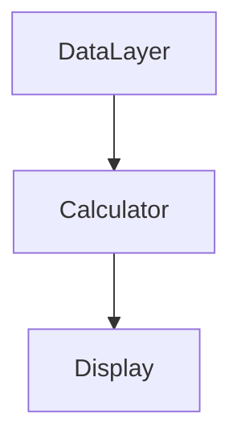

                 


# 彼得林奇的"价值投资"在负利率时代的策略重构

> 关键词：价值投资，负利率，投资策略，彼得·林奇，经济分析

> 摘要：本文深入探讨了彼得·林奇的价值投资理论在负利率环境下的重构策略。通过分析负利率对投资环境的影响，结合传统价值投资的核心要素，提出了一套适应当前经济形势的新策略，包括投资理念、数学模型、算法设计、系统架构和实战案例。本文旨在为投资者提供理论支持和实践指导，帮助他们在复杂多变的经济环境中实现稳健投资。

---

## 第一部分：引言

### 1.1 负利率时代的投资挑战

#### 1.1.1 负利率的定义与现状

- 负利率的定义：当短期国债收益率为负时，持有货币的机会成本为负，导致货币持有者面临损失。
- 负利率的现状：全球多个国家实施负利率政策，导致传统投资逻辑失效。
- 负利率的影响：资产价格波动加剧，传统价值评估方法失效。

#### 1.1.2 传统价值投资的局限性

- 价值投资的基本原理：寻找被低估的股票，长期持有优质企业。
- 传统策略的局限性：忽视宏观经济环境变化，无法应对负利率下的市场波动。
- 极端环境下的策略失效：在负利率时代，传统估值模型不再适用。

#### 1.1.3 本书的研究目标与意义

- 研究目标：重构价值投资策略，使其适应负利率环境。
- 研究意义：为投资者提供新的投资思路，帮助其在负利率时代实现稳健收益。

---

## 第二部分：价值投资的核心理念与传统策略

### 2.1 彼得林奇的价值投资理论

#### 2.1.1 价值投资的基本原理

- 核心理念：寻找具有持续竞争优势的企业，长期持有。
- 投资策略：关注企业的基本面，如ROE、毛利率、资产负债率等。
- 投资理念：买入并持有优质股票，长期获得超额收益。

#### 2.1.2 彼得林奇的投资策略

- 投资策略的核心要素：企业竞争优势、管理层能力、财务健康状况。
- 投资组合管理：分散投资，避免过度集中。
- 风险管理：严格控制仓位，避免重大损失。

#### 2.1.3 价值投资的核心要素与优势

- 核心要素：企业价值、竞争优势、管理层质量。
- 优势：长期稳健收益，抵御短期市场波动。

---

### 2.2 传统价值投资的局限性

#### 2.2.1 经济环境变化对传统策略的影响

- 负利率环境下的资产价格波动：债券收益率下降，股票估值上升。
- 负利率对投资组合的影响：传统债券配置面临损失，股票估值泡沫风险增加。

#### 2.2.2 负利率时代对投资策略的挑战

- 传统估值模型失效：市盈率、市净率等指标不再可靠。
- 风险偏好变化：投资者倾向于高风险资产，导致市场波动加剧。

#### 2.2.3 传统策略重构的必要性

- 需要适应新的经济环境：重新定义企业价值评估标准。
- 调整投资组合结构：增加对冲工具，降低市场波动风险。

---

## 第三部分：负利率时代的投资环境分析

### 3.1 负利率的经济影响

#### 3.1.1 负利率对资产价格的影响

- 负利率导致债券价格上升，收益率下降。
- 股票市场估值泡沫化，风险加剧。

#### 3.1.2 负利率对投资组合的影响

- 传统债券配置面临损失。
- 股票投资面临更大的波动风险。

#### 3.1.3 负利率对风险偏好的影响

- 投资者倾向于高风险资产，导致市场波动加剧。
- 资产配置分散化需求增加。

---

## 第四部分：负利率环境下价值投资策略重构

### 4.1 投资理念的重构

#### 4.1.1 重新定义企业价值

- 在负利率环境下，企业价值的评估标准需要调整。
- 重点考虑企业的现金流稳定性，而非单纯的盈利能力。

#### 4.1.2 股票估值模型的调整

- 传统估值模型的局限性：市盈率、市净率失效。
- 新的估值模型：现金流折现模型（DCF）的变种。

#### 4.1.3 投资策略的调整

- 增加对冲工具，如期权、期货。
- 降低股票仓位，增加现金配置。

### 4.2 投资组合管理的重构

#### 4.2.1 投资组合的再平衡

- 定期调整资产配置比例，保持风险可控。
- 增加短期债券配置，降低长期债券风险。

#### 4.2.2 风险管理的加强

- 设置止损点，避免重大损失。
- 严格控制杠杆使用，避免过度杠杆化。

#### 4.2.3 资产配置的多样化

- 增加对新兴市场的配置，分散风险。
- 增加对另类资产的配置，如房地产信托、基础设施投资。

---

## 第五部分：数学模型与算法设计

### 5.1 价值投资的数学模型

#### 5.1.1 现金流折现模型（DCF）

- 模型公式：
  $$
  \text{企业价值} = \sum_{t=1}^{n} \frac{\text{现金流}_t}{(1 + r)^t} + \frac{\text{残值}}{(1 + r)^n}
  $$
- 调整公式：在负利率环境下，折现率r可能为负，导致模型需要重新设计。

#### 5.1.2 现金流预测

- 预测方法：基于历史现金流和行业趋势，预测未来现金流。

### 5.2 算法设计

#### 5.2.1 现金流折现算法

- 算法步骤：
  1. 收集企业历史现金流数据。
  2. 预测未来现金流。
  3. 计算折现率。
  4. 计算企业价值。
  5. 比较当前股价与企业价值，决定是否投资。

#### 5.2.2 投资组合优化算法

- 算法步骤：
  1. 确定资产类别。
  2. 计算各类别风险收益比。
  3. 确定最优资产配置比例。
  4. 定期再平衡投资组合。

---

## 第六部分：系统架构与项目实战

### 6.1 系统架构设计

#### 6.1.1 系统功能设计

- 领域模型：企业价值评估、投资组合管理、风险管理。
- 系统架构：分层架构，包括数据层、计算层、展示层。

#### 6.1.2 系统架构图



#### 6.1.3 系统接口设计

- 数据接口：与股票数据库对接，获取实时数据。
- 计算接口：与量化工具对接，进行模型计算。

### 6.2 项目实战

#### 6.2.1 环境安装

- 安装Python、Pandas、NumPy、Matplotlib。

#### 6.2.2 核心代码实现

```python
import pandas as pd
import numpy as np

def calculate_enterprise_value(fcf, wacc, residual_value, n):
    """
    计算企业价值
    :param fcf: 自由现金流
    :param wacc: 加权平均资本成本
    :param residual_value: 残值
    :param n: 折现年限
    :return: 企业价值
    """
    discounted_cash_flows = []
    for t in range(1, n+1):
        discounted_cash_flows.append(fcf / (1 + wacc)**t)
    total = sum(discounted_cash_flows) + residual_value / (1 + wacc)**n
    return total
```

#### 6.2.3 代码解读与分析

- 代码功能：计算企业价值。
- 关键参数：自由现金流、加权平均资本成本、残值、折现年限。

#### 6.2.4 实际案例分析

- 案例：某科技公司股票评估。
- 步骤：数据收集、模型计算、结果分析。

---

## 第七部分：总结与展望

### 7.1 总结

- 负利率时代，价值投资策略需要重构。
- 新的策略包括：重新定义企业价值、调整投资组合、加强风险管理。

### 7.2 展望

- 未来研究方向：动态调整模型参数，适应经济环境变化。
- 投资者建议：保持灵活性，定期评估投资组合。

### 7.3 注意事项

- 风险提示：负利率环境下，市场波动加剧，投资需谨慎。
- 实战建议：结合实际市场情况，灵活调整策略。

### 7.4 拓展阅读

- 推荐书籍：《投资学》、《金融学基础》。
- 推荐文章：关于负利率环境下的投资策略调整。

---

通过以上结构，本文详细分析了彼得·林奇的价值投资理论在负利率环境下的重构策略，结合数学模型、算法设计和系统架构，为投资者提供了理论支持和实践指导。希望读者能够通过本文，更好地应对负利率时代的投资挑战。

