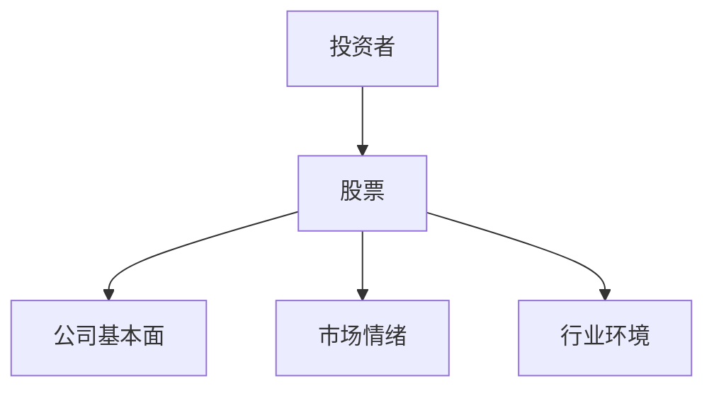
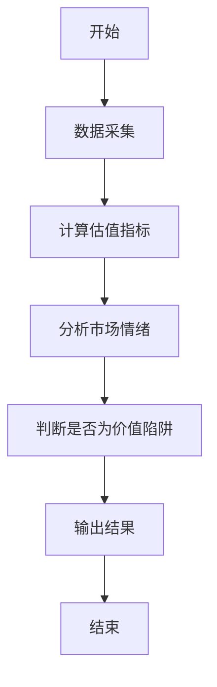

                 


# 彼得林奇的"价值陷阱"在新兴科技股中的识别

## 关键词：价值陷阱、彼得·林奇、科技股、投资策略、风险评估

## 摘要：本文深入探讨了彼得·林奇提出的“价值陷阱”概念，并结合新兴科技股的特点，分析了如何识别这些陷阱。通过技术分析、多因子模型和系统设计，提供了一套识别和规避价值陷阱的方法，帮助投资者在科技股投资中做出更明智的决策。

---

# 第一部分: 价值陷阱的背景与定义

## 第1章: 价值陷阱的定义与背景

### 1.1 价值陷阱的定义

#### 1.1.1 价值陷阱的内涵
价值陷阱是指那些表面上看似估值较低、具有吸引力的股票，实际上可能隐藏着严重的问题或风险，导致投资者陷入亏损的困境。这些股票可能因为行业衰退、公司基本面恶化或市场误判等原因，使得其估值指标（如市盈率、市净率）出现虚假的吸引力。

#### 1.1.2 彼得·林奇对价值陷阱的定义
彼得·林奇在其投资理论中强调，价值陷阱通常出现在那些看似便宜但实际缺乏成长性的公司中。他认为，投资者需要区分“烟蒂股”和“价值陷阱”，前者是被市场低估的优质公司，而后者则是基本面恶化、前景黯淡的公司。

#### 1.1.3 价值陷阱在投资中的重要性
识别价值陷阱是投资者避免重大损失的关键。特别是在科技股领域，由于行业波动大、技术更新快，价值陷阱的风险更为显著。投资者需要通过深入分析公司基本面和行业趋势，来避免被表面的低估值所迷惑。

### 1.2 价值陷阱的形成原因

#### 1.2.1 市场波动与投资者情绪
市场波动和投资者情绪是价值陷阱形成的重要因素。在市场低迷时期，一些优质科技股可能会因为恐慌性抛售而出现低估值，但这往往是暂时的。然而，一些基本面不佳的公司可能因为市场情绪的波动而被误判。

#### 1.2.2 企业基本面变化
企业自身的财务状况、盈利能力、管理团队等因素的变化，可能导致股票估值偏离其实际价值。例如，某科技公司可能因为研发投入不足或市场竞争加剧，导致其利润下降，从而成为价值陷阱。

#### 1.2.3 信息不对称与市场误判
信息不对称可能导致投资者对公司基本面的误判。新兴科技行业技术复杂，投资者可能因为缺乏专业知识而无法准确评估公司的实际价值，从而误将价值陷阱误认为是低估的股票。

### 1.3 价值陷阱与新兴科技股的关联

#### 1.3.1 新兴科技股的特点
新兴科技股通常具有高增长潜力，但也伴随着高波动性和高风险。这些股票可能因为技术创新、市场需求变化或竞争加剧而出现估值的剧烈波动。

#### 1.3.2 科技股投资中的常见误区
投资者在科技股投资中常见的误区包括过度关注短期股价波动、忽视公司基本面和行业趋势，以及盲目追求高估值的公司。

#### 1.3.3 价值陷阱在科技股中的典型表现
在科技股中，价值陷阱通常表现为低市盈率但无盈利增长、高市净率但资产质量低下，或者公司基本面恶化但股价仍被高估。

---

## 第2章: 价值陷阱的核心要素分析

### 2.1 核心概念原理

#### 2.1.1 价值陷阱的识别标准
识别价值陷阱的关键在于结合公司基本面和市场估值指标。常见的识别标准包括：

- 公司盈利能力持续下降
- 资产质量恶化（如高负债、低净资产收益率）
- 市场需求萎缩或竞争加剧
- 管理层存在问题（如频繁更换或财务造假）

#### 2.1.2 企业估值的关键指标
投资者需要关注以下估值指标：

- 市盈率（P/E）
- 市净率（P/B）
- 市销率（P/S）
- 净利润增长率
- 资产回报率（ROA）

#### 2.1.3 市场情绪与股价波动的关系
市场情绪和股价波动密切相关。在市场恐慌时，优质股可能被错杀，而价值陷阱则可能因投资者误判而被高估。

### 2.2 核心概念属性对比

#### 2.2.1 价值陷阱与价值投资的对比

| 对比维度         | 价值陷阱                          | 价值投资                          |
|------------------|-----------------------------------|-----------------------------------|
| 核心理念         | 追求低估值但实际有风险的股票       | 追求低估值且具有成长性的股票     |
| 投资策略         | 避免投资，识别并规避              | 主动寻找并投资                    |
| 风险             | 高风险，可能带来重大损失          | 低风险，长期收益稳定             |

#### 2.2.2 价值陷阱与成长股的对比

| 对比维度         | 价值陷阱                          | 成长股                            |
|------------------|-----------------------------------|-----------------------------------|
| 投资目标         | 低估值但缺乏成长性的公司          | 高增长但估值可能偏高的公司        |
| 风险             | 高，可能因公司基本面恶化而亏损    | 中等，成长性较强                  |
| 适合投资者类型   | 保守型投资者                       | 成长型投资者                      |

#### 2.2.3 价值陷阱与周期股的对比

| 对比维度         | 价值陷阱                          | 周期股                            |
|------------------|-----------------------------------|-----------------------------------|
| 投资逻辑         | 公司基本面恶化导致低估值           | 行业周期性波动导致估值偏离        |
| 风险             | 高，公司可能持续亏损               | 中等，周期性波动可预测             |
| 适合投资者类型   | 价值投资者                         | 善于判断周期性投资者              |

### 2.3 ER实体关系图



---

## 第3章: 价值陷阱识别的算法原理

### 3.1 算法原理概述

#### 3.1.1 多因子模型
多因子模型通过多个因子（如市盈率、市净率、ROE等）来评估股票的内在价值。通过综合分析多个因子，可以帮助投资者更全面地识别价值陷阱。

#### 3.1.2 股价与估值的偏离度分析
通过比较股票的当前股价与基于多因子模型计算的理论价值，可以识别股价偏离度较大的股票，这些股票可能是价值陷阱。

#### 3.1.3 市场情绪与资金流动的关联
分析市场情绪和资金流动数据，可以帮助识别因市场情绪波动导致的估值偏离，从而发现潜在的价值陷阱。

### 3.2 算法流程图



### 3.3 算法实现代码

```python
import pandas as pd
import numpy as np

def calculate_value_traps(stocks):
    traps = []
    for stock in stocks:
        # 计算市盈率
        pe = stock['profit'] / stock['price']
        # 计算市净率
        pb = stock['price'] / stock['book_value']
        # 计算ROE
        roe = stock['net_income'] / stock['equity']
        # 判断是否为价值陷阱
        if pe > 30 and pb < 1 and roe < 5%:
            traps.append(stock)
    return traps

# 示例数据
data = {
    'stock_id': ['A', 'B', 'C'],
    'price': [50, 30, 40],
    'profit': [100, 50, 80],
    'book_value': [20, 15, 25],
    'net_income': [10, 5, 8],
    'equity': [50, 25, 60]
}
df = pd.DataFrame(data)
traps = calculate_value_traps(df)
print("价值陷阱股票：", traps)
```

---

## 第4章: 价值陷阱识别的系统分析与架构设计

### 4.1 系统分析

#### 4.1.1 问题场景介绍
投资者需要一个系统来实时监控新兴科技股的市场数据，识别潜在的价值陷阱。系统需要整合公司基本面数据、市场情绪数据和行业趋势分析。

#### 4.1.2 系统功能设计
- 数据采集模块：实时采集股票数据
- 数据分析模块：计算估值指标
- 风险预警模块：识别价值陷阱

### 4.2 系统架构设计


---

## 第5章: 价值陷阱识别的项目实战

### 5.1 环境安装
安装Python和相关库（如Pandas、NumPy）。

### 5.2 核心代码实现

```python
import pandas as pd
import numpy as np

def calculate_value_traps(stocks):
    traps = []
    for stock in stocks:
        pe = stock['profit'] / stock['price']
        pb = stock['price'] / stock['book_value']
        roe = stock['net_income'] / stock['equity']
        if pe > 30 and pb < 1 and roe < 5%:
            traps.append(stock)
    return traps

# 示例数据
data = {
    'stock_id': ['A', 'B', 'C'],
    'price': [50, 30, 40],
    'profit': [100, 50, 80],
    'book_value': [20, 15, 25],
    'net_income': [10, 5, 8],
    'equity': [50, 25, 60]
}
df = pd.DataFrame(data)
traps = calculate_value_traps(df)
print("价值陷阱股票：", traps)
```

### 5.3 案例分析与解读
以某科技公司为例，分析其是否为价值陷阱。

---

## 第6章: 最佳实践与小结

### 6.1 小结
识别价值陷阱需要结合公司基本面和市场估值指标，特别是在科技股领域，投资者需要更加谨慎。

### 6.2 注意事项
- 定期更新数据和模型
- 避免过度依赖单一指标
- 结合行业趋势和市场情绪

### 6.3 拓展阅读
推荐阅读彼得·林奇的《投资之道》和《股票投资实战策略》。

---

通过以上步骤，投资者可以更好地识别新兴科技股中的价值陷阱，避免因误判而遭受损失。

