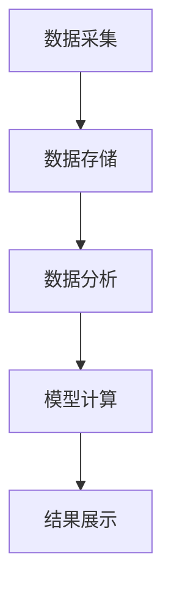

                 


# 彼得林奇的"反向思维"在中央银行政策解读中的应用

## 关键词：反向思维，中央银行，货币政策，彼得林奇，投资策略，系统架构

## 摘要：  
本文探讨了彼得林奇提出的“反向思维”在解读中央银行政策中的应用。通过分析货币政策工具、传导机制以及市场反应，结合数学模型和系统架构设计，展示了如何利用反向思维预测政策效果并制定投资策略。文章还提供了实际案例分析和系统实现方案，为读者提供了一套完整的理论与实践相结合的方法。

---

## 第1章：反向思维的起源与核心理念

### 1.1 彼得林奇与反向思维的提出  
彼得林奇是美国著名投资经理，以其逆向投资策略闻名。他提出反向思维的核心是“在别人恐惧时贪婪，在别人贪婪时恐惧”。这种思维模式强调在市场恐慌时寻找机会，在市场乐观时保持警惕。  

#### 1.1.1 反向思维的核心概念  
反向思维是一种逆向思考方法，强调关注市场非理性行为和价格偏差。其核心在于：  
1. **市场情绪分析**：识别市场的过度乐观或悲观情绪。  
2. **价格与价值背离**：寻找价格偏离内在价值的机会。  
3. **非对称性**：市场对利好和利空信息的反应程度不同。  

#### 1.1.2 反向思维在投资领域的应用  
反向思维广泛应用于资产配置、风险管理等领域。例如，在市场下跌时买入优质资产，在市场上涨时警惕潜在风险。  

---

## 第2章：中央银行政策的基本框架

### 2.1 中央银行的货币政策工具  
中央银行通过以下工具影响经济：  
1. **利率政策**：调整基准利率影响借贷成本。  
2. **货币供应量调控**：通过公开市场操作调节货币供给。  
3. **存款准备金率调整**：影响商业银行放贷能力。  

#### 2.1.1 利率政策的传导机制  
利率政策通过影响企业和个人借贷成本，进而影响投资和消费行为。  

#### 2.1.2 货币供应量调控的作用  
增加货币供应通常会刺激经济增长，但也可能引发通货膨胀。  

### 2.2 货币政策的传导机制  
货币政策通过多种渠道影响经济：  
1. **利率渠道**：降低利率会增加投资。  
2. **资产价格渠道**：降低利率会推高资产价格。  
3. **汇率渠道**：降低利率会导致本币贬值，出口增加。  

#### 2.2.1 货币政策传导机制的简化模型  
使用IS-LM模型分析货币政策的传导路径：  
$$ IS: Y = C + I + G + X - M \]  
$$ LM: M = kY - hi \]  
联立求解IS和LM方程，可以得到收入和利率的均衡值。  

---

## 第3章：反向思维在中央银行政策解读中的应用

### 3.1 反向思维的核心要素  
在解读中央银行政策时，反向思维强调：  
1. **市场情绪的逆向分析**：关注市场对政策的过度反应。  
2. **政策效果的预期偏差**：预测政策的实际效果与市场预期的差异。  
3. **市场反应的非对称性**：政策利好时市场可能过度反应，政策利空时市场可能反应不足。  

#### 3.1.1 市场情绪的逆向分析方法  
通过分析市场情绪指数（如VIX指数）判断市场恐慌程度，进而预测政策效果。  

#### 3.1.2 政策效果的非线性关系  
政策效果与市场反应之间可能存在非线性关系，反向思维可以帮助识别拐点。  

### 3.2 反向思维与货币政策效果预测  
反向思维可以用于预测货币政策的实际效果，从而制定更有效的投资策略。  

#### 3.2.1 基于反向思维的政策效果预测模型  
建立一个简化模型：  
$$ E = \alpha \cdot P + \beta \cdot Q \]  
其中，\( E \) 表示政策效果，\( P \) 表示市场预期，\( Q \) 表示政策力度。  

---

## 第4章：货币政策传导机制的数学模型

### 4.1 货币政策传导机制的简化模型  
IS-LM模型是分析货币政策传导机制的基础：  
$$ IS: Y = C + I + G + X - M \]  
$$ LM: M = kY - hi \]  

#### 4.1.1 模型的假设条件  
- 市场参与者理性预期。  
- 经济处于短期均衡状态。  

#### 4.1.2 模型的数学表达式  
联立IS和LM方程，可以得到收入 \( Y \) 和利率 \( i \) 的均衡值：  
$$ Y = \frac{C + I + G + X + hi}{1 + k} \]  
$$ i = \frac{kY - hi}{1} \]  

### 4.2 反向思维下的政策效果预测模型  
在反向思维框架下，政策效果预测模型可以表示为：  
$$ E = \alpha \cdot P + \beta \cdot Q \]  

---

## 第5章：反向思维的系统架构设计

### 5.1 系统功能设计  
一个完整的反向思维分析系统应包括以下功能模块：  
1. **数据采集模块**：获取中央银行政策和市场数据。  
2. **数据分析模块**：分析市场情绪和政策效果。  
3. **模型计算模块**：预测政策效果和市场反应。  
4. **结果展示模块**：以图表形式展示分析结果。  

### 5.2 系统架构设计  
使用Mermaid图展示系统架构：  


---

## 第6章：项目实战

### 6.1 环境安装  
安装Python、NumPy、Matplotlib等工具。  

### 6.2 核心实现代码  
以下是一个简单的政策效果预测代码示例：  
```python
import numpy as np
import matplotlib.pyplot as plt

# 模型参数
alpha = 0.8
beta = 0.2

# 数据生成
np.random.seed(123)
market_data = np.random.normal(0, 1, 100)
policy_data = np.random.normal(0, 1, 100)

# 模型计算
expected_policy_effect = alpha * market_data + beta * policy_data

# 结果展示
plt.figure(figsize=(10, 6))
plt.plot(market_data, label='Market Data')
plt.plot(policy_data, label='Policy Data')
plt.plot(expected_policy_effect, label='Expected Effect')
plt.legend()
plt.show()
```

### 6.3 实际案例分析  
以美联储加息为例，分析市场对加息的过度反应，进而预测实际政策效果。  

---

## 第7章：总结与展望

### 7.1 总结  
反向思维为解读中央银行政策提供了新的视角，尤其是在预测政策效果和制定投资策略方面具有重要意义。  

### 7.2 注意事项  
- 反向思维并非万能，需结合具体市场环境使用。  
- 数据质量和模型假设会影响预测准确性。  

### 7.3 拓展阅读  
推荐阅读《彼得林奇的投资哲学》和《货币政策的传导机制》等书籍。  

---

## 关键词：反向思维，中央银行，货币政策，彼得林奇，投资策略，系统架构

