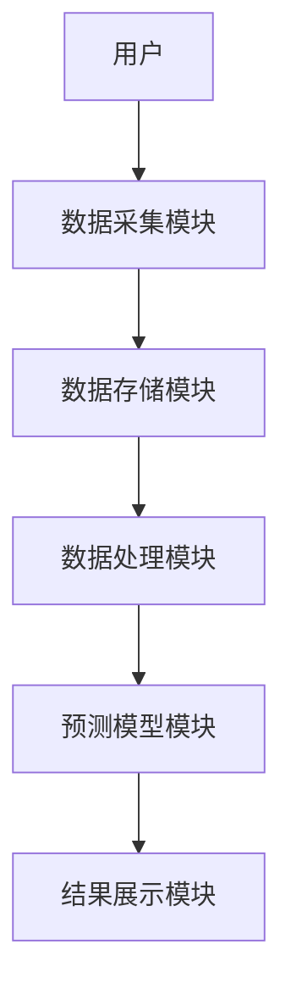
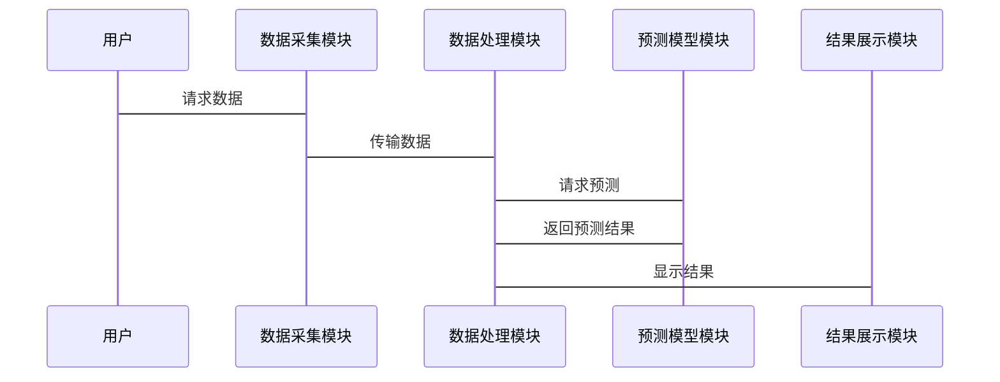

                 


# 《彼得林奇的"反向思考"在宏观经济预测中的应用》

> 关键词：宏观经济预测、反向思考、彼得林奇、投资策略、经济周期、市场情绪、时间序列分析

> 摘要：本文系统阐述了彼得林奇的“反向思考”策略在宏观经济预测中的应用，从理论基础到实践操作，详细分析了如何利用逆向思维识别经济拐点、制定投资策略。通过结合宏观经济指标与市场情绪分析，构建了基于反向思考的预测模型，探讨了其在经济周期波动中的预测优势与实际应用价值。

---

# 第一部分: 宏观经济预测与反向思考概述

## 第1章: 宏观经济预测的基本概念

### 1.1 宏观经济预测的定义与作用
#### 1.1.1 宏观经济预测的定义
宏观经济预测是对经济整体走势的预测，涵盖GDP、CPI、失业率等核心指标，旨在为政策制定者、企业和个人提供参考。

#### 1.1.2 宏观经济预测的作用与意义
通过预测，可以帮助企业和政府提前做好准备，规避风险，抓住机遇。例如，在经济衰退前调整投资策略，或在经济繁荣时优化资源配置。

#### 1.1.3 宏观经济预测的常见方法
- 定性分析：基于专家意见和经验判断。
- 定量分析：利用统计模型和数学方法进行预测。
- 综合分析：结合定性与定量方法。

### 1.2 彼得林奇的反向思考策略
#### 1.2.1 彼得林奇投资理念的核心思想
彼得林奇强调逆向思维，认为市场情绪的极端化往往预示着市场的转折点。例如，当市场恐慌时，投资者应寻找被低估的资产；当市场贪婪时，应警惕风险。

#### 1.2.2 反向思考在投资中的应用
- 在市场底部买入，顶部卖出。
- 通过分析市场情绪指标（如恐慌指数、投资者情绪指数）来判断市场走势。

#### 1.2.3 反向思考与宏观经济预测的结合
将反向思考应用于宏观经济预测，可以通过分析市场情绪和经济指标的反向关系，提前发现经济拐点。

---

## 第2章: 宏观经济预测的核心要素

### 2.1 宏观经济指标的分类与分析
#### 2.1.1 GDP、CPI、失业率等核心指标
- GDP：衡量经济整体规模和增长。
- CPI：衡量通货膨胀水平。
- 失业率：反映劳动力市场状况。

#### 2.1.2 财政政策与货币政策的影响
- 财政政策：政府通过支出和税收影响经济。
- 货币政策：中央银行通过利率和货币供应量影响经济。

#### 2.1.3 国际经济环境与贸易关系
- 国际贸易：影响一国的出口和进口。
- 汇率：影响国际竞争力和资本流动。

### 2.2 反向思考在宏观经济预测中的独特性
#### 2.2.1 逆向思维与市场情绪的关系
市场情绪往往与经济走势相反，例如市场情绪高涨时可能预示着经济即将放缓。

#### 2.2.2 反向思考如何识别市场拐点
通过分析市场情绪与经济指标的反向关系，可以提前发现经济拐点。

#### 2.2.3 反向思考与传统预测方法的对比
传统预测方法依赖于历史数据和统计模型，而反向思考更注重市场情绪和非理性行为的分析。

---

## 第3章: 宏观经济预测的基本框架

### 3.1 数据收集与处理
#### 3.1.1 数据来源与分类
- 数据来源：政府统计机构、国际组织（如IMF、世界银行）、金融市场数据等。
- 数据分类：时间序列数据、横截面数据。

#### 3.1.2 数据清洗与预处理
- 去除异常值、填补缺失值、标准化处理。

#### 3.1.3 数据可视化与初步分析
- 使用折线图、柱状图等工具分析数据趋势和分布。

### 3.2 宏观经济预测模型的构建
#### 3.2.1 时间序列分析模型
- ARIMA模型：适用于线性时间序列数据。
- GARCH模型：适用于波动率预测。

#### 3.2.2 统计回归模型
- 多元回归模型：分析多个变量对经济指标的影响。

#### 3.2.3 机器学习模型的应用
- 支持向量机（SVM）：用于分类和回归。
- 随机森林：用于特征重要性分析。

### 3.3 模型评估与优化
#### 3.3.1 模型评估指标
- �均方误差（MSE）、平均绝对误差（MAE）、R²值。

#### 3.3.2 超参数优化与调参
- 使用网格搜索或随机搜索优化模型参数。

#### 3.3.3 模型的鲁棒性与稳定性
- 交叉验证：评估模型的泛化能力。

---

# 第二部分: 反向思考在宏观经济预测中的应用

## 第4章: 反向思考的核心原理与数学模型

### 4.1 反向思考的逻辑框架
#### 4.1.1 市场情绪与经济周期的关系
- 市场情绪高涨时，经济可能接近顶部；市场情绪低落时，经济可能接近底部。

#### 4.1.2 反向思考的决策逻辑
- 当市场情绪过于乐观时，寻找潜在的负面因素；当市场情绪过于悲观时，寻找潜在的正面因素。

#### 4.1.3 反向思考与市场参与者的互动
- 投资者情绪影响市场价格，而价格又反过来反映市场情绪。

### 4.2 数学模型的构建

#### 4.2.1 时间序列分析模型
- 使用ARIMA模型预测GDP增长率：
$$ ARIMA(p, d, q) $$
其中，p为自回归阶数，d为差分阶数，q为移动平均阶数。

#### 4.2.2 统计回归模型
- 构建多元回归模型预测CPI：
$$ CPI = \beta_0 + \beta_1 GDP + \beta_2 unemployment + \epsilon $$

#### 4.2.3 机器学习模型
- 使用随机森林模型预测市场情绪指数：
$$ importance\_feature = feature\_importance\_score $$

---

## 第5章: 系统分析与架构设计

### 5.1 系统功能设计
#### 5.1.1 预测模块
- 数据采集：从数据库中获取宏观经济指标和市场情绪数据。
- 数据处理：清洗和预处理数据。
- 模型预测：选择合适的模型进行预测。

#### 5.1.2 反向思考模块
- 市场情绪分析：计算恐慌指数或投资者情绪指数。
- 经济指标分析：分析GDP、CPI等指标与市场情绪的关系。

### 5.2 系统架构设计



### 5.3 系统接口设计
- 数据接口：与数据库或API对接，获取宏观经济数据。
- 模型接口：与预测模型交互，输出预测结果。

### 5.4 系统交互设计



---

## 第6章: 项目实战

### 6.1 环境安装
- 安装Python、Pandas、NumPy、Scikit-learn等库。

### 6.2 核心实现

```python
# 数据处理
import pandas as pd
import numpy as np

data = pd.read_csv('macro_data.csv')
data['GDP_growth'] = data['GDP'].pct_change()
data = data.dropna()

# 模型构建
from sklearn.ensemble import RandomForestRegressor
from sklearn.metrics import mean_absolute_error

model = RandomForestRegressor()
model.fit(data[['GDP', 'unemployment']], data['CPI'])
预测结果 = model.predict(new_data[['GDP', 'unemployment']])
```

### 6.3 实际案例分析
- 使用历史数据验证模型的准确性。
- 分析反向思考策略在实际经济预测中的应用效果。

### 6.4 项目小结
- 反向思考策略在宏观经济预测中的优势。
- 模型优化的方向与改进空间。

---

## 第7章: 最佳实践与注意事项

### 7.1 最佳实践
- 定期更新模型，避免过时。
- 结合多种方法，提高预测的准确性。

### 7.2 小结
本文详细介绍了反向思考在宏观经济预测中的应用，从理论到实践，为读者提供了一套完整的解决方案。

### 7.3 注意事项
- 数据质量直接影响预测结果，需谨慎处理数据。
- 模型的解释性与准确性之间需要平衡。

### 7.4 拓展阅读
- 推荐阅读《彼得林奇的投资智慧》。
- 关注最新的宏观经济预测方法与技术。

---

# 附录: 参考文献与工具

- 参考文献：列出使用的书籍、论文和数据来源。
- 工具清单：Python、Pandas、NumPy、Matplotlib等。

---

通过以上目录和内容，读者可以系统地学习彼得林奇的反向思考策略，并将其应用于宏观经济预测中，掌握从理论到实践的完整流程。

