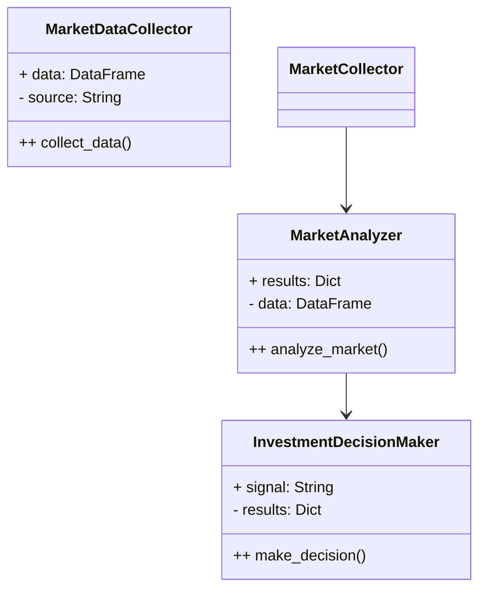
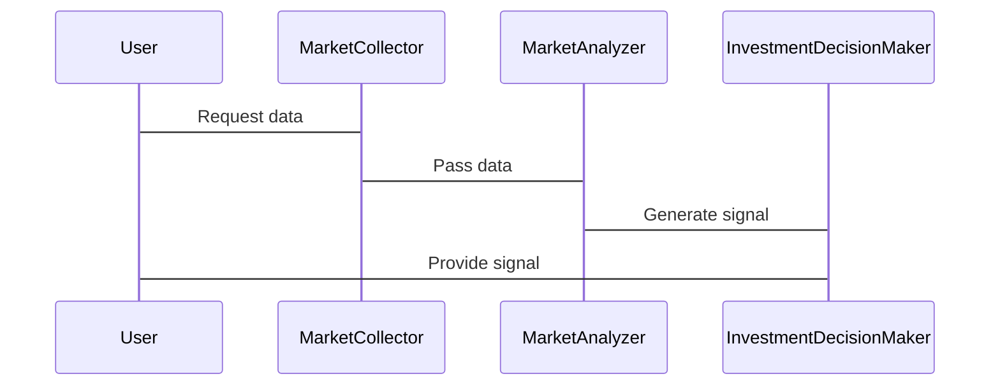

                 


# 彼得林奇的"反向投资"时机选择

> 关键词：反向投资，彼得林奇，市场周期，投资策略，风险管理，数学模型

> 摘要：本文详细探讨了彼得林奇的反向投资策略，分析了投资时机选择的核心原理，结合数学模型和系统架构设计，为投资者提供了实践指南。

---

## 第1章: 反向投资的背景与概念

### 1.1 投资市场的周期性与波动性

#### 1.1.1 投资市场的基本特性
投资市场具有周期性，通常经历复苏、繁荣、衰退、萧条四个阶段。市场的波动性受投资者情绪影响，情绪过热或过冷时市场偏离理性。

#### 1.1.2 市场周期的定义与阶段划分
- **复苏阶段**：市场逐步从萧条中恢复，价值被低估。
- **繁荣阶段**：市场高涨，资产价格远高于内在价值。
- **衰退阶段**：市场下跌，投资者恐慌抛售。
- **萧条阶段**：市场底部，具备长期投资价值。

#### 1.1.3 投资者情绪对市场的影响
投资者情绪波动导致市场非理性，情绪指数可量化市场热度，指导反向投资决策。

### 1.2 彼得林奇与反向投资理念

#### 1.2.1 彼得林奇的生平简介
彼得·林奇是Fidelity基金经理，以长期优异业绩闻名。他强调基本面分析和逆向思维，寻找被市场忽视的优质股。

#### 1.2.2 反向投资的核心思想
反向投资在市场恐慌时买入，在市场狂热时卖出。其本质是逆向思维，避免跟随大众决策。

#### 1.2.3 反向投资与传统投资策略的区别
反向投资强调逆市操作，传统投资随市场波动调整。反向策略需耐心和纪律，适合长期投资者。

---

## 第2章: 反向投资的时机选择原理

### 2.1 市场周期分析

#### 2.1.1 市场周期的四个阶段
- **复苏阶段**：市场逐步复苏，价值股被低估。
- **繁荣阶段**：市场高涨，投资者情绪乐观。
- **衰退阶段**：市场下跌，投资者恐慌。
- **萧条阶段**：市场底部，长期机会显现。

#### 2.1.2 每个阶段的特征与表现
- **复苏阶段**：经济指标逐步改善，企业盈利增长。
- **繁荣阶段**：资产价格远高于内在价值，投资者乐观。
- **衰退阶段**：经济指标恶化，企业盈利下降。
- **萧条阶段**：市场底部，价值被严重低估。

#### 2.1.3 周期性分析对投资决策的影响
通过分析市场周期，投资者可以识别反向投资的最佳时机。在衰退阶段买入，在繁荣阶段卖出。

### 2.2 逆向思维的应用

#### 2.2.1 逆向思维的定义与特点
逆向思维是指在市场普遍看空时看多，在市场普遍看多时看空。

#### 2.2.2 逆向思维在投资中的具体应用
- 在市场底部寻找被低估的资产。
- 在市场顶部规避高估的资产。

#### 2.2.3 如何识别市场非理性行为
通过市场情绪指标、估值指标等工具识别市场非理性行为。

### 2.3 反向投资的时机选择模型

#### 2.3.1 市场情绪指标的构建
市场情绪指标反映了投资者的乐观或悲观情绪，常用指标包括恐慌指数、换手率等。

#### 2.3.2 市场估值指标的分析
市盈率、市净率等指标用于判断市场估值是否合理。

---

## 第3章: 反向投资的核心策略

### 3.1 价值投资与成长投资的区别

#### 3.1.1 价值投资的定义与特点
价值投资寻找被市场低估的资产，注重内在价值。

#### 3.1.2 成长投资的定义与特点
成长投资寻找高成长潜力的资产，注重未来增长。

#### 3.1.3 两者在投资时机选择上的差异
价值投资适合市场底部，成长投资适合高成长行业。

### 3.2 彼得林奇的选股标准

#### 3.2.1 公司基本面分析
分析财务报表，关注盈利能力、资产负债情况。

#### 3.2.2 行业地位与竞争优势
选择行业领先、竞争优势明显的企业。

#### 3.2.3 财务指标与估值分析
关注市盈率、市净率等估值指标，寻找低估资产。

---

## 第4章: 反向投资的风险管理

### 4.1 投资组合的风险分散

#### 4.1.1 风险分散的原理
通过多样化投资降低特定资产的风险。

#### 4.1.2 如何构建风险分散的投资组合
配置不同资产类别，平衡风险与收益。

#### 4.1.3 风险分散与反向投资的结合
在市场底部分散投资于多个低估资产，降低风险。

### 4.2 仓位控制与止损策略

#### 4.2.1 仓位控制的定义与作用
根据市场情况调整持仓比例，避免过度集中。

#### 4.2.2 止损策略的制定与执行
设定止损点，防止亏损过大。

#### 4.2.3 如何在反向投资中应用止损策略
在市场反弹时逐步增加仓位，避免重大亏损。

---

## 第5章: 彼得林奇投资策略的数学模型

### 5.1 市场情绪指标的构建

#### 5.1.1 市场情绪指标的定义
市场情绪指标量化投资者情绪，帮助识别市场过度乐观或悲观。

#### 5.1.2 市场情绪指标的计算公式
$$
\text{市场情绪指数} = \frac{\text{市场换手率} - \text{历史平均换手率}}{\text{标准差}}
$$

#### 5.1.3 市场情绪指标的可视化
使用折线图展示市场情绪指数的变化趋势。

### 5.2 风险管理模型的设计

#### 5.2.1 风险管理模型的定义
风险管理模型用于评估和控制投资组合风险。

#### 5.2.2 风险管理模型的数学表达
$$
\text{风险价值} = \text{投资金额} \times \text{风险系数}
$$

#### 5.2.3 风险管理模型的应用实例
根据市场情绪指数调整风险系数，动态管理投资组合风险。

---

## 第6章: 系统分析与架构设计方案

### 6.1 投资决策支持系统的功能模块

#### 6.1.1 数据采集模块
从市场数据源获取实时信息，包括价格、成交量等。

#### 6.1.2 数据分析模块
计算市场情绪指数，评估投资标的估值。

#### 6.1.3 投资决策模块
根据分析结果生成投资信号，指导买卖决策。

### 6.2 系统架构设计

#### 6.2.1 系统架构的总体设计
采用分层架构，数据采集层、业务逻辑层、用户界面层。

#### 6.2.2 模块之间的交互关系
数据采集层向业务逻辑层传递数据，业务逻辑层处理后向用户界面层展示结果。

#### 6.2.3 系统的可扩展性与可维护性
模块化设计，便于功能扩展和维护。

---

## 第7章: 项目实战与最佳实践

### 7.1 环境安装与配置

#### 7.1.1 开发环境的搭建
安装Python、数据处理库（Pandas）、可视化库（Matplotlib）。

#### 7.1.2 数据源的获取与处理
从Yahoo Finance获取历史数据，清洗处理后用于分析。

#### 7.1.3 工具链的安装与配置
安装Jupyter Notebook，配置数据接口。

### 7.2 核心算法实现

#### 7.2.1 市场情绪指标的计算代码
```python
import pandas as pd
import numpy as np

# 假设data为包含'close'的DataFrame
def calculate_market_momentum(data, window=20):
    momentum = data['close'].rolling(window).mean()
    return momentum

market_momentum = calculate_market_momentum(data)
```

#### 7.2.2 风险管理模型的应用实例
```python
def calculate_risk_value(amount, risk_coefficient):
    return amount * risk_coefficient

risk_value = calculate_risk_value(100000, 0.05)
print(risk_value)  # 输出5000
```

### 7.3 系统功能设计

#### 7.3.1 系统功能模块的类图


#### 7.3.2 系统交互的序列图


---

## 第8章: 最佳实践、小结与注意事项

### 8.1 最佳实践 tips
- 定期回顾投资组合，调整仓位。
- 保持耐心，避免频繁交易。
- 结合技术分析和基本面分析。

### 8.2 小结
反向投资需要深入分析市场周期和公司基本面，结合数学模型和系统支持，制定科学的投资策略。

### 8.3 注意事项
- 风险管理是反向投资成功的关键。
- 逆向投资需要长期学习和实践。
- 避免盲目跟风，保持独立思考。

### 8.4 拓展阅读
推荐书籍：《彼得·林奇的投资策略》、《反向投资的艺术》。

---

通过以上详细分析，反向投资的核心在于逆向思维和长期价值，结合系统的数学模型和架构设计，投资者可以在市场波动中抓住机会，实现稳健收益。

