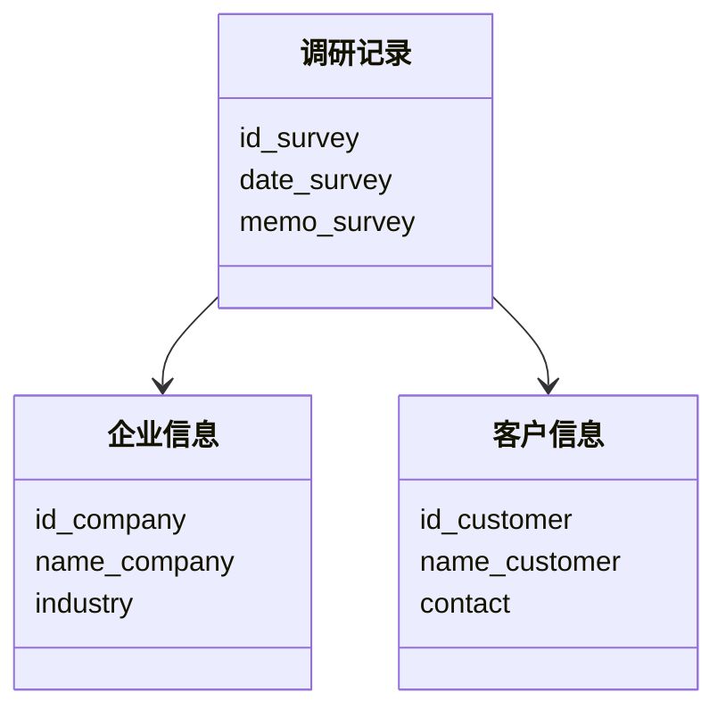
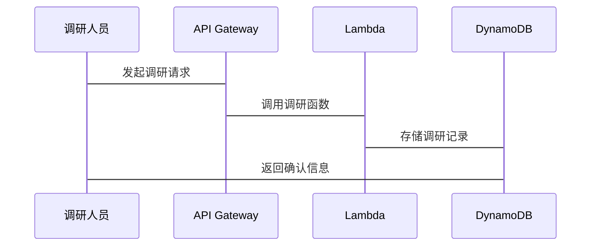

                 


# 彼得林奇的"实地调研"在远程办公时代的调整

> 关键词：彼得林奇，实地调研，远程办公，投资策略，数据分析，协作工具

> 摘要：本文探讨了彼得林奇传统的实地调研方法在远程办公时代的调整策略，分析了远程办公对投资行业的影响，提出了优化信息收集、团队协作和决策支持的具体方法。结合实际案例，展示了如何利用数据分析工具和协作平台实现高效的远程调研，并展望了未来的发展趋势。

---

## 第1章: 彼得林奇的实地调研方法概述

### 1.1 彼得林奇的实地调研方法

#### 1.1.1 实地调研的核心概念
实地调研是彼得林奇投资方法的重要组成部分，他通过与公司高管、员工和客户的一线接触，获取企业经营状况的第一手信息。这种调研方法依赖于面对面的交流和实地考察，强调信息的真实性和深度。

#### 1.1.2 实地调研的流程与特点
- **流程**：信息收集 → 深度访谈 → 数据分析 → 投资决策
- **特点**：信息真实、全面，注重细节和非财务信息

#### 1.1.3 实地调研在投资决策中的作用
实地调研帮助彼得林奇识别财务报表中未反映的问题，如管理团队的素质、企业文化、潜在风险等，从而做出更准确的投资决策。

### 1.2 远程办公时代的背景

#### 1.2.1 远程办公的兴起与发展趋势
远程办公的普及源于技术进步（如互联网、云办公工具）和企业对灵活性、效率的追求。新冠疫情加速了这一趋势，远程办公已成为常态。

#### 1.2.2 远程办公对实地调研的影响
- 优势：降低调研成本，扩大调研范围
- 挑战：信息真实性和深度的损失，沟通效率的降低

#### 1.2.3 投资行业中的远程办公挑战
投资行业依赖于实地调研获取信息，远程办公模式可能削弱这种信息获取能力，影响投资决策的准确性。

---

## 第2章: 彼得林奇实地调研方法的核心要素

### 2.1 核心概念与联系

#### 2.1.1 实地调研的核心要素分析
| 核心要素 | 描述 |
|----------|------|
| 信息收集 | 获取企业经营状况的第一手数据 |
| 深度访谈 | 与关键人物（高管、员工）交流 |
| 数据分析 | 整理和分析收集到的信息 |
| 决策支持 | 基于调研结果做出投资决策 |

#### 2.1.2 实地调研与投资决策的关系


#### 2.1.3 实地调研的边界与外延
- **边界**：仅限于直接影响投资决策的信息
- **外延**：扩展到企业外部环境、行业趋势等间接信息

### 2.2 核心概念原理

#### 2.2.1 实地调研的基本原理
实地调研通过面对面的交流，获取非财务信息，弥补财务数据的局限性，帮助投资者更全面地评估企业价值。

#### 2.2.2 实地调研的关键属性特征对比
| 属性 | 传统调研 | 远程调研 |
|------|----------|----------|
| 成本 | 高 | 低 |
| 时间 | 长 | 短 |
| 深度 | 深 | 浅 |

#### 2.2.3 实地调研的ER实体关系图
```mermaid
erDiagram
    customer {
        key id_cust int
        name_cust string
    }
    company {
        key id_comp int
        name_comp string
    }
    employee {
        key id_emp int
        name_emp string
    }
   调研记录 {
        id_survey int
        date_survey date
        memo_survey string
    }
    customer -|<many> 调研记录 : record
    company -|<many> 调研记录 : record
    employee -|<many> 调研记录 : record
```

---

## 第3章: 彼得林奇实地调研方法的调整策略

### 3.1 调整策略概述

#### 3.1.1 远程办公时代实地调研的挑战
- 信息真实性的验证难度增加
- 深度访谈的效率降低
- 现场氛围的缺失影响判断

#### 3.1.2 调整策略的必要性与目标
调整策略的目的是在远程办公环境下，尽可能保持实地调研的有效性，通过优化工具和方法，弥补远程调研的不足。

#### 3.1.3 调整策略的核心原则
- 结合远程工具，优化信息收集方式
- 强化数据分析能力，弥补深度访谈的不足
- 提升团队协作效率，确保调研质量

### 3.2 调整策略的具体实施

#### 3.2.1 信息收集与分析的优化
- **信息来源多样化**：利用电话、视频会议、在线问卷等多种渠道获取信息
- **数据清洗与分析**：使用数据分析工具（如Excel、Python）对收集到的数据进行清洗和分析

#### 3.2.2 团队协作与沟通的改进
- **协作平台的使用**：利用Slack、钉钉等工具建立高效的沟通机制
- **任务分工明确**：通过项目管理工具（如Trello）明确团队成员的任务分工

#### 3.2.3 决策支持系统的构建
- **数据可视化**：使用Power BI、Tableau等工具将数据可视化，便于团队理解和分析
- **决策支持模型**：构建基于数据分析的投资决策模型，辅助投资决策

---

## 第4章: 远程办公时代实地调研的工具与技术

### 4.1 远程调研工具的分类

#### 4.1.1 数据分析工具
- **Excel**：基础的数据清洗和分析
- **Python**：高级的数据分析和建模
- **R**：统计分析

#### 4.1.2 协作平台与沟通工具
- **Slack**：实时沟通和文件共享
- **钉钉**：团队协作和视频会议
- **Microsoft Teams**：综合沟通和协作

#### 4.1.3 数据可视化工具
- **Power BI**：数据可视化和报表生成
- **Tableau**：交互式数据可视化
- **Google Data Studio**：在线数据可视化

### 4.2 工具的使用方法

#### 4.2.1 数据分析工具的应用
- **Python代码示例**：
  ```python
  import pandas as pd
  df = pd.read_csv('data.csv')
  df_cleaned = df.dropna()
  print(df_cleaned.head())
  ```

#### 4.2.2 协作平台的配置与优化
- **Slack配置**：
  - 创建不同的频道（#investigation、#analysis）
  - 设置机器人自动提醒重要信息

#### 4.2.3 数据可视化工具的技巧
- **Power BI技巧**：
  - 使用切片器和仪表盘进行多维度分析
  - 设置数据刷新频率，保持数据实时更新

---

## 第5章: 实地调研方法调整的系统架构设计

### 5.1 系统功能设计

#### 5.1.1 领域模型设计


#### 5.1.2 系统架构设计
```mermaid
aws
    architecture
        title 投资调研系统架构
        client -> API Gateway: API 请求
        API Gateway -> Lambda: 调用后端函数
        Lambda -> DynamoDB: 读取/写入数据
        Lambda -> S3: 上传/下载文件
        DynamoDB --> Lambda: 返回数据
```

#### 5.1.3 系统接口设计
- **REST API**：
  - GET /api/company/{id}：获取企业信息
  - POST /api/survey: 提交调研记录

### 5.2 系统交互设计

#### 5.2.1 序列图设计


---

## 第6章: 项目实战与案例分析

### 6.1 项目环境安装

#### 6.1.1 开发环境配置
- 安装Python、Jupyter Notebook、Slack客户端

#### 6.1.2 工具安装与配置
- 安装AWS CLI、Power BI Desktop

#### 6.1.3 数据源准备
- 下载企业财报数据（CSV格式）

### 6.2 核心代码实现

#### 6.2.1 数据收集模块
```python
import requests

url = 'https://example.com/api/company'
response = requests.get(url)
data = response.json()
print(data)
```

#### 6.2.2 数据分析模块
```python
import pandas as pd

df = pd.read_csv('data.csv')
df['revenue'].plot.hist()
plt.show()
```

#### 6.2.3 决策支持模块
```python
from sklearn import linear_model

X = df[['revenue', 'profit']]
y = df['stock_price']
model = linear_model.LinearRegression()
model.fit(X, y)
print(model.coef_)
```

### 6.3 案例分析

#### 6.3.1 案例背景
某科技公司疫情期间的远程办公转型情况分析。

#### 6.3.2 数据分析
- 使用Power BI生成营收和利润趋势图
- 通过机器学习模型预测股价走势

#### 6.3.3 结论
远程办公模式下，该公司的营收增长显著，但利润因管理成本上升而略有下降，投资风险较低。

---

## 第7章: 总结与展望

### 7.1 总结

#### 7.1.1 调整方法的小结
通过优化工具和方法，远程办公时代的实地调研仍然可以保持较高的效率和准确性。

#### 7.1.2 注意事项
- 数据的真实性和完整性需要严格把控
- 团队协作效率的提升需要依赖高效的工具和流程
- 决策支持系统的构建需要结合企业的实际情况

### 7.2 展望

#### 7.2.1 远程办公工具的进一步优化
- 更智能化的AI辅助工具
- 更高效的协作平台

#### 7.2.2 投资策略的创新
- 结合远程调研和现场调研，形成混合调研模式
- 利用大数据和人工智能技术，提升投资决策的智能化水平

#### 7.2.3 行业发展趋势
远程办公将继续影响投资行业的调研方式，推动投资行业的数字化转型。

---

## 第8章: 最佳实践与小结

### 8.1 最佳实践

#### 8.1.1 工具使用技巧
- 数据分析工具的选择：根据数据规模和复杂度选择合适的工具
- 协作平台的配置：根据团队需求定制功能

#### 8.1.2 团队协作建议
- 明确任务分工，确保责任到人
- 定期召开线上会议，保持信息同步
- 建立有效的反馈机制，及时解决问题

### 8.2 小结

彼得林奇的实地调研方法在远程办公时代需要进行调整，通过优化工具和方法，投资者可以在远程环境下依然保持高效的调研能力。这不仅需要技术的支持，还需要团队协作和投资策略的创新。

### 8.3 注意事项

- 数据的真实性和完整性是远程调研的核心，需通过多种渠道验证信息
- 决策支持系统需结合企业实际情况，避免过于依赖技术工具
- 投资者需持续关注远程办公工具的发展，及时调整调研策略

### 8.4 拓展阅读

- 《远程办公：未来工作方式的革命》
- 《数据驱动的投资决策》
- 《彼得林奇的投资艺术》

---

## 结语

远程办公时代的实地调研调整是一个复杂而系统的过程，需要投资者在技术、团队和策略等多个方面进行优化。通过本文的分析和实践，投资者可以更好地适应远程办公环境，保持投资决策的高效和准确。未来，随着技术的进步和经验的积累，远程调研将变得更加高效和智能化，为投资行业带来新的发展机遇。

