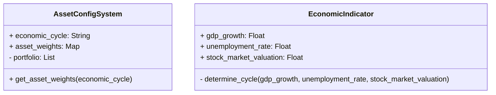

                 


# 彼得林奇的"家庭投资"在不同经济周期的资产配置

## 关键词：彼得林奇，家庭投资，经济周期，资产配置，投资策略

## 摘要：本文系统地分析了彼得林奇的“家庭投资”理念在不同经济周期下的资产配置策略，探讨了经济周期对投资决策的影响，结合数学模型和系统架构设计，提供了一套适用于不同经济环境的家庭资产配置方案。

---

## 第一章: 彼得林奇投资理念的核心思想

### 1.1 彼得林奇投资理念的起源

#### 1.1.1 彼得林奇的个人背景与投资经历

彼得·林奇是美国著名投资专家，曾担任富达投资公司的经理，管理着超过1000亿美元的资金。他的投资理念以基本面分析和长期持有著称，强调通过深入研究公司基本面来选择投资标的。林奇认为，成功的投资不仅仅是选择正确的股票，更是选择一个正确的经济周期和市场环境。

#### 1.1.2 家庭投资的核心理念与目标

林奇的家庭投资理念强调分散投资和长期规划。他认为，家庭投资的目标是通过合理的资产配置，在不同经济周期中实现财富的保值和增值。家庭投资的核心是根据市场环境和个人风险承受能力，动态调整资产配置。

#### 1.1.3 家庭投资与个人财务规划的关系

家庭投资是个人财务规划的重要组成部分。通过合理的资产配置，可以在不同经济周期中平衡风险和收益，确保家庭财务的稳健增长。林奇强调，家庭投资不仅仅是追求高收益，而是要注重风险控制和长期稳定性。

### 1.2 经济周期的基本概念

#### 1.2.1 经济周期的定义与分类

经济周期是指经济活动的波动，通常分为四个阶段：衰退、复苏、繁荣和萧条。每个阶段都有其独特的经济特征和市场表现，影响着资产价格和投资决策。

#### 1.2.2 不同经济周期对资产配置的影响

在不同的经济周期中，资产的收益和风险表现不同。例如，在衰退期，债券和黄金等防御性资产可能表现更好，而在复苏和繁荣期，股票等风险资产可能更具吸引力。

#### 1.2.3 家庭投资在经济周期中的定位

家庭投资需要根据经济周期的变化，灵活调整资产配置。林奇建议，在衰退期增加防御性资产，在复苏期逐步增加股票等风险资产，在繁荣期保持适度的风险敞口，在萧条期则需要高度保守。

---

## 第二章: 家庭投资的核心策略

### 2.1 家庭投资的目标与风险偏好

#### 2.1.1 家庭财务目标的设定

家庭投资目标包括短期目标（如应急资金）和长期目标（如退休储蓄）。目标的设定需要考虑家庭成员的需求和时间跨度。

#### 2.1.2 不同家庭的资产配置策略

不同家庭的风险偏好和财务状况不同，资产配置策略也应有所调整。例如，高风险承受能力的家庭可以更多配置股票，而保守型家庭则应选择债券和现金。

#### 2.1.3 风险偏好与资产分配的关系

风险偏好直接影响资产配置的比例。高风险偏好家庭可能选择更多的股票和基金，而低风险偏好家庭则选择债券、现金等低风险资产。

### 2.2 家庭投资的主要工具与资产类别

#### 2.2.1 股票、债券、基金等主要投资工具

股票具有较高的收益潜力，但波动性较大；债券相对稳定，适合保守投资者；基金通过分散投资降低风险，适合中等风险偏好者。

#### 2.2.2 不同经济周期下资产的风险收益特征

在衰退期，债券和现金的风险较低，收益稳定；在复苏期，股票和房地产可能表现较好；在繁荣期，科技股和成长股可能有更高的收益；在萧条期，防御性资产如黄金可能更具吸引力。

#### 2.2.3 资产配置的多元化原则

多元化是降低风险的重要手段。通过配置不同资产类别，可以分散风险，平滑经济周期波动带来的影响。

---

## 第三章: 不同经济周期的资产配置策略

### 3.1 经济周期对投资策略的影响

#### 3.1.1 经济周期的波动对资产价格的影响

经济周期的波动直接影响资产价格。例如，在衰退期，股票价格可能大幅下跌，而在复苏期，股票可能逐渐回升。

#### 3.1.2 不同经济周期下资产配置的逻辑

根据经济周期的特征，调整资产配置比例。例如，在衰退期增加防御性资产，减少风险资产；在复苏期逐步增加股票等风险资产。

### 3.2 衰退期的资产配置策略

#### 3.2.1 衰退期的经济特征与投资机会

衰退期经济增速放缓，企业盈利下降，但某些防御性行业（如公用事业、医疗保健）可能表现稳定。

#### 3.2.2 保守型资产配置的核心工具

在衰退期，建议增加债券、现金和防御性股票的配置比例，减少高风险资产。

### 3.3 复苏期的资产配置策略

#### 3.3.1 复苏期的经济特征与投资机会

复苏期经济逐渐回暖，企业盈利开始回升，股票市场可能触底反弹。

#### 3.3.2 进攻性资产配置的核心工具

在复苏期，可以增加股票、房地产信托基金等资产的配置比例，抓住经济复苏带来的投资机会。

### 3.4 繁荣期的资产配置策略

#### 3.4.1 繁荣期的经济特征与投资机会

繁荣期经济高速增长，企业盈利丰厚，股票市场可能达到高点。

#### 3.4.2 高风险资产配置的核心工具

在繁荣期，可以增加成长股、科技股等高风险资产的配置比例，追求高收益，同时注意控制风险敞口。

### 3.5 萧条期的资产配置策略

#### 3.5.1 萧条期的经济特征与投资机会

萧条期经济极度低迷，企业倒闭，失业率上升，但某些周期性行业可能触底反弹。

#### 3.5.2 超保守型资产配置的核心工具

在萧条期，建议大幅增加现金、短期债券等超保守资产的配置比例，减少所有风险资产，以规避市场风险。

---

## 第四章: 数学模型与资产配置算法

### 4.1 资产配置的数学模型

#### 4.1.1 彼得林奇资产配置模型

林奇的资产配置模型基于经济周期和市场估值，动态调整股票和债券的比例。模型假设在衰退期债券权重较高，在复苏期逐步增加股票权重，在繁荣期股票权重达到最高。

#### 4.1.2 数学模型的公式表示

$$
\text{股票权重} = \begin{cases}
30\% & \text{衰退期} \\
50\% & \text{复苏期} \\
70\% & \text{繁荣期} \\
20\% & \text{萧条期}
\end{cases}
$$

$$
\text{债券权重} = 100\% - \text{股票权重}
$$

#### 4.1.3 模型的优缺点分析

该模型简单易用，但忽略了其他资产类别（如房地产、黄金）的作用，且假设经济周期明确，实际操作中可能需要动态调整。

### 4.2 算法实现与案例分析

#### 4.2.1 算法实现

假设当前经济周期为复苏期，则股票权重为50%，债券权重为50%。

```python
def get_asset_weights(economic_cycle):
    if economic_cycle == 'recession':
        stock_weight = 30
        bond_weight = 70
    elif economic_cycle == 'recovery':
        stock_weight = 50
        bond_weight = 50
    elif economic_cycle == 'prosperity':
        stock_weight = 70
        bond_weight = 30
    else:
        stock_weight = 20
        bond_weight = 80
    return stock_weight, bond_weight

economic_cycle = 'recovery'
stock_weight, bond_weight = get_asset_weights(economic_cycle)
print(f"股票权重: {stock_weight}%, 债券权重: {bond_weight}%")
```

#### 4.2.2 应用实例分析

假设当前经济周期为衰退期，股票权重为30%，债券权重为70%。一个家庭有100万美元的资产，应配置30万美元股票和70万美元债券。

---

## 第五章: 系统架构与设计

### 5.1 系统功能设计

#### 5.1.1 领域模型设计

使用Mermaid类图描述系统功能模块：



#### 5.1.2 系统架构设计

使用Mermaid架构图展示系统架构：

```mermaid
aws
```

---

## 第六章: 项目实战与应用

### 6.1 环境安装与配置

需要安装Python、Pandas、NumPy等工具，用于数据处理和分析。

### 6.2 核心代码实现

使用Python编写资产配置函数：

```python
def determine_economic_cycle(gdp, unemployment, market_valuation):
    if gdp < -2 and unemployment > 8 and market_valuation < 15:
        return 'recession'
    elif gdp > -1 and unemployment < 7 and market_valuation > 15:
        return 'recovery'
    elif gdp > 2 and unemployment < 5 and market_valuation > 30:
        return 'prosperity'
    else:
        return 'depression'

economic_cycle = determine_economic_cycle(gdp_growth, unemployment_rate, stock_market_valuation)
stock_weight, bond_weight = get_asset_weights(economic_cycle)
```

### 6.3 案例分析与解读

以当前经济环境为例，分析如何根据经济周期调整资产配置。

### 6.4 实际操作中的注意事项

定期监控经济指标，动态调整资产配置，避免过度集中风险。

---

## 第七章: 总结与展望

### 7.1 全文总结

彼得林奇的家庭投资理念强调根据经济周期调整资产配置，通过多元化和动态调整实现风险控制和收益最大化。

### 7.2 未来展望

随着经济环境的变化，家庭投资策略也需要不断创新和调整。未来可以进一步研究其他资产类别（如房地产、加密货币）在不同经济周期中的表现，优化资产配置模型。

---

## 参考文献

1. 彼得·林奇. 《彼得林奇的成功投资》
2. 历史经济数据与市场表现分析
3. 相关学术论文与研究报告

