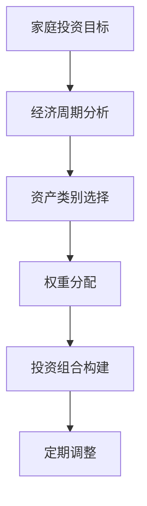
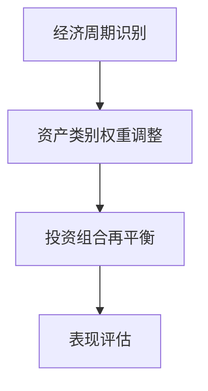
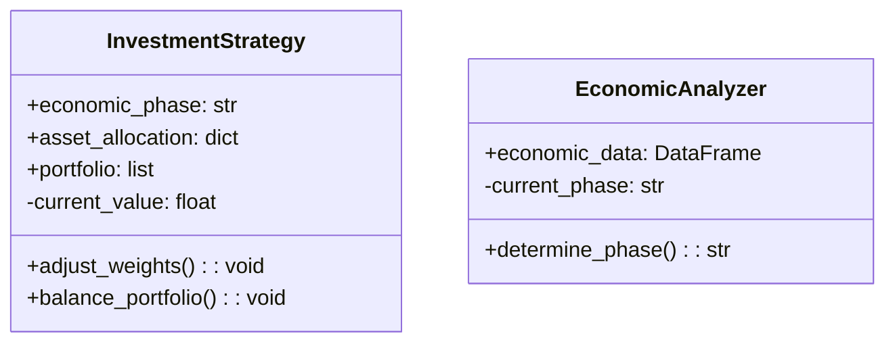
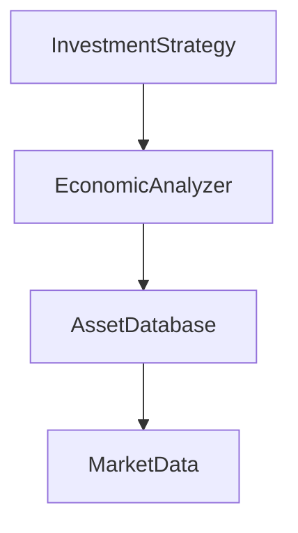

                 


# 彼得林奇的"家庭投资"在不同经济周期的资产配置调整

## 关键词：彼得·林奇，家庭投资，资产配置，经济周期，投资策略

## 摘要：本文探讨了彼得·林奇的家庭投资策略在不同经济周期下的资产配置调整方法。通过分析经济周期对资产表现的影响，结合现代投资组合理论，提出了适合家庭投资者的动态资产配置策略，并通过实际案例展示了如何在不同经济环境下优化投资组合。

---

# 1. 引言

## 1.1 为什么研究彼得·林奇的家庭投资策略
- 彼得·林奇作为著名基金经理，其投资理念对个人投资者具有重要启示。
- 家庭投资注重长期稳健回报，适合普通投资者。
- 理解其策略有助于在不同经济周期中做出明智的投资决策。

## 1.2 经济周期对资产配置的影响
- 经济周期波动影响各类资产的表现。
- 资产配置需要根据经济周期调整权重。

## 1.3 本文结构
- 背景介绍、理论基础、策略分析、案例实战。

---

# 2. 家庭投资的背景与核心概念

## 2.1 家庭投资的基本概念
- 家庭投资是通过分散投资实现财务目标。
- 突出稳健性和风险控制。

## 2.2 彼得·林奇的投资理念
- 长期投资，选择优秀公司。
- 分散投资，降低风险。

## 2.3 经济周期与资产配置
- 经济周期分为复苏、繁荣、衰退、萧条四阶段。
- 每个阶段适合的资产类型不同。

---

# 3. 家庭投资的核心概念与联系

## 3.1 家庭投资的核心概念原理
- 资产配置需考虑收益、风险、流动性。
- 分散化是降低风险的重要手段。

## 3.2 核心概念属性特征对比表
| 经济周期阶段 | 适合资产 | 风险水平 | 收益预期 |
|--------------|----------|----------|----------|
| 复苏          | 股票     | 中       | 中高     |
| 繁荣          | 股票     | 高       | 高       |
| 萧条          | 现金     | 低       | 低       |
| 萎缩          | 固定收益| 中       | 中       |

## 3.3 实体关系图与流程图


---

# 4. 资产配置的算法原理

## 4.1 现代投资组合理论（MPT）
- 基本原理：通过分散投资降低风险。
- 均值-方差优化模型：
  $$ \text{min} \left( \sigma^2 \right) \text{ s.t. } \sum w_i = 1 $$
- 马科维茨的有效前沿：展示最优风险收益组合。

## 4.2 经济周期驱动的资产配置算法


## 4.3 算法实现与代码示例
```python
import numpy as np
import pandas as pd

def economic_cycle_asset_allocation(economic_phase):
    if economic_phase == 'recession':
        return {'cash': 0.4, 'fixed_income': 0.3, 'equity': 0.2, 'realestate': 0.1}
    elif economic_phase == 'recovery':
        return {'cash': 0.2, 'fixed_income': 0.1, 'equity': 0.6, 'realestate': 0.1}
    else:
        return {'cash': 0.1, 'fixed_income': 0.2, 'equity': 0.6, 'realestate': 0.1}
```

---

# 5. 系统分析与架构设计

## 5.1 系统功能设计


## 5.2 系统架构设计


---

# 6. 项目实战：家庭投资策略的优化与实现

## 6.1 案例分析
- 经济衰退期：增加现金和固定收益资产。
- 经济繁荣期：增加股票配置。

## 6.2 投资组合优化
- 根据经济周期动态调整权重。
- 定期再平衡投资组合。

---

# 7. 总结与展望

## 7.1 小结
- 彼得·林奇的家庭投资策略强调长期稳健。
- 经济周期影响资产配置，需动态调整。

## 7.2 注意事项
- 风险管理至关重要。
- 税务规划需谨慎考虑。

## 7.3 拓展阅读
- 推荐书籍：《彼得·林奇的投资哲学》。
- 进一步学习现代投资组合理论。

---

# 8. 最佳实践 Tips

## 8.1 投资策略选择
- 根据经济周期调整资产配置。
- 保持长期视角，避免频繁交易。

## 8.2 定期评估与调整
- 至少每年评估一次投资组合。
- 根据市场变化及时调整。

---

# 结语

通过系统学习彼得·林奇的投资理念，并结合经济周期的特点，家庭投资者可以制定科学的资产配置策略，实现财富的稳健增长。投资不仅是知识的积累，更是一种智慧的体现，需要持续学习和实践。

