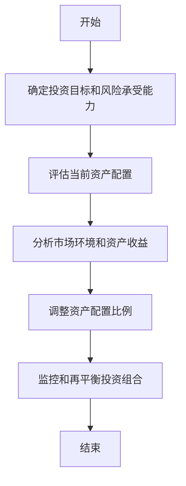

                 


# 彼得林奇的"家庭投资组合"在低利率环境下的资产配置

## 关键词：彼得·林奇，家庭投资组合，低利率环境，资产配置，投资策略，风险管理

## 摘要：本文探讨了低利率环境下彼得·林奇的家庭投资组合的资产配置策略。通过分析低利率对经济和资产的影响，结合彼得·林奇的投资理念，详细阐述了如何构建和优化投资组合，以应对低利率环境下的挑战。文章从理论到实践，结合数学模型和实际案例，为投资者提供科学的投资指导。

---

## 第一部分: 低利率环境下的投资背景与挑战

### 第1章: 低利率环境的背景与影响

#### 1.1 低利率环境的定义与现状

##### 1.1.1 利率的定义与分类

- 利率是指借款或存款的利息与本金的比率，是衡量资金成本的重要指标。
- 利率分为短期利率和长期利率，常见的短期利率包括银行同业拆借利率，长期利率包括国债收益率。
- 当前全球低利率环境主要表现为央行基准利率降至历史低位，甚至出现负利率。

##### 1.1.2 当前全球低利率环境的现状

- 全球多国央行实施量化宽松政策，导致基准利率持续走低。
- 疫情冲击下，主要经济体央行进一步降息，以刺激经济复苏。
- 低利率环境下，传统固定收益类资产收益率下降，投资者面临收益缩水的风险。

##### 1.1.3 低利率环境对经济的影响

- 刺激借贷和投资，促进经济增长。
- 增加企业的财务负担，影响盈利能力。
- 导致资产价格泡沫，增加金融系统的不稳定性。

#### 1.2 低利率环境下投资的挑战

##### 1.2.1 传统投资方式的局限性

- 固定收益类资产（如债券）收益率下降，无法满足投资收益目标。
- 股票市场估值偏高，投资风险加大。
- 现金类资产（如货币基金）收益几乎为零，资金的机会成本增加。

##### 1.2.2 低利率对资产价格的影响

- 债券价格上升，但到期收益率下降。
- 股票市场可能因为资金涌入而出现估值过高的现象。
- 房地产市场价格可能因低利率环境而上涨，但存在泡沫破裂的风险。

##### 1.2.3 投资者面临的困境与选择

- 投资者需要在低收益和高风险之间寻找平衡。
- 如何在低利率环境下实现资产保值和增值成为关键问题。
- 投资者需要重新审视和调整原有的投资策略。

#### 1.3 彼得·林奇投资理念的背景介绍

##### 1.3.1 彼得·林奇的投资者身份

- 彼得·林奇是美国著名投资家，曾担任富达投资的基金经理，管理过麦哲伦基金，取得了卓越的投资业绩。
- 他以长期投资、价值投资和分散投资理念闻名，注重基本面分析和风险控制。

##### 1.3.2 彼得·林奇的投资哲学

- 强调长期投资，避免频繁交易。
- 选择具有竞争优势的公司，长期持有优质资产。
- 通过分散投资降低风险，避免过度集中于某一资产类别。

##### 1.3.3 彼得·林奇的成功案例

- 麦哲伦基金在他的管理下，年均收益率超过29%，为投资者创造了巨额财富。
- 他的投资理念和方法被广泛认可，成为投资界的经典案例。

---

### 第2章: 家庭投资组合的核心概念与结构

#### 2.1 家庭投资组合的定义

##### 2.1.1 投资组合的定义

- 投资组合是指将资金分配到不同资产类别（如股票、债券、现金等）中，以实现投资目标的一种方式。
- 投资组合的目标通常包括风险控制、收益最大化和资产保值等。

##### 2.1.2 家庭投资组合的特殊性

- 家庭投资组合通常以家庭财务目标为导向，注重风险和收益的平衡。
- 家庭成员的财务状况、风险承受能力和投资期限各不相同，需要定制化的投资策略。

##### 2.1.3 投资组合的目标与边界

- 短期目标：应急资金储备、短期理财需求。
- 中期目标：子女教育费用、购房买车等大额支出。
- 长期目标：退休计划、财富传承等。

#### 2.2 家庭投资组合的核心要素

##### 2.2.1 资产类别划分

- 股票：高风险高收益，适合长期增值。
- 债券：相对稳定，提供固定收益，适合风险厌恶型投资者。
- 现金及现金等价物：流动性高，适合应急资金需求。
- 其他资产：房地产、黄金、私募基金等，提供多元化选择。

##### 2.2.2 资产配置比例

- 股票、债券、现金的比例需要根据市场环境和家庭需求调整。
- 通常建议在低利率环境下增加股票配置，以应对债券收益率下降的问题。

##### 2.2.3 风险与收益的平衡

- 投资组合的风险与收益成正比，需根据家庭的风险承受能力进行调整。
- 通过分散投资降低非系统性风险，同时关注系统性风险的控制。

#### 2.3 家庭投资组合的结构分析

##### 2.3.1 股票、债券、现金的三元结构

- 股票：占比较大，提供较高的收益潜力。
- 债券：作为稳定器，平衡投资组合的波动性。
- 现金：作为流动性储备，应对紧急需求或市场机会。

##### 2.3.2 不同资产类别的风险收益特征对比

| 资产类别 | 风险等级 | 收益潜力 | 流动性 |
|----------|----------|----------|--------|
| 股票     | 高       | 高       | 低     |
| 债券     | 中       | 中       | 中     |
| 现金     | 低       | 低       | 高     |

##### 2.3.3 投资组合的ER实体关系图

```mermaid
erDiagram
    investor {
        id
        name
        age
        risk_tolerance
    }
    asset_class {
        id
        name
        risk_level
        return_potential
    }
    investment {
        id
        investor_id
        asset_class_id
        allocation_percentage
    }
    investor --> investment: holds
    asset_class --> investment: belongs_to
```

---

### 第3章: 彼得·林奇投资策略的数学模型与算法原理

#### 3.1 投资组合优化的数学模型

##### 3.1.1 马科维茨有效前沿理论

- 马科维茨有效前沿理论是投资组合理论的基础，认为存在一个最优风险收益组合，使投资者在特定风险水平下获得最高收益，或在特定收益水平下承担最低风险。

##### 3.1.2 投资组合优化的数学公式

- 投资组合的收益可以表示为各资产收益的加权平均：
  $$ E(r_p) = \sum_{i=1}^{n} w_i E(r_i) $$
  其中，\( w_i \) 是资产 \( i \) 的权重，\( E(r_i) \) 是资产 \( i \) 的预期收益。

- 投资组合的方差（风险）可以表示为：
  $$ Var(r_p) = \sum_{i=1}^{n} \sum_{j=1}^{n} w_i w_j Cov(r_i, r_j) $$

##### 3.1.3 现代投资组合理论（MPT）的原理

- MPT强调通过分散投资降低非系统性风险，构建最优投资组合。
- 在低利率环境下，MPT可以帮助投资者在资产配置上做出更优的选择。

#### 3.2 彼得·林奇投资策略的算法实现

##### 3.2.1 资产配置算法的流程图



##### 3.2.2 算法实现的Python代码示例

```python
import numpy as np
import pandas as pd
from scipy.optimize import minimize

# 示例数据：资产收益和协方差矩阵
returns = np.array([[0.05, 0.07, 0.03],
                    [0.06, 0.05, 0.04],
                    [0.04, 0.06, 0.05]])

cov_matrix = np.array([[0.02, 0.01, 0.005],
                       [0.01, 0.03, 0.01],
                       [0.005, 0.01, 0.02]])

# 定义优化目标函数
def portfolio_variance(weights, cov_matrix):
    return (weights.T @ cov_matrix @ weights)[0, 0]

# 约束条件：权重之和为1
def constraint(weights):
    return np.sum(weights) - 1

# 初始猜测：等权配置
initial_weights = np.array([1/3, 1/3, 1/3])

# 使用scipy.optimize求解最优权重
result = minimize(portfolio_variance, initial_weights, args=(cov_matrix,), 
                 method='SLSQP', constraints={'type': 'eq', 'fun': constraint})

# 输出最优权重和最小方差
print("最优权重：", result.x)
print("最小方差：", result.fun)
```

##### 3.2.3 算法的优缺点分析

- 优点：能够量化资产配置，提供科学的投资决策依据。
- 缺点：假设资产收益符合正态分布，实际市场可能不符合这一假设，导致模型预测误差。

#### 3.3 低利率环境下投资组合优化的调整

##### 3.3.1 利率对投资组合的影响

- 低利率环境下，债券收益率下降，需要减少债券配置，增加股票等高收益资产的比例。
- 需要重新评估资产配置的流动性风险和通胀风险。

##### 3.3.2 资产配置的调整策略

- 根据市场变化动态调整资产配置比例。
- 通过多样化投资降低风险，避免过度集中于某一资产类别。

##### 3.3.3 调整后的投资组合模型

- 增加股票和成长型基金的配置比例。
- 保持适当的现金储备，以应对市场机会或突发事件。

---

### 第4章: 风险管理与组合优化

#### 4.1 低利率环境下风险管理的重要性

##### 4.1.1 系统性风险与非系统性风险

- 系统性风险：影响整个市场的风险，如经济衰退、通货膨胀等。
- 非系统性风险：特定资产或行业面临的风险，可通过分散投资降低。

##### 4.1.2 通货膨胀风险

- 低利率环境下，通货膨胀可能导致实际收益下降。
- 通过投资实物资产（如房地产）或抗通胀资产（如黄金）来对冲通胀风险。

##### 4.1.3 利率上升风险

- 低利率环境下，债券价格较高，利率上升时债券价格会下跌。
- 通过缩短债券久期或选择浮动利率债券来降低利率上升风险。

#### 4.2 家庭投资组合的风险管理策略

##### 4.2.1 风险分散策略

- 通过投资不同资产类别和行业分散风险。
- 定期评估和调整投资组合，确保风险控制在可接受范围内。

##### 4.2.2 资产再平衡策略

- 定期回顾投资组合的表现，根据市场变化和个人财务状况进行再平衡。
- 调整资产配置比例，确保投资组合符合预定目标。

##### 4.2.3 灵活性与适应性

- 在低利率环境下，保持一定的资产流动性，以便及时调整投资策略。
- 根据市场变化灵活调整资产配置，抓住投资机会。

---

## 第五部分: 案例分析与实战应用

### 第5章: 案例分析与实战应用

#### 5.1 案例分析

##### 5.1.1 案例背景介绍

- 某家庭在低利率环境下，希望构建一个稳健的家庭投资组合，实现资产保值和增值。
- 家庭成员包括中年收入稳定的夫妇和未成年的子女，风险承受能力中等。

##### 5.1.2 投资组合构建过程

- 确定投资目标：资产保值、适度增值，风险可控。
- 评估当前资产配置：现有资产中债券比例过高，股票比例过低。
- 分析市场环境：当前利率较低，股票市场估值合理，具备投资价值。
- 调整资产配置：增加股票配置比例至60%，债券保持30%，现金储备10%。

##### 5.1.3 投资组合的优化与调整

- 定期监控投资组合表现，根据市场变化进行再平衡。
- 当市场出现波动时，及时调整资产配置比例，降低投资风险。

#### 5.2 实战应用

##### 5.2.1 环境安装与配置

- 使用Python和相关库（如pandas、numpy、scipy）进行投资组合优化。
- 安装必要的金融分析工具和数据接口。

##### 5.2.2 核心实现源代码

```python
import numpy as np
import pandas as pd
from scipy.optimize import minimize

def calculate_efficient_frontier(returns, cov_matrix):
    n = len(returns)
    # 定义优化目标函数
    def portfolio_variance(weights):
        return (weights.T @ cov_matrix @ weights)[0, 0]
    
    # 约束条件：权重之和为1
    def constraint(weights):
        return np.sum(weights) - 1
    
    # 初始猜测：等权配置
    initial_weights = np.array([1/n] * n)
    
    # 求解最小方差组合
    result_min_var = minimize(portfolio_variance, initial_weights, args=(cov_matrix,), 
                             method='SLSQP', constraints={'type': 'eq', 'fun': constraint})
    
    # 生成收益-风险曲线
    efficient_frontier = []
    for target_return in np.linspace(min(returns), max(returns), 100):
        def target(weights, target_return_val):
            return (weights.T @ returns - target_return_val)[0, 0]
        
        result = minimize(portfolio_variance, initial_weights, args=(cov_matrix,), 
                          method='SLSQP', constraints={'type': 'eq', 'fun': lambda w: target(w, target_return)})
        efficient_frontier.append(result.x)
    
    return np.array(efficient_frontier)

# 示例数据：资产收益和协方差矩阵
returns = np.array([[0.05, 0.07, 0.03],
                    [0.06, 0.05, 0.04],
                    [0.04, 0.06, 0.05]])

cov_matrix = np.array([[0.02, 0.01, 0.005],
                       [0.01, 0.03, 0.01],
                       [0.005, 0.01, 0.02]])

# 计算有效前沿
efficient_frontier = calculate_efficient_frontier(returns, cov_matrix)

# 输出结果
print("有效前沿的权重：", efficient_frontier)
```

##### 5.2.3 代码应用解读与分析

- 代码实现了有效前沿的计算，帮助投资者找到最优的资产配置比例。
- 使用scipy.optimize模块进行优化计算，确保结果的准确性。
- 通过调整目标收益，投资者可以找到对应风险最低的资产配置方案。

##### 5.2.4 实际案例分析

- 通过具体案例分析，展示如何根据家庭需求和市场环境调整资产配置。
- 结合实际数据，验证彼得·林奇策略的有效性。

---

## 第六部分: 结论与展望

### 第6章: 结论与展望

#### 6.1 结论

- 彼得·林奇的家庭投资组合策略在低利率环境下依然有效，但需要根据市场变化进行调整。
- 通过科学的资产配置和风险控制，投资者可以在低利率环境下实现资产保值和增值。
- 定期监控和再平衡投资组合是确保策略有效性的关键。

#### 6.2 未来展望

- 随着科技的发展，更多的投资工具和方法将被应用于家庭投资组合的构建。
- 人工智能和大数据技术将为投资组合优化提供更强大的支持。
- 未来的研究可以进一步探讨低利率环境下不同类型资产的配置策略，以及如何应对全球经济不确定性带来的挑战。

---

## 参考文献

- 彼得·林奇的著作《彼得·林奇的成功投资策略》
- 现代投资组合理论（MPT）的相关文献
- 相关金融学教材和研究报告

---

## 致谢

感谢读者的耐心阅读，感谢合作伙伴的支持，感谢所有为本文提供灵感和数据的人士。

