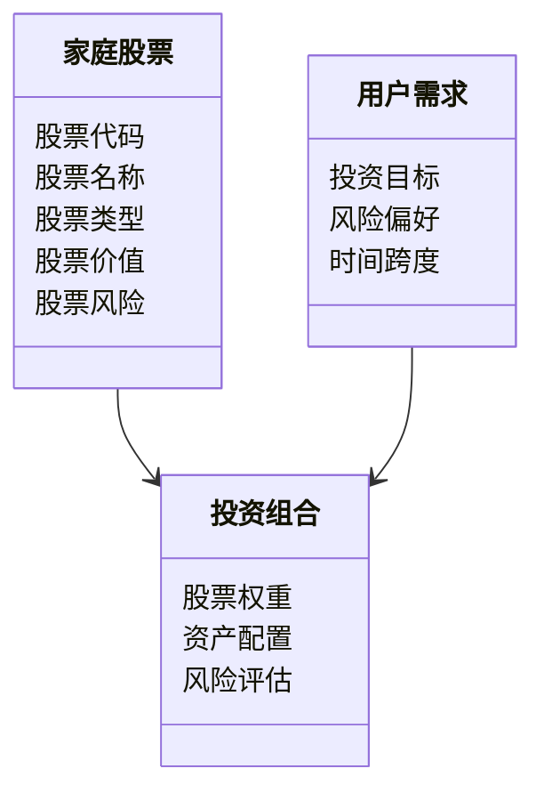
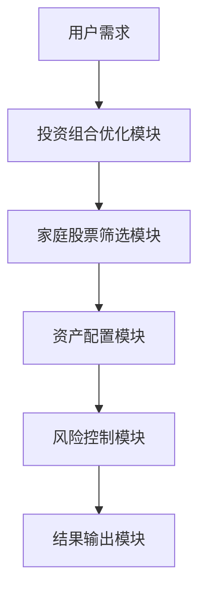
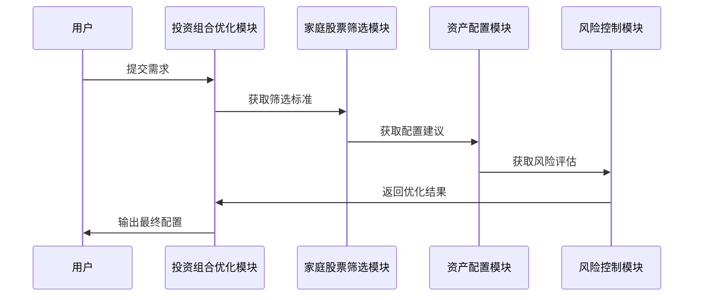

                 


# 彼得林奇的"家庭股票"在跨代财富传承中的投资组合构建

> 关键词：彼得林奇，家庭股票，跨代财富传承，投资组合，风险管理

> 摘要：本文系统阐述了彼得·林奇的“家庭股票”理念在跨代财富传承中的应用，从背景分析、理论基础、投资策略、系统架构到实战案例，全面解析了如何通过家庭股票构建适合跨代传承的投资组合。文章结合现代投资组合理论、风险管理模型和系统架构设计，为读者提供了从理论到实践的完整解决方案。

---

## 第1章：跨代财富传承的背景与问题

### 1.1 财富传承的背景与现状

#### 1.1.1 全球财富传承的现状分析
财富传承已成为全球关注的焦点。随着家族企业的发展和高净值家庭的增多，财富的代际传承问题日益突出。根据统计，约60%的家族财富在第二代传承后会面临大幅缩水或流失的风险。

#### 1.1.2 跨代财富传承的核心问题
- 财富的保值与增值需求
- 不同代际的投资目标差异
- 财富传承中的税务与法律问题
- 家族成员的财务行为差异

#### 1.1.3 财富传承中的常见挑战
- 资产分配的公平性问题
- 投资风险的代际传递
- 家族企业治理与传承风险

### 1.2 彼得·林奇的投资理念与家庭股票

#### 1.2.1 彼得·林奇的投资者画像
- 长期投资理念
- 价值投资与成长投资的结合
- 风险管理与分散投资

#### 1.2.2 家庭股票的核心概念
- 家庭股票的定义：适合家庭长期持有的优质股票
- 家庭股票的特征：
  - 稳定性：业绩波动小，股息稳定
  - 增长性：具备长期增长潜力
  - 流动性：易于买卖，具备市场流动性

#### 1.2.3 家庭股票在投资组合中的作用
- 资产配置的核心部分
- 抗风险能力的增强
- 财富传承的稳定性保障

## 第2章：跨代财富传承中的投资需求分析

### 2.1 财富传承中的投资需求

#### 2.1.1 财富保值与增值的需求
- 财富保值的核心目标
- 财富增值的实现路径

#### 2.1.2 财富传承中的资产配置问题
- 股票、债券、房地产等多资产配置
- 不同代际的资产分配策略

#### 2.1.3 财富传承中的税务与法律问题
- 股权继承的税务优化
- 财产分割的法律风险

### 2.2 家庭股票在跨代传承中的角色

#### 2.2.1 家庭股票的长期稳定性
- 股票市场的波动性分析
- 家庭股票在市场周期中的表现

#### 2.2.2 家庭股票的收益性分析
- 长期复利效应
- 股息收入的稳定性

#### 2.2.3 家庭股票的风险控制
- 风险分散策略
- 个股与市场的相关性分析

## 第3章：家庭股票投资组合构建的核心概念

### 3.1 家庭股票的核心要素

#### 3.1.1 家庭股票的属性分析
| 属性 | 描述 |
|------|------|
| 稳定性 | 收益波动小，股息稳定 |
| 增长性 | 具备长期增长潜力 |
| 流动性 | 市场流动性高，易于变现 |

#### 3.1.2 家庭股票与传统股票的对比
| 指标 | 家庭股票 | 传统股票 |
|------|---------|-----------|
| 投资目标 | 长期传承与稳定性 | 短期收益最大化 |
| 风险偏好 | 低风险偏好 | 高风险偏好 |
| 持股期限 | 长期持有 | 短期交易 |

#### 3.1.3 家庭股票在投资组合中的作用
- 核心资产配置
- 风险分散工具
- 财富传承的桥梁

### 3.2 跨代财富传承中的风险控制

#### 3.2.1 家庭股票的风险管理策略
- 分散投资：避免过度集中
- 风险对冲：利用股指期货等工具
- 定期再平衡：根据市场变化调整持仓

#### 3.2.2 投资组合的波动性控制
- 使用波动率模型进行风险评估
- 通过现代投资组合理论优化资产配置

#### 3.2.3 财富传承中的税务优化
- 利用税务递延策略
- 选择低税率地区的资产配置

## 第4章：跨代财富传承中的投资组合构建策略

### 4.1 投资组合构建的基本框架

#### 4.1.1 资产配置的理论基础
- 现代投资组合理论（MPT）的核心思想
- 风险与收益的平衡

#### 4.1.2 家庭股票的筛选标准
- 选择具备长期增长潜力的优质股票
- 优先选择股息稳定、业绩稳定的公司

#### 4.1.3 投资组合的动态调整
- 定期评估市场环境变化
- 根据家族需求调整持仓比例

### 4.2 家庭股票的分类与选择

#### 4.2.1 家庭股票的分类方法
- 根据行业特性分类
- 根据公司规模分类
- 根据成长性与价值性分类

#### 4.2.2 家庭股票的选择标准
- 公司基本面分析
- 财务健康状况评估
- 股东结构与治理能力

#### 4.2.3 不同代际的股票策略
- 老一辈：注重稳定与分红
- 中年一代：平衡风险与收益
- 年轻一代：注重成长性与创新性

## 第5章：跨代财富传承中的投资组合优化

### 5.1 投资组合优化的数学模型

#### 5.1.1 现代投资组合理论（MPT）的公式
$$ \text{最优权重} = \frac{\mu - r_f}{\sigma^2} $$
其中，$\mu$是资产的预期收益，$r_f$是无风险利率，$\sigma^2$是资产的波动率。

#### 5.1.2 资产分配的优化算法
$$ \text{风险调整后的收益} = E[r] - \lambda \sigma^2 $$
其中，$\lambda$是风险厌恶系数。

### 5.2 家庭股票在投资组合中的权重计算

#### 5.2.1 资产风险与收益的平衡
$$ \text{最优权重} = \frac{\text{收益权重}}{\text{风险权重}} $$

#### 5.2.2 股票收益与风险的量化分析
$$ \text{风险调整后的收益} = \text{收益} - \text{风险} \times \text{风险溢价} $$

#### 5.2.3 资产配置的动态调整
$$ \text{新权重} = \text{原权重} \times (1 + \text{调整系数}) $$

## 第6章：跨代财富传承中的系统架构设计

### 6.1 系统功能设计

#### 6.1.1 领域模型设计


#### 6.1.2 系统架构设计


### 6.2 系统接口设计

#### 6.2.1 接口描述
- 输入：用户需求参数（风险偏好、投资目标、时间跨度）
- 输出：优化后的投资组合配置

#### 6.2.2 接口交互


## 第7章：项目实战与案例分析

### 7.1 环境安装

#### 7.1.1 环境要求
- Python 3.8及以上版本
- 安装必要的库：pandas、numpy、scipy

### 7.2 核心实现

#### 7.2.1 家庭股票筛选代码
```python
import pandas as pd
import numpy as np

def select_family_stocks(stocks_df, target_sector):
    # 筛选目标行业的股票
    sector_mask = stocks_df['行业'] == target_sector
    # 筛选股息率高于平均的股票
    dividend_mask = stocks_df['股息率'] > stocks_df['股息率'].mean()
    # 筛选市盈率低于行业平均的股票
    pe_mask = stocks_df['市盈率'] < stocks_df['市盈率'].mean()
    # 返回满足条件的股票
    return stocks_df[sector_mask & dividend_mask & pe_mask]
```

#### 7.2.2 投资组合优化代码
```python
import numpy as np
import matplotlib.pyplot as plt

def plot_efficient_frontier(expected_returns, cov_matrix, risk_free_rate):
    # 计算最优投资组合
    n = len(expected_returns)
    # 使用拉格朗日乘数法求解
    C = np.array(cov_matrix)
    inv_C = np.linalg.inv(C)
    mu = np.array(expected_returns)
    ones = np.ones(n)
    b1 = ones.T
    b2 = np.array([[1.0 for _ in range(n)]])
    B = np.concatenate([b1, b2])
    BT = B.T
    inv_BTB = np.linalg.inv(BT @ B)
    w = inv_BTB @ BT @ mu
    w = w[:-1]
    # 绘制有效前沿
    plt.figure(figsize=(10, 6))
    plt.scatter(w, np.sqrt(np.diag(inv_BTB @ BT @ C @ BT @ inv_BTB)))
    plt.xlabel('收益')
    plt.ylabel('风险')
    plt.title('有效前沿')
    plt.show()
```

### 7.3 案例分析

#### 7.3.1 案例背景
某富裕家族计划将部分资产配置为家庭股票，用于跨代传承。家族希望在保持资产稳定的同时，实现长期的资本增值。

#### 7.3.2 实施步骤
1. 确定投资目标与风险偏好
2. 筛选符合条件的家庭股票
3. 构建投资组合并进行优化
4. 定期监控与调整

#### 7.3.3 实施结果
- 通过家庭股票筛选模块，选择了5只符合要求的股票
- 投资组合优化模块计算出最优的资产配置方案
- 风险控制模块确保了组合的稳定性

## 第8章：总结与展望

### 8.1 总结
本文通过分析彼得·林奇的家庭股票理念，结合跨代财富传承的需求，构建了适合长期传承的投资组合。通过理论分析、系统设计和实战案例，证明了家庭股票在财富传承中的重要性。

### 8.2 展望
未来的研究可以进一步探讨家庭股票在不同文化背景下的适应性，以及在新兴市场的应用。此外，还可以结合区块链技术，探索更加透明和安全的财富传承方式。

---

## 附录

### 附录A：术语表
- 家庭股票：适合家庭长期持有的优质股票
- 投资组合优化：通过数学模型找到最优的资产配置方案
- 现代投资组合理论（MPT）：一种基于风险与收益平衡的投资理论

### 附录B：参考文献
1. 彼得·林奇：《彼得·林奇的股票投资战策》
2. 哈里·马科维茨：《投资组合理论》
3. 约翰·纳什：《博弈论与经济行为》

---

以上是完整的目录大纲，接下来将按照此大纲逐步展开文章内容。

