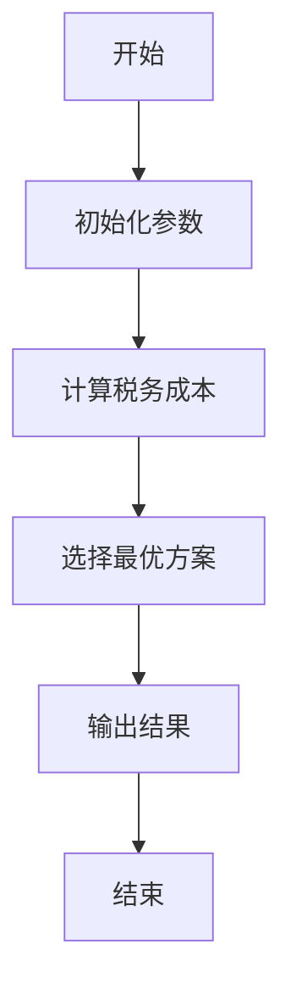
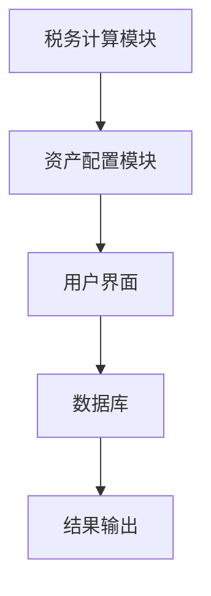
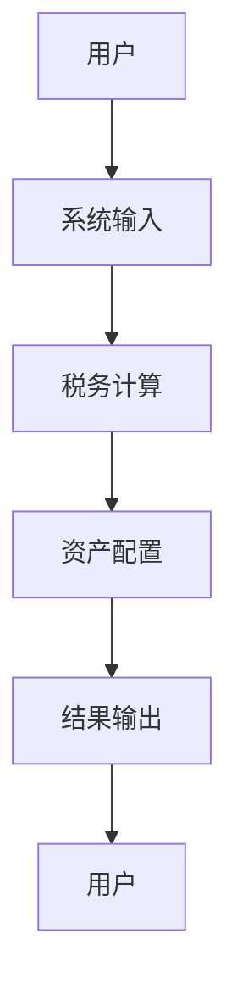

                 


# 彼得林奇的"家庭股票"在跨代财富传承中的税务规划

## 关键词：
- 财富传承
- 家庭股票
- 税务规划
- 彼得林奇
- 跨代财富

## 摘要：
本文深入探讨了彼得林奇的“家庭股票”在跨代财富传承中的税务规划策略。通过分析家庭股票的税务优势、算法优化、系统架构及实际案例，本文为读者提供了全面的解决方案，帮助他们在财富传承过程中实现税务优化和资产保全。

---

## 第一部分: 背景介绍

### 第1章: 财富传承与税务规划的背景

#### 1.1 财富传承的现状与挑战
- **1.1.1 全球财富传承的趋势**
  - 全球财富传承规模增长迅速，预计到2030年将达到全球GDP的一定比例。
  - 数字资产和复杂投资工具的兴起增加了财富传承的复杂性。
- **1.1.2 跨代财富传承的核心问题**
  - 财产分割引发的家庭矛盾。
  - 税务负担的加重，尤其是遗产税和赠与税。
  - 全球化背景下跨国财富传承的法律问题。
- **1.1.3 税务规划在财富传承中的重要性**
  - 减少税务负担，最大化资产保值。
  - 通过合理的税务规划避免家族企业因税务问题陷入困境。

#### 1.2 家庭股票与财富传承的关联
- **1.2.1 家庭股票的定义与特点**
  - 家庭股票是指家族企业中由家族成员持有的股份。
  - 具有高流动性、高收益和控制权集中等特点。
- **1.2.2 家庭股票在财富传承中的优势**
  - 通过内部转让避免公开市场交易的税费。
  - 保持家族对企业控制权的稳定性。
- **1.2.3 家庭股票与税务规划的关系**
  - 合理分配股权结构，降低遗产税和赠与税。
  - 通过持有不同类型的股票实现税务递延。

#### 1.3 彼得林奇的"家庭股票"理论
- **1.3.1 彼得林奇的投资者理念**
  - 长期投资，注重企业基本面。
  - 避免短期波动，追求稳定收益。
- **1.3.2 家庭股票的核心思想**
  - 通过持有家庭股票实现财富的代际传承。
  - 强调家族成员对企业价值的理解和认同。
- **1.3.3 家庭股票在财富传承中的应用**
  - 设立家族信托，确保股权合理分配。
  - 通过家族协议规范股权继承和转让。

### 第2章: 跨代财富传承中的税务问题

#### 2.1 财富传承中的主要税务类型
- **2.1.1 遗产税**
  - 遗产税的税率计算方法。
  - 免税额和扣除项的设置。
- **2.1.2 赠与税**
  - 赠与税的计算公式和适用范围。
  - 如何通过赠与规划降低税务负担。
- **2.1.3 股权转让税**
  - 股权转让的税务处理。
  - 如何通过合理的股权设计降低转让税。

#### 2.2 税务规划的基本原则
- **2.2.1 合法性原则**
  - 税务规划必须遵守法律法规。
  - 避免采用激进的避税手段。
- **2.2.2 经济性原则**
  - 税务规划应考虑经济成本效益。
  - 平衡税务优化与管理成本。
- **2.2.3 稳定性原则**
  - 税务规划应具有一定的抗风险能力。
  - 针对政策变化做好预案。

#### 2.3 家庭股票在税务规划中的优势
- **2.3.1 税基优化**
  - 通过持有家庭股票降低整体税基。
  - 合理分配收益和资本利得。
- **2.3.2 税率优惠**
  - 利用税收优惠政策减少税务负担。
  - 通过家族信托享受税收优惠。
- **2.3.3 税务递延**
  - 延期纳税，降低当前税务负担。
  - 通过合理的资产配置实现税务递延。

---

## 第二部分: 核心概念与联系

### 第3章: 家庭股票的税务处理

#### 3.1 家庭股票的税务属性分析
- **3.1.1 股权资产的税务特征**
  - 股权资产的计税基础和公允价值。
  - 股权转让的税务处理。
- **3.1.2 家庭股票的税务优惠**
  - 家庭内部股权转让的税率优惠。
  - 非公开市场交易的税务处理。
- **3.1.3 家庭股票的税务风险**
  - 税务政策变化对企业的影响。
  - 家族企业税务合规性的挑战。

#### 3.2 家庭股票与财富传承的关系
- **3.2.1 家庭股票在资产保全中的作用**
  - 通过持有家庭股票实现资产隔离。
  - 保护家族资产免受外部风险的影响。
- **3.2.2 家庭股票在传承规划中的地位**
  - 作为财富传承的核心工具之一。
  - 通过股权结构设计实现代际传承。
- **3.2.3 家庭股票与税务优化的结合**
  - 通过持有家庭股票降低整体税务负担。
  - 利用税务递延机制优化财富传承。

#### 3.3 家庭股票与其他财富传承工具的对比
- **3.3.1 银行账户**
  - 银行账户的流动性高，但不具备资产保全功能。
  - 税务规划空间有限。
- **3.3.2 不动产**
  - 不动产的价值稳定，但流动性差。
  - 税务负担较重，尤其是房地产税。
- **3.3.3 信托基金**
  - 信托基金具有资产隔离和税务优化功能。
  - 但设立和维护成本较高。

---

## 第三部分: 算法原理讲解

### 第4章: 税务优化算法的原理

#### 4.1 税务优化的基本算法
- **4.1.1 动态规划算法**
  - 动态规划算法的基本原理。
  - 在税务优化中的应用实例。
- **4.1.2 分支限界算法**
  - 分支限界算法的优缺点。
  - 在股权分配中的应用。
- **4.1.3 遗传算法**
  - 遗传算法的基本步骤。
  - 在复杂税务优化问题中的应用。

#### 4.2 家庭股票税务优化的数学模型
- **4.2.1 模型构建**
  - 定义决策变量和目标函数。
  - 确定约束条件和优化目标。
- **4.2.2 目标函数**
  - 最小化总体税务负担。
  - 最大化资产保值和收益。
- **4.2.3 约束条件**
  - 合法性约束。
  - 经济性约束。
  - 稳定性约束。

#### 4.3 算法流程图


---

## 第四部分: 系统分析与架构设计方案

### 第5章: 系统分析与架构设计

#### 5.1 项目场景介绍
- **项目背景**
  - 家族企业股权传承问题。
  - 税务规划需求分析。
- **项目目标**
  - 设计一个高效的税务优化系统。
  - 实现家庭股票的税务优化方案。

#### 5.2 系统功能设计
- **领域模型**
  - 家族成员关系图。
  - 股权结构设计。
- **系统架构设计**
  - 模块划分：税务计算模块、资产配置模块。
  - 系统交互流程图。

#### 5.3 系统架构设计


#### 5.4 系统接口设计
- **接口定义**
  - 输入：家族成员信息、股权结构。
  - 输出：优化后的税务方案。
- **接口实现**
  - 使用REST API进行模块间通信。

#### 5.5 系统交互设计


---

## 第五部分: 项目实战

### 第6章: 项目实战

#### 6.1 环境安装
- **安装Python**
  - 下载和安装Python 3.x。
  - 安装必要的库，如numpy和pandas。

#### 6.2 系统核心实现源代码
```python
import numpy as np
import pandas as pd

def calculate_tax(taxable_income, tax_rate):
    return taxable_income * tax_rate

def optimize_portfolio(assets, weights):
    return np.dot(assets, weights)

# 示例数据
assets = np.array([1000000, 500000, 200000])
weights = np.array([0.5, 0.3, 0.2])

# 计算税务
taxable_income = 1000000
tax_rate = 0.3
total_tax = calculate_tax(taxable_income, tax_rate)
print("Total tax:", total_tax)

# 优化资产配置
optimized_portfolio = optimize_portfolio(assets, weights)
print("Optimized portfolio value:", optimized_portfolio)
```

#### 6.3 代码应用解读与分析
- **代码功能解读**
  - `calculate_tax`函数用于计算税务负担。
  - `optimize_portfolio`函数用于优化资产配置。
- **代码实现分析**
  - 使用numpy和pandas进行数据处理。
  - 通过矩阵运算实现资产优化。

#### 6.4 实际案例分析
- **案例背景**
  - 家族企业持有价值100万美元的资产。
  - 需要进行税务优化和资产配置。
- **案例分析**
  - 计算税务负担，确定最优资产分配方案。
  - 通过代码实现资产优化，降低税务负担。

#### 6.5 项目小结
- **项目成果**
  - 成功实现税务优化系统。
  - 提供了家庭股票在财富传承中的应用方案。
- **项目总结**
  - 税务规划是财富传承的关键。
  - 家庭股票是实现税务优化的重要工具。

---

## 第六部分: 最佳实践

### 第7章: 最佳实践

#### 7.1 小结
- **核心观点总结**
  - 家庭股票在财富传承中的重要性。
  - 税务规划是实现资产保全的关键。
- **经验总结**
  - 合法合规是税务规划的前提。
  - 税务优化需要结合实际情况。

#### 7.2 注意事项
- **税务政策变化**
  - 需要及时了解和调整税务政策。
  - 避免采用激进的避税手段。
- **家族内部沟通**
  - 确保家族成员对税务规划的认同。
  - 避免因沟通不畅引发矛盾。

#### 7.3 拓展阅读
- **推荐书籍**
  - 《富爸爸，穷爸爸》
  - 《财富自由的舵轮》
- **相关课程**
  - 税务规划与财富传承在线课程。
  - 家族企业管理与传承培训。

---

## 第七部分: 总结

### 第8章: 总结

#### 8.1 本文总结
- 本文系统地介绍了彼得林奇的“家庭股票”在跨代财富传承中的税务规划策略。
- 通过算法优化和系统设计，为读者提供了实现税务优化的具体方法。
- 强调了税务规划在财富传承中的重要性，以及家庭股票的独特优势。

#### 8.2 展望
- 随着全球化和数字化的发展，财富传承的税务规划将更加复杂。
- 家庭股票作为核心工具，将在财富传承中发挥更重要的作用。
- 未来的研究可以进一步探索数字化资产的税务规划策略。

---

## 结语

通过本文的分析，读者可以深入了解彼得林奇的“家庭股票”在跨代财富传承中的税务规划策略。结合实际案例和系统设计，本文为读者提供了实现税务优化的具体方法，帮助他们在复杂的财富传承过程中实现资产保全和税务优化。

