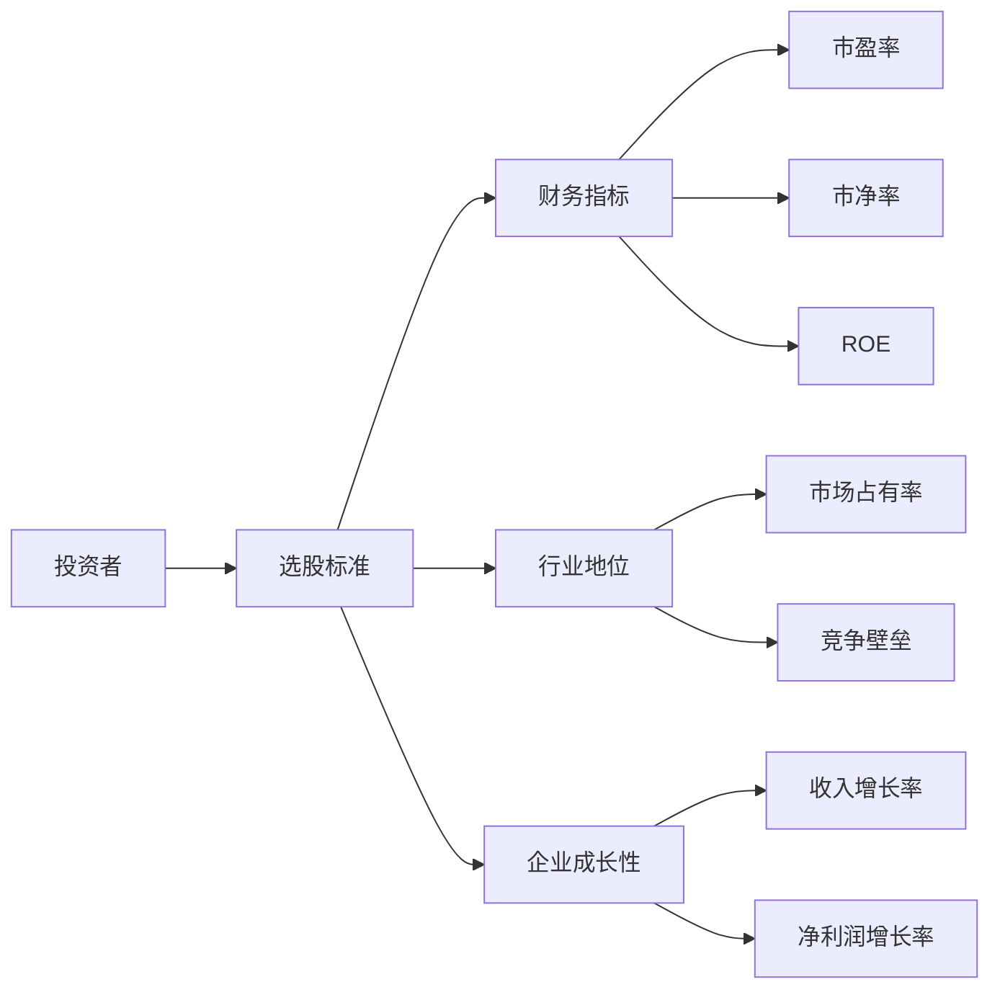
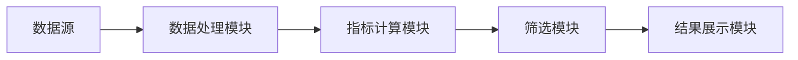

                 


# 彼得林奇的"小盘价值股"发掘技巧

> 关键词：彼得林奇，小盘股，价值股，投资技巧，选股标准，财务分析，投资策略

> 摘要：本文系统地介绍了彼得林奇的“小盘价值股”投资策略，从背景介绍、核心概念、算法原理到实际项目案例，详细解析了如何通过基本面分析和数学模型来发掘具有投资价值的小盘股。文章结合理论与实践，为投资者提供了实用的选股技巧和投资建议。

---

# 第1章: 小盘价值股的定义与特点

## 1.1 小盘价值股的定义
### 1.1.1 小盘股的定义与特征
小盘股是指市值较小的公司股票，通常在10亿美元以下。其特征包括流动性较低、波动性较大、成长空间广阔等。

### 1.1.2 价值股的核心概念
价值股是指市场价格低于其内在价值的股票，通常表现为低市盈率、低市净率和高股息率。

### 1.1.3 小盘价值股的特点
小盘价值股结合了小盘股和价值股的特点，通常具有较高的成长潜力和低估的市场价格。

## 1.2 小盘价值股与大盘股的对比
### 1.2.1 市值规模的差异
小盘股市值较小，大盘股市值较大，流动性较高。

### 1.2.2 风险与收益的对比
小盘股风险较高，但潜在收益也更大；大盘股风险较低，收益相对稳定。

### 1.2.3 市场流动性的影响
小盘股流动性较低，市场波动较大；大盘股流动性高，波动较小。

## 1.3 彼得林奇投资理念的背景
### 1.3.1 彼得林奇的个人投资风格
彼得林奇以基本面分析和长期投资著称，专注于寻找被市场低估的小盘股。

### 1.3.2 小盘股投资的历史表现
小盘股在长期表现中往往优于大盘股，尤其是在市场复苏期。

### 1.3.3 价值投资的哲学基础
价值投资强调购买低于内在价值的股票，长期持有，等待市场重新评估。

## 1.4 小盘价值股的投资机会
### 1.4.1 小盘股的潜在增长空间
小盘股公司通常处于成长阶段，具有较大的发展空间。

### 1.4.2 价值股的低估优势
价值股市场价格低于内在价值，具有较大的上涨空间。

### 1.4.3 小盘价值股的市场周期性
在市场低迷期，小盘价值股往往被低估，是较好的投资机会。

---

# 第2章: 彼得林奇选股标准的核心概念

## 2.1 彼得林奇选股标准概述
### 2.1.1 选股标准的层次划分
彼得林奇的选股标准分为财务指标、行业地位和企业成长性三个层次。

### 2.1.2 标准的核心要素
包括低市盈率、低市净率、高ROE、稳定的收入增长率和净利润增长率。

### 2.1.3 标准的适用范围
适用于市值较小、财务健康、成长潜力大的公司。

## 2.2 核心概念的原理分析
### 2.2.1 企业基本面分析
通过分析公司的财务报表，评估公司的盈利能力和财务健康状况。

### 2.2.2 财务数据的重要性
市盈率（P/E）、市净率（P/B）和ROE是衡量公司价值的重要指标。

### 2.2.3 管理团队的作用
优秀的管理团队能够带领公司实现持续增长。

## 2.3 标准的属性特征对比
### 2.3.1 财务指标的权重对比
市盈率和市净率是衡量公司价值的核心指标，权重较高。

### 2.3.2 行业地位的评估维度
包括市场占有率、竞争壁垒和行业前景。

### 2.3.3 企业成长性的评估标准
收入增长率和净利润增长率是衡量公司成长性的主要指标。

## 2.4 标准的ER实体关系图


## 2.5 本章小结
彼得林奇的选股标准基于企业的基本面分析，通过财务指标、行业地位和企业成长性三个维度，筛选出具有投资价值的小盘价值股。

---

# 第3章: 彼得林奇选股标准的算法原理

## 3.1 算法原理概述
### 3.1.1 算法的核心思想
通过量化分析，筛选出符合彼得林奇选股标准的股票。

### 3.1.2 算法的步骤
1. 数据收集：获取目标公司的财务数据。
2. 初步筛选：计算市盈率、市净率和ROE，排除不符合标准的公司。
3. 深度分析：评估公司的行业地位和成长性。
4. 最终评估：综合各项指标，选出符合条件的股票。

## 3.2 算法的数学模型
### 3.2.1 市盈率计算
$$市盈率 = \frac{股价}{每股收益}$$

### 3.2.2 市净率计算
$$市净率 = \frac{股价}{每股净资产}$$

### 3.2.3 ROE计算
$$ROE = \frac{净利润}{股东权益}$$

## 3.3 算法的流程图


## 3.4 算法的Python实现
### 3.4.1 数据获取
使用Python的`pandas`库获取目标公司的财务数据。

### 3.4.2 数据清洗
对数据进行清洗，处理缺失值和异常值。

### 3.4.3 指标计算
计算市盈率、市净率和ROE等指标。

### 3.4.4 筛选标准
根据彼得林奇的选股标准，筛选出符合条件的股票。

## 3.5 本章小结
通过量化分析，彼得林奇的选股标准可以转化为具体的算法，帮助投资者快速筛选出具有投资价值的小盘价值股。

---

# 第4章: 彼得林奇选股标准的系统分析

## 4.1 系统功能设计
### 4.1.1 功能模块
包括数据收集模块、指标计算模块、筛选模块和结果展示模块。

### 4.1.2 功能流程
数据收集 -> 指标计算 -> 筛选 -> 结果展示。

## 4.2 系统架构设计
### 4.2.1 架构图


### 4.2.2 模块交互
数据处理模块负责获取和清洗数据，指标计算模块计算各项指标，筛选模块根据标准筛选股票，结果展示模块展示最终结果。

## 4.3 系统接口设计
### 4.3.1 数据接口
定义数据接口，用于获取目标公司的财务数据。

### 4.3.2 筛选接口
定义筛选接口，用于根据标准筛选股票。

## 4.4 本章小结
通过系统化的架构设计，可以构建一个高效的小盘价值股筛选系统，帮助投资者快速找到符合条件的股票。

---

# 第5章: 彼得林奇选股标准的项目实战

## 5.1 项目背景
### 5.1.1 项目目标
筛选出符合彼得林奇选股标准的小盘价值股。

### 5.1.2 项目范围
选取某行业的小盘股公司进行分析。

## 5.2 项目实现
### 5.2.1 数据获取
使用Python的`pandas`库获取目标公司的财务数据。

### 5.2.2 数据清洗
处理缺失值和异常值，确保数据的准确性。

### 5.2.3 指标计算
计算市盈率、市净率和ROE等指标。

### 5.2.4 筛选标准
根据彼得林奇的选股标准，筛选出符合条件的股票。

## 5.3 实际案例分析
### 5.3.1 案例选择
选择某小盘股公司进行分析。

### 5.3.2 数据分析
计算各项指标，评估公司的财务状况和成长潜力。

### 5.3.3 筛选结果
展示筛选结果，说明该股票是否符合彼得林奇的选股标准。

## 5.4 本章小结
通过实际案例分析，验证了彼得林奇选股标准的有效性，帮助投资者更好地理解如何应用这些标准进行投资。

---

# 第6章: 彼得林奇选股标准的最佳实践

## 6.1 投资经验总结
### 6.1.1 长期投资的重要性
强调长期持有股票，避免短期波动的影响。

### 6.1.2 分散投资的风险
建议投资者分散投资，降低风险。

## 6.2 投资策略建议
### 6.2.1 行业选择
选择具有成长潜力的行业，如科技、医疗等。

### 6.2.2 管理层评估
关注公司的管理团队，选择具有优秀管理能力的公司。

## 6.3 注意事项
### 6.3.1 市场波动的影响
提醒投资者注意市场波动，避免盲目跟风。

### 6.3.2 财务报表的真实性
强调财务报表的真实性，选择财务健康的企业。

## 6.4 拓展阅读
### 6.4.1 推荐书籍
推荐几本关于价值投资的经典书籍。

### 6.4.2 网站资源
推荐几个获取财务数据和市场分析的网站。

## 6.5 本章小结
本文总结了彼得林奇选股标准的最佳实践，为投资者提供了实用的投资建议和注意事项。

---

# 附录: 彼得林奇选股标准的Python代码实现

## 附录A: 数据获取与清洗
```python
import pandas as pd

# 获取数据
data = pd.read_csv('data.csv')

# 数据清洗
data.dropna(inplace=True)
data.drop_duplicates(inplace=True)
```

## 附录B: 指标计算
```python
# 计算市盈率
data['PE'] = data['股价'] / data['每股收益']

# 计算市净率
data['PB'] = data['股价'] / data['每股净资产']

# 计算ROE
data['ROE'] = data['净利润'] / data['股东权益']
```

## 附录C: 筛选标准
```python
# 筛选标准
筛选结果 = data[(data['PE'] < 15) & (data['PB'] < 2) & (data['ROE'] > 10)]
```

---

# 结语
通过本文的详细讲解，读者可以全面了解彼得林奇的“小盘价值股”发掘技巧，并通过实际案例和Python代码实现，掌握如何在实际投资中应用这些技巧。希望本文能为投资者提供有价值的参考和启发。

